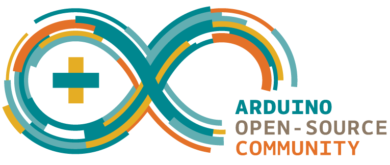
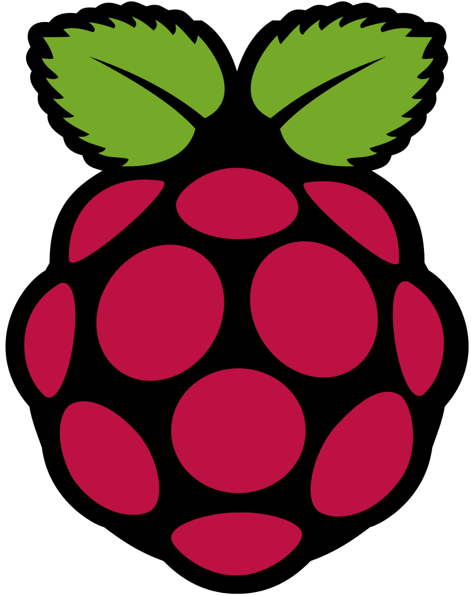
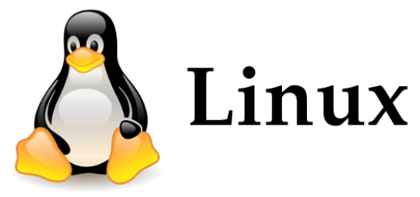
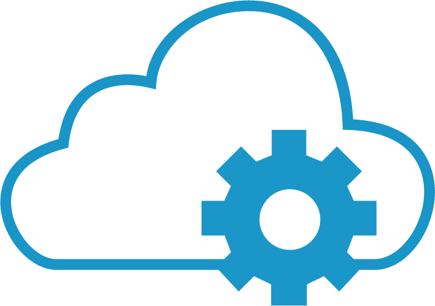

Overview
========

This documentation will try to cover different aspects of the Thinger.io platform in terms of hardware integration, cloud console, server a API, and server deployment.

# Hardware Clients

This section will cover how to program your hardware to connect and use the Thinger.io platform. As there are many IoT hardware available nowadays, this section is divided in different categories.

There is a category related with Arduino compatible hardware, which is any board you can program with the Arduino IDE (Arduino + Ethernet, Arduino + Wifi, ESP8266, NodeMCU, TI CC3200, etc). There is other general category related with Linux powered devices like the Raspberry Pi, Intel Edison, or any other Linux computer running Ubuntu or MacOS. Finally, there is a section that will cover the integration with the ARM Mbed platform and compatible devices.

So, to start using the platform select the hardware platform you want to use.

## Arduino

This category is related with any hardware that can be programmed over the Arduino IDE and its libraries. So it is not exclusively for Arduino Devices, as you can also program different boards like the ESP8266, or Texas Instruments CC3200 board. Of course, you can still use any other Arduino Board with Ethernet of Wifi capabilities.

[Arduino Client Documentation >](arduino)

## Linux

If you want to develop an IoT product or project based on a device running Linux OS, there is also an special client for this platform. There are some specific examples for each common Linux board like Raspberry Pi or Intel Edison. But you can run the client in practically any computer running a Linux distribution, including a computer with Mac OS.

[Linux Client Documentation >](linux)

## ARM Mbed

ARM is building its own IoT ecosystem in the cloud, mainly to simplify the development process in any ARM mBed compatible hardware. So, if you have an ARM mBed compatible board, this is your place.

[ARM MBed Client Documentation >](mbed)

Cloud Console
=============

The Cloud Console is related with the management front-end designed to easily manage your devices and visualize its information in the cloud. In this section you will learn how to register devices, create real-time dashboards, access the devices API, and other management operations.

[Cloud Console Documentation >](console)

Server API
==========

The Thinger.io Cloud is supported by a REST API designed to easily integrate your IoT projects with other applications like WebServices, mobile phones, or desktop applications. So if you want to integrate your device with your own application or service, then this is the starting point.

[Server API Documentation >](api)

Thinger.io Hardware
===================

This section is related to the Thinger.io hardware boards, like the ClimaStick. A small powerful device plenty of sensors, ready for prototyping, learning, or developing products.

[ClimaStick Board >](hardware/climaStick)

Server Deployment
=================

This section is related to the Cloud configuration and deployment in your own infrastructure, both in local machines or in the cloud.

[Server Deployment Documentation >](deployment)

