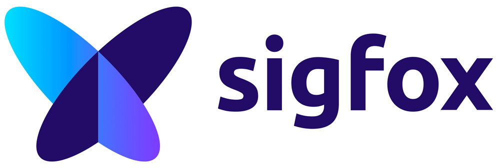
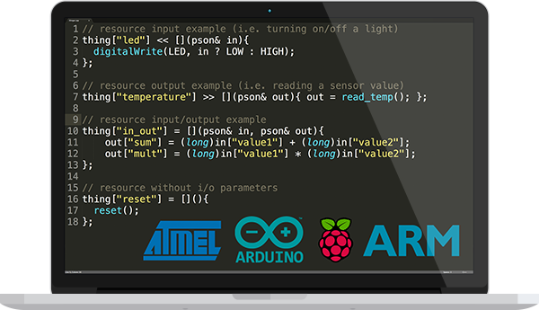
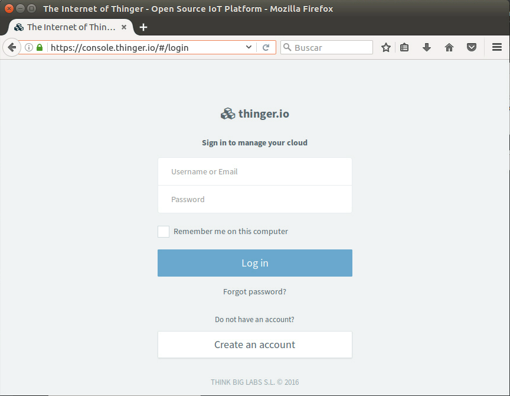
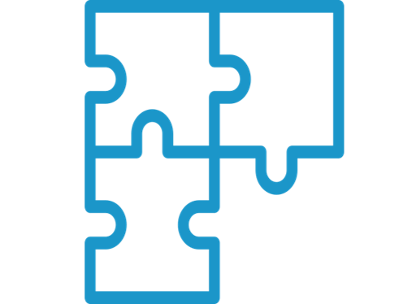
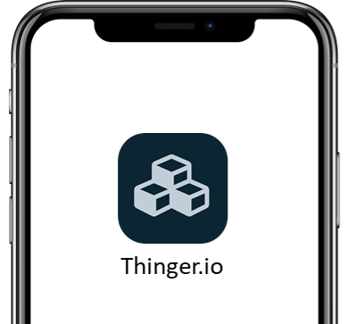
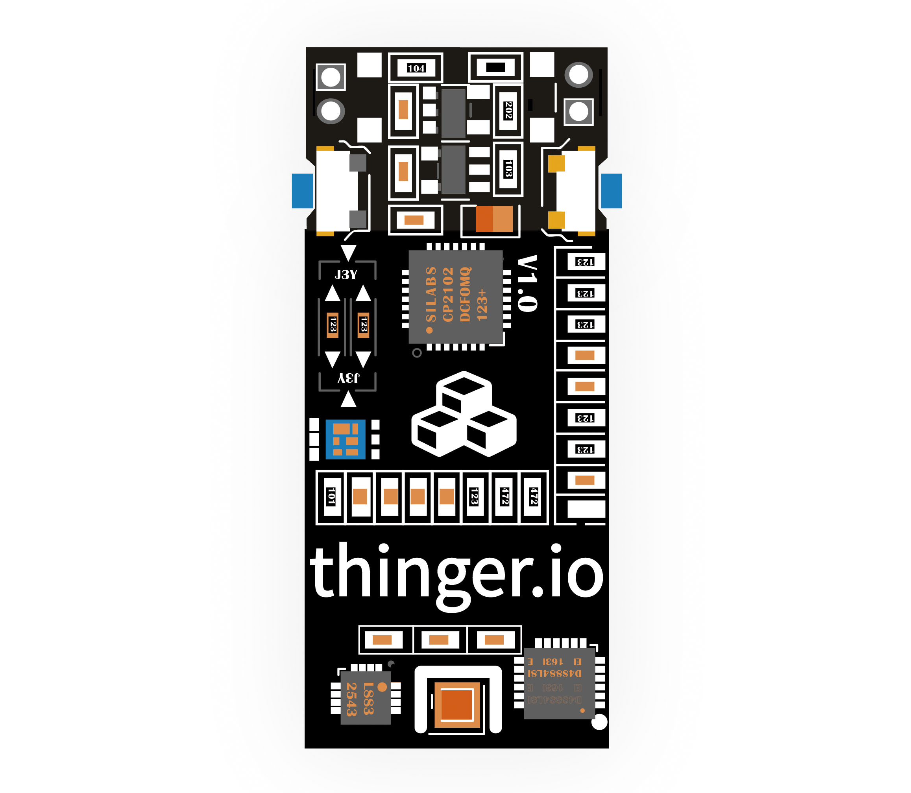

# OVERVIEW

## Hardware Devices

This section will cover how to program your hardware to connect and use the Thinger.io platform. As there are many IoT hardware available nowadays, this section is divided in different categories.

There is a category related with Arduino compatible hardware, which is any board you can program with the Arduino IDE \(Arduino + Ethernet, Arduino + Wifi, ESP8266, NodeMCU, TI CC3200, etc\). There is other general category related with Linux powered devices like the Raspberry Pi, Intel Edison, or any other Linux computer running Ubuntu or MacOS. Finally, there is a section that will cover the integration with the ARM Mbed platform and compatible devices.

So, to start using the platform select the hardware platform you want to use.

<table>
  <thead>
    <tr>
      <th style="text-align:left"><a href="hardware-devices/arduino.md">Arduino</a>
      </th>
      <th style="text-align:left"></th>
      <th style="text-align:left"><a href="hardware-devices/linux.md">Linux</a>
      </th>
    </tr>
  </thead>
  <tbody>
    <tr>
      <td style="text-align:left">
        
&lt;b&gt;&lt;/b&gt;<a href="hardware-devices/arduino.md"><b> </b></a>
        

        

        

        

        

        

        

        
<a href="hardware-devices/arduino.md">This category is related with any hardware that can be programmed over the Arduino IDE and its libraries. So it is not exclusively for Arduino Devices, as you can also program different boards like the ESP8266, ESP32, </a>Arduino
          MRK, etc.

      </td>
      <td style="text-align:left"></td>
      <td style="text-align:left">
        

        

        
For <a href="hardware-devices/linux.md">Linux OS based devices, such as  Raspberry Pi, Intel Edison, and many other computer running a Linux distribution, including a Mac OS computer.</a>
        

      </td>
    </tr>
    <tr>
      <td style="text-align:left">
        
<b>Edge Devices</b>
        

        

        

        

        

        

          
        

        

        

        

        

        
In this category is covered the Sigfox integration with the platform,
          where the user can configure callbacks for transmitting data from the devices
          to the cloud for creating real-time dashboards.

      </td>
      <td style="text-align:left">&lt;b&gt;&lt;/b&gt;</td>
      <td style="text-align:left">
        
<b>ARM mbed</b>
        

        
&lt;b&gt;&lt;/b&gt;
          
        

        
ARM is building its own IoT ecosystem in the cloud, mainly to simplify
          the development process when using this kind of hardware. So, to integrate
          an ARM mBed compatible board, this is your place.

      </td>
    </tr>
  </tbody>
</table>However, Thinger.io can be adapted to many other hardware devices running our C++ source code libraries or third party platforms by using the HTTP device integration. 

## [Software Client Coding](coding.md)

This section will cover how to add different functionality to your devices for exposing resources, calling endpoints, or streaming data to real-time websockets.

## [Cloud Console](console.md)

The Cloud Console is related with the management front-end designed to easily manage your devices and visualize its information in the cloud. In this section you will learn how to register devices, create real-time dashboards, access the devices API, and other management operations.

## Plugins System

 

Plugins are extensions that allows complementing Thinger.io Platform with specific features or functionalities. 

## [Mobile A](mobile.md)[pp](mobile.md)

This section is related with the use of the Android and iOS Mobile App. You will learn how to scan devices, point them to another server or visualize and manage its information.

## [Server API](api.md)

The Thinger.io Cloud is supported by a REST API designed to easily integrate your IoT projects with other applications like Web Services, mobile phones, or desktop applications. So if you want to integrate your device with your own application or service, then this is the starting point.

## Plugins

## [Thinger.io Hardware](climastick.md)

This section is related to the Thinger.io hardware boards, like the ClimaStick. A small powerful device plenty of sensors, WiFi, ready for prototyping, learning, or developing products.

## [Server Deployment](deployment.md)

This section is related to the Cloud configuration and deployment in your own infrastructure, both in local machines or in the cloud.

