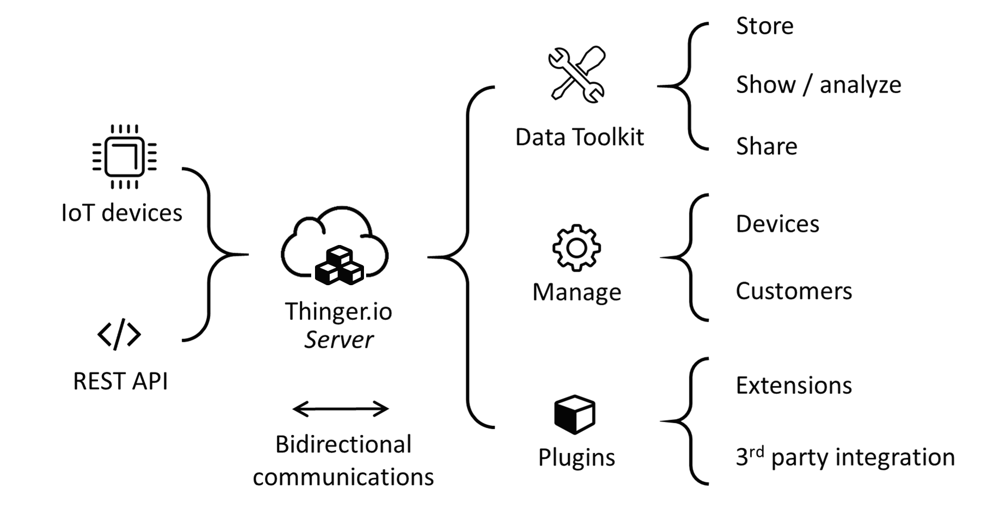

# OVERVIEW

## What is Thinger.io?

Thinger.io is a cloud IoT Platform that provides every needed tool to prototype, scale and manage connected  products in a very simple way. Our goal is democratize the use of IoT making it accessible to the hole world, and streamlining the development of big IoT projects.

* **Free IoT platform**: Thinger.io provides a lifetime freemium account with only few limitations to start learning and prototyping, when your product becomes ready to scale, you can deploy a Premium Server with full capacities within minutes.
* **Simple but Powerful**: Just a couple code lines to connect a device and start retrieving data or controlling it's functionalities with our web based Console, able to connect and manage thousands of devices in a simple way.
* **Hardware agnostic:** Any device from any manufacturer can be easily integrated with Thinger.io's infrastructure.
* **Extremely scalable & efficient infrastructure:** thanks to our unique communication paradigm, in which the IoT **server subscribes device resources** to retrieve data only when it is necessary, a single Thinger.io instance is able to manage thousands of IoT devices with low computational load, bandwidth and latencies. 
* **Open-Source**: most of the platform modules, libraries and APP source code are available in our github repository to be downloaded and modified with MIT license. 


Sign-up ****[**HERE** ](https://console.thinger.io/#/signup)to obtain a **free account** and start creating IoT projects within minutes!


### Thinger.io Main Features

* **Connect devices:** Fully compatible with every kind of devices, no matter the processor, the network or the manufacturer. Thinger.io allows to create **bidirectional communications** with Linux, Arduino, Raspberry PI or MQTT devices and even with edge technologies like Sigfox or LoRaWAN or other internet API data resources. 
* **Store Device Data:** Just a couple clicks to create a Data Bucket a store IoT data in an scalable, efficient and affordable way, that also allows real-time data aggregation. 
* **Show Real-time** or **Stored Data** in multiple widgets such as time series, donut charts, gauges or even custom made representations to create awesome dashboards within minutes. 
* **Trigger events and data values** using an embedded Node-RED rule engine 
* **Extend with custom features** with multiple plugins to integrate IoT projects into your company's software or any other third party Internet service.  
* **Custom the appearance** thanks to our fully rebrandeable frontend, that allows to introduce your branding colors, logotypes and web domain 

Are you ready to start creating IoT projects? [**Create here your free account**](https://console.thinger.io/#/signup) and learn below how to use all this technology.

## Quick Start Guide

To start working with Thinger.io just [**create a free account in our cloud platform**](https://console.thinger.io/#/signup) and follow the next steps to configure and connect your first IoT device

### 1. Create Device

Using "Devices" menu tab, just click in "New device" button, and fill the form with the device ID, description and Credentials you prefer.

### 2.Connect Device

After provisioning the device at Thinger.io cloud, it is the moment to configure it in the Hardware device. there are many different hardware supports and communication technologies but Thinger.io allows using all of them: 



1. Install Thinger.io libraries into your Arduino IDE
2. Going to "File&gt;Examples&gt;Thinger.io", open the example code that fix better for the PCB
3. Edit the example code to include your username, device ID and Thinger.io credentials. If the device use a secured networks, connection credentials needs to be written too as shown in the image below. 

This example contains a two simple resources to send and retrieve data from Thinger.io platform, however, it can be modified with many diff

erent functionalities that we have explained at the [**Firmware Coding**](coding/) ****section.  After modifying the source code, just click upload button to flash the sketch and wait for the device connection.


Find additional information about Thinger.io devices in the next sections: 

1. \*\*\*\*[**Compatible Arduino and Linux devices**](devices/)\*\*\*\*
2. \*\*\*\*[**Zero to Hero Thinger.io Firmware Coding Guide**](coding/) ****
3. \*\*\*\*[**Connection Troubleshooting Guide**](https://docs.thinger.io/coding/good-practices-and-troubleshooting)\*\*\*\*




1\) Create an HTTP device profile by selecting it in the "Device Type" when creating the device  
2\) Going to the device dashboard, create an HTTP device Callback  
3\) Create a device Access Token to authorize the device sending data to the platform  
4\) Introduce the HTTP request \(API+TOKEN\) into your device code or third party platform and start sending data to Thinger.io





Any individual Sigfox or LoraWAN device can be integrated using our API as HTTP devices, just setting an HTTP device callback into their callback managers, but if a big network is going to be created using these technologies, it is better to use our integration plugins:







1\) Create a new device profile and select "MQTT" device type  
2\) Configure device credentials a secret password  
3\) Configure the MQTT client to send data to the embedded broker

More details at: 





Complete device list can be displayed by going to "devices" menu tab. This interface allows managing devices and check its connection status and accessing devices dashboard by clicking over each devices ID.

### 3.Devices & Data management

Each device can be managed through the "Device Dashboard". This interface shows connection data and also allows checking the "device API" with raw device data representation.

Thinger.io provides bidirectional communication, so it is possible to retrieve data into the server using "**devices output resources**" and also sending messages from server to the "**devices input resources**". Both resources are represented in the "device API" viewer.

### 4.Store, Show & Share Data

Thinger.io provides three essential tools to work with devices data that are the basis for creating any IoT project, next tabs shows each tool introduction:



To **store** **device data** in an scalable way, programming different sampling intervals or recording events raised by devices.



Panels with **customizable widgets** that can be created within minutes using drag'n drop technology, to show real-time and stored data.



Extend the devices interoperatibility by using endpoints to interact with other services like IFTTT, custom Web Services, emails, or call other devices.



Dashboards, Data buckets or Device resources can be easily shared with third parties using **Access Tokens** and our **API**



### 5.Extend Thinger.io

Thinger.io platform can be complemented with many different Internet services using **Plugins** that can be found and deployed within seconds Just going to our marketplace and selecting it.



## [Compatible Devices](devices/)

[Thinger.io is Hardware agnostic, so it allows connecting any kind of electronic device without matter the manufacturer, hardware architecture, network technology or operative system. However there are different ways to integrate each device type, in this section it is explained how to connect most common devices by including our software libraries or using Thinger.io API to send data with HTTP queries](devices/)

## [Software Client Coding](coding/)

This section will cover how to add different functionality to your devices for exposing resources, calling endpoints, or streaming data to real-time websockets.

## [Cloud Consol](console/)e

The Cloud Console is related with the management front-end designed to easily manage your devices and visualize its information in the cloud. In this section you will learn how to register devices, create real-time dashboards, access the devices API, and other management operations.

