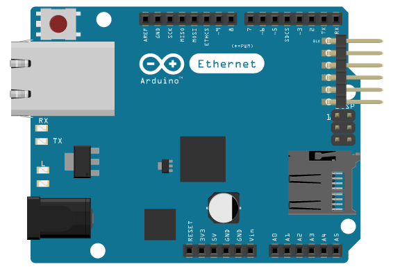
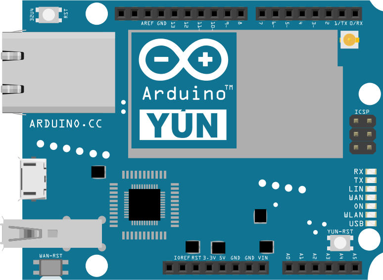
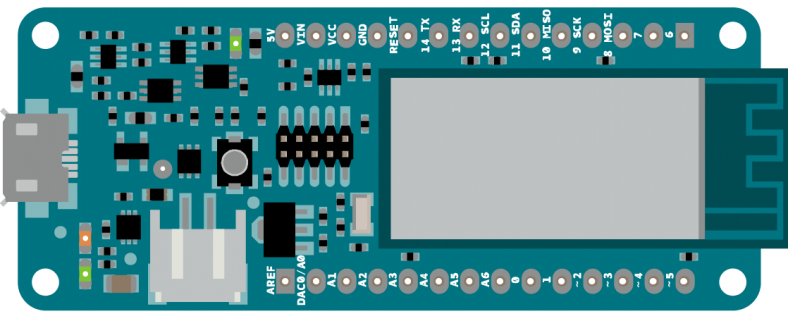
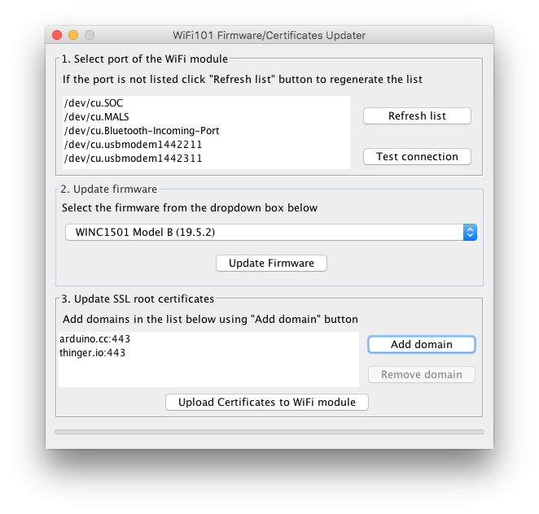
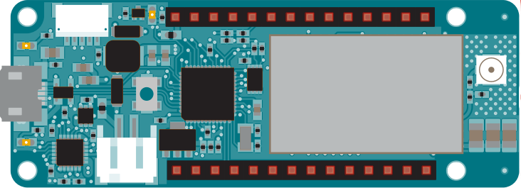
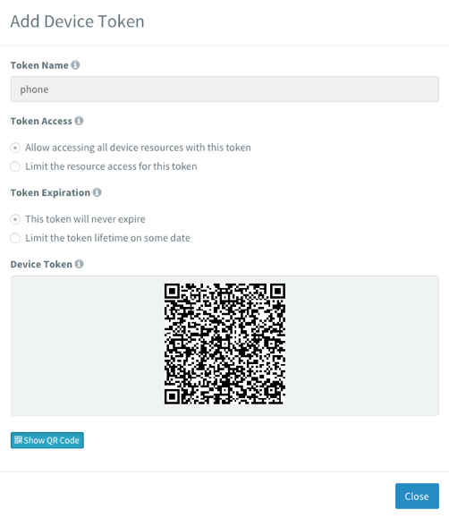
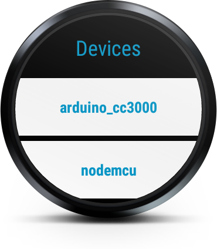
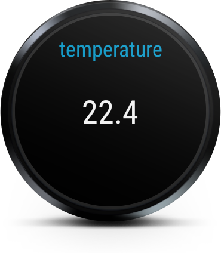

Overview
========

This documentation is related with the Arduino client library version of the Thinger.io platform. With this library you will be able to connect almost any Arduino board using Ethernet, Wifi, GSM, or other supported boards like ESP8266, NodeMCU, and TI CC3200.

The client library allows connecting your IoT devices to the [Thinger.io](http://thinger.io "thinger.io IoT Cloud Platform") cloud platform. This is a library specifically designed for the Arduino IDE, so you can easily program your devices and connect them within minutes.

It supports multiple network interfaces and boards, like Ethernet Shield, Wifi Shield, and GSM. It also supports other boards like ESP8266 (or NodeMCU), Texas Instruments CC3200 Launchpad, and Adafruit CC3000 board. It requires a modern Arduino IDE version, starting at 1.6.3.

Installation
============

The first step to start building thinger.io devices is to install the required libraries in the Arduino IDE to support exposing device resources like sensor values, lights, relays, and so on.

If you do not have the Arduino IDE installed yet, then it is a good moment to start, here are also some advices to choose the right version.

## Arduino IDE 

It is required a modern version of Arduino supporting `Library Manager` and some other features. Please install a version starting form **1.6.3** from the official Arduino download page. This step is not required if you already have a modern version.

[Download Arduino IDE >](https://www.arduino.cc/en/Main/Software)

There are two ways of installing the library. The preferred way is by using the Arduino `Library Manager`, which simplifies searching and installing new libraries. It also supports updating libraries when new versions are released. So use this method when possible. The other way to install the library is by using the traditional method of download and import the `zip` library. 

## Library Manager

The most easy way to install new libraries is by using the `Library Manager` available in the Arduino IDE. For installing the thinger.io library please follow the following steps:

Open the **Library Manager**

 

> Open the **Library Manager** in the Arduino menu in `Sketch` >
    `Include Library` > `Manage Libraries`

**Search** and install the thinger.io library

  

> Search the library with name **thinger.io** and then click `Install`. You can update the library also from this manager when it is updated.

Now the library should be be available with some default examples.

## Manual Import

If the preferred way using the Library Manager is not working or you prefer to manage the libraries yourself, you can also install the library by the traditional way. 

**Download** the latest version from the Github repository by clicking in the link below. This will download a file called `Arduino-Library-master.zip`.

[Download Library >](https://github.com/thinger-io/Arduino-Library/archive/master.zip)

Now **rename** the `Arduino-Library-master.zip` file to something more relevant like `thinger.zip`. 

The final step is to **import** the `zip` library using the Arduino IDE. This step will uncompress and copy the `zip` library in the Arduino libraries folder. Which is usually under your Documents folder.

<p align="center">

</p>

> Sketch > Include Library > Add .ZIP libraries

Now the library should be be available with some default examples.

Supported Hardware
==================

The thinger.io platform is designed to support almost any microcontroller or device with communication capabilities. No matter if it has Ethernet, Wifi, GSM, or the chip is from some vendor or not. Almost any device can be integrated in the cloud. So you can choose the hardware you want to connect, as this platform does not force you to purchase some compatible vendor hardware. This is a crucial when designing your IoT projects. Here you are free to choose the hardware you want!

In the following sections there are some of the devices that are compatible trough the Arduino IDE. For other device like Raspberry Pi, Intel Edison, BeagleBone Black, or any other device running a Linux distribution, please refer to the Linux Documentation.

## Arduino + Ethernet

The Arduino Ethernet Shield connects your Arduino to the internet in mere minutes. Just plug this module onto your Arduino board, connect it to your network with an RJ45 cable, and you are almost done to start controlling your world through the internet.

The following example will allow connecting your device to the cloud platform in a few lines. Just replace the sketch **username**, **deviceId**, and **deviceCredential** with your own credentials.

<p align="center">

</p>

``` cpp
#include <SPI.h>
#include <Ethernet.h>
#include <ThingerEthernet.h>

ThingerEthernet thing("username", "deviceId", "deviceCredential");

void setup() {
}

void loop() {
  thing.handle();
}
```

Want to add some device resources (led, sensors, etc.) to interact with them from the Internet?. Check the [Add Resources](#coding-adding-resources) section.

## Arduino + Wifi

The Arduino Wifi Shield is a poweful IoT shield that connects your Arduino board to the internet wirelessly. Connecting it to a WiFi network is simple, no further configuration in addition to the SSID and the password are required. The WiFi Shield comes with an easy-to-use library that allows to connect your Arduino board to the internet with few instructions. This is also applied to the Thinger client, so you can connect your Arduino + Wifi Shield to the platform in a few lines of code.

The following example will allow connecting your device to the cloud platform in a few lines. Just replace the sketch **username**, **deviceId**, and **deviceCredential** with your own credentials, and the **wifi_ssid**, **wifi_password** with the WiFi credentials. 

<p align="center">

</p>


``` cpp
#include <SPI.h>
#include <WiFi.h>
#include <ThingerWifi.h>

ThingerWifi thing("username", "deviceId", "deviceCredential");

void setup() {
    thing.add_wifi("wifi_ssid", "wifi_password");
}

void loop() {
  thing.handle();
}
```

Want to add some device resources (led, sensors, etc.) to interact with them from the Internet?. Check the [Add Resources](#coding-adding-resources) section.


## Arduino + CC3000

The CC3000 chip from Texas Instruments was one of the first low-cost WiFi chips that revolutionized the IoT maker ecosystem. In contrary to the other available WiFi alternatives, like the WiFi shield, the CC3000 appeared at a low cost (about 10$) for their time. It is a powerful chip as it integrates the whole TCP/IP stack and many other protocols. Some vendors like Adadruit started to build modules and libraries for integrating this chip with the Arduino ecosystem. Thanks to the libraries provided by Adafruit is then possible to build connected device with a few lines of code.

So for this module is required to have installed the **Adafruit CC3000 Libraries**, as they are directly used by the thinger client. You can download it here.

[Adafruit CC3000 Libraries >](https://github.com/adafruit/Adafruit_CC3000_Library/archive/master.zip)

The following example will allow connecting your device to the cloud platform in a few lines. Just replace the sketch **username**, **deviceId**, and **deviceCredential** with your own credentials, and the **wifi_ssid**, **wifi_password** with the WiFi credentials.

<p align="center">

</p>

``` cpp
#include <Adafruit_CC3000.h>
#include <SPI.h>
#include <ccspi.h>
#include <ThingerCC3000.h>

ThingerCC3000 thing("username", "deviceId", "deviceCredential");

void setup() {
    thing.add_wifi("wifi_ssid", "wifi_password");
}

void loop() {
  thing.handle();
}
```

Want to add some device resources (led, sensors, etc.) to interact with them from the Internet?. Check the [Add Resources](#coding-adding-resources) section.

## Arduino Yun

The Arduino Yún is a microcontroller board based on the ATmega32u4 and the Atheros AR9331. The Atheros processor supports a Linux distribution based on OpenWrt named OpenWrt-Yun. The board has built-in Ethernet and WiFi support, a USB-A port, micro-SD card slot, 20 digital input/output pins (of which 7 can be used as PWM outputs and 12 as analog inputs), a 16 MHz crystal oscillator, a micro USB connection, an ICSP header, and 3 reset buttons. This board let the programmable ATmega32u4 communicate with Internet by using the Bridge Library that expose some functions running in the Linux distribution.

The following example will allow connecting the Yun to the cloud platform in a few lines. Just replace the sketch **username**, **deviceId**, and **deviceCredential** with your own credentials. Notice that it is not required to configure any network parameter in the code, as this managed by the running Linux distribution. However you many need to connect with your Arduino Yun via WiFi to connect it some local network.

<p align="center">

</p>

``` cpp
#include <YunClient.h>
#include <ThingerYun.h>

ThingerYun thing("username", "deviceId", "deviceCredential");

void setup() {
    Bridge.begin();
}

void loop() {
    thing.handle();
}
```

Want to add some device resources (led, sensors, etc.) to interact with them from the Internet?. Check the [Add Resources](#coding-adding-resources) section.

## Arduino MKR1000

The Arduino MKR1000 is a microcontroller based on the Atmel ATSAMW25 SoC (System on Chip), that is part of the SmartConnect family of Atmel Wireless devices, specifically designed for IoT projects and devices. A good 32 bit computational power similar to the Zero board, the usual rich set of I/O interfaces, low power Wi-Fi with a Cryptochip for secure communication, and the ease of use of the Arduino Software (IDE) for code development and programming. All these features make this board the preferred choice for the emerging IoT battery-powered projects in a compact form factor.
 
The following example will allow connecting the MKR1000 to the cloud platform in a few lines using secure connections (TLS/SSL). Just replace the sketch **username**, **deviceId**, and **deviceCredential** with your own credentials, and the **wifi_ssid**, **wifi_password** with the WiFi credentials.

<p align="center">

</p>

```cpp
#include <WiFi101.h>
#include <ThingerWifi101.h>

ThingerWifi101 thing("username", "deviceId", "deviceCredential");

void setup() {
  thing.add_wifi("your_wifi_ssid", "your_wifi_ssid_password");
}

void loop() {
  thing.handle();
}
```

**&#9888; NOTE:** For using MKR1000 over the default TLS/SSL connection it is required to install the Thinger.io server certificate in the board with the Wifi101 Firmware Updater located in the Tools menu.

<p align="center">

</p>

Or it is possible to disable the secure TLS/SSL connection, by declaring the following define before any other include:

```cpp
#define _DISABLE_TLS_
// other includes goes here
``` 

## Arduino MKR GSM1400

Arduino MKR GSM 1400 has been designed to offer a practical and cost effective solution for makers seeking to add global GSM connectivity to their projects with minimal previous experience in networking. It is based on the Atmel SAMD21 and a SARAU201 GSM module.
 
The following example will allow connecting the GSM1400 to the cloud platform in a few lines using secure connections (TLS/SSL). Just replace the sketch **username**, **deviceId**, and **deviceCredential** with your own credentials, and the **GPRS_APN**, **GPRS_LOGIN**, **GPRS_PASSWORD**, and **PIN_NUMBER** with your SIM information.

<p align="center">

</p>

```cpp
#include <MKRGSM.h>
#include <ThingerMKRGSM.h>

#define USERNAME "your_user_name"
#define DEVICE_ID "your_device_id"
#define DEVICE_CREDENTIAL "your_device_credential"

#define PIN_NUMBER "your_pin"

#define GPRS_APN "your_apn_name"
#define GPRS_LOGIN "your_gprs_login"
#define GPRS_PASSWORD "your_gprs_password"

ThingerMKRGSM thing(USERNAME, DEVICE_ID, DEVICE_CREDENTIAL);

void setup() {
  // optional set pin number
  thing.set_pin(PIN_NUMBER);

  // set APN
  thing.set_apn(GPRS_APN, GPRS_LOGIN, GPRS_PASSWORD);

  // set builtin led to output
  pinMode(LED_BUILTIN, OUTPUT);

  // pin control example over internet (i.e. turning on/off a light, a relay, etc)
  thing["led"] << digitalPin(LED_BUILTIN);

  // resource output example (i.e. reading a sensor value, a variable, etc)
  thing["millis"] >> outputValue(millis());

  // more details at http://docs.thinger.io/arduino/
}

void loop() {
  thing.handle();
}
```

Want to add some device resources (led, sensors, etc.) to interact with them from the Internet?. Check the [Add Resources](#coding-adding-resources) section.

## ESP8266 / NodeMCU

The ESP8266 chip from Espressif was the new generation of low-cost WiFi chips after the TI CC3000/CC3200. This small chip not only integrates the whole WiFi features, but also a powerful programmable MCU. Depending on the board layout (ESP-01, ESP-03, ESP-07, ESP12, etc) it is attached to a programmable flash, ranging from 512K to 4M. This increases the available user code space, and make possible other cool features like a small file system, or OTA updates.

This devices can be directly programmed from the Arduino IDE. You can follow the following steps if you did not programmed this boards with the Arduino IDE. The only requirement is to install the board via the Arduino Boards Manager.

For this step, just put http://arduino.esp8266.com/stable/package_esp8266com_index.json into **Additional Board Manager URLs** field in the **Arduino v1.6.4+** preferences. If this URL is not working, maybe you may need to check the Github project that supports the library: [ESP8266 Github](https://github.com/esp8266/Arduino).

 

> In the Arduino preferences, enter http://arduino.esp8266.com/stable/package_esp8266com_index.json in **Additional Boards Manager URLs**

Next, go to the Boards manager to install the ESP8266 package. Search for the esp8266 and install the package **esp8266 by ESP8266 Community**

 

> **Tools** > **Boards** > **Board manager...** Then search and install the esp8266 package.

Now you can program almost any ESP8266 directly from the Arduino IDE. From the **Tools** > **Boards** you should see now the new ESP8266 boards installed. Select your board to be able to compile code for the ESP8266.

 

> Select the ESP8266 based board you will program from **Tools** > **Boards**

You can find additional information for the ESP8266 package in the [ESP8266 Github Repository](https://github.com/esp8266/Arduino). The easiest board to program is the Node MCU, which does not require pressing Flash + Reset buttons for uploading the sketch. For other boards you will need to use a USB to Serial converter (3v3!) and flash the sketch by setting some GPIOs to GND. Please search in Google for this step if you are not sure how to make it for your board. For our example we will be using the NodeMCU, that already converts the 5v from USB to 3v3, and provides the USB to Serial embedded in the board.

The following example will allow connecting your device to the cloud platform in a few lines. Just replace the sketch **username**, **deviceId**, and **deviceCredential** with your own credentials, and the **wifi_ssid**, **wifi_password** with the WiFi credentials.

<p align="center">

</p>

``` cpp
#include <SPI.h>
#include <ESP8266WiFi.h>
#include <ThingerWifi.h>

ThingerWifi thing("username", "deviceId", "deviceCredential");

void setup() {
  thing.add_wifi("wifi_ssid", "wifi_credentials");
}

void loop() {
  thing.handle();
}
```

Since library version 2.5.0, the ESP8266 will connect by default using secure sockets layers (SSL/TLS). However, if you want to disable the secure TLS/SSL connection, you can declare the following define before any other include.

``` cpp
#define _DISABLE_TLS_
// other includes goes here
``` 

Want to add some device resources (led, sensors, etc.) to interact with them from the Internet?. Check the [Add Resources](#coding-adding-resources) section.

## TI Launchpad CC3200

The TI CC3200 was the natural evolution of the CC3000/CC3100 chip. Instead on providing a single chip for managing the WiFi communications, it also integrates a powerful programmable MCU, in the same way the ESP8266 is doing. So you can program your code and have WiFi capabilities right out of the box. The easiest way to start with this chip is by using the TI CC3200 Launchpad, which integrates the chip, as well as some sensors, leds, and the USB to serial so you can program the board right from the USB.

To program this board it is possible to use an Arduino-based IDE that is called [Energia](http://energia.nu/download/). So, download and install it before continue. Checkout also the required [instructions](http://energia.nu/pin-maps/guide_cc3200launchpad/) for programming the CC3200, as you need to make a short between two pins.

Once the environment is available and you can program the board examples, then you should install the Thinger Arduino Client Libraries also in the Energia IDE. Check the [Manual Import](#installation-manual-import) for reference.

The following example will allow connecting your device to the cloud platform in a few lines. Just replace the sketch **username**, **deviceId**, and **deviceCredential** with your own credentials, and the **wifi_ssid**, **wifi_password** with the WiFi credentials.

<p align="center">

</p>

``` cpp
#include <WiFi.h>
#include <ThingerWifi.h>

ThingerWifi thing("username", "deviceId", "deviceCredential");

void setup() {
    thing.add_wifi("wifi_ssid", "wifi_password");
}

void loop() {
  thing.handle();
}
```

Want to add some device resources (led, sensors, etc.) to interact with them from the Internet?, check the [Add Resources](#coding-adding-resources) section.

## Arduino + ENC28J60

The ENC28J60 is a very cheap Ethernet controller that can be used with our Arduinos to extend its connectivity. The main advantage of this controller is that it is inexpensive, as you can find this module for a few dollars. The bad news is that all the TCP/IP stack, DNS features, and so on, must run in the microcontroller itself, so there is no enough space in stock Arduinos for building things. This way, for integrating the thinger.io libraries in the sketch, it would be necessary to disable the DHCP protocol (that uses UDP under the hood), and assign a manual IP address. If this is ok for you, then this module can be a great option.

There are some libraries for managing this boards, but we will use [UIPEthernet](https://github.com/ntruchsess/arduino_uip), as it provides an standard interface that is compatible with the stock Thinger libraries.

The following example will allow connecting your device to the cloud platform in a few lines. Just replace the sketch **username**, **deviceId**, and **deviceCredential** with your own credentials.

<p align="center">

</p>

``` cpp
// UIPEthernet for ENC28J60: https://github.com/ntruchsess/arduino_uip
#include <UIPEthernet.h>
#include <ThingerENC28J60.h>

#define USERNAME "your_username"
#define DEVICE_ID "your_device_id"
#define DEVICE_CREDENTIAL "your_device_credential"

ThingerENC28J60 thing(USERNAME, DEVICE_ID, DEVICE_CREDENTIAL);

void setup() {
  // ENC28J60 using fixed IP Address. DHCP is too big for the sketch.
  uint8_t mac[6] = {0x00, 0x01, 0x02, 0x03, 0x04, 0x05};
  Ethernet.begin(mac, IPAddress(192, 168, 1, 125));

  pinMode(2, OUTPUT);

  // pin control example (i.e. turning on/off a light, a relay, etc)
  thing["led"] << digitalPin(2);

  // resource output example (i.e. reading a sensor value)
  thing["millis"] >> outputValue(millis());
}

void loop() {
  thing.handle();
}
```

Want to add some device resources (led, sensors, etc.) to interact with them from the Internet?, check the [Add Resources](#coding-adding-resources) section.


## SeeedStudio LinkIT ONE

The LinkIt ONE development board is an open source, high performance, Arduino footprint board for prototyping Internet of Things (IoT) devices. The list of capabilities is truly staggering. The board is based around a powerful ARM7 EJ-S™ processor, but has onboard GSM, GPRS, Wi-Fi, Bluetooth BR/EDR/BLE, GPS, Audio codec, and SD card connector (and more!).

The board is programmed through the Arduino IDE with a plugin from MediaTek. Check the [MediaTek LinkIt™ ONE SDK for Arduino](http://labs.mediatek.com/site/global/developer_tools/mediatek_linkit/sdk_intro/index.gsp) 

<p align="center">

</p>


> Pin-out similar to Arduino boards, including Digital I/O, Analog I/O, PWM, I2C, SPI, UART and power supply, compatible with Grove 4-pin interface. Although the board is made by Seeed, the chipset is made by MediaTek, a large Chinese company who are already offering significant SDK / support resources.

### WIFI Connection
The following example will allow connecting your device to the cloud platform in a few lines. Just replace the sketch **username**, **deviceId**, and **deviceCredential** with your own credentials, and the **wifi_ssid**, **wifi_password** with the WiFi credentials.

``` cpp
#include <LTask.h>
#include <LWiFi.h>
#include <LWiFiClient.h>
#include <ThingerLinkItOneWifi.h>

ThingerLinkItOneWifi thing("username", "deviceId", "deviceCredential");

void setup() {
    thing.add_wifi("wifi_ssid", "wifi_password");
}

void loop() {
    thing.handle();
}
```

### GPRS Connection

It is also possible to connect the board by using the GPRS connection, so it does not require a WiFi connection for the communication, improving the board mobility. Note that the current version of the LinkIt ONE does not support a SIM with PIN, so remove the PIN befor its use. In this case, it is only necessary to provide the **apn**, **username**, and **password** provided by your network operator. But you can skip this process if your SIM already integrates this information.

``` cpp
#include <LGPRS.h>
#include <LGPRSClient.h>
#include <ThingerLinkItOneGPRS.h>

ThingerLinkItOneGPRS thing("user_id", "device_id", "device_credential");

void setup() {
  thing.set_apn("apn", "username", "password");
}

void loop() {
  thing.handle();
}
```

Want to add some device resources (led, sensors, etc.) to interact with them from the Internet?, check the [Add Resources](#coding-adding-resources) section.


Coding
======

This section will cover how to add different functionality to your devices for exposing resources, calling endpoints, or streaming data to real-time websockets.

## Sketch Overview

Almost all Arduino Sketches looks the same. There is a setup method, and there is a loop method. Nothing changes here while integrating with Thinger.io. However you must know where you should define your device resources, or where it is possible to interact with external services. In general terms, any device resource (led, relay, sensor, servo, etc.) must be defined inside the `setup()` method. As well as you initialize your devices, set the input/output direction of a digital pin, or initialize the Serial port speed, you also need to initialize here your resources. This basically consists on configuring what values or resources you want to expose over the Internet.<br/><br/>The `loop()` is the place to always call to the `thing.handle()` method, so the thinger libraries can handle the connection with the platform. This is the place also for calling your endpoints, or streaming real-time data to an open WebSocket. Please, take into account to **do not add any delay inside the `loop()`** except if you know what you are doing, like working with deep sleep modes or so in your device. Any other delay will condition the proper functioning of Thinger in your device. Also it can be bad to read a sensor value in every loop if the sensor takes too much time to complete a read. This will result in a device with a noticeable lag while attending to our commands. 

``` cpp
// add required headers according to your device
#include <SPI.h>
#include <Ethernet.h>
#include <ThingerEthernet.h>

// initialize Thinger instance (type can change depending on your device)
ThingerEthernet thing("username", "deviceId", "deviceCredential");

void setup() {
    // initialize your sensors and pins
    
    // initialize wifi (see examples for your device)

    // add resources here, like sensors, lights, etc.
}

void loop() {
  // call always the thing handle in the loop and avoid any delay here
  thing.handle(); 
  // here you can call endpoints
  // and also you can stream resources
}

```

You can easily start with some available example for your device after you install the client libraries.

<p align="center">

</p>

> It is recommended to start with some of the examples available in the Arduino IDE when you install the librarires

## Setting Credentials

All the devices connected to the platform needs to be authenticated against the server. When you create a [device in the console](https://link_to_console) you are basically creating a new device identifier and setting a device credential. Therefore, you need to setup this credentials also in your Arduino code so the device can be recognized and associated to your account. This is normally done while initializing the Thinger instance in the code. That is, when you define the `thing` instance. Replace here your `username`, `deviceId`, and `deviceCredential` with the values you have registered in the cloud.

```cpp
ThingerWifi thing("username", "deviceId", "deviceCredential");
```
## Adding Resources

In the Thinger.io platform, each device can define several resources. You can think that a resource is anything you can sense or actuate. For example, a typical resource will be a sensor value like temperature or humidity, or a relay that turns on and off a light. This way, you should define the resources you need to expose over the Internet.

All resources must be defined inside the `setup()` method of the Arduino sketch. This way the resources are configured at the beginning, but can be accessed later as necessary.

There are three different types of resources, which are explained in the following sections.

### Input Resources

If you need to control or actuate your IoT device, it is necessary to define an input resource. In this way, an input resource is anything that can provide information to your device. For example, it can be a resource for turning on and off a light or a relay, change a servo position, adjust a device parameter, etc.

To define an input resource it is used the operator `<<` pointing to the resource name, and it uses a C++11 Lambda function to define the function.

The input resource function takes one parameter of type `pson` that is a variable type that can contain booleans, numbers, floats, strings, or even structured information like in a JSON document.
 
The following subsections will show how to define different input resources for typical use cases.

*Turn on/off a led, a relay, etc*

This kind of resources only requires an on/off state so it can be enabled or disabled as required. As the `pson` type han hold multiple data types, we can think that the `pson` parameter of the input function is like a boolean. 
 
So, inside the `setup` function you can place a resource called `led` (but you can use any other name), of input type (using the operator `<<`), that takes a reference to a `pson` parameter. This example will turn on/off the digital pin 10 using a ternary operator over the `in` parameter.

``` cpp
thing["led"] << [](pson& in){
  digitalWrite(10, in ? HIGH : LOW);
};
```

*Modify a servo position*

Modifying a servo position is quite similar to turning on/off a led. In this case, however, it is necessary to use an integer value. As the `pson` type can hold multiple data types, we can still use the `pson` type as an integer value. 

``` cpp
thing["servo"] << [](pson& in){
    myServo.write(in);
};
```

*Update sketch variables*

You can use the input resources also for updating your sketch variables, so you can change your device behaviour dynamically. This is quite useful in some situations where you want to temporary disable an alarm, change the reporting intervals, update an hysteresis value, and so on. In this way, you can define additional resources to change your variables.  

``` cpp
float hysteresis = 0; // defined as a global variable
thing["hysteresis"] << [](pson& in){
    hysteresis = in;
};
```

*Pass multiple data*

The `pson` data type can hold not only different data types, but also is fully compatible with JSON documents. So you can use the pson data type to receive multiple values at the same time. This example will receive two different floats that are stored with the `lat` and `lon` keys.

``` cpp
thing["location"] << [](pson& in){
    float lat = in["lat"];
    float lon = in["lon"];
};
```

*Show Input Resources State in Dashboards and API*

The Dashboards or API works in a way that when you open them, they query the associated resources to correctly print its current state, i.e., the switch is on or off. In this way, when the API or a Dashboard is open, each associated input resource is called, receiving empty data in the call, as there is no intention to control the resource (the pson input will be empty).

So, how the Dashboards or the API knows what is the current state of an input resource? The resource must set its current state in the input parameter, if it is empty, or use the input value if there is one. This way, we can obtain three different things: query the current resource state (without modifying it), modify the current resource state, and obtain the expected input on the resource (this is how the API explorer on the device works).

Therefore, a correct input resource definition that actually allows to display the current state of the resource in a Dashboard or in the API, will be like this example code.

```cpp
thing["resource"] << [](pson& in){
    if(in.is_empty()){
        in = currentState;
    }
    else{
        currentState = in;
    }
}
```

This sample code basically returns the current state (like a boolean, a number, etc) if there is no input control, or use the incoming data to update the current state. This can be easily adapted for controlling a led, while showing its current state in the dashboard once opened or updated. 

```cpp
thing["led"] << [](pson& in){
    if(in.is_empty()){
        in = (bool) digitalRead(pin);
    }
    else{
        digitalWrite(pin, in ? HIGH : LOW);
    }
}
```

Note: for controlling a digital pin just use the method explained in the Easier Resources Section.

### Output Resources

Output resources should be used in general when you need to sense or read a sensor value, like temperature, humidity, etc. So the output resources are quite useful for extracting information from the device. 

To define an output resource it is used the operator `>>` pointing out of the resource name, and it uses a C++11 Lambda function to define the output function.

The output resource function takes one parameter of `pson` type that is a variable type that can contain booleans, numbers, floats, strings, or even structured information like in a JSON document.
 
The following subsections will show how to define different output resources for typical use cases.

*Read a sensor value*

Defining an output resource is quite similar to defining an input resource, but in this case it is used the operator `>>`. In the callback function we can fill the out value with any value we want, like in this case the output from a sensor reading. 

``` cpp
thing["temperature"] >> [](pson& out){
      out = dht.readTemperature();
};
```

*Read multiple data*

In the same way the input resources can receive multiple values at the same time, the output resources can also provide multiple data. This is an example for providing both latitude and longitude from a GPS.

``` cpp
thing["location"] >> [](pson& out){
      out["lat"] = gps.getLatitude();
      out["lon"] = gps.getLongitude();
};
```

*Read sketch variables*

If your sketch cannot provide a single sensor reading, as it is doing some kind of data integration, an output resource can be used also for reading your sketch variables, where the computed result is updated frequently.

``` cpp
float yaw = 0; // defined as a global variable
thing["yaw"] >> [](pson& out){
      out = yaw;
};
```

### Input/Output Resources

The last resource type is a resource that not only takes an input or an output, but takes both parameters. This is quite useful when you want to read an output that depends on a input, i.e., when you need to provide a changing reference value to a sensor.

This kind of resources are defined with the operator `=`. In this case the function takes two different `pson` parameters. One for input data and another one for output data. This example provides an altitude reading using the BMP180 Sensor. It takes the reference altitude as input, and provides the current altitude as output.

``` cpp
thing["altitude"] = [](pson& in, pson& out){
    out = bmp.readAltitude(in);
};
```
  
You can also define more complex input/output resources, that takes several input values, to provide also multiple output values, like in this example that takes `value1` and `value2` to provide the `sum` and `mult` values.

``` cpp
thing["in_out"] = [](pson& in, pson& out){
    out["sum"] = (long)in["value1"] + (long)in["value2"];
    out["mult"] = (long)in["value1"] * (long)in["value2"];
};
```

### Resources without parameters

It is also possible to define resources that does not require any input nor generates any output. They are just like callbacks that can be executed as you want, for example to reboot the device, or do some required action. 

In this case, the resource is defined as a function without any input or output parameters.

``` cpp
thing["resource"] = [](){
    // write here your execution code
};
```

## Easier Resources

The client library also includes some useful syntactic sugar definitions for declaring resources more easily without having to think in input or or output resources. This syntactic sugar features are macros that are expanded automatically to define the resources in the standard way.

The advantage of using this kind of definitions is that your resources will be able to handle state when you query them from the API. For example, if you have a digital pin enabled or disabled, you will be able to see its current state both in the API explorer or in a dashboard.

### Control a digital pin

This kind of resources will allow defining a resource for declaring a control over a digital pin, so you can alternate over on/off states, that can be used for controlling a led, a relay, a light, etc.

It is required to define the digital pin as OUTPUT in your setup code, or the resource will not work properly.

``` cpp
thing["relay"] << digitalPin(PIN_NUMBER);
thing["relay"] << invertedDigitalPin(PIN_NUMBER);
```

### Define Output Resources
 
This kind of resources will allow defining a resource for declaring a read-only resource, like a value obtained from a sensor, or a given variable in our sketch.

In this example we are defining a resource that exposes a sensor reading, like the DHT11 sensor temperature.

``` cpp
thing["temperature"] >> outputValue(dht.readTemperature());
```

But it is also possible to define a output resource for any global variable in our sketch.

``` cpp
thing["variable"] >> outputValue(myVar);
```

### Modify Sketch Variables

Our sketch usually defines some parameters or variables that are used inside the loop code. This kind of resources are normally used to handle or control the execution behaviour. With this kind of resources we can modify any parameter we want to expose, like a float, an integer, a boolean, etc.

In this example it is possible to remotelly modify the boolean `sdLogging` variable defined as a global variable.
``` cpp
thing["logging"] << inputValue(sdLogging);
```

It is also possible to define a callback function to know when the variable has changed, so we can perform any other action. For this use case, define the resource as the following to have some code executed when the `hysteresisVar` changes.

``` cpp
thing["hysteresis"] << inputValue(hysteresisVar, {
    // execute some code when the value change
    Serial.println("Hystereis changed to: ");
    Serial.print(hysteresisVar);
});
```

### Servo control

It is also possible to define a resource for controlling a servo instance. This way, the defined resource will automatically handle your servo instance, reading its current position, or changing to a new one according to the API interactions.

For defining a servo resource just define and initialize your servo as usual, and then use the declared instance in the resource definition. 

``` cpp
thing["servo"] << servo(myServoInstance);
```

## Communication between devices

In Thinger.io, it is possible that devices can communicate between them. There are two possibilities here. One is the communication between devices from the same account, and the other is the communication between devices from different accounts. Here we describe the two different approaches:

### Same account communication

For this use case, there are specific methods that the devices can use to communicate with other devices. Suppose that we have a `deviceA`, and a `deviceB` that wants to communicate between them.

The `deviceA` defines a resource like in the following example.

```cpp
setup(){
    thing[“resourceOnA”] = [](){
        Serial.println("Someone is calling me!");
    };
}
```

`deviceB` can easily call this method by running the following command.

```cpp
loop(){
    thing.handle();
    // be sure to call it at an appropiate rate
    thing.call_device("deviceA", "resourceOnA");
}
```

But also, the `deviceA` can define a resource with some expected input.

```cpp
setup(){
    thing[“resourceOnA”] << [](pson& in){
        int val1 = in["anyValue1"];
        float val2 = in["anyValue2"];
        // Work with the updated parameters here
    };
}
```

`deviceB` can also call this method providing the appropriated input by defining a `pson` type that is filled with the same keys used on `resourceOnA`.

```cpp
loop(){
    thing.handle();
    // be sure to call it at an appropiate rate
    pson data;
    data["anyValue1"] = 3;
    data["anyValue2"] = 43.1;
    thing.call_device("deviceA", "resourceOnA", data);
}
```

`deviceB` can also call this method by providing the information from an defined resource that generates the information, in this case, the call is similar as the previous example, but using the resource as the data source.

```cpp
setup(){
    thing["resourceName"] >> [](pson& out){
        out["anyValue1"] = 3;
        out["anyValue2"] = 43.1;
    };
}

loop(){
    thing.handle();
    // be sure to call it at an appropiate rate
    thing.call_device("deviceA", "resourceOnA", thing["resourceName"]);
}
```

###  Communication between different accounts

If we want to communicate devices from different accounts, we can do that through calling an endpoint of type `Thinger.io Device Call`. Just register an endpoint of this type in the console, like in the following example.

<p align="center">

</p>

In this case it is required to define different parameters in the endpoint:

* Endpoint Identifier: The endpoint id that the device will use for calling the device.
* Device Owner: The device owner username.
* Device Identifier: The device id of the other account.
* Resource Name: The resource on the device to be called.
* Device Access Token: A device token generated in the other account for granting external access to the device.

Once defined, the device will be able to call the endpoint, as explained in the following section. It basically consists on calling the `call_endpoint`method.

```cpp
thing.call_endpoint("DeviceACall");
```

## Using Endpoints

In Thinger.io, an endpoint is defined as some kind of external resource that can be accessed by the device. With the endpoints feature, devices can easily send emails, SMS, push data to external WebServices, interact with IFTTT, and any general action that can be made by using WebHooks (Calling HTTP/HTTPS URLs).

Calling an endpoint is so easy from the Arduino sketch, as it is only required to call the `call_endpoint` method over the `thing` variable.

```cpp
thing.call_endpoint("endpoint_id");
```

You can simply call an endpoint to make some action like sending a predefined email, or also call the endpoint with some data, which is specially useful when you are using third party services that consume your devices data.

**You should take extra attention while calling resources, and call them at an appropriate rate. Otherwise you can consume easily your available data, receive hundred of emails, or consume your API calls in third-party services.**

### Calling Endpoints

In this case we will see a simple example to send an email alert based on a temperature value. For this example, we have configured an email endpoint called `high_temp_email` that contains some warning text about the temperature. For this case we do not want to check the temperature every millisecond, so we are introducing some variables to control the sensing and warning frequency. In this example, the temperature is checked every hour, and if it is above 30ºC, it will call the endpoint called `high_temp_email` which will send us an email with the predefined text. It is important here to **do not add delays** inside the loop method, as it will prevent the required execution of the `thing.handle()` method, so we are using here a non-blocking delay based on the `millis()` function.

```cpp
unsigned long lastCheck = 0;
loop(){
    thing.handle(); // required thing handle
    unsigned long currentTs = millis();
    if(currentTs-lastCheck>=60*60*1000){
        lastCheck = currentTs;
        if(dht.readTemperature()>30){
            thing.call_endpoint("high_temp_email");
        }
    }
}
```

You can be so creative here and call your endpoints when the presence sensor makes a detection, when your humidity sensor reports that there is no water in your plants, when the location of a device is not as expected, and many other stuff. Other interesting way of using endpoints is by its integration with IFTTT, so you can interact with multiple third-party services!

### Sending Data to Endpoints

Sending data to an endpoint (in JSON format) is also quite easy. We need to call also the `call_endpoint` method, but in this case adding some information based on the `pson` data format, which will be automatically converted to JSON. For example, if we want to report data to a third party service like Keen.io, we can create such kind of endpoints in the console. Once configured, we can call the endpoint with our readings, for example with humidity and temperature values from a DHT sensor.

```cpp
// be careful of sending data at an appropriate rate!
pson data;
data["temperature"] = dht.readTemperature();
data["humidity"] = dht.readHumidity();
thing.call_endpoint("keen_endpoint", data);
```

You can also send data based on a defined resource, i.e., suppose you have a resource that already serves the temperature and humidity. It is possible to reuse this definition for sending this same data to the endpoint, without having to redefine the sensor reading, like in the following example.

```cpp
setup(){
    // defined resource in the setup for reading a sensor value
    thing["data"] >> (pson& out){
        out["temperature"] = dht.readTemperature();
        out["humidity"] = dht.readHumidity();
    }
}

loop(){
    // be careful of sending data at an appropriate rate!
    thing.call_endpoint("endpoint", thing["data"]);
}
```
### Email Type Endpoint Example
This is a simple example, applied to email type endpoint, with custom body

```cpp
setup()
{
 thing["Level"] >> outputValue(actualRelative);
}
loop()
{
 if(actualLevel>UpperLevel && endpointUpperFlag)
   {
    thing.call_endpoint("endpoint_id",thing["Level"]);
    endpointUpperFlag=0;
   }
}

```
Notice that there are a variable that limitates the run of this "if" just once, its important to define any condition or method to warrantee that this kind of enpoint call is executed just once (or at appropiate rate), because it can get a lot of emails generated by the microcontroller across thinger.io platform.

At endpoint configuration, in the custom body email, must add double brackets "{{}}" to invoke the variable sent by the microcontroller, in our example, we used the following body

"The actual level is {{}}%"

And receiving an email with the text:

The actual level is 80.34% 


## Streaming Resources

In Thinger.io you can open WebSockets connections against your devices, so you can receive sensor values, events, or any other information in real-time. The WebSockets are mainly used in the Dashboard feature of the Console, and are normally used for streaming resources at a fixed configurable interval. This functionality is available right out of the box when you define an output resource. However, if you want to transmit the information right when it is required, like when your device detects a movement, presence, etc., you must program some code, that is quite similar to calling an endpoint.

In this case, you must detect when you want to stream the event, like the accelerometer value is over some threshold, your presence sensor is making a detection, or the compass heading is changing. This is up to you when it is necessary to stream new data. Streaming resources also requires that another endpoint is connected listening for them (i.e., from a WebSocket connection), so if there is no one listening for this data, the data is not sent. This is handled automatically by the client library and the server, therefore it is safe to stream data always, as the device will transmit the information only when there is a destination. 

The following example will report the compass heading in real-time if the heading value changes more than 1 degree.

<p align="center">

</p>

```cpp
void setup(){
  thing["heading"] >> [](pson& out){     
    out = getHeading();
  };
}

float previousHeading = 0;
void loop() {
  thing.handle();
  float currentHeading = getHeading();
  if(abs(currentHeading-previousHeading)>=1.0f){
    thing.stream(thing["heading"]);
    previousHeading=currentHeading;
  }
}
```

## Enabling Debug Output
Thinger.io library provides extensive logging of its activities, which is especially useful when one needs to troubleshoot authentication and Wi-Fi connectivity issues. Include the following definition in your sketch, but *make sure it comes first, before any other includes* (it was reported to cause crashes on some boards otherwise).

```
#define _DEBUG_

// the rest of your sketch goes here
```

It is also necessary to enable `Serial` communication, as all the debugging information is displayed over Serial. So enable it in your sketch in the setup method.

```
void setup() {
  Serial.begin(115200);
}
```

## ESP8266 Deep Sleep and SmartConfig
`SmartConfig` allows one to configure board's WiFi credentials via an external device on the same network (e.g. smartphone or another wifi client). This means no sensitive information goes into a sketch nor in a config file on a device.

`Deep Sleep` is a special mode of ESP8266 which allows it to shut down most of the circuits and wake up after some configurable time. For deep sleep (and wake up) to work properly, one has to connect `GPIO16` (usually a `D0` on dev boards) and `RST` pins.

However, some boards chose to wire a built-in LED to the same `D0` pin, and will go into a crash loop when using `ThingerSmartConfig` class, which uses the LED as a debugging aid at runtime. The solution is to use an overloaded constructor and disable its use of the LED.

```
ThingerSmartConfig thing(USERNAME,
                         DEVICE_ID,
                         DEVICE_CREDENTIAL,
                         false); // required for deep sleep
```

Interacting
===========

It is possible to easily interact with your devices within minutes once you have defined your resources and the device is connected to the platform. There are several ways of interaction, like creating dashboards, accessing with a mobile application (currently only in Android), accessing from the API explorer, or calling the cloud API directly.

## Android

One of the easiest ways to access your devices is to simply issue a device token to grant access to the device. When you generate a device token you can restrict the shared resources, and the token expiration time, so you can share some device functionality with other people safely. The idea is that you can use this device token and scan it as a QR code in the Android application.

<p align="center">

</p>

> Generate a device token in your cloud console, so you can easily interact from your phone within minutes.

### Mobile APP

The current version of the [Android APP](https://play.google.com/store/apps/details?id=io.thinger.thinger) does not require any kind of login to interact with your devices. Simply scan your token as a QR code and your phone will be able to interact with your device for reading sensor values, changing led or relays states, and so on.

<p align="center">

</p>

> In the current version of the Android APP, you can interact with your device resources out of the box. Just scan the QR Code and start interacting with your resources directly from the Internet.

### Android Wear

The Android APP supports Android Wear devices for controlling and reading values from your devices! The current version is still under testing and therefore it can still have some errors. At this moment the Wear version allows reading values (not composed values at this moment), execute resources, and control boolean resources. It is so cool to turn on and off things from the SmartWatch! 

To get the devices available in the SmartWatch, it is not required to do anything special. As usually, just scan the QR code from the platform with the mobile phone.

<p align="center">




</p>

## Cloud Console

The Cloud Console add some support for out of the box device interaction. You can interact with your devices from the API explorer, or also create real-time dashboards to display the device information. It is not necessary to write additional code to support this kind of interaction, just only declare your resources in your device and you will be able to access them directly in the console.

So this section will review different interaction approaches from the cloud console.

### Dashboards

In the cloud console you can easily create and configure real-time dashboards for display your device data, like sensors. You just need to select the device, an associated resource, and select the update method, that can be a configurable sampling interval, or update as required by device.

TODO Reference to dashboards in cloud console

<p align="center">

</p>

> Visualize your sensor data in real-time using the dashboards. Add different widgets, like maps, charts, donut charts, text, etc. This example is monitoring several sensors like pressure, temperature, humidity, compass, and altitude. So you can configure the dashboards with the devices and resources you want.

### API Explorer

Another way of interaction with your device is trhough the API Explorer. Every defined resource in your device is automatically accesible from the API Explorer, so you can read data, send commands or values, call functions, etc. 

This feature is so useful if you want to interact with your device using the Server API, so you can easily visualize the device exposed API, and the expected input and output. Also it is very important while writing code on your device, so you can easily check if your resources are working as expected, like reading a sensor value, turning on and off a relay, and so on. 

TODO Reference to API Explorer in cloud console

<p align="center">
<video width="100%" autoplay loop>
  <source src="assets/api-explorer.mp4" type="video/mp4">
Your browser does not support the video tag.
</video>
</p>

> Every defined resource in your device, like a sensor, a relay, a light, and so on, can be accessed out of the box from the API Explorer. This example is turning on and off a led directly from the explorer.

## Server API

In progress... Refer to the Server API documentation
