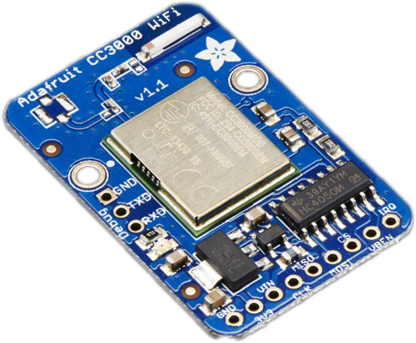
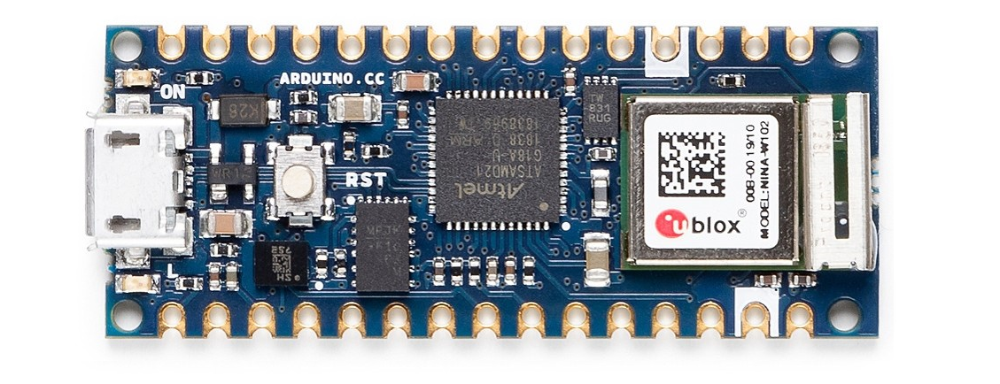

# ARDUINO WIFI

## Introduction

Using Arduino with WiFi is a great option for connecting your Arduino board wirelessly to the Internet in a few minutes. Connecting a device to a WiFi network is simple, no further configuration in addition to the SSID and the password are required. There are many boards with WiFi connectivity, as it provides an easy setup, without any cable requirement. There are a plenty of alternatives for WiFi connectivity, including shields, devices with on-board WiFi, or external modules that can be connected to the microcontroller.

In this documentation we cover how to connect devices over WiFi by using different approaches, like Arduino Shields, external modules, and devices with embedded WiFi like Arduino Nano 33 IoT, or Arduino MKR WIFI 1010 .

## Arduino with WiFi Shield


The following example will allow connecting your Arduino device with the WiFi Shield to the cloud platform in a few lines. Just modify the `arduino_secrets.h` file with your own information.



```cpp
#define THINGER_SERIAL_DEBUG
#define THINGER_USE_STATIC_MEMORY
#define THINGER_STATIC_MEMORY_SIZE 512

#include <WiFi.h>
#include <ThingerWifi.h>
#include "arduino_secrets.h"

ThingerWifi thing(USERNAME, DEVICE_ID, DEVICE_CREDENTIAL);

void setup() {
  // open serial for debugging
  Serial.begin(115200);
  
  // configure wifi network
  thing.add_wifi(SSID, SSID_PASSWORD);

  pinMode(2, OUTPUT);

  // pin control example (i.e. turning on/off a light, a relay, etc)
  thing["led"] << digitalPin(2);

  // resource output example (i.e. reading a sensor value, a variable, etc)
  thing["millis"] >> outputValue(millis());

  // more details at http://docs.thinger.io/arduino/
}

void loop() {
  thing.handle();
}
```



```cpp
#define USERNAME "your_user_name"
#define DEVICE_ID "your_device_id"
#define DEVICE_CREDENTIAL "your_device_credential"

#define SSID "your_wifi_ssid"
#define SSID_PASSWORD "your_wifi_ssid_password"
```



## Arduino with CC3000

The CC3000 chip from Texas Instruments was one of the first low-cost WiFi chips that revolutionized the IoT maker ecosystem. In contrary to the other available WiFi alternatives, like the WiFi shield, the CC3000 appeared at a low cost (about 10$) for their time. It is a powerful chip as it integrates the whole TCP/IP stack and many other protocols. Some vendors like Adadruit started to build modules and libraries for integrating this chip with the Arduino ecosystem. Thanks to the libraries provided by Adafruit is then possible to build connected device with a few lines of code.



So for this module is required to have installed the **Adafruit CC3000 Libraries**, as they are directly used by the thinger client. You can install it directly from the Arduino Library Manager by searching `cc3000`.

.png>)

The following example will allow connecting your Arduino device with the CC3000 module to the cloud platform in a few lines. Just modify the `arduino_secrets.h` file with your own information.



```cpp
#define THINGER_SERIAL_DEBUG

#include <ThingerCC3000.h>
#include "arduino_secrets.h"

ThingerCC3000 thing(USERNAME, DEVICE_ID, DEVICE_CREDENTIAL);

void setup() {
  // open serial for debugging
  Serial.begin(115200);

  // configure wifi network
  thing.add_wifi(SSID, SSID_PASSWORD);

  pinMode(2, OUTPUT);

  // pin control example (i.e. turning on/off a light, a relay, etc)
  thing["led"] << digitalPin(2);

  // resource output example (i.e. reading a sensor value, a variable, etc)
  thing["millis"] >> outputValue(millis());

  // more details at http://docs.thinger.io/arduino/
}

void loop() {
  thing.handle();
}
```



```cpp
#define USERNAME "your_user_name"
#define DEVICE_ID "your_device_id"
#define DEVICE_CREDENTIAL "your_device_credential"

#define SSID "your_wifi_ssid"
#define SSID_PASSWORD "your_wifi_ssid_password"
```



## Arduino Yun

The Arduino Yún is a microcontroller board based on the ATmega32u4 and the Atheros AR9331. The Atheros processor supports a Linux distribution based on OpenWrt named OpenWrt-Yun. The board has built-in Ethernet and WiFi support, a USB-A port, micro-SD card slot, 20 digital input/output pins (of which 7 can be used as PWM outputs and 12 as analog inputs), a 16 MHz crystal oscillator, a micro USB connection, an ICSP header, and 3 reset buttons. This board let the programmable ATmega32u4 communicate with Internet by using the Bridge Library that expose some functions running in the Linux distribution.


The following example will allow connecting an Arduino Yun to the cloud platform in a few lines using the WiFi interface. Just modify the `arduino_secrets.h` file with your own information. Notice that it is not required to configure any network parameter in the code, as this managed by the running Linux distribution. However you many need to connect with your Arduino Yun via WiFi to connect it some local network.



```cpp
#include <ThingerYun.h>
#include "arduino_secrets.h"

ThingerYun thing(USERNAME, DEVICE_ID, DEVICE_CREDENTIAL);

void setup() {
  pinMode(LED_BUILTIN, OUTPUT);

  // initialize bridge
  Bridge.begin();

  // pin control example (i.e. turning on/off a light, a relay, etc)
  thing["led"] << digitalPin(LED_BUILTIN);

  // resource output example (i.e. reading a sensor value, a variable, etc)

  // more details at http://docs.thinger.io/arduino/
}

void loop() {
  thing.handle();
}
```



```cpp
#define USERNAME "your_user_name"
#define DEVICE_ID "your_device_id"
#define DEVICE_CREDENTIAL "your_device_credential"
```




For using Arduino Yun, the device must be connected to a network with Internet, just with Ethernet or a Wifi connection. It can be configured in the Arduino Yun web configuration.



## Arduino MKR1000

The Arduino MKR1000 is a microcontroller based on the Atmel ATSAMW25 SoC (System on Chip), that is part of the SmartConnect family of Atmel Wireless devices, specifically designed for IoT projects and devices. A good 32 bit computational power similar to the Zero board, the usual rich set of I/O interfaces, low power WiFi with a Cryptochip for secure communication, and the ease of use of the Arduino Software (IDE) for code development and programming. All these features make this board the preferred choice for the emerging IoT battery-powered projects in a compact form factor.


The following example will allow connecting the MKR1000 device to the cloud platform in a few lines using the WiFi interface. Just modify the `arduino_secrets.h` file with your own information.



```cpp
#define THINGER_SERIAL_DEBUG

#include <ThingerWifi101.h>
#include "arduino_secrets.h"

// cannot connect? Update WiFi101 firmware and add iot.thinger.io SSL Certificate
// https://support.arduino.cc/hc/en-us/articles/360016119219

ThingerWifi101 thing(USERNAME, DEVICE_ID, DEVICE_CREDENTIAL);

void setup() {
  // open serial for debugging
  Serial.begin(115200);

  // configure wifi network
  thing.add_wifi(SSID, SSID_PASSWORD);

  pinMode(LED_BUILTIN, OUTPUT);

  // pin control example (i.e. turning on/off a light, a relay, etc)
  thing["led"] << digitalPin(LED_BUILTIN);

  // resource output example (i.e. reading a sensor value, a variable, etc)
  thing["millis"] >> outputValue(millis());

  // more details at http://docs.thinger.io/arduino/
}

void loop() {
  thing.handle();
}
```



```
#define USERNAME "your_user_name"
#define DEVICE_ID "your_device_id"
#define DEVICE_CREDENTIAL "your_device_credential"

#define SSID "your_wifi_ssid"
#define SSID_PASSWORD "your_wifi_ssid_password"
```




For using MKR1000 over the default TLS/SSL connection it is required to install the Thinger.io server certificate in the board with the Wifi101 Firmware Updater located in the Tools menu.



## Arduino MKR1010

The Arduino MKR WiFi 1010 is the easiest point of entry to basic IoT and pico-network application design. Whether you are looking at building a sensor network connected to your office or home router, or if you want to create a BLE device sending data to a cellphone, the MKR WiFi 1010 is your one-stop-solution for many of the basic IoT application scenarios. The board's main processor is a low power Arm® Cortex®-M0 32-bit SAMD21, like in the other boards within the Arduino MKR family. The WiFi and Bluetooth® connectivity is performed with a module from u-blox, the NINA-W10, a low power chipset operating in the 2.4GHz range. On top of those, secure communication is ensured through the Microchip® ECC508 crypto chip. Besides that, you can find a battery charger, and a directionable RGB LED on-board.

.png>)

The following example will allow connecting the MKR1010 device to the cloud platform in a few lines using the WiFi interface. Just modify the `arduino_secrets.h` file with your own information.


The integration with Thinger.io requires downloading an additional library called "Arduino WiFiNINA" that allows communicating with the U-BLOX WiFi module.




```cpp
#define THINGER_SERIAL_DEBUG

#include <ThingerWiFiNINA.h>
#include "arduino_secrets.h"

// cannot connect? Update WiFiNiNA and add iot.thinger.io SSL Certificate
// https://support.arduino.cc/hc/en-us/articles/360016119219

ThingerWiFiNINA thing(USERNAME, DEVICE_ID, DEVICE_CREDENTIAL);

void setup() {
  // configure LED_BUILTIN for output
  pinMode(LED_BUILTIN, OUTPUT);

   // open serial for debugging
  Serial.begin(115200);

  // configure wifi network
  thing.add_wifi(SSID, SSID_PASSWORD);

  // pin control example (i.e. turning on/off a light, a relay, etc)
  thing["led"] << digitalPin(LED_BUILTIN);

  // resource output example (i.e. reading a sensor value, a variable, etc)
  thing["millis"] >> outputValue(millis());

  // more details at http://docs.thinger.io/arduino/
}

void loop() {
  thing.handle();
}
```



```cpp
#define USERNAME "your_user_name"
#define DEVICE_ID "your_device_id"
#define DEVICE_CREDENTIAL "your_device_credential"

#define SSID "your_wifi_ssid"
#define SSID_PASSWORD "your_wifi_ssid_password"
```




For using MKR1010 over the default TLS/SSL connection it is required to install the Thinger.io server certificate in the board with the Wifi101 Firmware Updater located in the Tools menu.



## Arduino Nano 33 IoT

In the same iconic size of the Arduino Nano, the Arduino Nano 33 IoT hosts an Arm Cortex-M0+ SAMD21 processor, a WiFi and Bluetooth module based on ESP32, a 6 axis Inertial Measurement Unit (IMU) and a crypto chip which can securely store certificates and pre shared keys.




The integration with Thinger.io requires downloading an additional library called "Arduino WiFiNINA" that allows communicating with the U-BLOX WiFi module.


The following example will allow connecting the Arduino Nano 33 IoT device to the cloud platform in a few lines using the WiFi interface. Just modify the `arduino_secrets.h` file with your own information.



```cpp
#define THINGER_SERIAL_DEBUG

#include <ThingerWiFiNINA.h>
#include "arduino_secrets.h"

// requires library Arduino_LSM6DS3 for the imu readings
#include <Arduino_LSM6DS3.h>

// cannot connect? Update WiFiNiNA and add iot.thinger.io SSL Certificate
// https://support.arduino.cc/hc/en-us/articles/360016119219

ThingerWiFiNINA thing(USERNAME, DEVICE_ID, DEVICE_CREDENTIAL);

void setup() {
  // configure LED_BUILTIN for output
  pinMode(LED_BUILTIN, OUTPUT);

  // open serial for debugging
  Serial.begin(115200);

  // initialize IMU
  if (!IMU.begin()) {
    Serial.println("Failed to initialize IMU!");
    while (1);
  }

  // configure wifi network
  thing.add_wifi(SSID, SSID_PASSWORD);

  // pin control example (i.e. turning on/off a light, a relay, etc)
  thing["led"] << digitalPin(LED_BUILTIN);

  // resource output example (i.e. reading a sensor value, a variable, etc)
  thing["millis"] >> outputValue(millis());

  // example for the built-int gyroscope
  thing["imu"] >> [](pson& out){
    float x, y, z;
    IMU.readGyroscope(x, y, z);
    out["x"] = x;
    out["y"] = y;
    out["z"] = z;
  };

  // more details at http://docs.thinger.io/arduino/
}

void loop() {
  thing.handle();
}
```



```cpp
#define USERNAME "your_user_name"
#define DEVICE_ID "your_device_id"
#define DEVICE_CREDENTIAL "your_device_credential"

#define SSID "your_wifi_ssid"
#define SSID_PASSWORD "your_wifi_ssid_password"
```




For using Arduino 33 IoT over the default TLS/SSL connection it is required to install the Thinger.io server certificate in the board with the Wifi101 Firmware Updater located in the Tools menu.



## Arduino Nano RP2040

The brain of the board is the Raspberry Pi RP2040 silicon; a dual-core Arm Cortex M0+ running at 133MHz. It has 264KB of SRAM, and the 16MB of flash memory is off-chip to give you extra storage. But what’s really exciting is the on-board connectivity options. The hugely popular and highly adaptable u-blox NINA-W102 radio module is on there to make this a true IoT champion. It’s got on-board, built-in sensors to turn your builds into powerhouse projects, too. Microphone and motion sensing add a depth of possibilities that’s almost impossible to find in a board of this size. The Arduino Nano RP2040 Connect is the premium choice for RP2040 devices, and the perfect option for upgrading your projects and unlocking the potential of new ones.

.png>)


The integration with Thinger.io requires downloading an additional library called "Arduino WiFiNINA" that allows communicating with the U-BLOX WiFi module.


The following example will allow connecting the Arduino Nano RP2040 device to the cloud platform in a few lines using the WiFi interface. Just modify the `arduino_secrets.h` file with your own information.



```cpp
#define THINGER_SERIAL_DEBUG

#include <ThingerMbed.h>
#include "arduino_secrets.h"

ThingerMbed thing(USERNAME, DEVICE_ID, DEVICE_CREDENTIAL);

// cannot connect? Update WiFiNiNA and add iot.thinger.io SSL Certificate
// https://support.arduino.cc/hc/en-us/articles/360016119219

void setup() {
  // configure LED_BUILTIN for output
  pinMode(LED_BUILTIN, OUTPUT);

  // open serial for debugging
  Serial.begin(115200);

  // configure wifi network
  thing.add_wifi(SSID, SSID_PASSWORD);

  // pin control example (i.e. turning on/off a light, a relay, etc)
  thing["led"] << digitalPin(LED_BUILTIN);

  // resource output example (i.e. reading a sensor value, a variable, etc)
  thing["millis"] >> outputValue(millis());

  // start thinger task
  thing.start();

  // more details at http://docs.thinger.io/arduino/
}

void loop() {
  // use loop as in normal Arduino Sketch
  // use thing.lock() thing.unlock() if using variables exposed on thinger resources
}
```



```cpp
#define USERNAME "your_user_name"
#define DEVICE_ID "your_device_id"
#define DEVICE_CREDENTIAL "your_device_credential"

#define SSID "your_wifi_ssid"
#define SSID_PASSWORD "your_wifi_ssid_password"
```




For using Arduino Nano RP2040 over the default TLS/SSL connection it is required to install the Thinger.io server certificate in the board with the Wifi101 Firmware Updater located in the Tools menu.



## Arduino Portenta H7

Portenta H7 simultaneously runs high level code along with real time tasks. The design includes two processors that can run tasks in parallel. For example, is possible to execute Arduino compiled code along with MicroPython one, and have both cores to communicate with one another. The Portenta functionality is two-fold, it can either be running like any other embedded microcontroller board, or as the main processor of an embedded computer.&#x20;

H7's main processor is the dual core STM32H747 including a Cortex® M7 running at 480 MHz and a Cortex® M4 running at 240 MHz. The two cores communicate via a _Remote Procedure Call_ mechanism that allows calling functions on the other processor seamlessly.

.png>)



```cpp
#define THINGER_SERIAL_DEBUG

#include <ThingerMbed.h>
#include "arduino_secrets.h"

ThingerMbed thing(USERNAME, DEVICE_ID, DEVICE_CREDENTIAL);

void setup() {
  // configure LED_BUILTIN for output
  pinMode(LED_BUILTIN, OUTPUT);

  // open serial for debugging
  Serial.begin(115200);

  // configure wifi network
  thing.add_wifi(SSID, SSID_PASSWORD);

  // pin control example (i.e. turning on/off a light, a relay, etc)
  thing["led"] << digitalPin(LED_BUILTIN);

  // resource output example (i.e. reading a sensor value, a variable, etc)
  thing["millis"] >> outputValue(millis());

  // more details at http://docs.thinger.io/arduino/
}

void loop() {
  thing.handle();
}
```



```cpp
#define USERNAME "your_user_name"
#define DEVICE_ID "your_device_id"
#define DEVICE_CREDENTIAL "your_device_credential"

#define SSID "your_wifi_ssid"
#define SSID_PASSWORD "your_wifi_ssid_password"
```




In case of problems when connecting over secure TLS connections, you can try updating the WiFi firmware by flashing the WiFiFirmwareUpdater example sketch.




## Arduino Opta Wifi

The Arduino Opta is designed for industrial automation, offering robust performance and reliability. It features a dual-core STM32H747 microcontroller, which includes a Cortex® M7 running at 480 MHz and a Cortex® M4 running at 240 MHz. This configuration enables the Opta to handle complex real-time tasks and high-level code execution concurrently.

With its versatile architecture, the Opta supports running Arduino sketches alongside MicroPython, allowing developers to leverage the strengths of both programming environments. The dual-core setup facilitates inter-core communication via Remote Procedure Call, ensuring smooth and efficient coordination between the two processors. This capability makes the Arduino Opta ideal for advanced automation systems, where precise control and rapid response are crucial.

Additionally, the Arduino Opta is equipped with industrial-grade features, such as enhanced I/O capabilities and robust connectivity options. It can be seamlessly integrated into existing industrial networks, providing a reliable solution for monitoring and control applications. Whether used as a standalone microcontroller or as part of a larger embedded system, the Opta's performance and versatility make it a valuable asset in any industrial setting.

<figure><figcaption><p>Arduino Opta Wifi</p></figcaption></figure>



```cpp
#define THINGER_SERIAL_DEBUG

#include <ThingerMbed.h>
#include <ThingerPortentaOTA.h>
#include "arduino_secrets.h"

ThingerMbed thing(USERNAME, DEVICE_ID, DEVICE_CREDENTIAL);
ThingerPortentaOTA ota(thing);

void setup() {
    // open serial for debugging
    Serial.begin(115200);

    // configure leds for output
    pinMode(LED_D0, OUTPUT);
    pinMode(LED_D1, OUTPUT);
    pinMode(LED_D2, OUTPUT);
    pinMode(LED_D3, OUTPUT);
    pinMode(LEDR, OUTPUT);
    pinMode(LED_BUILTIN, OUTPUT);

    // configure relays for output
    pinMode(D0, OUTPUT);
    pinMode(D1, OUTPUT);
    pinMode(D2, OUTPUT);
    pinMode(D3, OUTPUT);

    // example for controlling relays and status led
    thing["relay_d0"] << [](pson& in){
        if(in.is_empty()){
            in = (bool) digitalRead(D0);
        }else{
            digitalWrite(D0, in ? HIGH : LOW);
            digitalWrite(LED_D0, in ? HIGH : LOW);
        }
    };

    thing["relay_d1"] << [](pson& in){
        if(in.is_empty()){
            in = (bool) digitalRead(D1);
        }else{
            digitalWrite(D1, in ? HIGH : LOW);
            digitalWrite(LED_D1, in ? HIGH : LOW);
        }
    };

    thing["relay_d2"] << [](pson& in){
        if(in.is_empty()){
            in = (bool) digitalRead(D2);
        }else{
            digitalWrite(D2, in ? HIGH : LOW);
            digitalWrite(LED_D2, in ? HIGH : LOW);
        }
    };

    thing["relay_d3"] << [](pson& in){
        if(in.is_empty()){
            in = (bool) digitalRead(D3);
        }else{
            digitalWrite(D3, in ? HIGH : LOW);
            digitalWrite(LED_D3, in ? HIGH : LOW);
        }
    };

    // example for controlling led
    thing["led"] << digitalPin(LED_BUILTIN);
    thing["led_r"] << digitalPin(LEDR);

    // resource output example (i.e. reading a sensor value, a variable, etc)
    thing["millis"] >> outputValue(millis());

    // start thinger on its own task
    thing.start();

    // more details at http://docs.thinger.io/arduino/
}

void loop() {
    // use loop as in normal Arduino Sketch
    // use thing.lock() thing.unlock() when using/modifying variables exposed on thinger resources
    delay(1000);
}
```



```cpp
#define USERNAME "your_user_name"
#define DEVICE_ID "your_device_id"
#define DEVICE_CREDENTIAL "your_device_credential"

#define SSID "your_wifi_ssid"
#define SSID_PASSWORD "your_wifi_ssid_password"
```




In case of problems when connecting over secure TLS connections, you can try updating the WiFi firmware by flashing the WiFiFirmwareUpdater example sketch.




## Arduino Uno WiFi Rev2

The Arduino Uno WiFi is functionally the same as the Arduino Uno Rev3, but with the addition of WiFi and some other enhancements. It incorporates a brand new 8-bit microprocessor from Microchip and has an onboard IMU (Inertial Measurement Unit). The WiFi Module is a self-contained SoC with integrated TCP/IP protocol stack that can provide access to a WiFi network, or act as an access point.


The integration with Thinger.io requires downloading an additional library called "Arduino WiFiNINA" that allows communicating with the U-BLOX WiFi module.


The following example will allow connecting the Arduino Uno WiFi Rev2 device to the cloud platform in a few lines using the WiFi interface. Just modify the `arduino_secrets.h` file with your own information.



```cpp
#define THINGER_SERIAL_DEBUG

#include <ThingerWiFiNINA.h>
#include "arduino_secrets.h"

// cannot connect? Update WiFiNiNA and add iot.thinger.io SSL Certificate
// https://support.arduino.cc/hc/en-us/articles/360016119219

ThingerWiFiNINA thing(USERNAME, DEVICE_ID, DEVICE_CREDENTIAL);

void setup() {
  // configure LED_BUILTIN for output
  pinMode(LED_BUILTIN, OUTPUT);

   // open serial for debugging
  Serial.begin(115200);

  // configure wifi network
  thing.add_wifi(SSID, SSID_PASSWORD);

  // pin control example (i.e. turning on/off a light, a relay, etc)
  thing["led"] << digitalPin(LED_BUILTIN);

  // resource output example (i.e. reading a sensor value, a variable, etc)
  thing["millis"] >> outputValue(millis());

  // more details at http://docs.thinger.io/arduino/
}

void loop() {
  thing.handle();
}
```



```cpp
#define USERNAME "your_user_name"
#define DEVICE_ID "your_device_id"
#define DEVICE_CREDENTIAL "your_device_credential"

#define SSID "your_wifi_ssid"
#define SSID_PASSWORD "your_wifi_ssid_password"
```




For using this board with he default TLS/SSL connection it is required to install the Thinger.io server certificate in the board with the Wifi101 Firmware Updater located in the Tools menu.



###
