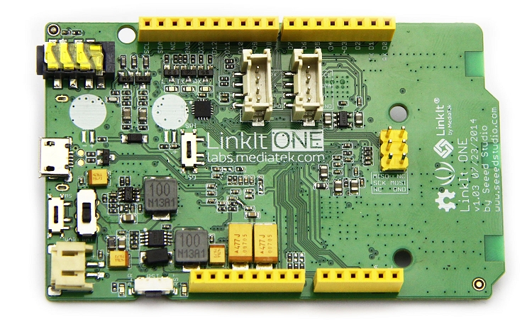

# OTHER DEVICES

## TI Launchpad CC3200

The TI CC3200 was the natural evolution of the CC3000/CC3100 chip. Instead on providing a single chip for managing the WiFi communications, it also integrates a powerful programmable MCU, in the same way the ESP8266 is doing. So you can program your code and have WiFi capabilities right out of the box. The easiest way to start with this chip is by using the TI CC3200 Launchpad, which integrates the chip, as well as some sensors, leds, and the USB to serial so you can program the board right from the USB.


To program this board it is possible to use an Arduino-based IDE that is called [Energia](http://energia.nu/download/). So, download and install it before continue. Checkout also the required instructions for programming the CC3200, as you need to make a short between two pins.

Once the environment is available and you can program the board examples, then you should install the Thinger Arduino Client Libraries also in the Energia IDE. Check the [Manual Import](./#installation-manual-import) for reference.

The following example will allow connecting your device to the cloud platform in a few lines. Just replace the sketch **username**, **deviceId**, and **deviceCredential** with your own credentials, and the **wifi\_ssid**, **wifi\_password** with the WiFi credentials.

```cpp
#include <WiFi.h>
#include <ThingerWifi.h>

ThingerWifi thing("username", "deviceId", "deviceCredential");

void setup() {
    thing.add_wifi("wifi_ssid", "wifi_password");
}

void loop() {
  thing.handle();
}
```

Want to add some device resources \(led, sensors, etc.\) to interact with them from the Internet?, check the [Add Resources](./#coding-adding-resources) section.

## SeeedStudio LinkIT ONE

The LinkIt ONE development board is an open source, high performance, Arduino footprint board for prototyping Internet of Things \(IoT\) devices. The list of capabilities is truly staggering. The board is based around a powerful ARM7 EJ-S™ processor, but has onboard GSM, GPRS, Wi-Fi, Bluetooth BR/EDR/BLE, GPS, Audio codec, and SD card connector \(and more!\).

The board is programmed through the Arduino IDE with a plugin from MediaTek. Check the [MediaTek LinkIt™ ONE SDK for Arduino](http://labs.mediatek.com/site/global/developer_tools/mediatek_linkit/sdk_intro/index.gsp)



> Pin-out similar to Arduino boards, including Digital I/O, Analog I/O, PWM, I2C, SPI, UART and power supply, compatible with Grove 4-pin interface. Although the board is made by Seeed, the chipset is made by MediaTek, a large Chinese company who are already offering significant SDK / support resources.

### WIFI Connection

The following example will allow connecting your device to the cloud platform in a few lines. Just replace the sketch **username**, **deviceId**, and **deviceCredential** with your own credentials, and the **wifi\_ssid**, **wifi\_password** with the WiFi credentials.



```cpp
#include <ThingerLinkItOneWifi.h>

ThingerLinkItOneWifi thing("user_id", "device_id", "device_credential");

void setup() {
  thing.add_wifi("SSID", "SSID_Password");

  pinMode(2, OUTPUT);

  // pin control example (i.e. turning on/off a light, a relay, etc)
  thing["led"] << digitalPin(2);

  // resource output example (i.e. reading a sensor value, a variable, etc)
  thing["millis"] >> outputValue(millis());

  // more details at http://docs.thinger.io/arduino/
}

void loop() {
  thing.handle();
}
```



### GPRS Connection

It is also possible to connect the board by using the GPRS connection, so it does not require a WiFi connection for the communication, improving the board mobility. Note that the current version of the LinkIt ONE does not support a SIM with PIN, so remove the PIN befor its use. In this case, it is only necessary to provide the **apn**, **username**, and **password** provided by your network operator. But you can skip this process if your SIM already integrates this information.



```cpp
#include <ThingerLinkItOneGPRS.h>

#define USERNAME "your_user_name"
#define DEVICE_ID "your_device_id"
#define DEVICE_CREDENTIAL "your_device_credential"

ThingerLinkItOneGPRS thing(USERNAME, DEVICE_ID, DEVICE_CREDENTIAL);

void setup() {
  // SIM unlock using a PIN is not supported by LinkItOne. Remove PIN from SIM before use.

  // Set your GPRS APN if it is not provided automatically by your SIM
  //thing.set_apn("orangeworld", "orange", "orange");

  pinMode(2, OUTPUT);

  // pin control example (i.e. turning on/off a light, a relay, etc)
  thing["led"] << digitalPin(2);

  // resource output example (i.e. reading a sensor value, a variable, etc)
  thing["millis"] >> outputValue(millis());

  // more details at http://docs.thinger.io/arduino/
}

void loop() {
  thing.handle();
}
```



