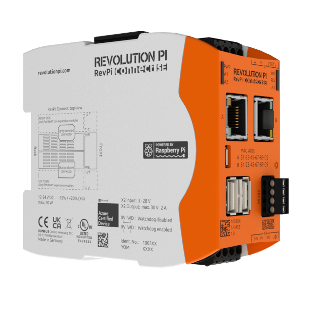

# Kunbus RevPi

## Product Description

<figure><figcaption>
Open Source IPC based on Raspberry Pi
</figcaption></figure>

Revolution Pi is an open, modular, and inexpensive industrial PC based on the well-known Raspberry Pi. Housed in a slim DIN-rail housing, the three available base modules can be seamlessly expanded by a variety of suitable I/O modules and fieldbus gateways. The 24V powered modules are connected via an overhead connector in seconds and can be easily configured via a graphical configuration tool.

To achieve real industrial suitability according to EN 61131-2 or IEC 61131-2, the rather unknown Raspberry Pi Compute Module was used as a basis. The module, which looks like a notebook RAM bar, is limited to the essentials and does not have any external interfaces. With the Raspberry Pi Compute Module, the foundation has been laid for equipping the Raspberry Pi with a robust and industry-compatible periphery developed by us, which meets all important industrial standards. On the software side, the Revolution Pi has a specially adapted Raspberry Pi OS (formerly known as Raspbian) operating system, which is equipped with a real-time patch. The use of Raspberry Pi OS ensures that most of the applications developed for the Raspberry Pi can also be used on the Revolution Pi.

## Integration

To integrate Kunbus RevPi with Thinger.io, just connect it to a server instance with the standard [Linux/Raspberry Pi client](../../../linux.md).

## Product Services

### PiCtory

[PiCtory](https://revolutionpi.com/tutorials/what-is-pictory/) is a browser-based application that allows you to communicate between your RevPi and connected devices using a configuration file. This configuration file is created by means of PiCtory.

The main functions of a configuration file are:

* Communicating the type and position of the expansion modules to the base module
* Communicating mutually the basic settings of your RevPi and connected devices
* Using the configuration values of your RevPi in other applications

<figure><figcaption>
Pictory Running on Kunbus RevPi and managed from Thinger.io
</figcaption></figure>

To access Pictory from Thinger.io, it is required to create a [Product Service](kunbus-revpi.md#product-services) with the following configuration:

<figure><figcaption></figcaption></figure>

### Node-RED

Node-RED is a programming tool for wiring together hardware devices, APIs, and online services in new and interesting ways.

It provides a browser-based editor that makes it easy to wire together flows using the wide range of nodes in the palette that can be deployed to its runtime in a single-click.

Kunbus Rev-PI integrates Node-RED. The [node-red-contrib-revpi-nodes](https://flows.nodered.org/node/node-red-contrib-revpi-nodes) provides a set of nodes in [Node-RED](https://nodered.org/) to read and write to I/O Pins of your [Revolution Pi](https://revolution.kunbus.de/).

<figure><figcaption>
Node-RED Running on Kunbus RevPi and managed from Thinger.io
</figcaption></figure>

To access Node-RED from Thinger.io, it is required to create a [Product Service](kunbus-revpi.md#product-services) with the following configuration:

<figure><figcaption></figcaption></figure>

## Terminal

To access the system terminal of the Kunbus RevPi, it is not required to do any additional setup. Once the device is connected with Thinger.io, just access the Terminal section on the device and click "Connect".

<figure><figcaption>
Kunus RevPi terminal managed from Thinger.io
</figcaption></figure>

