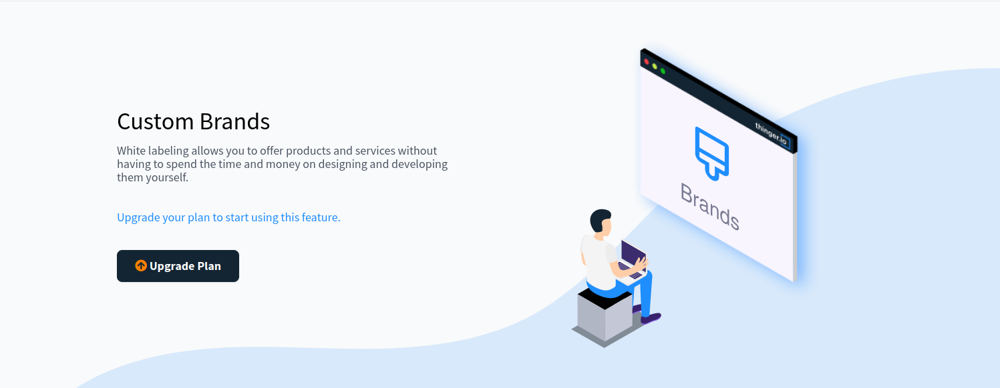
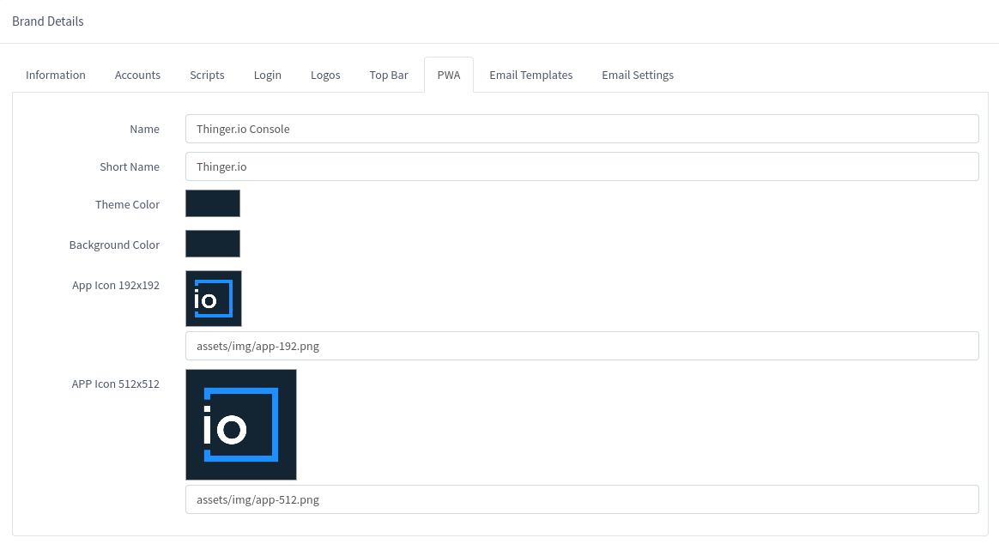

# WHITE-LABELING

Thinger.io instances support multi-tenant web console customizations. By means of a management tool that is available at the main menu "Rebranding" section, it is possible to create and manage multiple web customizations, in order to customize the aspect of the web console to different customers or projects by changing some elements such as:

* [x] Branding Colors
* [x] Web, Favicon and Main Menu logotypes
* [x] Links, Email accounts and copyright


Note that each web console rebrand needs to be supported by an individual web domain, which can be managed in the "Domain" section of the main menu, or use the default domain.


## New console rebranding

Select "Brands" on the Thinger menu:

<figure><figcaption></figcaption></figure>

Clicking into "Add Brand" button of the "Rebranding" section allows creating a new branding profile. The process starts by introducing a web domain name, which will be the identification for the brand profile:

<figure><figcaption></figcaption></figure>

If the instance subscription doesn't include any rebranding add-on, the next message will be shown in the web console: &#x20;

<figure><figcaption></figcaption></figure>

Check out the pricing page for information regarding the branding.

### Adding Branding Details

If the Domain Name is valid, the form context will expand, allows completing the branding details sections by editing the standard Thinger.io values:

<figure><figcaption></figcaption></figure>

All elements in this tab are optional and will not be added to the web page if left empty. Here's a breakdown of the fields available for configuration:

* **Domain Name:** URL of the new, rebranded web console. This Web Domain needs to be introduced in the system, as explained in the CUSTOM WEB DOMAIN section. The default domain may also be used.
* **Description:** Additional information about the rebranding profile in order to identify it from the others.
* **Page title:** Name for the web browser tabs.
* **Page URL:** Link to the company, customer, or project website.
* **Meta Description:** Brief summary of a web page used as a meta field, displayed as part of search engines.
* **Meta Keywords:** Keywords used for search engine indexing.
* **Share Image:** Image that appears in social networks and messaging apps when a user shares a link to the site.
* **Company Name:** Name of the project, customer, or company this rebranding belongs to.
* **Contact Email:** Address for the main menu "Email" button that users are going to use to contact for support.
* **Copyright:** The bottom of the website includes a copyright declaration that can be customized here to protect the rebranding rights.
* **Community Links:** Toggle that enables or disables the display of the default community support link from Thinger.io on the rebranded console.
* **Server version:** Toggle that controls whether the server version is displayed in the bottom left corner of the rebranded website.

### Accounts

Here are the configurable options:

* **Cross Sign-in:** This toggle enables or disables the ability for users to sign in to this brand's console using credentials from other linked Thinger.io brands or integrated external services. This feature streamlines the user experience by allowing a single sign-on across connected platforms.
* **Public Sign-up:** This toggle controls whether new users can directly register an account through this brand's web console login page. When enabled, users can create their own accounts without requiring an invitation from an administrator.
* **Account Role:** This dropdown allows selecting the default role that will be automatically assigned to any new user accounts created under this brand, especially those signing up via the public sign-up option. This sets their initial permissions and access levels within the platform.

<figure><figcaption></figcaption></figure>

Once configured, the 'Update Brand' button is clicked to save the changes.

### Scripts

Specifically, the **"Index Scripts"** area provides an HTML editor where custom HTML, JavaScript, or CSS code can be embedded. This enables adding bespoke elements, integrating third-party services (like analytics or chat widgets), or modifying the behavior and appearance of the main console pages beyond the standard branding options. This feature provides powerful control for tailoring the user interface and functionality to specific needs:

<figure><figcaption></figcaption></figure>

### Login

The login page serves as the initial destination for users. Incorporating the company's distinctive image and colors enhances the overall platform experience.

In this form, we will be able to set the background color or background image, with support for animated images. Select where the box should be located and its style.&#x20;

<figure><figcaption></figcaption></figure>

These settings will render a login page:

<figure><figcaption></figcaption></figure>

### Custom Logo

What really makes the difference when creating a rebrand is the use of custom logotypes. The third tab of the branding editor allows changing each web console logo separately. To obtain good results, it is important to take care of the background color of each logotype in order to obtain enough contrast:

<figure><figcaption></figcaption></figure>

And also, the menu icon, before clicking on "Add Brand" if it hasn't been created, or "Update Brand", if it has already been created:

<figure><figcaption></figcaption></figure>


Logotypes need to be introduced in a PNG file format with a transparent background&#x20;


### **Custom Top Bar**

The top bar also has a big impact on the website aspect. The branding menu allows changing its aspect in two ways, the Top Bar Color and the text color:

<figure><figcaption></figcaption></figure>

It is also important to take care of selected colors in order to obtain a nice contrast between the texts and background.&#x20;

### **PWA**

Thinger.io web console has been prepared with PWA Smartphone responsive features, allowing to create web apps with web console custom preferences that, when used on the smartphone allow a user experience very similar to a common APP, thanks to the creation of a custom logo in the main menu and hiding the web browser navigation bar.

<figure><figcaption></figcaption></figure>

To use the PWA on a smartphone, simply click on the "add to the main menu" option in the browser menu. This functionality can be applied in any of the web console interfaces, even in shared dashboards:

<figure><figcaption></figcaption></figure>

The PWA function parameters will be automatically configured based on the preferences of the other tabs of the web console rebranding. So it is not possible to introduce different ones. &#x20;

.png>)

### Email Templates

When working on multi-user projects, the platform has a series of communications that allow basic communication with users to `Email Verification`, `Create Password`, `Forgot Password` and `Device Disabled`. These emails can also be customized by the developer, allowing the modification of:

1. Email Verification:

<figure><figcaption></figcaption></figure>

* **From**: Is the sender's mail address that will be sent in the mail. Leave it empty to use the default configured address in the SMTP section
* **Name**: Sender's contact mail. Leave it empty to use the default name configured in the SMTP section
* **Subject**: Email subject.
* **Template**:  Configure the email template, working directly with the text or with the HTML code. This is a completed template:

<figure><figcaption></figcaption></figure>

While this is the HTML code:

<figure><figcaption></figcaption></figure>


Every Template can be tested. The HTML code will be shown by pressing the 'Show Code' button, which then becomes the 'Hide Code' button.


2. Create Password:

* **From**: Is the sender's mail address that will be sent in the mail. Leave it empty to use the default configured address in the SMTP section
* **Name**: Sender's contact mail. Leave it empty to use the default name configured in the SMTP section
* **Subject**: Email subject.
* **Template**:  Configure the email template, working directly with the text or with the HTML code.

<figure><figcaption></figcaption></figure>

3. Forgot Password:

* **From**: Is the sender's mail address that will be sent in the mail. Leave it empty to use the default configured address in the SMTP section
* **Name**: Sender's contact mail. Leave it empty to use the default name configured in the SMTP section
* **Subject**: Email subject.
* **Template**:  Configure the email template, working directly with the text or with the HTML code.

<figure><figcaption></figcaption></figure>

4. Device Disabled:

* **From**: Is the sender's mail address that will be sent in the mail. Leave it empty to use the default configured address in the SMTP section
* **Name**: Sender's contact mail. Leave it empty to use the default name configured in the SMTP section
* **Subject**: Email subject.
* **Template**:  Configure the email template, working directly with the text or with the HTML code.

<figure><figcaption></figcaption></figure>

### Email Settings

This section allows customizing the email server for this specific brand. Note that it is also possible to modify it in the Server Settings to create a default configuration for the whole host, which will be applied to all the rebrands.&#x20;

<figure><figcaption></figcaption></figure>

#### SMTP Configuration

The **Simple Mail Transfer Protocol**, better known as SMTP, is a protocol used to transmit email messages over the Internet. Thinger.io server instances contain an SMTP server that allows sending notifications to the instance users, which has been configured by default to use the same web domain as the IoT server host and the standard parameters, however,  these parameters can be customized by changing the server:

<figure><figcaption></figcaption></figure>

* **Host:** Is the SMTP address or web domain
* **Port:** Custom port to be used in order to send the notifications
* **Username**: SMTP username credentials&#x20;
* **Password:** SMTP username password
* **SSL/TLS** **Connection:** should be enabled if the SMTP has been installed on a different host, but can be disabled if it is running on the same one.

#### Amazon SES Configuration

The integration with Amazon SES provides a much simpler and scalable mailing tool. It can be selected instead of the common SMTP by selecting it on Email Type, and placing the credentials in its appropriate section. These credentials can be obtained on the AWS SES configuration section, as explained on[ **this link**](https://ongage.atlassian.net/wiki/spaces/HELP/pages/13795743/Amazon+SES+Setup+Tutorial)**.**

<figure><figcaption></figcaption></figure>

## **Modify Console Rebranding**

When the Console Rebranding profile is finished, a new entry will appear in the rebranding administration list:

<figure><figcaption></figcaption></figure>

It is possible to access the configuration form and edit all parameters by clicking on the brand profile identifier, which is the associated web domain.

## Remove a Console Rebranding Profile

A rebranding profile can be easily deleted just selecting it in the Brand List and clicking the "Remove" button.

<figure><figcaption></figcaption></figure>

## Increase Rebranding Limits&#x20;

This feature is reserved for professional uses, so only Medium and Large subscriptions can create custom rebranding profiles. If the subscription didn't include any branding, it may be upgraded to a superior plan by contacting us at support@thinger.io.
