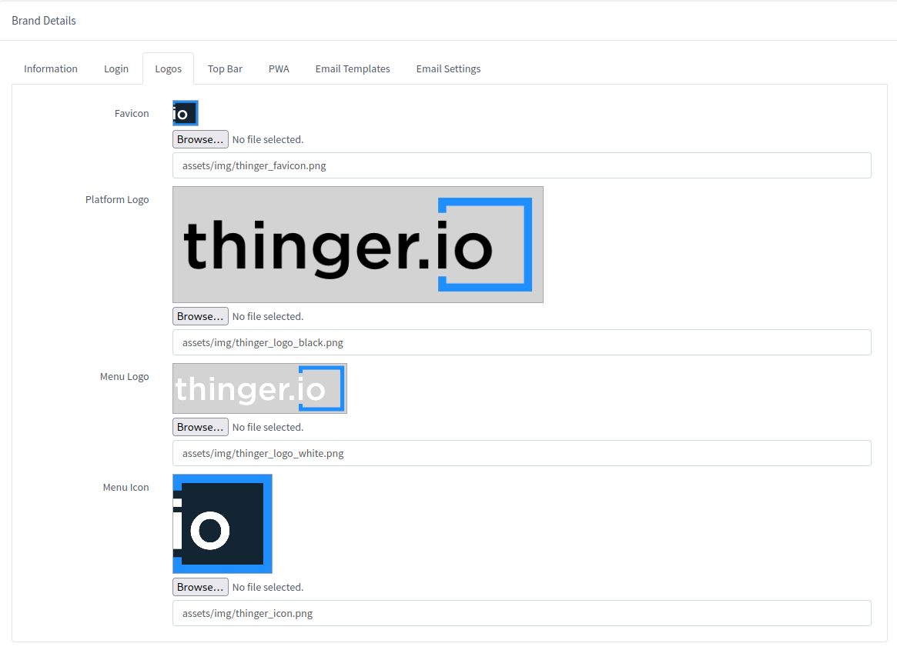

# WHITE-LABELING

Thinger.io instances support multi-tenant web console customizations. By means of a management tool that is available at the main menu "Rebranding" section, it is possible to create and manage multiple web customizations, in order to custom the aspect of the web console to different customers or projects by changing some elements such as:

* [x] Branding Colors
* [x] Web, Favicon and Main Menu logotypes
* [x] Links, Email accounts, copyright


Note that each web console rebrand needs to be supported by an individual web domain, which can be managed in the "Domain" section of the main menu or use the default domain.


## New console rebranding

Clicking into "Add Brand" button of the "Rebranding" section allows creating a new branding profile. The process starts by introducing a web domain name, that will be the identification for the brand profile:

.png>)

If the instance subscription doesn't include any rebranding add-on, the next message will be shown in the web console: &#x20;

<figure><figcaption></figcaption></figure>

Check out the pricing page for information regarding the branding.

### Adding Branding Details

If the Domain Name is valid, the form context will expand allowing to complete the branding details sections by editing the standard Thinger.io values:

<figure><figcaption></figcaption></figure>

All elements in this tab are option and will not be added to the web page if left empty.

* **Domain Name:** URL of the new rebranded web console. This Web Domain needs to be introduced in the system as is explained in the [web-domain-customization.md](web-domain-customization.md "mention") section.  The default domain may also be used.
* **Description: A**dditional information about the rebranding profile in order to identify it from the others.
* **Page title:** Name for the web browser tabs.
* **Page URL:** Link to the company, customer or project website
* **Meta Description:** Brief summary of a web page used as a meta field, displayed as parts of search engines.
* **Meta Keywords:** Keywords used for search engine indexing.
* **Share Image:** Image that appears in social networks and messaging apps when a user shares a link to the site.
* **Company Name:** Name of the project, customer or company this rebranding belongs to.&#x20;
* **Contact Email:** Address for the main menu"Email" button that the users are going to contact for support.
* **Twitter Account:**  Social media profile can be added by placing here the complete URL of the twitter profile.
* **Copyright:** The bottom of the website includes a copyright declaration that can be customized here to protect the rebranding rights.&#x20;
* **Community Links:** Shows the default community support link from Thinger.io.
* **Server version:** Shows the server version on the bottom left corner.

### Login

The login page serves as the initial destination for users. Incorporating the company's distinctive image and colors enhances the overall platform experience.

In this form we will be able to set the background color, or background image, with support for animated images. Select where the box should be located and its style.

<figure><figcaption></figcaption></figure>

This settings will render a login page as he following:

<figure><figcaption></figcaption></figure>

### Custom Logo

What really makes the difference when creating a rebranding is the use of custom logotypes. The third tab of the branding editor allows changing each web console logo separately. To obtain good results, it is important to take care about the background color of each logotype in order to obtain enough contrast.

<figure><figcaption></figcaption></figure>


Logotypes need to be introduced in PNG file format with transparent background&#x20;


### **Custom Top Bar**

The top bar has also a big impact on the website aspect. The branding menu allows changing it aspect in two ways: the Top Bar Color and the text color:

.png>)

It is important also to take care of selected colors in order to obtain a nice contrast between the texts and background.&#x20;

### **PWA**

Thinger.io web console has been prepared with PWA Smartphone responsive features, allowing to create web apps with web console custom preferences that when used on the smartphone allow a user experience very similar to a common APP thanks to the creation of a custom logo in the main menu and hiding the web browser navigation bar.

<figure><figcaption></figcaption></figure>

To use the PWA on a smartphone, simply click on the "add to the main menu" option of the browser menu. this functionality can be applied in any of the web console interfaces, even in shared dashboards

.png>)

The PWA function parameters will be automatically configured based on the preferences of the other tabs of the web console rebranding. So it is not possible to introduce different ones. &#x20;

.png>)

### Email Templates

When working on multi-user projects, the platform has a series of communications that allows basic communication with users to `verify email`, `create a new password`, `Forgot Password` and `Device Disabled`. These emails can also be customized by the developer, being able to modify the following parameters:

* **From**: Is the sender mail address that will be sent in the mail. Leave it empty to use the default configured address configured in the SMTP section
* **Name**: Sender contact mail. Levar it empty to use the default name configured in the STMP section
* **Subject**: Email subject
* **Template**:  Configure the email template workinng directly with the text or with the HTML code

.png>)

### Email Settings

This section allows to custom the email server for this specific brand, note that it is also posible to modify it in the Server Settings to create a default configuration for the hole host, that will be applied to all the rebrands.&#x20;

.png>)

#### SMTP Configuration

The **Simple Mail Transfer Protocol**, better known as SMTP, is a protocol used to transmit email messages over the internet. Thinger.io server instances contains an SMTP server that allows sending notifications to the instance users, that has been configured by default to use the same web domain as the IoT server host and the standard parameters, however,  these parameters can be customized by changing the server:

.png>)

* **Host:** Is the SMTP address or web domain
* **Port:** Custom port to be used in order to send the notifications
* **Username**: SMTP username credentials&#x20;
* **Password:** SMTP username password
* **SSL/TLS** **Connection:** should be enabled if the SMTP has been installed in a different host but can be disabled if it is running in the same one.

#### Amazon SES Configuration

The integration with Amazon SES provides a much simple and scalable mailing tool. It can be selected instead of the common SMTP by selecting it on Email Type, and placing the credentials on its appropriate section. These credentials can be obtained on the AWS SES configuration section as explained on[ **this link**](https://ongage.atlassian.net/wiki/spaces/HELP/pages/13795743/Amazon+SES+Setup+Tutorial)

.png>)

## **Modify Console Rebranding**

When the Console Rebranding profile is finished, a new entry will appear into the rebranding administration list as shown in the image below:

.png>)

It is possible to access the configuration form and edit all parameters by clicking into the brand profile identificator, which is the associated web domain.

## Remove a Console Rebranding Profile

A rebranding profile can be easily deleted just selecting it in the Brand List and clicking into the red "Remove Brand" button.

.png>)

## Increase Rebranding Limits&#x20;

This feature is reserved for professional uses, so only Medium and Large subscriptions can create custom rebranding profiles. If the subscription didn't include any branding, it may be upgraded to a superior plan by contacting us at support@thinger.io.
