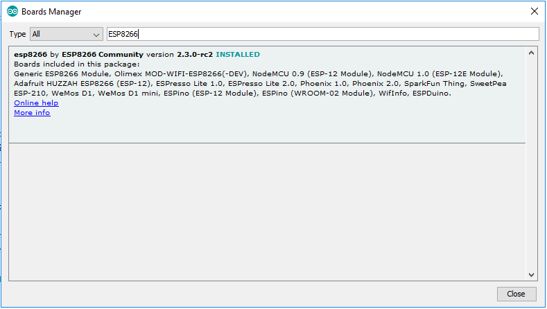
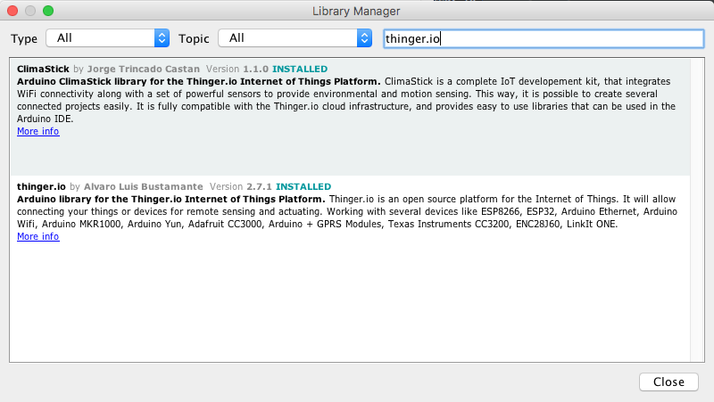

# WiFi Button

## 
Introduction


Thinger.io WiFi Button is a ready-to-go Internet of Things based dash-button that integrates ESP8266 processor with WiFi connectivity among a simple integration with Thinger.io platform events to provide a flexible support for many different use cases. 

These devices are aimed to create simple interfaces Huma-Internet, which can be used for any kind of project in education, connected industry, or home automation. Depending on the user requirements, the WiFi-Button can be used to execute functions through Thinger.io Platform, such as sending notification via email, endpoints to IFTTT, messages to other devices or even, by means of a Thinger.io Server Event, trigger the execution of a flow in Node-RED.

Our buttons have been provided with an example program that allows to configure a WiFi network and some Thinger.io credentials by means of a web server inserted in the device itself. Once the configuration is done, the device makes an instant connection with the Thinger.io Server that was configures, allowing it to perform any function programmed in the platform. After that, the hardware of the WiFi Button will change to an hibernation status that allows saving battery to extend life greater than 3000 pulsations in good conditions.

 The next sections explains how to work with this example program and how to configure Thinger.io platform to explode its capacities. 

## **Quick start guide**

This section contains the deployment instruction that should be followed on device’s first run:

1. Opening the bottom battery cap, Insert with two R03 \(AAA\) 1.5V alkaline batteries, then close the cap and insert the security screw if available. 
2. Put the bottom switch in “ON” position
3. Press the main button to first start the device. One “bip” sound will be emitted.
4. The device will create a WiFi hotspot that can be used to configure connection credentials using a multimedia device.

### **Button Status graph**

This device has been provided with a basic program that allows creating useful functionalities using thinger.io endpoints. The next execution diagram shows how does this program and how to use the single button to move between the different program menus, that allows introducing or deleting WiFi credentials, changing the device program by using Arduino OTA feature or just making a single connection to order any functionality. 

### **Device Sound interface**

This device is provided with a buzzer, that allows a simple way to know the device working status.  Next sound commands list contains a specification of the interface protocol that has been introduced in the device.

| **Process status** | **Sound specification** |
| :--- | :--- |
| Wake up  | **·** |
| 5 seconds pressed button  | **·** |
| Confirmation | **· ·** |
| WiFi error | **\_ \_ \_** |
| Cleaning credentials menu | **· · ·** |
| Cleaning credentials confirmation | **\_** |
| Timeout, going to sleep | **\_     \_     \_** |

| Sound specification | **Sound description** |
| :--- | :--- |
| **"·"** | short sharp sound \(“bip”\) |
| **"\_"** | long grave sound \(“daaa”\) |
| "  " | Silent |

### **Initial configuration process**

Brand new device is not ready to use, WiFi connection credentials and user information should be introduced. During the first run, a hotspot will be created by the device. This hotspot allows users accessing a graphical configuration interface using common web navigator. Follow next steps to access this interface and configure the WiFi credentials.


In order to save battery, the configuration hotspot is hold up for 180 seconds \(3 minutes**\). After this time the WiFi button will automatically turn its power supply off**, so if the process wasn’t completed it will be restarted by pressing the main button one time.


1\)      With the bottom switch in “ON” position, press the device and listen the Wake-up signal \(one “bip”\).

2\)      Using a Smartphone or Personal computer with WiFi connectivity, open WiFi configuration and look for the button device WiFi hotspot. Then connect to this network by introducing the password, which will be the same as the WiFi SSID \(wifi network name\).

3\)      When the device begins connected to the access point, a Web Browser should automatically open the configuration interface, as is shown in the image below:


**WARNING!** If the computer is connected to the WiFi hotspot but the web browser doesn't show this interface, it is possible to manually access it by opening web browser and writing 192.168.4.1 address in the browser bar.


4\)      Select **“Configure WiFi”** option by pressing this button of the main menu. This option will launch a Scan process to find the better quality WiFi signals of your home or office and show it in the next menu.


IMPORTANT: When the desired WiFi Network SSID doesn’t appears at this list, pressing “Scan” bottom text will launch a new scanning process. If the problem persist, the SSID can be manually wroten the SSID text box.


5\)      Select the right WiFi network SSID by clicking over it, then introduce your WiFi security password in order to provide full connectivity to the WiFi button device.

6\)      Continue the button filling out the form as explained in next section \(Device Credentials Configuration\).

7\)      Finally, press “Save” button in order to store credentials and first-run the device.

If everything goes right and the device manage to connect the WiFi network properly, a confirmation sound will be emitted. After sending the first message, the device switch to a low power mode, however, it is possible to turn off the bottom hardware switch to avoid accidental executions without affecting the configuration.


**WARNING!** If the connection wasn’t possible, **the WiFi hotspot will be launched again** in order to provide the user another chance to make the configuration. If, after 3 minutes, the device is not receiving interaction from the user, an alert signal will be emitted and the device will power off the WiFi hotspot.  ****


### **Device Credentials Configuration**

In addition to the common configuration parameters, each connected device has to be configured to send data to a specific IoT server. The next table shows all the parameters that can be changed in this buttons in order to adapt it to different use cases:

| **Parameter** | **Description** |
| :--- | :--- |
| IoT server address | Thinger.io Hostname, for example "acme.do.thinger.io" |
| Server account | Each account can be managed to a project or user, place here the name of these account |
| Auto-provisioning token | An authorization string that provide auto-provisioning permissions to create the device profile. |
| Device ID | Button identifier |

As soon as a valid WiFi configuration is made, the WiFi button will create a new device profile on this platform according to the auto-provisioning process setting its device credentials with the data that was included during the button configuration. This profile can be checked at Thinger.io platform workspace, by clicking on “devices” menu tab.

Clicking on the device name it is possible to access the device dashboard that contains information related to the device connection and status, and provides a simple way to show device parameters.

**Working with the device**

1. Making sure that the bottom switch in “ON” position.
2. Press the main device button for an instant. Wake-up signal will be emitted.
3. If the device is configured properly, after few seconds the device shall emit the confirmation signal \(double “beep”\).

If the confirmation signal is not emitted, review your configuration or go to the troubleshooting section of this guide \(sect. 6\).

**Changing device configuration**

After the first configuration, it is possible to change WiFi credentials and program parameters by cleaning the memory and repeating the configuration process. To make this, the system has been provided with a “delete credentials” process, which can be launched using the main button as is explained in the next steps:

1. Making sure that the bottom switch in “ON” position.
2. Hold the device main button pressed \(Wake-up signal will be emitted at the beginning\), then continue pressing the button during 5 to 8 seconds.
3. When a second “bip” is emitted, you can drop the button to get into “cleaning credentials” mode.
4. If this process was carried out properly, the cleaning credentials mode will run in the device for 10 seconds. And the “cleaning credentials” message will be emitted.
5. To confirm the deletion of the credentials press the button momentary one more time. Then the “delete” message will be emitted and WiFi configuration hotspot will be launched in order to provide a way to configure new credentials.
6. If you don’t want to configure new credentials, you can now turn the device bottom switch off or wait 3 minutes to automatically power off.


once a device's credentials are deleted, it is not possible to recover them.


### **General Troubleshooting Guidelines**

This section compiles all the possible operating problems and the recommendations to follow in order solve them or to identify the factor that causes the system malfunction:

<table>
  <thead>
    <tr>
      <th style="text-align:left">Problem</th>
      <th style="text-align:left">Source</th>
      <th style="text-align:left">Solution</th>
      <th style="text-align:left">Observations</th>
    </tr>
  </thead>
  <tbody>
    <tr>
      <td style="text-align:left">After configure the device credentials, no confirmation signal was emitted
        and the hotspot stils up</td>
      <td style="text-align:left">WiFi credentials can&#x2019;t be confirmed because the device wasn&#x2019;t
        able to connect this network.</td>
      <td style="text-align:left">Check WiFi SSID and password to be sure that they are well gotten and
        the WiFi is accessible in 2.4 Ghz frequency.</td>
      <td style="text-align:left">It is possible that the SSID and password are correct but the device can&apos;t
        connect because of additional protection protocols in the network</td>
    </tr>
    <tr>
      <td style="text-align:left">The device is not emitting wake-up signal when main button is pressed.</td>
      <td
      style="text-align:left">
        
1.Device battery is discharged

        
2. Device bottom switch is in &#x201C;OFF&#x201D; position

        </td>
        <td style="text-align:left">
          
1. Change device battery

          
2. Put the bottom switch in &#x201C;ON&#x201D; position

          

        </td>
        <td style="text-align:left">Also, The device could be working with configuration hotspot opened</td>
    </tr>
  </tbody>
</table>## Configuring Thinger.io Platform















## Development 

These devices has been created as a platform to develop different IoT use cases, it is possible to change its standard programmation to modify the behavior.

### Configure Environment

This section covers how to setup your computer to start working with the ClimaStick device.

#### Install required components

* You may need to install the CP2102 drivers from Silicon Labs if the ClimaStick device is not recognized from your computer. This driver is for the USB to serial interface to communicate with the board.

[Download page &gt;](http://www.silabs.com/products/mcu/pages/usbtouartbridgevcpdrivers.aspx)

* Arduino IDE v1.6.13 or newer. 

[Download page &gt;](https://www.arduino.cc/en/main/software)

#### Configure Arduino IDE

1- Open File &gt; Preferences &gt; Additional\_Boards\_URL\_Manager to include the "ESP8266 boards manager link" that you can retrieve from [Github community project](https://github.com/esp8266/Arduino). It is normally `http://arduino.esp8266.com/stable/package_esp8266com_index.json`

2- Open Tools &gt; Boards &gt; Boards Manager... and search for ESP8266 package, then install the last version.

3- Now you can program almost any ESP82XX processor directly from the Arduino IDE. From the Tools &gt; Boards you should see now the new ESP8266 community boards installed.

1. For program ClimaStick V1 select **NODE\_MCU V1.0 \(ESP-12E Module\)**.
2. For program ClimaStick V2 select **WeMos D1 Mini Lite**.

4- Open Sketch &gt; Include Library &gt; Manage Libraries, and search for **Thinger.io** libraries. Then install the Thinger.io Platform and WiFi Button libraries, as shown in the following picture.

Now your computer is ready to start programming these devices to easily adapt their behavior to multiple use cases.

### Firmware development guidelines

#### Hardware resources

| Resource | Attached GPIO | Annotations |
| :--- | :--- | :--- |
| Button | GPIO12 | This port can be read to know if the main button is pressed or not. |
| Hold Circuitry | GPIO13 | This port must be HIGH to hold the device power supply enabled \(POWER ON\). If the port is LOW, the device will be turned OFF. |
| Buzzer | GPIO14 | This is an active buzzer so HIGH signal on this port results on a constant sound. |
| LED | GPIO5 | This feature is optional, not all the hardware devices has been provided with LEDs |
| Battery Sensor | Internal  |  |

#### Thinger.io Resources

#### WiFi Button Library

### Uploading firmware

When a new device firmware is ready, the uploading process requires using an external processor that needs to be wire to the PCB programming connector.

**OTA programming**

In order to provide an upgradeable system, these devices can be re-programed using Arduino IDE / Platformio IDE OTA \(Over The Air\) system. To launch this status and upgrade device firmware, follow next steps:

1\)      Making sure that the bottom switch in “ON” position.

2\)      Hold the device main button pressed \(Wake-up signal will be emitted at the beginning\), then continue pressing the button during 10 to 15 seconds.

3\)      When a third “beep” is emitted, you can drop the button to get into “OTA firmware update” mode. Then an alert signal will be emitted.

4\)      If this process was carried out properly, an “OTA” hotspot will be opened. Using a computer, developers can connect Arduino IDE to this network and send new firmware to the button via Wireless Port.

#### **USB-**UART Programming

1\)Button enclosure disassembling

2\)Wiring an UART programmer

Been able to connect the WiFi button to your computer requires an UART to USB device. An specific programmer or a node-MCU pcb can be used as shown in the image below: 

&gt;&gt;CONNECTION WIRING IMAGE&lt;&lt;

Onces the device is wired, go to the Arduino IDE&gt;tools&gt;Serial Port selector and choose the addressed serial communication port of your programmer. Commontly it will be a COM\_\# port, or named as /dev/cu.SLAB\_USBtoUART on Mac.

At this point, the WiFi Button PCB can be programmed directly by pressing the Upload button of the Arduino IDE. However, if the synchronization fails or the program is not able to connect with the PCB, please follow the next check-list in order to identify the problem: 

#### UART Programming Troubleshoot

* Be sure that your micro USB wire allows data transmission. Some cables are only for electrical power and may not work properly.
* Verify that your operating system properly recognize the CP2102 serial port interface.
* Checkout the selected serial COM port on Arduino IDE: Tools &gt; Port
* ⚠ **Flash boot mode:** If you are sure that everything is configured properly, and the problem still persists, you can force a flash boot up by keeping pressed the USR button of the board, then press the RST button once, and finally release the USR button. After doing this, the PCB should be ready to receive the program. 


ClimaStick's processor status can be checked be opening the Serial Port inspector of ArduinoIDE and selecting 74.880 baudrate. When booting up, the PCB will print the bootstatus between two possibilities:   

1\) If the processor is in normal execution mode, a message ended with the command "mode\(3,6\)" will be printed. 

2\) If Flash mode, a message ended in  "mode\(1,6\)" means that the processor is ready to receive a new sketch. 


## Device Files

### Datasheet



### Design files



## Additional considerations

* This device is designed for indoor use only. Do not expose it to rain or snow.

  This device has been developed along WiFi communication system. So it is mandatory to count with an existent network with enough signal quality to work properly.

* This device is only ready to work with 2.4Ghz WiFi networks, WPA2 and DHCP protocols should be configured in the WiFi router, in order to provide a secure IP address and connection to the device.
* Use only R03 \(AAA\) batteries. Other types of batteries may burst causing personal injury and damage. Do not mix different types of batteries \(eg. NiMH, NiCd, Alkaline, Li-ion, Li-po, etc\) in the device.
* Remove batteries from the electrical device if the device is not going to be used for a long time.
* Do not incinerate, disassemble or short circuit batteries.
* Do not dispose of electrical appliances as unsorted municipal waste, use separate collection facilities. Contact your local government for information regarding the collection systems available. If electrical appliances are disposed of in landfills or dumps, hazardous substances can leak into the groundwater and get into the food chain, damaging your health and well-being.

#### Disclaimer

* This device is commercialized by Thinger.io platform \(INTERNET OF THINGER S.L\) as a development kit under auto certification. so it is not suggested to common commercial homologation rules. The device owner is liable for all injuries to third parties and damage to their properties. 

