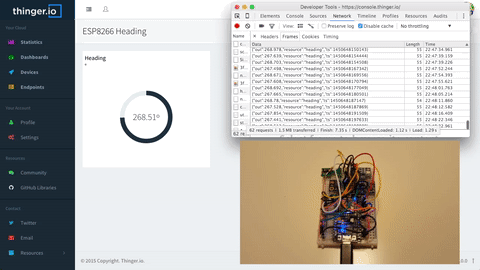

# CODING GUIDE

## Sketch Overview

Almost all Arduino Sketches looks the same. There is a setup method, and there is a loop method. Nothing changes here while integrating with Thinger.io. However you must know where you should define your device resources, or where it is possible to interact with external services. In general terms, any device resource (led, relay, sensor, servo, etc.) must be defined inside the `setup()` method. As well as you initialize your devices, set the input/output direction of a digital pin, or initialize the Serial port speed, you also need to initialize here your resources. This basically consists on configuring what values or resources you want to expose over the Internet.

The `loop()` is the place to always call to the `thing.handle()` method, so the thinger libraries can handle the connection with the platform. This is the place also for calling your endpoints, or streaming real-time data to a dashboard. Please, take into account to **do not add any delay inside the `loop()`** except if you know what you are doing, like working with deep sleep modes or so in your device. Any other delay will condition the proper functioning of Thinger in your device. Also it can be bad to read a sensor value in every loop if the sensor takes too much time to complete a read. This will result in a device with a noticeable lag while attending to our commands.

```cpp
// add required headers according to your device
#include <ThingerESP32.h>

// initialize Thinger instance (type can change depending on your device)
ThingerESP32 thing("username", "deviceId", "deviceCredential");

void setup() {
    // initialize your sensors and pins

    // initialize wifi (see examples for your device)

    // add resources here, like sensors, lights, etc.
}

void loop() {
  // call always the thing handle in the loop and avoid any delay here
  thing.handle(); 
  // here you can call endpoints
  // and also you can stream resources
}
```

## Setting Credentials

All the devices connected to the platform needs to be authenticated against the server. When you create a [device in the console](https://link\_to\_console) you are basically creating a new device identifier and setting a device credential. Therefore, you need to setup this credentials also in your Arduino code so the device can be recognized and associated to your account. This is normally done while initializing the Thinger instance in the code. That is, when you define the `thing` instance. Replace the your `username`, `deviceId`, and `deviceCredential` with the values you have registered in the cloud. Note that credentials uses to be defined inside `arduino_secrets.h`

```cpp
 ThingerESP32 thing("username", "deviceId", "deviceCredential");
```

## Adding Resources

In the Thinger.io platform, each device can define several resources. You can think that a resource is anything you can sense or actuate. For example, a typical resource will be a sensor value like temperature or humidity, or a relay that turns on and off a light. This way, you should define the resources you need to expose over the Internet.

All resources must be defined inside the `setup()` method of the Arduino sketch. This way the resources are configured at the beginning, but can be accessed later as necessary.

There are three different types of resources, which are explained in the following sections.

### Input Resources

If you need to control or actuate your IoT device, it is necessary to define an input resource. In this way, an input resource is anything that can provide information to your device. For example, it can be a resource for turning on and off a light or a relay, change a servo position, adjust a device parameter, etc.

To define an input resource it is used the operator `<<` pointing to the resource name, and it uses a C++11 Lambda function to define the function.

The input resource function takes one parameter of type `pson` that is a variable type that can contain booleans, numbers, floats, strings, or even structured information like in a JSON document.

The following subsections will show how to define different input resources for typical use cases.

#### _**Turn on/off a led, a relay, etc**_

This kind of resources only requires an on/off state so it can be enabled or disabled as required. As the `pson` type can hold multiple data types, we can think that the `pson` parameter of the input function is like a boolean.

So, inside the `setup` function you can place a resource called `led` (but you can use any other name), of input type (using the operator `<<`), that takes a reference to a `pson` parameter. This example will turn on/off the digital pin 10 using a ternary operator over the `in` parameter.

```cpp
thing["led"] << [](pson& in){
  digitalWrite(10, in ? HIGH : LOW);
};
```

#### _**Modify a servo position**_

Modifying a servo position is quite similar to turning on/off a led. In this case, however, it is necessary to use an integer value. As the `pson` type can hold multiple data types, we can still use the `pson` type as an integer value.

```cpp
thing["servo"] << [](pson& in){
    myServo.write(in);
};
```

#### _**Update sketch variables**_

You can use the input resources also for updating your sketch variables, so you can change your device behaviour dynamically. This is quite useful in some situations where you want to temporary disable an alarm, change the reporting intervals, update an hysteresis value, and so on. In this way, you can define additional resources to change your variables.

```cpp
float hysteresis = 0; // defined as a global variable
thing["hysteresis"] << [](pson& in){
    hysteresis = in;
};
```

#### _**Pass multiple data**_

The `pson` data type can hold not only different data types, but also is fully compatible with JSON documents. So you can use the Pson data type to receive multiple values at the same time. This example will receive two different floats that are stored with the `lat` and `lon` keys.

```cpp
thing["location"] << [](pson& in){
    float lat = in["lat"];
    float lon = in["lon"];
};
```

#### _**Show Input Resources State in Dashboards and API**_

The Dashboards or API works in a way that when you open them, they query the associated resources to correctly print its current state, i.e., the switch is on or off. In this way, when the API or a Dashboard is open, each associated input resource is called, receiving empty data in the call, as there is no intention to control the resource (the pson input will be empty).

So, how the Dashboards or the API knows what is the current state of an input resource? The resource must set its current state in the input parameter, if it is empty, or use the input value if there is one. This way, we can obtain three different things: query the current resource state (without modifying it), modify the current resource state, and obtain the expected input on the resource (this is how the API explorer on the device works).

Therefore, a correct input resource definition that actually allows to display the current state of the resource in a Dashboard or in the API, will be like this example code.

```cpp
thing["resource"] << [](pson& in){
    if(in.is_empty()){
        in = currentState;
    }
    else{
        currentState = in;
    }
};
```

This sample code basically returns the current state (like a boolean, a number, etc) if there is no input control, or use the incoming data to update the current state. This can be easily adapted for controlling a led, while showing its current state in the dashboard once opened or updated.

```cpp
thing["led"] << [](pson& in){
    if(in.is_empty()){
        in = (bool) digitalRead(pin);
    }
    else{
        digitalWrite(pin, in ? HIGH : LOW);
    }
};
```

Note: for controlling a digital pin just use the method explained in the Easier Resources Section.

### Output Resources

Output resources should be used in general when you need to sense or read a sensor value, like temperature, humidity, etc. So the output resources are quite useful for extracting information from the device.

To define an output resource it is used the operator `>>` pointing out of the resource name, and it uses a C++11 Lambda function to define the output function.

The output resource function takes one parameter of `pson` type that is a variable type that can contain booleans, numbers, floats, strings, or even structured information like in a JSON document.

The following subsections will show how to define different output resources for typical use cases.

#### _**Read a sensor value**_

Defining an output resource is quite similar to defining an input resource, but in this case it is used the operator `>>`. In the callback function we can fill the out value with any value we want, like in this case the output from a sensor reading.

```cpp
thing["temperature"] >> [](pson& out){
      out = dht.readTemperature();
};
```

#### _**Read multiple data**_

In the same way the input resources can receive multiple values at the same time, the output resources can also provide multiple data. This is an example for providing both latitude and longitude from a GPS.

```cpp
thing["location"] >> [](pson& out){
      out["lat"] = gps.getLatitude();
      out["lon"] = gps.getLongitude();
};
```

#### _**Read sketch variables**_

If your sketch cannot provide a single sensor reading, as it is doing some kind of data integration, an output resource can be used also for reading your sketch variables, where the computed result is updated frequently.

```cpp
float yaw = 0; // defined as a global variable
thing["yaw"] >> [](pson& out){
      out = yaw;
};
```

### Input/Output Resources

The last resource type is a resource that not only takes an input or an output, but takes both parameters. This is quite useful when you want to read an output that depends on a input, i.e., when you need to provide a changing reference value to a sensor.

This kind of resources are defined with the operator `=`. In this case the function takes two different `pson` parameters. One for input data and another one for output data. This example provides an altitude reading using the BMP180 Sensor. It takes the reference altitude as input, and provides the current altitude as output.

```cpp
thing["altitude"] = [](pson& in, pson& out){
    out = bmp.readAltitude(in);
};
```

You can also define more complex input/output resources, that takes several input values, to provide also multiple output values, like in this example that takes `value1` and `value2` to provide the `sum` and `mult` values.

```cpp
thing["in_out"] = [](pson& in, pson& out){
    out["sum"] = (long)in["value1"] + (long)in["value2"];
    out["mult"] = (long)in["value1"] * (long)in["value2"];
};
```

### Resources without parameters

It is also possible to define resources that does not require any input nor generates any output. They are just like callbacks that can be executed as you want, for example to reboot the device, or do some required action.

In this case, the resource is defined as a function without any input or output parameters.

```cpp
thing["resource"] = [](){
    // write here your execution code
};
```

## Easier Resources

The client library also includes some useful syntactic sugar definitions for declaring resources more easily without having to think in input or or output resources. This syntactic sugar features are macros that are expanded automatically to define the resources in the standard way.

The advantage of using this kind of definitions is that your resources will be able to handle state when you query them from the API. For example, if you have a digital pin enabled or disabled, you will be able to see its current state both in the API explorer or in a dashboard.

### Control a digital pin

This kind of resources will allow defining a resource for declaring a control over a digital pin, so you can alternate over on/off states, that can be used for controlling a led, a relay, a light, etc.

It is required to define the digital pin as OUTPUT in your setup code, or the resource will not work properly.

```cpp
thing["relay"] << digitalPin(PIN_NUMBER);
thing["relay"] << invertedDigitalPin(PIN_NUMBER);
```

### Define Output Resources

This kind of resources will allow defining a resource for declaring a read-only resource, like a value obtained from a sensor, or a given variable in our sketch.

In this example we are defining a resource that exposes a sensor reading, like the DHT11 sensor temperature.

```cpp
thing["temperature"] >> outputValue(dht.readTemperature());
```

But it is also possible to define a output resource for any global variable in our sketch.

```cpp
thing["variable"] >> outputValue(myVar);
```

### Modify Sketch Variables

Our sketch usually defines some parameters or variables that are used inside the loop code. This kind of resources are normally used to handle or control the execution behaviour. With this kind of resources we can modify any parameter we want to expose, like a float, an integer, a boolean, etc.

In this example it is possible to remotely modify the boolean `sdLogging` variable defined as a global variable.

```cpp
thing["logging"] << inputValue(sdLogging);
```

It is also possible to define a callback function to know when the variable has changed, so we can perform any other action. For this use case, define the resource as the following to have some code executed when the `hysteresisVar` changes.

```cpp
thing["hysteresis"] << inputValue(hysteresisVar, {
    // execute some code when the value change
    Serial.println("Hystereis changed to: ");
    Serial.print(hysteresisVar);
});
```

### Servo control

It is also possible to define a resource for controlling a servo instance. This way, the defined resource will automatically handle your servo instance, reading its current position, or changing to a new one according to the API interactions.

For defining a servo resource just define and initialize your servo as usual, and then use the declared instance in the resource definition.

```cpp
thing["servo"] << servo(myServoInstance);
```

## Communication between devices

In Thinger.io, it is possible that devices can communicate between them. There are two possibilities here. One is the communication between devices from the same account, and the other is the communication between devices from different accounts. Here we describe the two different approaches:

### Same account communication

For this use case, in which both devices belong to the same user account, there is a specific method that allows devices to communicate with other devices with low latency and simple codification. this communication can contain data or not (it is possible to make an empty call). let's Suppose that we have two devices: `deviceA` and `deviceB`, and we want to communicate both calling from `deviceB`to a specific `deviceA` input resource. We can use "thing.call\_device(,);" as shown in the example below:

The `deviceA` defines a resource like in the following example.

```cpp
setup(){
    thing[“resource_On_A”] = [](){
        Serial.println("Someone is calling me!");
    };
}
```

`deviceB` can easily call this resource and send data to it by running the following command.

```cpp
loop(){
    thing.handle();
    // be sure to call it at an appropiate rate
    thing.call_device("deviceA", "resource_On_A");
}
```

On the other hand, if we want to send the message with a `pson` payload in order to share data between devices. In this case, the `deviceA` will need to define a resource with some expected input

```cpp
setup(){
    thing[“resourceOnA”] << [](pson& in){
        int val1 = in["anyValue1"];
        float val2 = in["anyValue2"];
        // Work with the updated parameters here
    };
}
```

Then `deviceB` can call this method providing the appropriated input by defining a `pson` type that is filled with the same keys used on `resourceOnA`, as shown in the code below:

```cpp
loop(){
    thing.handle();
    // be sure to call it at an appropiate rate
    pson data;
    data["anyValue1"] = 3;
    data["anyValue2"] = 43.1;
    thing.call_device("deviceA", "resourceOnA", data);
}
```

`deviceB` can also call this method by providing the information from an defined resource that generates the information, in this case, the call is similar as the previous example, but using the resource as the data source.

```cpp
setup(){
    thing["resourceName"] >> [](pson& out){
        out["anyValue1"] = 3;
        out["anyValue2"] = 43.1;
    };
}

loop(){
    thing.handle();
    // be sure to call it at an appropiate rate
    thing.call_device("deviceA", "resourceOnA", thing["resourceName"]);
}
```

### Communication between different accounts

If we want to communicate devices from different accounts, we can do that through calling an endpoint of type `Thinger.io Device Call`. Just register an endpoint of this type in the console, like in the following example.


In this case it is required to define different parameters in the endpoint:

* Endpoint Identifier: The endpoint id that the device will use for calling the device.
* Device Owner: The device owner username.
* Device Identifier: The device id of the other account.
* Resource Name: The resource on the device to be called.
* Device Access Token: A device token generated in the other account for granting external access to the device.

Once defined, the device will be able to call the endpoint, as explained in the following section. It basically consists on calling the `call_endpoint`method.

```cpp
thing.call_endpoint("DeviceACall");
```

## Using Endpoints

In Thinger.io, an endpoint is defined as some kind of external resource that can be accessed by the device. With the endpoints feature, devices can easily send emails, SMS, push data to external Web Services, interact with IFTTT, and any general action that can be made by using WebHooks (Calling HTTP/HTTPS URLs).

Calling an endpoint is so easy from the Arduino sketch, as it is only required to call the `call_endpoint` method over the `thing` variable.

```cpp
thing.call_endpoint("endpoint_id");
```

Endpoints can be called from the device code in order to execute any action like sending a predefined email. The call can also include some reading values, which is specially useful to send device's data to  third-party services.


**Extra attention must be taken while calling resources, in order to avoid uncontrolled recurrency. If the interval is too short the server will lock the device connection**


### Calling Endpoints

In this case we will see a simple example to send an email alert based on a temperature value. For this example, we have configured an email endpoint called `high_temp_email` that contains some warning text about the temperature. For this case we do not want to check the temperature every millisecond, so we are introducing some variables to control the sensing and warning frequency. In this example, the temperature is checked every hour, and if it is above 30ºC, it will call the endpoint called `high_temp_email` which will send us an email with the predefined text. It is important here to **do not add delays** inside the loop method, as it will prevent the required execution of the `thing.handle()` method, so we are using here a non-blocking delay based on the `millis()` function.

```cpp
unsigned long lastCheck = 0;

loop(){
    thing.handle(); // required thing handle
   
    unsigned long currentTs = millis();
    
    if(currentTs-lastCheck>=60*60*1000){
        lastCheck = currentTs;
        if(dht.readTemperature()>30){
            thing.call_endpoint("high_temp_email");
        }
    }
}
```

You can be so creative here and call your endpoints when the presence sensor makes a detection, when your humidity sensor reports that there is no water in your plants, when the location of a device is not as expected, and many other stuff. Other interesting way of using endpoints is by its integration with IFTTT, so you can interact with multiple third-party services!

### Sending Data to Endpoints

Sending data to an endpoint (in JSON format) is also quite easy. We need to call also the `call_endpoint` method, but in this case adding some information based on the `pson` data format, which will be automatically converted to JSON. For example, if we want to report data to a third party service like Keen.io, we can create such kind of endpoints in the console. Once configured, we can call the endpoint with our readings, for example with humidity and temperature values from a DHT sensor.

```cpp
// be careful of sending data at an appropriate rate!
pson data;
data["temperature"] = dht.readTemperature();
data["humidity"] = dht.readHumidity();
thing.call_endpoint("keen_endpoint", data);
```

You can also send data based on a defined resource, i.e., suppose you have a resource that already serves the temperature and humidity. It is possible to reuse this definition for sending this same data to the endpoint, without having to redefine the sensor reading, like in the following example.

```cpp
setup(){
    // defined resource in the setup for reading a sensor value
    thing["data"] >> (pson& out){
        out["temperature"] = dht.readTemperature();
        out["humidity"] = dht.readHumidity();
    }
}

loop(){
    // be careful of sending data at an appropriate rate!
    thing.call_endpoint("endpoint", thing["data"]);
}
```

### Email Type Endpoint Example

This is a simple example, applied to email type endpoint, with custom body

```cpp
setup()
{
 thing["Level"] >> outputValue(actualRelative);
}
loop()
{
 if(actualLevel>UpperLevel && endpointUpperFlag)
   {
    thing.call_endpoint("endpoint_id",thing["Level"]);
    endpointUpperFlag=0;
   }
}
```

Notice that there are a variable that limitates the run of this "if" just once, its important to define any condition or method to warrantee that this kind of enpoint call is executed just once (or at appropiate rate), because it can get a lot of emails generated by the microcontroller across thinger.io platform.

At endpoint configuration, in the custom body email, must add double brackets "" to invoke the variable sent by the microcontroller, in our example, we used the following body

`"The actual level is %"`

And receiving an email with the text:

`The actual level is 80.34%`

## Using Data Buckets

Thinger.io provides an easy to use and extremely scalable virtual storage system, that allows to store long term device data from device output resources. This information can be used to be plotted in dashboards, or can be exported in different formats for offline processing or third party Data Analysis process.

### From Device Resource

It is not necessary to implement specific codification in your device firmware to start storing data in a data bucket, because they will retrieve information from your output resources, just configure your Data Bucket to set the source and sampling interval as it is explained in our Console documentation at: [http://docs.thinger.io/console/#data-buckets](http://docs.thinger.io/console/#data-buckets)

### Streaming Resource Data

It is also possible to let he device stream the information when required, i.e., by raising an event when detected. In this case, we can use the "Update by Device" option while configuring the bucket, and we will use the streaming resource instruction as described here:

Using a previous defined Output Resource, that was called for example \["location"], it could be done like in the following code snippet.

```cpp
 void loop() {
  thing.handle();
  // use your own logic here to determine when to stream/record the resource.
  if(requires_recording){
      thing.stream("location");
  }
}
```

### From Write Call

This option will allow setting the bucket in a state that it will not register any information by default, but it will just wait for writing calls, both from the Arduino library using the write\_bucket method, as shown here, or calling the REST API directly like done with Sigfox. This feature opens the option to register information in the same bucket from different devices, or store information from devices that are not connected permanently with the server, that are in sleep mode, or use a different technology like Sigfox.

Here is an example of an ESP8266 device writing information to a bucket using the write\_bucket function:

```cpp
void setup() {
  // define the resource with temperature and humidity
  thing["door_status"] >> [](pson &out){ 
    out["OPEN"] = (bool)digitalRead(SENSOR_PIN);
  };
}

void loop() { 
  // handle connection
  thing.handle();

  if(digitalRead(SENSOR_PIN)!=previous_status){
    // write to bucket BucketId when the door changes its status
    thing.write_bucket("BucketId", "door_status");
  }
  previous_status=digitalRead(SENSOR_PIN);
}
```

Note that this instruction will retrieve the \["door\_status"] resource PSON, so it is also possible to call this function by attaching a custom PSON, as shown down below:

```cpp
void loop(){
  // handle connection
  thing.handle();

  if(digitalRead(SENSOR_PIN)!=previous_status){
    // write to bucket BucketId when the door changes its status
    thing.write_bucket("BucketId", "door_status");
  }
  previous_status=digitalRead(SENSOR_PIN);
}
```

## Streaming Resources

In Thinger.io you can open WebSockets connections against your devices, so you can receive sensor values, events, or any other information in real-time. The WebSockets are mainly used in the Dashboard feature of the Console, and are normally used for streaming resources at a fixed configurable interval. This functionality is available right out of the box when you define an output resource. However, if you want to transmit the information right when it is required, like when your device detects a movement, presence, etc., you must program some code, that is quite similar to calling an endpoint.

In this case, you must detect when you want to stream the event, like the accelerometer value is over some threshold, your presence sensor is making a detection, or the compass heading is changing. This is up to you when it is necessary to stream new data. Streaming resources also requires that another endpoint is connected listening for them (i.e., from a WebSocket connection), so if there is no one listening for this data, the data is not sent. This is handled automatically by the client library and the server, therefore it is safe to stream data always, as the device will transmit the information only when there is a destination.

The following example will report the compass heading in real-time if the heading value changes more than 1 degree.



```cpp
void setup(){
  thing["heading"] >> [](pson& out){     
    out = getHeading();
  };
}

float previousHeading = 0;
void loop() {
  thing.handle();
  float currentHeading = getHeading();
  if(abs(currentHeading-previousHeading)>=1.0f){
    thing.stream(thing["heading"]);
    previousHeading=currentHeading;
  }
}
```

## Enabling Debug Output

Thinger.io library provides extensive logging of its activities, which is especially useful when one needs to troubleshoot authentication and Wi-Fi connectivity issues. Include the following definition in your sketch, but _make sure it comes first, before any other includes_ (it was reported to cause crashes on some boards otherwise).

```
#define THINGER_SERIAL_DEBUG

// the rest of your sketch goes here
```

It is also necessary to enable `Serial` communication, as all the debugging information is displayed over Serial. So enable it in your sketch in the setup method.

```
void setup() {
  Serial.begin(115200);
}
```

## Listen for Connection State

Sometimes it can be useful for your application to know what is the current connection status with Thinger.io, i.e., to notify disconnected status with a led, request device configuration after authentication, or any other internal control flow according to connection state.

In order to create a listener for such connection states, it can be done with the `set_state_listener` function in the `setup()` method. For example, itis possible to define a listener that will receive the different connection states for the network, server, or authentication:&#x20;

```cpp
void setup(){
    
    // your setup code here..
    
    thing.set_state_listener([&](ThingerClient::THINGER_STATE state){
        switch(state){
            case ThingerClient::NETWORK_CONNECTING:
                break;
            case ThingerClient::NETWORK_CONNECTED:
                break;
            case ThingerClient::NETWORK_CONNECT_ERROR:
                break;
            case ThingerClient::SOCKET_CONNECTING:
                break;
            case ThingerClient::SOCKET_CONNECTED:
                break;
            case ThingerClient::SOCKET_CONNECTION_ERROR:
                break;
            case ThingerClient::SOCKET_DISCONNECTED:
                break;
            case ThingerClient::SOCKET_ERROR:
                break;
            case ThingerClient::SOCKET_TIMEOUT:
                break;
            case ThingerClient::THINGER_AUTHENTICATING:
                break;
            case ThingerClient::THINGER_AUTHENTICATED:
                break;
            case ThingerClient::THINGER_AUTH_FAILED:
                break;
            case ThingerClient::THINGER_STOP_REQUEST:
                break;
        }
      });
  }
```

In the following table it is detailed the different values and its description.

| State                     | Description                                                                                                               |
| ------------------------- | ------------------------------------------------------------------------------------------------------------------------- |
| NETWORK\_CONNECTING       | The underlying network is being connected, i.e., initializing ethernet, wifi, gsm, etc.                                   |
| NETWORK\_CONNECTED        | The network is connected and ready to be used.                                                                            |
| NETWORK\_CONNECT\_ERROR   | The network cannot be initialized, i.e., bad WiFi credentials, cannot reach GSM, etc.                                     |
| SOCKET\_CONNECTING        | After the network is connected, it means that the client is connecting to Thinger.io servers.                             |
| SOCKET\_CONNECTED         | The socket has been connected to the server.                                                                              |
| SOCKET\_CONNECTION\_ERROR | The socket cannot be connected to Thinger.io. If often means a bad Internet connection.                                   |
| SOCKET\_DISCONNECTED      | The connection with Thinger.io has been closed.                                                                           |
| SOCKET\_ERROR             | An error happened with the socket, i.e, bad read or write, which will cause a disconnect.                                 |
| SOCKET\_TIMEOUT           | The socket timed out while reading or writing, so the connection will be closed.                                          |
| THINGER\_AUTHENTICATING   | Thinger.io client is connected and it is being authenticated.                                                             |
| THINGER\_AUTHENTICATED    | Thinger.io client is connected and authenticated, so it can use Thinger.io, i.e., call an endpoint, read a property, etc. |
| THINGER\_AUTH\_FAILED     | Thinger.io client authentication failed. Please, review your server, username, device id, and password.                   |
| THINGER\_STOP\_REQUEST    | Thinger.io client was requested to stop, i.e., from the source code, or by the server.                                    |
