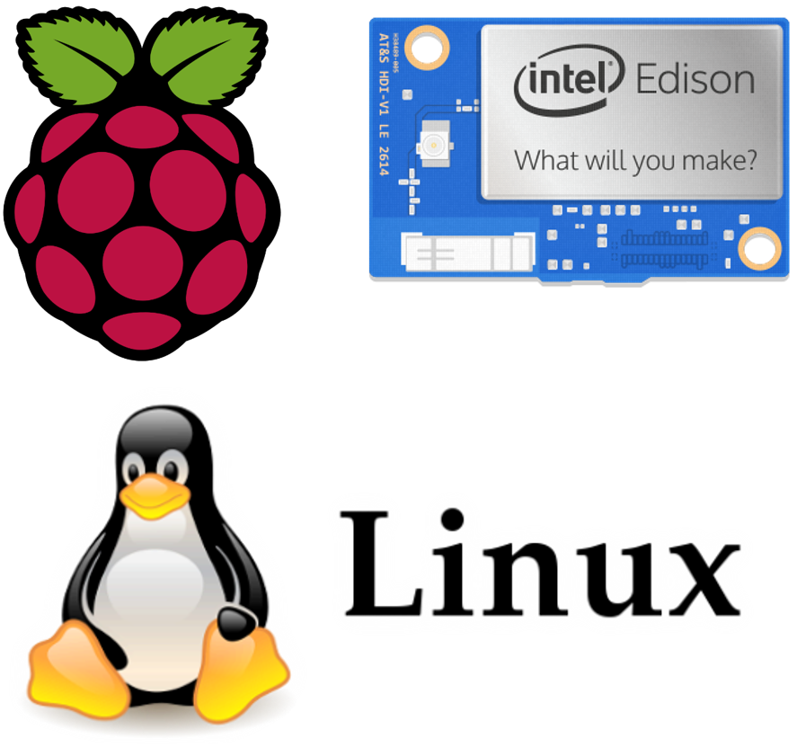
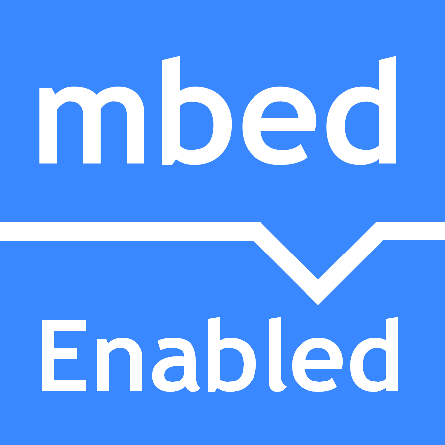

# COMPATIBLE DEVICES

As there are many different IoT hardware available nowadays, this section is divided in different categories: 

**Arduino compatible devices** such as Arduino MKR,  Ethernet hats + Arduino classic boards, ESP8266, NodeMCU, TI CC3200, etc. 



**Linux** **devices**, including **Raspberry Pi**, Intel Edison and any other Linux computer running Linux or MacOs



**Low-Power Devices** or "Edge devices" such as **Sigfox**, **LoraWAN**, **TheThingsNetwork** or any other infrastructure with gateways:



**Any other device or third-party Platform** that can't be furnished with Thinger.io software client, can be also integrated using our open API



## 

<table>
  <thead>
    <tr>
      <th style="text-align:left"><a href="arduino.md">Arduino</a>
      </th>
      <th style="text-align:left"></th>
      <th style="text-align:left"><a href="linux.md">Linux</a>
      </th>
    </tr>
  </thead>
  <tbody>
    <tr>
      <td style="text-align:left">
        
&lt;b&gt;&lt;/b&gt;<a href="arduino.md"><b> </b></a>
        

        

        

        

        

        

        

        
<a href="arduino.md">This category is related with any hardware that can be programmed over the Arduino IDE and its libraries. So it is not exclusively for Arduino Devices, as you can also program different boards like the ESP8266, ESP32, </a>Arduino
          MRK, etc.

      </td>
      <td style="text-align:left"></td>
      <td style="text-align:left">
        

        

        
For <a href="linux.md">Linux OS based devices, such as  Raspberry Pi, Intel Edison, and many other computer running a Linux distribution, including a Mac OS computer.</a>
        

      </td>
    </tr>
    <tr>
      <td style="text-align:left">
        
<b>Edge Devices</b>
        

        
&lt;b&gt;&lt;/b&gt;<a href="sigfox.md">&lt;b&gt;&lt;/b&gt;<b> </b></a>&lt;b&gt;&lt;/b&gt;

        
In this category is covered the Sigfox integration with the platform,
          where the user can configure callbacks for transmitting data from the devices
          to the cloud for creating real-time dashboards.<b> </b>
        

      </td>
      <td style="text-align:left">&lt;b&gt;&lt;/b&gt;</td>
      <td style="text-align:left">
        
<b>ARM mbed</b>
        

        
&lt;b&gt;&lt;/b&gt;
          
        

        
ARM is building its own IoT ecosystem in the cloud, mainly to simplify
          the development process when using this kind of hardware.

      </td>
    </tr>
  </tbody>
</table>However, Thinger.io can be adapted to many other hardware devices running our C++ source code libraries or third party platforms by using the HTTP device integration. 

