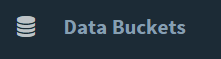
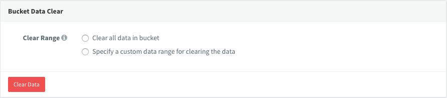
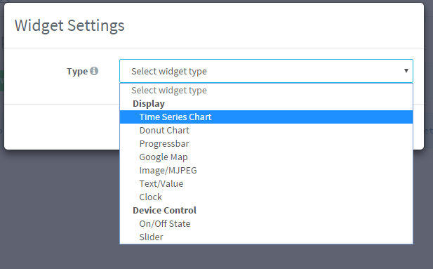
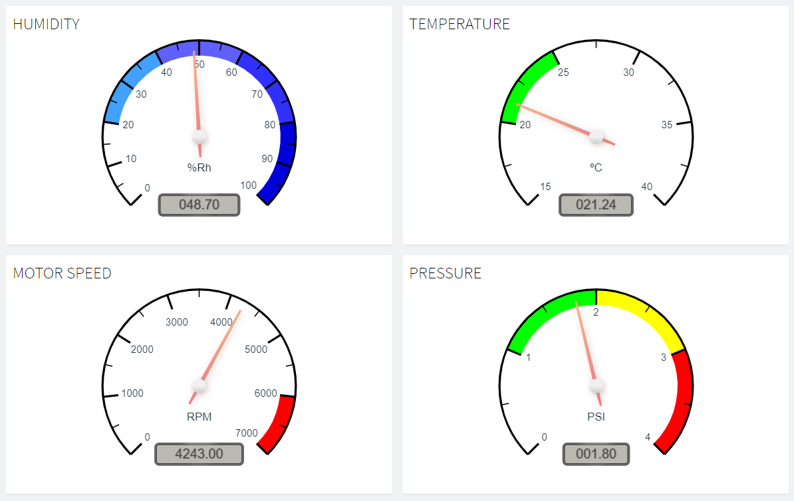
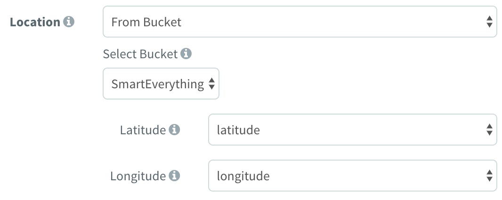
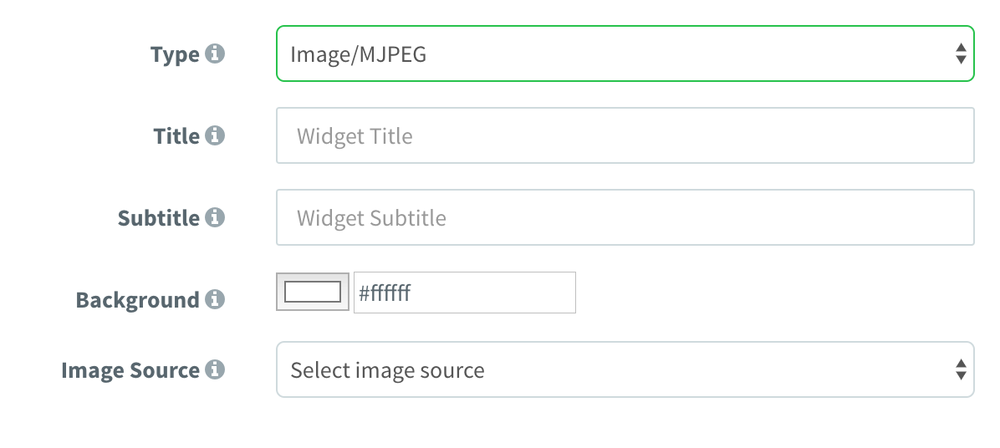
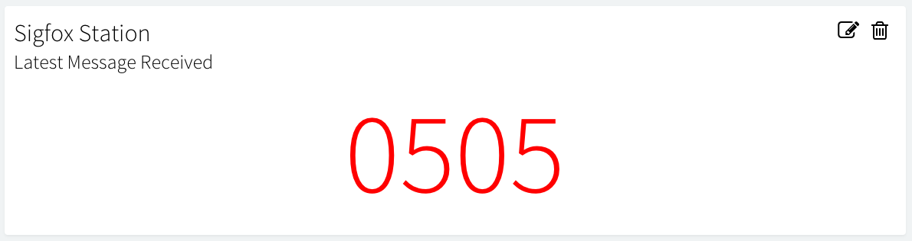
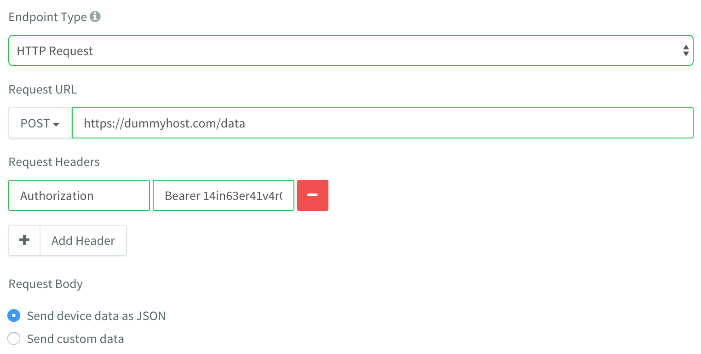
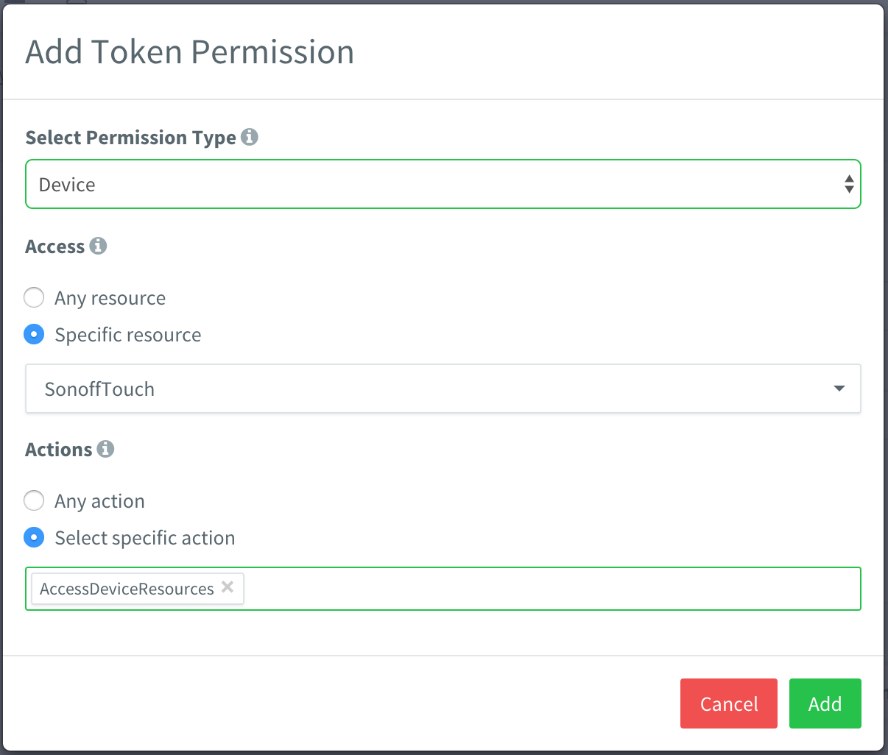

# CLOUD CONSOLE

## Introduction

This documentation provides information about the front-end console of the Thinger.io IoT platform. This way you will learn how to manage different elements of the platform, like devices, endpoints, data buckets, or access tokens.

Once you log in to your Thinger.io account, you will access by default to the `Statistics` section, where you can see some basic information about your account, like number of devices, endpoints, data buckets, endpoints, ans so on. There is also a map, which displays the current approximate location of your connected devices. Finally, there are some statistics about your devices consumption in terms of sent or received information.

On the left side of the `Statistics` screen you will find the main menu, which contains all the platform features that you will need when building IoT projects. These features are described in more detail in the following sections.


## Devices Administration

### Create Device

The first step to start an IoT project in Thinger.io \(except for not connected devices like Sigfox\) is by creating devices, which will grant access to connect your devices to your account. Any device in Thinger.io must be registered to get access to the cloud. Each one has its own identifier and credentials and is related to the user account. This section describes the required steps to register a new device in your account.

To register a new device, once you have been logged in your console dashboard, please go to the **Devices** section that appears in the left menu.


This section will list your registered devices and will show some information about its connection. Something similar to the following picture.


If it's your first time on thinger.io this list will be empty. Next we'll show you how to create your first device. First of all, click on **Add Device** that will open a form in which you can introduce your device indentification credentials and select a **Device Type** from the drop down list, selecting one of these types: 

* Generic device: For devies with Thinger.io software client on it. Such as Raspberry Pi, Linux or Arduino devices. 
* HTTP device: This option allows you retrieving data from third party platforms and comercial devices in order to work their information despite not having a full integration. 
* Thinger Core 32 device: This is only for ESP32 modules with Thinger.io Core on it.

After selecting your the device type you can fill the input text form as explained below:


Add the **device identifier** \(unique within your devices\), a **device description** that may help you to identify your device, and the **device credentials**. Each device has its own identifier/credential, so a comprised device will not affect other devices. All your passwords in the server are stored securely using `PBKDF2 SHA256` with a 32 bytes salt generated with `PRNG` and a non-despreciable amount of iterations. Keep your **device identifier** and **device credential**, as you will need them for connecting your device \(the password cannot be recovered later\).

If all goes fine, you should see some success message


Now, you can o back to your devices list, and your device should appear as disconnected.


Now you can use your new device id and the device credentials to connect the new device. Depending on your device, you will need to install the required libraries or development environment, so checkout the following sections according to your device:





Remember that Sigfox devices, does not share the concept of connected device, as they are by default offline devices that send information periodically. If you want to store information from these devices, please, checkout the following documentation.



For the following example, we will be using the Arduino IDE along with an ESP8266 device, like the NodeMCU. In this case, you can open the example code for the ESP8266, and fill the device details: your username, the device ID, and the device credentials established while creating the device. The following picture represents the relation between the code and the device created in your account.


Once we have established in the code our account identifier, device identifier, and device credentials, we can compile and flash the program. Meanwhile, we can open our device in the cloud console, just by clicking its identifier in the devices list. In the device screen, you will be able to see some information about your device, like its IP address, connection status, or sent/received information in real time. By default, our device will appear as disconnected, like in the following picture.


Once the device gets connected to the account, the interface will change its status, showing that it is connected, and it is transmitting information, like in the following picture:


Note that the connected device dashboard is able to show an estimated location of the device, that can be modified following the instructions of the "properties" chapter of this documentation. So, now we have our device connected to our account, and we are ready to start interacting with the device over the Internet.

### Device API

One cool feature of the Thinger.io platform, is that it allows to discover the resources defined in your device. A resource can be a sensor reading, like temperature, humidity, or pressure. A resource can be also any actionable element, like a light, a relay, or a motor. But in general, any device resource is like a callback function that can be called \(on demand\) through a Rest API. In this way, this section explains how to interact with your device resources over the cloud console, but also you will find how you can issue your own REST API calls to query your device.

Once you have your device connected to your account, as described in the previous section, you can access to its resources and explore the API Rest endpoints using the `API EXPLORER`. You can access to this screen over the Device Dashboard, by clicking on the small blue button called `Device API`.

In the API explorer interface you will see one different box for each resource defined in your code. Each resource has an identifier, that is related with the resource name defined in your code. In the Thinger.io platform, you can define 4 different types of resources, one for input \(sending data to the device\), one for output \(the device will send information\), one for input/output \(you can send and receive information in one call\), and just a callback resource, which you can just execute without sending or receiving information. The input and output data, from the API perspective, can be any JSON document. Take a look to your library documentation in order to see how to define these different resources.

For example, the default ESP8266 example in the Arduino libraries, defines two different resources. One input resource, called `led`, for controlling the `BUILTIN_LED`, and one output resource, called `millis` to extract the current millis of the device, as defined in the following code. Notice that a resource name can be any arbitrary text to identify the underlying resource, as they are not tied to any constant defined in the platform.

So, these are our sample resource:

```cpp
thing["led"] << digitalPin(BUILTIN_LED);
thing["millis"] >> outputValue(millis());
```

If our device is connected to the platform, we can open our device API explorer and see the defined resources in the platform, like in the following picture.


You can see how our defined resources in the device are now available in the platform, as the device is able to report the available resources and their format \(or current state\). The idea is that you can test here your resources, that is, interacting with them in real-time. In this case, you will be able to switch the led state, or read the current milliseconds from the Arduino device. Every click in the `Run` button will execute your resource, i.e., forcing a read from a sensor, calling the `millis()` function, or sending a new state for the actuator, depending on the resource type \(input or output\).

The nice idea about that, is that every device resource, can be translated to a REST API endpoint, so you can consume or interact with your devices using standard REST queries, i.e., using a `POST` method to send values to the device, or using a `GET` method to read information from the device. So, you can easily test these API endpoints before integrating them in other platforms or applications.

You can even test more complex inputs and outputs from the platform. In example, suppose that you have defined a resource that basically returns the sum and multiplication between two integer numbers, something like:

```cpp
thing["in_out"] = [](pson& in, pson& out){
    out["sum"] = (int)in["value1"] + (int)in["value2"];
    out["mult"] = (int)in["value1"] * (int)in["value2"];
};
```

This resource definition will be translated to the following resource in the platform, where it is possible to both test input values, and view the output result. So, you can try entering some values, click on `Run`, and see the output reported by the device. This example also emphasizes how the resources work, as they are not just static values, but callbacks you can call with any input or output value.


In addition to this useful device API explorer where you can interact with your devices, you can also obtain specific information about the REST API endpoint by clicking on the `Show Query` button. This provides information about the method type, URL, content type, request body, and response body. You can also click on `Curl`, so you can copy the command to interact with your device directly from your console. The above example is translated to the following REST API call:


There is more information available about the API for interacting with your devices [here](http://docs.thinger.io/api/#devices-api-access-device-resources).

### Device Tokens

All the interactions with your connected devices, i.e., by using the REST API endpoints commented above, or a mobile phone, needs to be authenticated against the platform. By default, when you interact with your devices over the Thinger.io console, you are implicitly signing all your requests to the platform with an access token you obtained from your username and password. This kind of authorization grants access to all your account resources, so you can configure devices, buckets, etc. However, this authorization expires quite frequently \(but renewed automatically by your browser\), and cannot be used to grant access to our devices to other users or platforms, as you will be providing access to all your account.

In this case, it is possible to create specific access tokens for granting access to your devices, and even grant access to specific resources on your devices. Moreover, it is possible to define the token validity in time, by enabling an expiration date. This way, if you need to provide access to some of your device resources to a third party tool like IFTTT, a external web page, a mobile phone, or any other service, it is highly recommended to create a device token.

To create a device token, open the device Dashboard and take a look to the subsection called "Device Tokens". Then, click on the green button `Add` on the right of the box. Then, a modal window will appear, were you can configure different parameters:

* Token name: Use a representative name to remember why the token was issued, i.e., IFTTT Access, Mobile phone, etc.
* Token access: Configure the token to allow accessing all device resources, or limit the access to a set of resources.
* Token expiration: Configure the token to expire at some given date, or available indefinitely.

The following figure shows a sample screenshot while configuring a device token.


Once the token is saved, the interface will show the access token to be used in the REST API Calls, like in the following figure. If you need help to integrate this access token in the REST API calls, checkout [this](http://docs.thinger.io/api/#authentication-api-rest-api-authentication) documentation.


### HTTP devices Callback <a id="http-devices-callback"></a>

Because of the nature of these devices, [thinger.io](http://thinger.io/) applies a special treatment, based on the use of callbacks to make the integration. A callback is a functionality of the server that can be used to request a process with device data by means of a HTTP query, such as store it in a bucket, calling an endpoint profile or registering the information contained in a JSON that should be sended with the query.

To create a callback, open the device Dashboard and take a look to the subsection called "callback", that will show different options in the context `callback details` as shown in the image below:


This context shows the different functionalities that can be requested from the server using a callback, by just clicking in the checkbox and selecting the resource that will receive the data, such as:

* Data storage in scalable [Data Buckets](http://docs.thinger.io/console/#data-buckets)
* Calling [Endpoint Profiles](http://docs.thinger.io/console/#endpoints) to integrate with third parties
* Retrieving or modifying [Device Properties](http://docs.thinger.io/api/#Device-properties) using `Set device property` or `response data` features.

Note that it is not possible to create properties, data buckets or endpoints though callback request, so it is necessary to initialize then first using the web console or via REST API.

Ones you have configured the callback details, the system will be ready to receive a request. In a similar way to the "show query" feature included in the Connected device's dashboard, you can find a precise specification of the HTTP request structure and a complete cURL example by clicking in the "overview" or "cURL Example" tabs in the upper side of `Callback Details` context as shown in the image below:


Finally, to create a Callback HTTP request, take in count that the `Authorization Header` must be included 9in your HTTP request as shown in the example below:

```text
https://<Thinger_Server>/v3/users/<Username>/devices/<Device_ID>/callback?authorization=<Authorization_Header>
```

### Device Tokens <a id="device-tokens"></a>

All the interactions with your connected devices, i.e., by using the REST API endpoints commented above, or a mobile phone, needs to be authenticated against the platform. By default, when you interact with your devices over the [Thinger.io](http://thinger.io/) console, you are implicitly signing all your requests to the platform with an access token you obtained from your username and password. This kind of authorization grants access to all your account resources, so you can configure devices, buckets, etc. However, this authorization expires quite frequently \(but renewed automatically by your browser\), and cannot be used to grant access to our devices to other users or platforms, as you will be providing access to all your account.

In this case, it is possible to create specific access tokens for granting access to your devices, and even grant access to specific resources on your devices. Moreover, it is possible to define the token validity in time, by enabling an expiration date. This way, if you need to provide access to some of your device resources to a third party tool like IFTTT, a external web page, a mobile phone, or any other service, it is highly recommended to create a device token.

To create a device token, open the device Dashboard and take a look to the subsection called "Device Tokens".


Then, click on the green button \`Add\` on the right of the box. Then, a modal window will appear, were you can configure different parameters:

* Token name: Use a representative name to remember why the token was issued, i.e., IFTTT Access, Mobile phone, etc.
* Token access: Configure the token to allow accessing all device resources, or limit the access to a set of resources.
* Token expiration: Configure the token to expire at some given date, or available indefinitely.

The following figure shows a sample screenshot while configuring a device token.


Once the token is saved, the interface will show the access token to be used in the REST API Calls, like in the following figure. If you need help to integrate this access token in the REST API calls, checkout [this](http://docs.thinger.io/api/#authentication-api-rest-api-authentication) documentation.


### Device Properties <a id="device-properties"></a>

[Thinger.io](http://thinger.io/) provides a simple way to store additional information related to an specific device, such as location, identificators or even configuration parameters that may be retrieved by devies using comon Json files. On this way, the platform can be used as devices persistent memory. To create a device property, open the device Dashboard and take a look to the subsection called "Properties".


This menu provides an easy way to create, manage or delete devices properties. Note that the property created in this example is specifying the device location. [Thinger.io](http://thinger.io/) system has been designed to detect this configuration and automatically represent it on the device dasboard map.


Properties declarations and modifications are made by means of a special context, provided with a json validator that enhances the text and check morfologic mistakes.

#### Coding with properties <a id="coding-with-properties"></a>

It is also possible to create, retrieve and modify data properties from devices, however, at this point we must differentiate between HTTP devices or [thinger.io](http://thinger.io/) software client devices, which will use `set_property()` or `get_propery()` comands as shown in the example below:

```text
/*set property value*/

//create a pson with new values
pson data;
data["longitude"]=-4.056;
data["latitude"]=41.40;
//sending new values to platform
thing.set_property("location", data, true);

/*retrieve property value*/

//creating a pson to store the property values
pson data;
//retrieving data from the platform
thing.set_property("My_Property", data, true);
 
```

\(You can learn more details about this functions in the "codification" section of this documentation\).

using HTTP devices it's also the possible to interact with properties through callback configuration submenu tools.


Acording to this configuration, when [Thigner.io](http://thigner.io/) server receives any transmission from "SigfoxDevice1" the payload data will be stored into "data" property, creating a JSON with all variables. In the oposite situation, thanks to the "Response Data" feature, the values stored in the parameter with was called "downlink\_data" will be sent to the device thought Sigfox infrastructure.

### Device Settings <a id="device-settings"></a>

It is possible to adjust some device details like its description or credentials going to the "Settings" subsection of the device dashboard. This way, you can change the device credentials by a new one of your choice in case you forgot it \(the password cannot be recovered from database as it is encrypted\). Notice that changing the device password, will not disconnect the device, but will prevent its reconnection once disconnected.


If you need to change the device identifier it is necessary to delete the device and register a new one with the desired one.

## Data buckets

A data bucket is some kind of virtual storage where you can keep time series information, like temperature or humidity over time. But it is possible to use them to store any other event, like motion detections, garage door opens, temperature warnings, and so on.

This information can be used to plot information in dashboards, or can be exported in different formats for offline processing.

### Create Bucket

To create a data bucket, you need to access the `Data Buckets` feature, by clicking on this section:



To create the bucket, just press in the **Add Bucket** button, which will show the following screen:


Here it is necessary to configure different parameters:

* **Bucket Id**: Unique identifier for your bucket. 
* **Bucket name**: Use a representative name to remember the bucket scope, like `WeatherData`.
* **Bucket description**: Fill here any description with more details, like Temperature and humidity in house.
* **Enabled**: Data bucket recording can be enabled or disabled. Just switch it on to enable it.
* **Data source**:
  * **From Device Resource**: It means that it will take information from a specific device resource \(like temperature, motion, and so on\). In this option, the device should keep a permanent connection with the server. This add some benefits as we can change the sampling rate on demand, without having to change our device code, by using the `Sampling Interval` option.


    **Remember** that defining a resource in the device is described in more detail [here](http://docs.thinger.io/arduino/#coding-adding-resources), but a single resource reporting temperature and humidity from a DHT sensor could be coded like this:

    ```text
    // define the resource just once in the setup
    thing["TempHum"] >> [](pson &out){ 
      out["temperature"] = dht.readTemperature();
      out["humidity"] = dht.readHumidity();
    };
    ```

    It is also possible to let he device stream the information when required, i.e., by raising an event when detected. In this case, we can use the `Update by Device` option while configuring the bucket, and use the streaming resources as described [here](http://docs.thinger.io/arduino/#coding-streaming-resources).

    Using the previous `TempHum` sample resource, it could be done like in the following code snippet.

    ```cpp
    void loop() {
      thing.handle();
      // use your own logic here to determine when to stream/record the resource.
      if(requires_recording){
          thing.stream("TempHum");
      }
    }
    ```

    This way, the data bucket is subscribed to a device resource, and its information is registered in every stream call.

  * **From Write Call**: This option will allow setting the bucket in a state that it will not register any information by default, but it will just wait for writing calls, both from the Arduino library using the `write_bucket` method, as shown [here](http://docs.thinger.io/hardware/climaStick/#quickstart-examples-data-recording-using-sleep), or calling the REST API directly like done with [Sigfox](http://docs.thinger.io/sigfox/#steps-in-thingerio-create-a-data-bucket). This feature opens the option to register information in the same bucket from different devices, or store information from devices that are not connected permanently with the server, that are in sleep mode, or use a different technology like Sigfox.

    Here is an example of an ESP8266 device writing information to a bucket using the `write_bucket` function:

    ```cpp
    void setup() {
      // define the resource with temperature and humidity
      thing["TempHum"] >> [](pson &out){ 
        out["temperature"] = dht.readTemperature();
        out["humidity"] = dht.readHumidity();
      };
    }

    void loop() { 
      // handle connection
      thing.handle();
      // write to bucket BucketId the TempHum resource
      thing.write_bucket("BucketId", "TempHum");
      // sleep the device SLEEP_MS milliseconds
      ESP.deepSleep(SLEEP_MS*1000, WAKE_RF_DEFAULT); 
    }
    ```


### Review Bucket Data

Once the data bucket has been configured, and it started to record data from a device or from write calls, it will display the information inside a table. Every record contains the server timestamp in UTC \(but shown in local time zone in the console\), and the record value. The value stored in the data bucket can be a single value, or any other JSON document. If the JSON document is composed by key-value pairs, like in the previous examples, they will be displayed in tabular format, just like in the following screenshot.


### Clear Bucket Data

Sometimes it can be useful to clear the bucket information without deleting the whole bucket, creating and configuring it again. Therefore, you can clear the bucket, or a part of them easily from the bucket page. In the clear process, the bucket can still record information from your devices.



### Export Bucket Data

It is possible to export all your stored information in different file formats, so you can process the data offline, like applying Artificial Intelligence, Business Analytics, Big Data, etc. In this way, you can access your bucket and configure the export process, like selecting the file type, or the export range. After a few minutes, you will receive an email with a download to your file \(valid for 3 months in the default cloud console\).


## Dashboards

A dashboard is a graphical user interface that allows displaying your information in different figures and charts. You can configure the dashboards with different widgets, configure its layout, dimension, color, and data sources to generate valuable information for your business or processes.

The dashboards can **display information in real-time** from your devices \(using websockets over the server for minimum latency\), or use historic information stored in data buckets that is polled periodically. It is possible to configure the data source for each dashboard widget independently. For devices connected to the platform, it is even possible to dynamically configure the sampling interval for each resource, i.e., in a resource defined from sensor readings, it will allow adjust its physical sampling interval and transmission over the wire. The dashboards are not just only for displaying data, but can also **actuate in real-time** over your connected devices, so you can use some control widgets like on/off values or sliders.

Here is a sample dashboard with some widgets defined, like time series charts, donut charts, maps, or single values, but you can use many other ones


Ready to create your own dashboard?

### Create Dashboard

To manage all your dashboards, it is necessary to access to the `Dashboards` section, by clicking in the following menu item:


Then click on the `Add Dashboard` button that will open a new interface for entering the dashboard details, like in the following screenshot:


Here it is necessary to configure different parameters:

* **Dashboard Id**: Unique identifier for your dashboard. 
* **Dashboard name**: A representative name of your dashboard, in a more friendly way than its identifier.
* **Dashboard description**: Fill here any description or detailed information you need to keep about the dashboard.

After this process, it is possible to access to the new dashboard, that will appear empty by default.

### Edit Dashboard

By default, the dashboard appears in viewing mode, where you cannot modify or configure he dashboard, however, there is an edit mode that can be easily enabled by clicking on the upper-right switch of the dashboard. So, enable the edit mode every time you need to add, move, or resize a widget. The edit mode also enables different options like sharing dashboards.


### Add a Display Widget

When the edit mode is enabled in the dashboard, a new button called `Add Widget` will appear. Clicking on it will show a popup where it is possible to select the widget type to add in the dashboard. There are different widgets both for displaying information, or control connected devices, just like in the following picture:



The following subsections describes the different parameters for each widget type.

#### Time Series Chart

A time series chart is a graph that can display values over time. In this sense, this is quite useful when it is required to display time series data, like temperature variable that changes over time. It is possible to plot a single variable or multiple values in the same chart. The initial configuration of this widget is like shown in the following figure:


The configurable parameters are the following:


* **Title**: Optional title for the widget. 
* **Subtitle**: Optional subtitle for the widget.
* **Background**: Optional color for the widget background \(defaults to white\).
* **Chart Input**: Configure how to feed the values to the time series chart. It is possible to feed the information from a connected **device** or from a **data bucket**
  * **From Device**: With this option it is necessary to select a device \(that must be connected to provide information\) and specify the resources to plot. The following figure is an example that is selecting the device `deviceA`, and the resource `millis` from the device. Notice that when a time series widget is feed from a device, it will not keep the information if the dashboard is closed or refreshed, as it is just real-time data from your device to your dashboard. You can also select between different refresh modes, like sampling at different intervals \(that can be updated online\), or the chart is updated by the device.

  * **From Data Bucket**: With this option, the widget will take the information from a given bucket to plot the historic information on it. So, it is necessary to just select the bucket identifier created in your account. If the bucket is composed by multiple variables, it will allow selecting the variables to plot, like in the following picture. When the information is selected from the data bucket, you will require to establish a data timeframe to be displayed, that can be relative to the current time, or an absolute period between two dates.


* **Options**: It is possible to configure some graph features like splines, legends, axis, etc.
* **Chart Color**: Both on data selected from a device or from a data bucket, it is possible to configure series colors, depending on the information available in the resource, it will show only one configurable color, or a color for each series, like in the previous screenshot.


* **Data Aggregation**: 

Show raw data directly from a Bucket could be tricky when there is a lot of data-points, specially if the measures are very noisy or irregular. This feature allows aggregating data using different statistics such as medians, means, minimum and maximum values, a counter of data points per period and a data sumatory. The aggregation can be applied over different intervals that goes from five minutes to one week, by using the next configuration inputs in the widget form, and also using the upside right parameters on each time series chart widgets.


The next image shows four different representations of the same dataset and time interval, aggregated using different algorithms:  



Note that Data Aggregation system is only available in **private server** instances with **InfluxDB** 


#### Tachometer Chart

It is a quite visual widget that allows showing device data in a traditional "dial gauge" representation, that can be customized with different value ranges and color marcs, making it more accurate or simplifying the simpection with just a glance.



The configurable parameters are the following:


* **Title**: Optional title for the widget. 
* **Subtitle**: Optional subtitle for the widget.
* **Background**: Optional color for the widget background \(defaults to white\). This widget has a particularity behavior in relation to this parameter. Pressing into the green "+" button, It is possible to select different background colors depending on the real time value that is being shown: 


This image is representing an example in which the measured variable is reaching dangerous pressure values. According to this situation, the background color is changing to red, so it will be easier to identify and manage the event if there is not any automatic system in the product.  


* **Chart Input**: Configure how to feed the values to the tachometer chart. It is possible to feed the information from a connected **device** or from a **data bucket**
  * **From Device Resource**: With this option it is necessary to select a device \(that must be connected to provide information\) and specify the resources to plot. The following figure is an example that is selecting the device `deviceA`, and the resource `millis` from the device. Notice that when a time series widget is feed from a device, it will not keep the information if the dashboard is closed or refreshed, as it is just real-time data from your device to your dashboard. You can also select between different refresh modes, like sampling at different intervals \(that can be updated online\), or the chart is updated by the device.
  * **From Device Property:** This option allows retrieving data from device properties, which is really useful to show device configuration data, but also is the better way to show real time \(or last received\) data from HTTP devices. 
  * **From Data Bucket**: With this option, the widget will take the information from a given bucket to plot the historic information on it. So, it is necessary to just select the bucket identifier created in your account. If the bucket is composed by multiple variables, it will allow selecting the variables to plot, like in the following picture. When the information is selected from the data bucket, you will require to establish a data timeframe to be displayed, that can be relative to the current time, or an absolute period between two dates.
  * **Manual Data**: It is always possible to manually introduce values in order to create simulate the behavior of the widget.

The last tab shows all the display options. This is probably the most customizable widget of Thinger.io Platform. It allows selecting a lot of different parameters as shown in the image below: 


* **Display options:**
  * **Units**: Optional information that will display the variable unit, like ºC.
  * **Value Ranges**: This parameter configures the total data range that will be shown at the chart, and also allows adding sub-ranges that can be configured with different colors in order to simplify the visual checking.
  * **Plate Color**: Configure the background plate color.
  * **Text Color**: Configure the text color.
  * **Tick Color**: Configure the division ticks color. 
  * **Major Ticks**: Allows to configure the range of each tick
  * **Show Value**: To display or hide the numeric representation of the value in a digital textbox.

#### Virtual LED

Using LED spots is a common way  to create simple graphical interfaces in electronic projects in order to represent system status, alerts, etc. This widget has been included in Thinger.io Platform with the same purpose, so it can be used to show binary status by changing its color, create alerts by setting blink behavior or show multiple data by including more than one color range in a kind of RGB simulation. 


This widget can be configured in many different ways though the three steps form. first of all selecting "Led indicator" in the Widget menu tab, and then indicating:

* **Title**: Optional title for the widget. 
* **Subtitle**: Optional subtitle for the widget.
* **Background**: Optional color for the widget background \(defaults to white\). This widget has a particularity behavior in relation to this parameter. Pressing into the green "+" button, It is possible to select different background colors depending on the real time value that is being shown: 

Then, the Led indicator menu tab allows selecting the data source, that can be a connected device or a data bucket:

* **Chart Input**: Configure how to feed the values to the tachometer chart. It is possible to feed the information from a connected **device** or from a **data bucket**
  * **From Device Resource**: With this option it is necessary to select a device \(that must be connected to provide information\) and specify the resources to plot. The following figure is an example that is selecting the device `deviceA`, and the resource `millis` from the device. Notice that when a time series widget is feed from a device, it will not keep the information if the dashboard is closed or refreshed, as it is just real-time data from your device to your dashboard. You can also select between different refresh modes, like sampling at different intervals \(that can be updated online\), or the chart is updated by the device.
  * **From Device Property:** This option allows retrieving data from device properties, which is really useful to show device configuration data, but also is the better way to show real time \(or last received\) data from HTTP devices. 
  * **From Data Bucket**: With this option, the widget will take the information from a given bucket to plot the historic information on it. So, it is necessary to just select the bucket identifier created in your account. If the bucket is composed by multiple variables, it will allow selecting the variables to plot, like in the following picture. When the information is selected from the data bucket, you will require to establish a data timeframe to be displayed, that can be relative to the current time, or an absolute period between two dates.
  * **Manual Data**: It is always possible to manually introduce values in order to create simulate the behavior of the widget.

Finally, the "Display Options" tab allows to custom the led behavior in the next parameters:

* **Led Size**: Configure the diameter of the led spot pixels
* **Color**: configures the led default color, and also allows creating color ranges by pressing the green "+" button on the right side.
  * **Color ranges**: Each time that the "+" button is pressed, a new color range is included, allowing to define a new range and the color that will be shown when the selected input value belongs to this range.  
  * **Blinking led option:** The right side switches allows adding a blinking behavior to the led when this range profile begins active. It is also possible to disable the blinking by pressing over the led widget. 


#### Donut Chart

A donut chart is a graph that can display a value, normally in form of a rounded percentage. In this sense, this is quite useful when you have a know variable that oscillates between a maximum and minimum value. In this case, it is only possible to only represent a single variable, that can be both updated in real-time from a device, or from a data bucket.


The configurable parameters are the following:


* **Title**: Optional title for the widget. 
* **Subtitle**: Optional subtitle for the widget.
* **Background**: Optional color for the widget background \(defaults to white\).
* **Donut Value**: Configure how to feed the donut char value. It is possible to feed the information from a connected **device** or from a **data bucket**, in a similar way as the time series chart.
* **Units**: Optional information that will display the variable unit, like ºC.
* **Min Value**: The expected minimum value of the variable.
* **Max Value**: The expected maximum value of the variable.
* **Donut Color**: The color to display inside the donut.

#### Progressbar

A progressbar is a graph that can easily represent a progress on some action or process. In this sense, this is quite useful when you have any process that is being completed over time and needs to be monitored. In this case, it is only possible to only represent a single variable, that can be both updated in real-time from a device, or from a data bucket.


The configurable parameters are the following:


* **Title**: Optional title for the widget. 
* **Subtitle**: Optional subtitle for the widget.
* **Background**: Optional color for the widget background \(defaults to white\).
* **Progressbar Value**: Configure how to feed the progressbar value. It is possible to feed the information from a connected **device** or from a **data bucket**, in a similar way as the time series chart.
* **Units**: Optional information that will display the variable unit, like %.
* **Min Value**: The expected minimum value of the variable.
* **Max Value**: The expected maximum value of the variable.

#### Google Maps

A map can be used to represent, at this moment, a single location in a map. It is quite convenient to track devices in real-time as the chart can be feed in real-time from a connected device, like over a GPRS connection. It is also possible to plot locations from a data bucket, so devices like Sigfox can be also be tracked.


Here is an example of this widget working in real-time with a connected device:

 \[!\[Real-Time GPS location over GPRS using IoT Solution\]\(https://img.youtube.com/vi/3QDDOPMg22g/0.jpg\)\]\(https://www.youtube.com/watch?v=3QDDOPMg22g\)

The configurable parameters are the following:


* **Title**: Optional title for the widget. 
* **Subtitle**: Optional subtitle for the widget.
* **Background**: Optional color for the widget background \(defaults to white\).
* **Location**: Configure how to feed the location in the map. It is possible to feed the information from a connected **device** or from a **data bucket**. When feeding the plot from a data bucket or a device, it is required to match the required latitude and longitude \(in degrees\) with the variables present in the bucket, or in the device resource.



* **Center**: Force the map to automatically keep the location in the center.

#### Image/MJPEG

The image/MJPEG widget can be used to represent both a still image, like your business logo, or a live stream from a MJPEG source, like a surveillance camera. To feed this widget it is necessary the image/MJPEG url.


The configurable parameters are the following:



* **Title**: Optional title for the widget. 
* **Subtitle**: Optional subtitle for the widget.
* **Background**: Optional color for the widget background \(defaults to white\).
* **Image Source**: Configure if the image source is a still image, or a MJPEG stream. In both cases it is required to provide the source URL, like in the following screenshot:


#### Text/Value

The text/value widget is an useful widget to display any arbitrary data, specially text values that cannot be represented with other widgets. As any other widget, can display data both from connected devices or data buckets.



The configurable parameters are the following:


* **Title**: Optional title for the widget. 
* **Subtitle**: Optional subtitle for the widget.
* **Background**: Optional color for the widget background \(defaults to white\).
* **Text Value**: As any other widget, it is possible to select a resource from a connected device, or a value from a data bucket.
* **Units**: Optional information to display the units of the displayed information.
* **Text Color**: Configure the text color.

#### Clock

This widget is just a clock widget that can display the current time both in the local time zone or in UTC, which can be useful when monitoring processes in real-time. Note that this widget takes the current time just from your computer.


The configurable parameters are the following:


* **Title**: Optional title for the widget. 
* **Subtitle**: Optional subtitle for the widget.
* **Background**: Optional color for the widget background \(defaults to white\).
* **Color**: Color for the text.
* **UTC**: Display the clock in UTC or in the local timezone.

### Add a Control Widget

In Thinger.io it is possible to not just display information in dashboard, but also control devices in real-time. In this section are described some available widgets that can be used control connected devices.

#### On/Off State

The On/Off widget allows controlling a boolean state of a connected device, like turning on/off a light, a motor, a relay, or any other element. The device should expose a boolean input, just like those examples for controlling a led. The resource is then mapped to this widget, that can change the device state in real-time. If the input resource is defined properly [implemented](http://docs.thinger.io/arduino/#coding-adding-resources-input-resources), this widget is also able to show the current device state.

  

The configurable parameters are the following:


* **Title**: Optional title for the widget. 
* **Subtitle**: Optional subtitle for the widget.
* **Background**: Optional color for the widget background \(defaults to white\).
* **Device Resource**: Determines the specific device and resource to control. Use a connected device for an easy config, as you can automatically select the device and resource.


This widgect has te posibility to be shown in two different appearances, that can be specified in the **Switch Style** parameter: **Switch** is the standard configuration with a little non-configurable switch, and **Button** which is an improved face that can be configured with different colors and icons. When this option is selected, next paremeters will be shown:


* **On Color**: The color that will be displayed when the boolean value of this resource is true.
* **Off Color**: The color that will be displayed when the boolean value of this reource is false.
* **Icon**: This button is able to show a customizable icon from favicon library or any other icon library URL.
* **Icon Color**: Icon color is also configurable with an hexadecimal value. Note that there are different color options for both button status, so you can customize it as you want.

  

#### Slider

The slider widget allows controlling a numeric state of a connected device, like setting a threshold, a target temperature, or any other internal device state that is likely to be controlled remotely. The device should expose a numeric input. The resource is then mapped to this widget, that can change the target value in real-time. If the input resource is defined properly [implemented](http://docs.thinger.io/arduino/#coding-adding-resources-input-resources), this widget is also able to show the current device state.


The configurable parameters are the following:


* **Title**: Optional title for the widget. 
* **Subtitle**: Optional subtitle for the widget.
* **Background**: Optional color for the widget background \(defaults to white\).
* **Device Resource**: Determines the specific device and resource to control. Use a connected device for an easy config, as you can automatically select the device and resource.
* **Min Value**: Maximum value of the slider.
* **Max Value**: Minimum value of the slider.
* **Step Width**: Slider precision.

### Share Dashboard

By default, any dashboard is private to the account owner. However, it is possible to share the dashboard so others can access your information. To share a dashboard, just enter in the dashboard config and enable the `Share` switch. After enabling the dashboard sharing, an URL will be generated, which can be publicly shared.

**Note:** The generated authorization \(appended to the end of the URL\) can be used to partially access your resources, like devices or buckets used to feed the charts. Review the generated access token for more details.

**Note:** If you change your dashboards by adding new data sources \(devices or buckets\), it is necessary to disable an re-enable the dashboard sharing to update the authorization. It will not share new data sources automatically for security reasons.


## Endpoints

An endpoint, is the entry point to a service, a process, or any other destination. So, in Thinger.io an endpoint can be defined like a target destination that can be called by devices to perform any action, like sending an email, send a SMS, call a REST API, interact with IFTTT, call a device from a different account, or call any other HTTP endpoint.

Calling those endpoints directly by devices can be complex in small microcontrollers, and would require more bandwidth in devices. This way, Thinger.io can handle endpoints calls that can be requested directly by devices, activating them by using its identifier and passing any information required. It also adds some flexibility, as the endpoint request can be dinamically changed as necessary, while the deployed code in the device remains the same.

### Create Endpoint

To manage all your endpoints, it is necessary to access to the Endpoints section, by clicking in the following menu item:


Then click on the Add Endpoint button that will open a new interface for entering the endpoint details, like in the following screenshot:


Here it is necessary to configure different parameters:

* **Endpoint Id**: Unique identifier for your endpoint \(_the device must use this identifier for activating the endpoint_\). 
* **Endpoint Description**: Fill here any description or detailed information you need to keep about the dashboard.
* **Endpoint Type**: Defines the endpoint type, depending on the selected type, the endpoint will present different fields. In the following sections are described some of these types.

### Email Endpoint

An email endpoint allows sending emails from your devices. You can define your target email address, subject, and compose your email body.

The configurable parameters are the following:

* **Email Address**: The target email address of your message.
* **Email Subject**: The email subject.
* **Email Body**: Allows defining the email body, that can be a plain JSON text with the data sent from your device, or a custom body that can contain also information gathered from your device.

In the following screenshot, there is an example of an email endpoint that contains some text and variables that are filled when the device calls the endpoint, adding the current temperature and humidity reported by the device. Notice that `temperature` and `humidity` variables are closed inside double brackets `{{}}`, so the endpoint will be expecting this information to complete the body. In the following, there is some code examples calling this endpoint.


Calling endpoints is well documented [here](http://docs.thinger.io/arduino/#coding-using-endpoints-calling-endpoints), but it is basically required to call the endpoint by using the `call_endpoint` method, which requires the endpoint id, `ExampleEmail` in this example, and the optional data to be sent to the endpoint, which is a `pson` document \(quite similar to JSON\) with two keys named `temperature` and `humidity` holding the readings from a DHT sensor. In the following there is an example of such call.

```cpp
pson data;
data["temperature"] = dht.readTemperature();
data["humidity"] = dht.readHumidity();
thing.call_endpoint("ExampleEmail", data);
```

**Note**: If you want to include a single value in the email body, you can use the double bracket `{{}}` without any key, and send a `pson` document from the device with a single value. So, the following body:

```text
Temperature is: {{}} ºC
```

Can be filled with this call in the device:

```cpp
pson data = dht.readTemperature();
thing.call_endpoint("ExampleEmail", data);
```

### HTTP Endpoint

An HTTP endpoint is a generic type of endpoint that can be used to interact with any other web service or web application. So, this endpoint can be configured to make any HTTP request, by configuring the method, URL, headers, and body.

The configurable parameters are the following:

* **Request URL**: Configure the method \(GET, POST, PUT, PATCH, or DELETE\), and the request URL.
* **Request Headers**: It is possible to add headers to the request, that can be useful for adding authorizations, control caches, configure content type, etc.
* **Request Body**: The body can be either a custom body with an specific content, or a JSON payload with the information sent by the device. In a custom body it is possible to add custom variables, like shown in the email example. This way, it is possible to create contents in different formats like XML, SOAP, etc \(remember to add the adequate content-type in this case\).



## File Storage System


Thinger.io provides a flexible cloud storage system that allows uploading files to the IoT server in order to provide support to other platform features such as the HTML Widget or the OTA System. The information will be stored in a non-volatile memory of the server host, so it is important to take care about the size of the files, specially when the instance is shared with other user accounts, to prevent server local storage from becoming saturated. 

### Create an Storage Profile

Each storage profile will create an isolated directory with different access permissions. To create a new storage profile, press the "Add Storage" button and complete the form as shown in the image below:


* **Storage ID:** Enter here a unique ID for the Storage profile 
* **Storage name:** Each Storage can have also a mnemonic name 
* **Storage Description:** Additional information for an easy identification of the storage profile proposals. 
* **Public Read:** This switch provides public read only permissions to third parties using an HTTP path that will be created automatically using the Storage ID. 

Onces the form is completed, pressing the "Add Storage" button will create a new Storage Profile.  


* **Index File:** Is the file from the storage system that will be opened when accessing the public HTTP path. By default is "index.html" but can be changed with any other file stored in the system.
* **HTTP Path:** Is the URL that allows reading the index file from a third party program if the public access permission is switched on.
* **Storage Explorer Button:** This element opens the experimental File Explorer that allows managing the file system.

### Storage Explorer \(Experimental\)

The storage explorer is a complete file management tool ready to upload, modify and remove documents from the file system. Its graphical interface is constituted by three sections: 


* Top bar contains logotypes with different controls
  * **Refresh**: If any changes have been made to the file system from a source other than this terminal, the refresh button allows you to update the status of the documents.
  * **Delete files**: The "-" button allows removing all selected files.
  * **Upload files**: This button opens the file upload context, which is explained in the next section.
  * **Constraint**: Collapses/deploy the files navigator.
  * **Store**: Save the current status of all the edited documents
* Left sidebar is a files navigator in which the database elements can be shown and selected to be edited or deleted. 
* In the bottom section of the interface, the explorer shows a terminal console in which some information can be displayed when working with extensions. 

#### Uploading files

Thinger.io's file explorer has a upload manager that can be accessed by pressing the "Upload files" icon. this manager supports the massive files uploading from any computer,  just dragging the files or directories to the central box surface and pressing the green "upload all" button.


#### Edit Files

The storage explorer contains a navigator in which the data hierarchy is displayed. Each file is represented under it's hierarchy context. an enhanced text editor is also included, allowing yo show and modify files in the cloud.  


## Access Tokens

All the Thinger.io back-end can be accessed over REST API Calls. In fact, the console is just an Angular REST client interacting with the API to manage devices, buckets, endpoints, dashboards, and so on. Every REST API request must be authenticated in order to take effect, so, any client needs to provide an authorization code in every call. This way, access tokens is the way to provide authorization to third party services or applications to make API Requests, without having to share the username and password. Moreover, with access tokens it is possible to grant access to specific resources and actions of your account, like read a specific device, or write to a custom bucket \(like in [this example](http://docs.thinger.io/sigfox/#steps-in-thingerio-create-an-access-token)\).

**Note:**  Using an access token via API is covered in more detail [here](http://docs.thinger.io/api/#authentication-api-rest-api-authentication).

### Create Token

To manage all your tokens, it is necessary to access to the `Access Tokens` section, by clicking in the following menu item:


Then click on the `Add Token` button that will open a new interface for entering the endpoint details, like in the following screenshot:


The configurable parameters are the following:

* **Token ID**: Unique Token ID within the user account.
* **Token Name**: Token name to easily recognize the token scope.
* **Enabled**: Controls whether the token is enabled or disabled. 
* **Token Permissions**: In this section it is possible to define the scope, or the level access of the token. Depending on the given permissions, the token will have access to different parts of your account. Adding a new permission will normally require selecting the permission type \(access a device, bucket, dashboard, etc.\), the level access \(some specific resource or all of their type\), and the allowed actions \(all or some of them\). This configuration is handled by the following screenshot:

  

    &lt;/p&gt; 

    The available permission types and their actions are defined as follows:

  * **Admin Access**: Provides access to the whole account.
  * **Device**: Provides access to a single device or all devices. It is possible to define the action between:
    * `AccessDeviceResources`: Grants access to executing device resources, like reading a sensor variable.
    * `ListDeviceResources`: Grants access to list the device resources names.
    * `GetDeviceStats`: Grants access to read device statistics like public ip, connected time, bandwidth, etc.
    * `CreateDeviceToken`: Grants access to create device tokens.
    * `ListDeviceTokens`: Grants access to read device tokens.
    * `DeleteDeviceToken`: Grants access to delete device tokens.
    * `ListDevices`: Grants access to list the account devices.
    * `DeleteDevice`: Grants access to delete devices. 
    * `CreateDevice`: Grants access to create a new device.
    * `UpdateDevice`: Grants access to modify a device, like its description or credential.
    * `ListDeviceLocations`: Grants access to fetch the connected devices locations.
  * **Bucket**: Provides access to a single bucket or all buckets. It is possible to define the action between:
    * `ReadBucket`: Grants access to read information stored in a bucket.
    * `WriteBucket`: Grants access to write information to a bucket.
    * `ExportBucket`: Grants access to export the information stored in a bucket.
    * `ClearBucket`: Grants access to clear the information stored in a bucket.
    * `ListBuckets`: Grants access to list the account buckets.
    * `DeleteBucket`: Grants access to delete buckets. 
    * `CreateBucket`: Grants access to create a new bucket.
    * `UpdateBucket`: Grants access to modify the bucket configuration, like data sources, description, etc.
    * `ReadBucketConfig`: Grants access to read the current bucket config.
  * **Endpoint**: Provides access to a single endpoint or all endpoints. It is possible to define the action between:
    * `ListEndpoints`: Grants access to list the account endpoints.
    * `CreateEndpoint`: Grants access to create a new endpoint.
    * `ReadEndpointConfig`: Grants access to read the current endpoint config.
    * `UpdateEndpoint`: Grants access to modify the endpoint configuration.
    * `DeleteEndpoint`: Grants access to delete endpoints. 
    * `CallEndpoint`: Grants access to execute an endpoint.     
  * **Dashboard**: Provides access to a single dashboard or all dashboards. It is possible to define the action between:
    * `ListDashboards`: Grants access to list the account dashboards.
    * `CreateDashboard`: Grants access to create a new dashboard.
    * `ReadDashboardConfig`: Grants access to read the current dashboard config.
    * `UpdateDashboard`: Grants access to modify the dashboard configuration.
    * `DeleteDashboard`: Grants access to delete dashboards. 
  * **Token**: Provides access to a single token or all tokens. It is possible to define the action between:
    * `ListTokens`: Grants access to list the account tokens.
    * `CreateToken`: Grants access to create a new token.
    * `ReadTokenConfig`: Grants access to read the current token config.
    * `UpdateToken`: Grants access to modify the token configuration.
    * `DeleteToken`: Grants access to delete tokens. 



