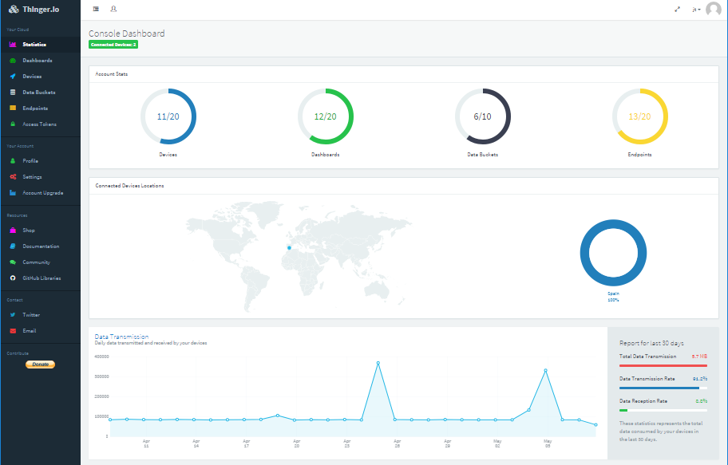
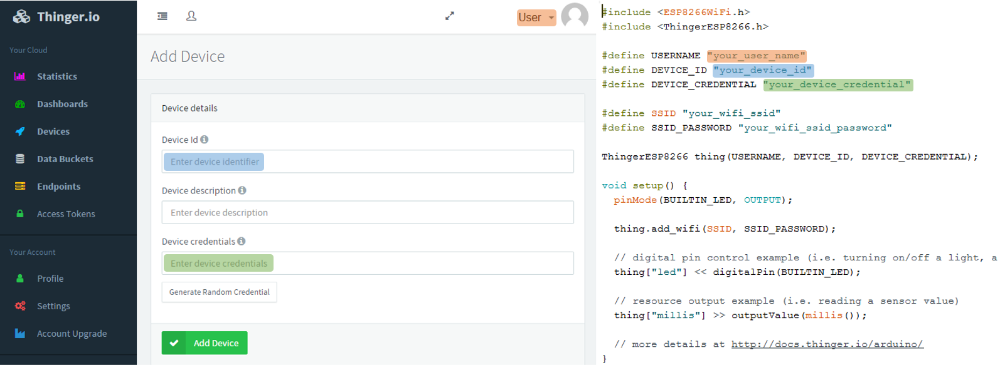
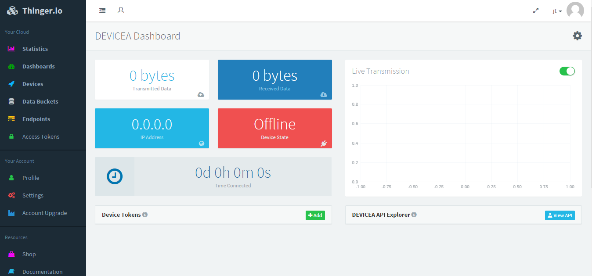
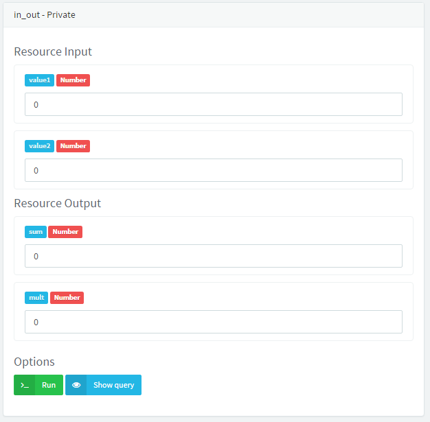
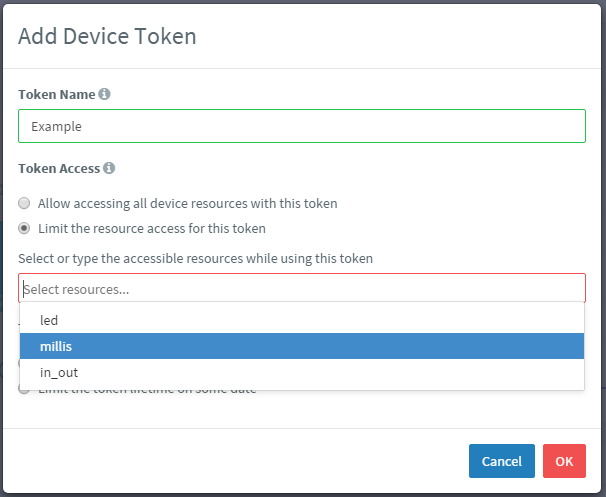
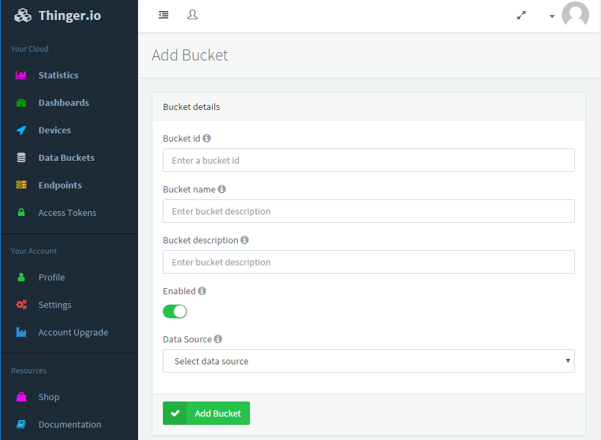
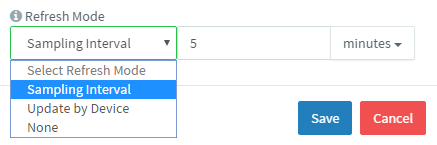
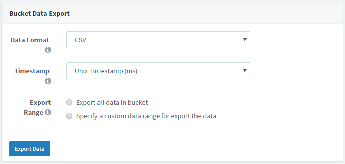
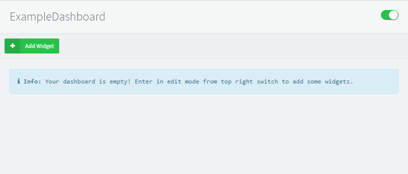
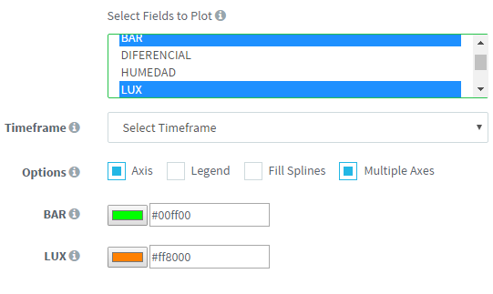

Quick start guide
========
This guide is a simple user manual which you can use to learn all the Thinger.io platform techniques and begin in an
IoT developer. 
On your first access to Thinger.io account, you will see the Stadistics interface that shows the main status of your account,
the basic enabled and features, and some widgets that will shows information about your data transmission consumption, and 
the current location of your devices in a global map.

On the left side of your screen you will find the main menu, with all the feature tabs that you can use to create projects 
and functionalities with your devices. The basic account, allows to create two different devices and 
use a few of all features but, you can enlarge this capabilities using the Account Update tab. 

<p align="center">

</p>


Device administration
========
First step to start any project becomes creating a device. Any device in Thinger.io must be registered to get access to the cloud. Each one has its own identifier and credentials and is related to the user account. The most easy way to registering the device is by using the Thinger.io cloud console. This post describes the required steps to register a new device.
So, once you have been logged in your console dashboard, please go to the **Devices** section that appears in the left menu.

 

This section will list your registered devices and will show some information about its connection. Something like the following picture.

 
    
In this screen click on **Add Device** that will open a form in which you can introduce the device credentials.

 

Add here the **device identifier** (unique within your devices), a **device description** that may help you to identify your device, and the **device credentials**. Each device has its own identifier/credential, so a comprised device will not affect other devices. All your passwords in the server are stored securely using `PBKDF2 SHA256` with a 32 bytes salt generated with `PRNG` and a non-despreciable amount of iterations. Keep your **device identifier** and **device credential**, as you will need them for connecting your device (the password is not visible once you set it).

If all goes fine, you should see some success message 

 

 Go back to your devices list, and now you should see your new device created.

 

Now you can use your new device id and the device credentials to connect the new device.


Check out the source code libraries installation guide to get the main code and the examples for your working platform:
 
  [Arduino](http://docs.thinger.io/arduino/)
  
  [Linux & Raspberry Pi](http://docs.thinger.io/linux/)
  
  [Sigfox](http://docs.thinger.io/sigfox/)
  
  [Mbed](http://docs.thinger.io/mbed/)
  

Open an example code an fill the device details with the same device ID and credentials that you use in the "Add device"
interface, like it is showed in the image below:
     
<p align="center">

</p>
        
Then, compile and run our program and click on your device name to open its administration dashboard, where you will be able to see 
 some status information about your device like IP, connection time or actual connection status:
 
  <p align="center">
  
  </p>

## Opening the device dashboard ##

You can try clicking in the device name for opening its dashboard, that currently displays some information like its connection status, connected time, up and down bytes, and a real time activity state. This dashboard will be improved in the future with more functionality and configurable elements. Also you can see in this dashboard a small button called **DEVICE_NAME API**. This button will open a screen that allows you interacting directly with the resources programmed in your device.


## Exploring device API resources

Ones you have any connected device, you should be able to access to his resources and explore the API Rest messages using the 
"Device Api" interface. You can access to this terminal through the Device Dashboard, clicking into de blue button "device API".

this interface will create one different box for each resource that you have created on your program. Each box have 
an identifier with the resource name and if you make a complex resource with more than one variable, there will appear differentiated
with there input or output keys. 

Thinger.io counts with two different basic resource types: input and output. You can see an explanation of how to create each
resource for your work platform in the source code documentation. > link a la docu de recursos

<p align="center">

</p>

The input resources will be represented with an input tex box, and will be automatically limited by the system to receive 
a valid value due to the variable type that you associate to de input key.

If you create a bool or binary value input, the interface is able to create a switch like this

Output resources will be represented with a text box or with a switch for binary values too.

It is possible to build a dual resource with input and output values. this values will appear separated in the resource box. We could differentiate
them with a value keys:

<p align="center">

</p>

    
This interface is particulary useful to debug our projects, because it shows all data as it is recovered from the device message.
If you want to see the exactly architecture of the messages and the structure of the Pson that it's being created by your resources, 
press the "Show query" blue button of the resource and it will appear separated by semantic content. Be aware that, this boxes contains
the hole information contained into the rest API message that is sent between your web browser and the Thinger.io server, and it is
possible to reproduce the functionality of your actions in any other Rest-full program, to make specific request to the server. This
functionality will be explained into an specific section of the documentation. 

 <p align="center">
 
 </p>
    
## Creating a device Token 

A device token is an authorization code that allow us to create utilities, integrating any project into third party services using the REST API. It is possible to create
multiple device tokens related to the same device and we can select the access capabilities to some specific resources into a specific time period. If you don't select anything, the endpoint will be able to access to the hole resources any without restrictions.

To create a device token, open the device Dashboard and take a look to the subsection called "Device Tokens" then press 
the green button with the text "+ Add" on the right of the box. It will appear an interface that will allows you to introduce the token identifier 
and the specific time and resources permissions. 

<p align="center">

</p>

## Edit device settings

It is possible to change some device details like the description and the credentials by clicking the gear icon on the right  top of the 
 device dashboard. This is very useful, because is a better way to change the device credentials if you forgotten it, instead of delete and recreate
 the device.
   
 <p align="center">

</p>
  
 If you need to change the name or it es necessary to delete the device, it is possible to delete the hole configuration of the
 device selecting it into the device tab and clicking on the "Delete" button.
 
 
 
Data buckets
======
## creating a bucket
Thinger.io server is able to create data bases with the output resources information that we associate to a Data Bucket. With this feature, we can store the values 
to create historic dashboards or to export to a CSV file and apply some data analysis to the registered information. You can manage data buckets pressing into the next main menu tab:
    
 <p align="center">
 
 </p> 
    
To create a data bucket, just click into the menu tab and press the **Add Bucket** button.

 <p align="center">
 
 </p>

Then fill the details and switch on the storage with the button "Enable". 
Next step will be associate the bucket to any data source, which can be an specific resource of any device in a specific time period, or an open 
write call that will allow us to send data from different devices and time periods using a Bucket_call instruction with the bucket identifier. 

<p align="center">

</p> 

There are some limitations into the minimum period between data writes and in the time of data retention according to your account, you can check this into the
pricing tab: https://thinger.io/pricing/

## Exporting database
You can download all your stored information into a CSV file going to any bucket administration page, selecting a timestamp format and a time range and pressing 
into "Export data" button. After a few minutes, you will receive an email with a download of your file. 
            
<p align="center">

</p>        
      
## Delete database
It is possible to delete all the stored information selecting the check box and pressing Delete button. This process could delay some minutes if there was a lot of entries.

<p align="center">

</p>     
        
Dashboards
======
## creating dashboards
A dashboard is graphical interface system that allows to create representations of any resource values from your devices. They counts with a lot of different widgets that 
you can use to represent the information according to your requirements, such as time series or donut charts, progress bars, text and image boxes and some input widgets like a slide button 
or a slider. Best thing of this feature is that you can select multiple parameters like widgets sizes, colours units, or even the data refresh sampling interval that the system will use to
actualize the represented values. All dashboard features can be founded into the next menu tab:

<p align="center">

</p> 

First step to create a dashboard is go to the dashboards tab and press into the "Add dashboard button", it will open a details form where you can introduce the name, description
and identifier of the new dashboard. Then go back the main tab and select the new element to open the dashboard and see the empty canvass. Pressing into the upper button you
will enable the dashboard edition, and then you are ready to create the first widget going to the "new widget" button to open the settings form. 

<p align="center">

</p> 

## adding new widgets

First you will see on this form is a strip menu where you can select the widget type, and after selecting one type it will appear the rest of the configuration form with some details text boxes
to identify the widget and the represented information like is showed in the image below:

<p align="center">

</p>  
    
This is the most important things you should now about the widgets configuration:

Chart input from device: If you select this option you will be able to access to any device resources, that will be showed en real time during the visualization o this dashboard. If the device
is connected, the form will create a new strip menu where you can select the resource and the variables that you want to include into the widget. If the device is not connected you can select it and 
write the resource and variables identifier into a text box, but it is very important that you write the identifiers properly. 
    
<p align="center">

</p>  
    
When you begin creating a series chart, note that more than one variable can be selected into the same chart it belongs to the same resource, using **control** key of your keyboard or making a 
multiple selection dragging the mouse. It is possible to change the colors of each variable line clicking into the colour box at the bottom of the form. 
  
<p align="center">

</p> 
 
chart input from data bucket: Feed a dashboard directly from device will works always on real time situations, and the data will be stored into your browser cache memory so, if your refresh the session, all data sowed into your time series charts will be lost. 
If you want to make a long range time representation of any data, the correct  way to make it is creating a data bucket and feeding the dashboard with the stored data. When you select this tab into the strip menu, it will appear a list with all created bucket that you can select.

Fill splines option: This option will create a nice color effect your widget, specially if you are using a multivariable chart.
Multiple axes option: This feature is necessary if you are using variables with different units or ranges, because it wil include different ordinate axes to the chart, making easy the check out of the values.
Ones you have fill out the details and click the **save** button, the widget will appear into an standard size and position that you can modified like you want by dragging the box or his margins.
Sampling protocol: There are to different sampling protocols that you can select to actualize the data when it comes from a device: A fixed sampling interval (with a minimum sampling of one second), or "send by device" interval what do not point any specific time, so the server will be always ready to receive any data from the device when it makes any data stream.

```cpp

// update by device example code

```

   PONER EL GIFT DEL DASHBOARD 
                    
Endpoints
======
  
One endpoint is a REST API message that we can send to any third party system to apply for an specific service. It is possible to create and send endpoint queries with the device program, but you will need to include a lot of inefficient code to send, receive and extract the information if the endpoint server gives some output. Thinger.io server includes an endpoint manager that allows to create endpoints to different services using the same simple structure in your  source code >>you can see the source code explanation and examples here<<, note that it is possible to attach an output Pson into the endpoint call, with which you can include some information to the server.  
Create and endpoint entry on your account is very easy too, just go to the **endpoint** menu tab and press into de **Add endpoint** button, it will open a form where you can introduce the endpoint indentifier which you will use into your code, some description and select a type.
Different types are preconfigured endpoints that we have created to simplify even more the endpoint creation process. so, just select any of the strip menu options and fill the new form entries, then press **Save** button and your endpoint will be created.
There are some particular endpoint types that we should talk about:
Thinger.io email endpoint: This types allows to send an email to an specific direction. It is possible to include virtual data values into the email context using the output identifier any variables included in the call_endpoint() attached Pson, surrounded by two keys: "{{example}}"

```cpp
EJEMPLO DE CORREO CON VARIABLES
```

Then, the source code of your program should call this endpoint and attach any Pson with the variables like in the example below:

```cpp
EJEMPLO DE CODIGO DE LLAMADA A ENDPOINT
```
		

The result of this integration should be this:
		
<p align="center">

</p> 

IFTTT maker channel: 
This channel allows executing multiple actions like sending tweets, posting to Facebook, doing push notifications, sending emails or SMS, and many many other actions you must check. To do this you will need to have an IFTTT account. 

HTTP request: There are countless endpoint services on internet, if you want to create queries to any other service that is not include in our selection, it is possible to create an HTTP request interface in the Thinger.io server, select the type (GET / POST) and even include any other request headers that you need to adapt the request to the third party requirements. Then you can select the request body, creating a JSON encapsulation or sending a custom data string.


## Access tokens: 


