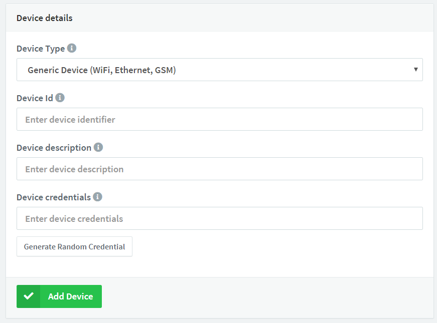
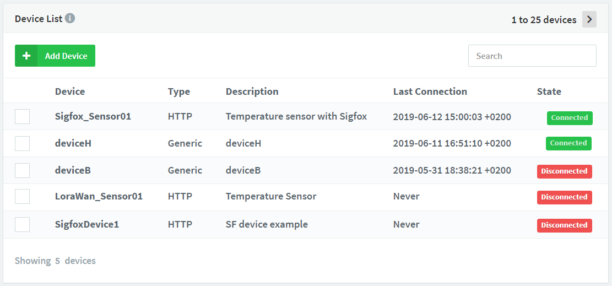
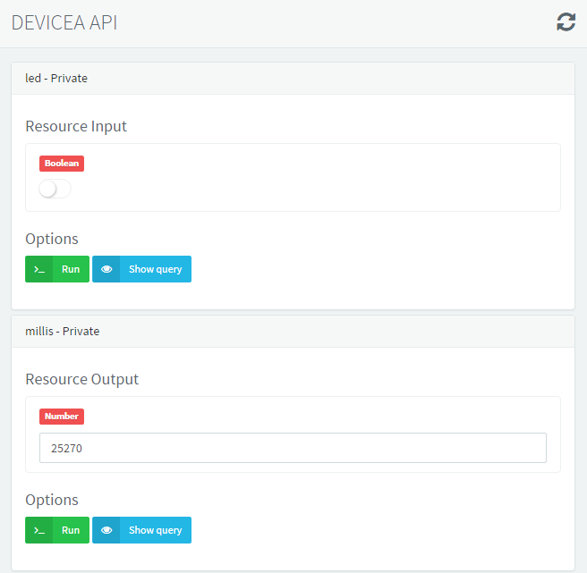
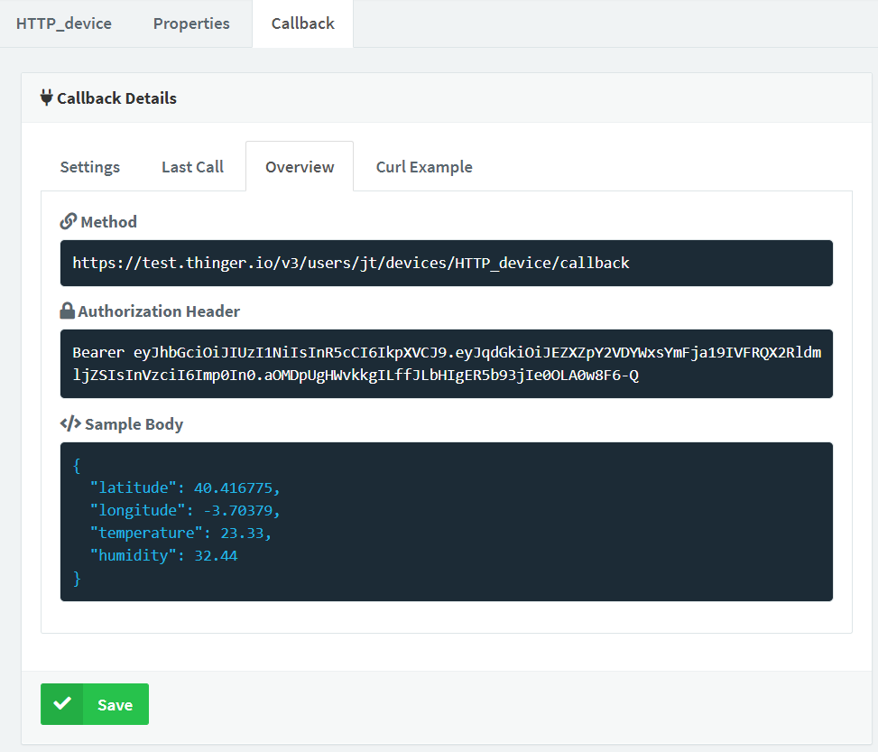
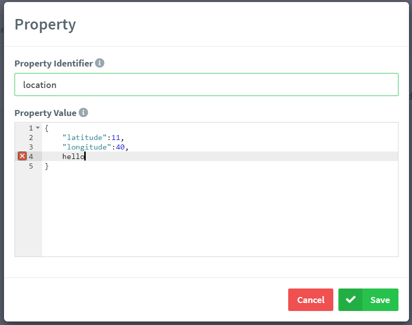

# DEVICES ADMINISTRATION

## Create Device

The first step to start an IoT project in Thinger.io \(except for not connected devices like Sigfox\) is by creating devices, which will grant access to connect your devices to your account. Any device in Thinger.io must be registered to get access to the cloud. Each one has its own identifier and credentials and is related to the user account. This section describes the required steps to register a new device in your account.

To register a new device, once you have been logged in your console dashboard, please go to the **Devices** section that appears in the left menu.


This section will list your registered devices and will show some information about its connection. Something similar to the following picture.


If it's your first time on thinger.io this list will be empty. Next we'll show you how to create your first device. First of all, click on **Add Device** that will open a form in which you can introduce your device indentification credentials and select a **Device Type** from the drop down list, selecting one of these types: 

* **Generic device**: For devies with Thinger.io software client on it. Such as Raspberry Pi, Linux or Arduino devices. 
* **HTTP device**: This option allows you retrieving data from third party platforms and comercial devices in order to work their information despite not having a full integration. 
* **Thinger Core 32 device**: This is only for ESP32 modules with Thinger.io Core on it.

After selecting your the device type you can fill the input text form as explained below:



Add the **device identifier** \(unique within your devices\), a **device description** that may help you to identify your device, and the **device credentials**. Each device has its own identifier/credential, so a compromised device will not affect other devices. All your passwords in the server are stored securely using `PBKDF2 SHA256` with a 32 bytes salt generated with `PRNG` and a non-depreciable amount of iterations. Keep your **device identifier** and **device credential**, as you will need them for connecting your device \(the password cannot be recovered later\).

If all goes fine, you should see some success message


Now, you can o back to your devices list, and your device should appear as disconnected.



Now you can use your new device id and the device credentials to connect the new device. Depending on your device, you will need to install the required libraries or development environment, so checkout the following sections according to your device:





Remember that Sigfox devices, does not share the concept of connected device, as they are by default offline devices that send information periodically. If you want to store information from these devices, please, checkout the following documentation.



For the following example, we will be using the Arduino IDE along with an ESP8266 device, like the NodeMCU. In this case, you can open the example code for the ESP8266, and fill the device details: your username, the device ID, and the device credentials established while creating the device. The following picture represents the relation between the code and the device created in your account.


Once we have established in the code our account identifier, device identifier, and device credentials, we can compile and flash the program. Meanwhile, we can open our device in the cloud console, just by clicking its identifier in the devices list. In the device screen, you will be able to see some information about your device, like its IP address, connection status, or sent/received information in real time. By default, our device will appear as disconnected, like in the following picture.


Once the device gets connected to the account, the interface will change its status, showing that it is connected, and it is transmitting information, like in the following picture:


Note that the connected device dashboard is able to show an estimated location of the device, that can be modified following the instructions of the "properties" chapter of this documentation. So, now we have our device connected to our account, and we are ready to start interacting with the device over the Internet.

## Device Explorer

Each device counts with an explorer and administration interface, that allows showing and configuring different devices features. This interface is common for all device types in thinger.io but note that some features such as the "device API explorer" may not be available if the device have not an actual real-time connection with the server. 

In the next sections, it is explained each different feature of the device explorer:

### Device API

One cool feature of the Thinger.io platform, is that it allows to discover the resources defined in your device. A resource can be a sensor reading, like temperature, humidity, or pressure. A resource can be also any actionable element, like a light, a relay, or a motor. But in general, any device resource is like a callback function that can be called \(on demand\) through a Rest API. In this way, this section explains how to interact with your device resources over the cloud console, but also you will find how you can issue your own REST API calls to query your device.

Once you have your device connected to your account, as described in the previous section, you can access to its resources and explore the API Rest endpoints using the `API EXPLORER`. You can access to this screen over the Device Dashboard, by clicking on the small blue button called `Device API`.

In the API explorer interface you will see one different box for each resource defined in your code. Each resource has an identifier, that is related with the resource name defined in your code. In the Thinger.io platform, you can define 4 different types of resources, one for input \(sending data to the device\), one for output \(the device will send information\), one for input/output \(you can send and receive information in one call\), and just a callback resource, which you can just execute without sending or receiving information. The input and output data, from the API perspective, can be any JSON document. Take a look to your library documentation in order to see how to define these different resources.

For example, the default ESP8266 example in the Arduino libraries, defines two different resources. One input resource, called `led`, for controlling the `BUILTIN_LED`, and one output resource, called `millis` to extract the current millis of the device, as defined in the following code. Notice that a resource name can be any arbitrary text to identify the underlying resource, as they are not tied to any constant defined in the platform.

So, these are our sample resource:

```cpp
thing["led"] << digitalPin(BUILTIN_LED);
thing["millis"] >> outputValue(millis());
```

If our device is connected to the platform, we can open our device API explorer and see the defined resources in the platform, like in the following picture.



You can see how our defined resources in the device are now available in the platform, as the device is able to report the available resources and their format \(or current state\). The idea is that you can test here your resources, that is, interacting with them in real-time. In this case, you will be able to switch the led state, or read the current milliseconds from the Arduino device. Every click in the `Run` button will execute your resource, i.e., forcing a read from a sensor, calling the `millis()` function, or sending a new state for the actuator, depending on the resource type \(input or output\).

The nice idea about that, is that every device resource, can be translated to a REST API endpoint, so you can consume or interact with your devices using standard REST queries, i.e., using a `POST` method to send values to the device, or using a `GET` method to read information from the device. So, you can easily test these API endpoints before integrating them in other platforms or applications.

You can even test more complex inputs and outputs from the platform. In example, suppose that you have defined a resource that basically returns the sum and multiplication between two integer numbers, something like:

```cpp
thing["in_out"] = [](pson& in, pson& out){
    out["sum"] = (int)in["value1"] + (int)in["value2"];
    out["mult"] = (int)in["value1"] * (int)in["value2"];
};
```

This resource definition will be translated to the following resource in the platform, where it is possible to both test input values, and view the output result. So, you can try entering some values, click on `Run`, and see the output reported by the device. This example also emphasizes how the resources work, as they are not just static values, but callbacks you can call with any input or output value.


In addition to this useful device API explorer where you can interact with your devices, you can also obtain specific information about the REST API endpoint by clicking on the `Show Query` button. This provides information about the method type, URL, content type, request body, and response body. You can also click on `Curl`, so you can copy the command to interact with your device directly from your console. The above example is translated to the following REST API call:


There is more information available about the API for interacting with your devices [here](http://docs.thinger.io/api/#devices-api-access-device-resources).

### Device Tokens

All the interactions with your connected devices, i.e., by using the REST API endpoints commented above, or a mobile phone, needs to be authenticated against the platform. By default, when you interact with your devices over the Thinger.io console, you are implicitly signing all your requests to the platform with an access token you obtained from your username and password. This kind of authorization grants access to all your account resources, so you can configure devices, buckets, etc. However, this authorization expires quite frequently \(but renewed automatically by your browser\), and cannot be used to grant access to our devices to other users or platforms, as you will be providing access to all your account.

In this case, it is possible to create specific access tokens for granting access to your devices, and even grant access to specific resources on your devices. Moreover, it is possible to define the token validity in time, by enabling an expiration date. This way, if you need to provide access to some of your device resources to a third party tool like IFTTT, a external web page, a mobile phone, or any other service, it is highly recommended to create a device token.

To create a device token, open the device Dashboard and take a look to the subsection called "Device Tokens". Then, click on the green button `Add` on the right of the box. Then, a modal window will appear, were you can configure different parameters:

* Token name: Use a representative name to remember why the token was issued, i.e., IFTTT Access, Mobile phone, etc.
* Token access: Configure the token to allow accessing all device resources, or limit the access to a set of resources.
* Token expiration: Configure the token to expire at some given date, or available indefinitely.

The following figure shows a sample screenshot while configuring a device token.


Once the token is saved, the interface will show the access token to be used in the REST API Calls, like in the following figure. If you need help to integrate this access token in the REST API calls, checkout [this](http://docs.thinger.io/api/#authentication-api-rest-api-authentication) documentation.


### HTTP devices Callback <a id="http-devices-callback"></a>

Because of the nature of these devices, [thinger.io](http://thinger.io/) applies a special treatment, based on the use of callbacks to make the integration. A callback is a functionality of the server that can be used to request a process with device data by means of a HTTP query, such as store it in a bucket, calling an endpoint profile or registering the information contained in a JSON that should be sended with the query.

To create a callback, open the device Dashboard and take a look to the subsection called "callback", that will show different options in the context `callback details` as shown in the image below:


This context shows the different functionalities that can be requested from the server using a callback, by just clicking in the checkbox and selecting the resource that will receive the data, such as:

* Data storage in scalable [Data Buckets](http://docs.thinger.io/console/#data-buckets)
* Calling [Endpoint Profiles](http://docs.thinger.io/console/#endpoints) to integrate with third parties
* Retrieving or modifying [Device Properties](http://docs.thinger.io/api/#Device-properties) using `Set device property` or `response data` features.

Note that it is not possible to create properties, data buckets or endpoints though callback request, so it is necessary to initialize then first using the web console or via REST API.

Ones you have configured the callback details, the system will be ready to receive a request. In a similar way to the "show query" feature included in the Connected device's dashboard, you can find a precise specification of the HTTP request structure and a complete cURL example by clicking in the "overview" or "cURL Example" tabs in the upper side of `Callback Details` context as shown in the image below:



Finally, to create a Callback HTTP request, take in count that the `Authorization Header` must be included 9in your HTTP request as shown in the example below:

```text
https://<Thinger_Server>/v3/users/<Username>/devices/<Device_ID>/callback?authorization=<Authorization_Header>
```

### Device Tokens <a id="device-tokens"></a>

All the interactions with your connected devices, i.e., by using the REST API endpoints commented above, or a mobile phone, needs to be authenticated against the platform. By default, when you interact with your devices over the [Thinger.io](http://thinger.io/) console, you are implicitly signing all your requests to the platform with an access token you obtained from your username and password. This kind of authorization grants access to all your account resources, so you can configure devices, buckets, etc. However, this authorization expires quite frequently \(but renewed automatically by your browser\), and cannot be used to grant access to our devices to other users or platforms, as you will be providing access to all your account.

In this case, it is possible to create specific access tokens for granting access to your devices, and even grant access to specific resources on your devices. Moreover, it is possible to define the token validity in time, by enabling an expiration date. This way, if you need to provide access to some of your device resources to a third party tool like IFTTT, a external web page, a mobile phone, or any other service, it is highly recommended to create a device token.

To create a device token, open the device Dashboard and take a look to the subsection called "Device Tokens".


Then, click on the green button \`Add\` on the right of the box. Then, a modal window will appear, were you can configure different parameters:

* Token name: Use a representative name to remember why the token was issued, i.e., IFTTT Access, Mobile phone, etc.
* Token access: Configure the token to allow accessing all device resources, or limit the access to a set of resources.
* Token expiration: Configure the token to expire at some given date, or available indefinitely.

The following figure shows a sample screenshot while configuring a device token.


Once the token is saved, the interface will show the access token to be used in the REST API Calls, like in the following figure. If you need help to integrate this access token in the REST API calls, checkout [this](http://docs.thinger.io/api/#authentication-api-rest-api-authentication) documentation.


### Device Properties <a id="device-properties"></a>

[Thinger.io](http://thinger.io/) provides a simple way to store additional information related to an specific device, such as location, identificators or even configuration parameters that may be retrieved by devies using comon Json files. On this way, the platform can be used as devices persistent memory. To create a device property, open the device Dashboard and take a look to the subsection called "Properties".


This menu provides an easy way to create, manage or delete devices properties. Note that the property created in this example is specifying the device location. [Thinger.io](http://thinger.io/) system has been designed to detect this configuration and automatically represent it on the device dasboard map.



Properties declarations and modifications are made by means of a special context, provided with a json validator that enhances the text and check morfologic mistakes.

#### Coding with properties <a id="coding-with-properties"></a>

It is also possible to create, retrieve and modify data properties from devices, however, at this point we must differentiate between HTTP devices or [thinger.io](http://thinger.io/) software client devices, which will use `set_property()` or `get_propery()` comands as shown in the examples below:

```text
/*set property value*/

//create a pson with new values
pson data;
data["longitude"]=-4.056;
data["latitude"]=41.40;
//sending new values to platform
thing.set_property("location", data, true);
```

```text
/*retrieve property value*/

//creating a pson to store the property values
pson data;
//retrieving data from the platform
thing.get_property("My_Property", data);
```

\(You can learn more details about this functions in the "codification" section of this documentation\).

using HTTP devices it's also the possible to interact with properties through callback configuration submenu tools.


Acording to this configuration, when [Thigner.io](http://thigner.io/) server receives any transmission from "SigfoxDevice1" the payload data will be stored into "data" property, creating a JSON with all variables. In the oposite situation, thanks to the "Response Data" feature, the values stored in the parameter with was called "downlink\_data" will be sent to the device thought Sigfox infrastructure.

### Device Settings <a id="device-settings"></a>

It is possible to adjust some device details like its description or credentials going to the "Settings" subsection of the device dashboard. This way, you can change the device credentials by a new one of your choice in case you forgot it \(the password cannot be recovered from database as it is encrypted\). Notice that changing the device password, will not disconnect the device, but will prevent its reconnection once disconnected.


If you need to change the device identifier it is necessary to delete the device and register a new one with the desired one.

