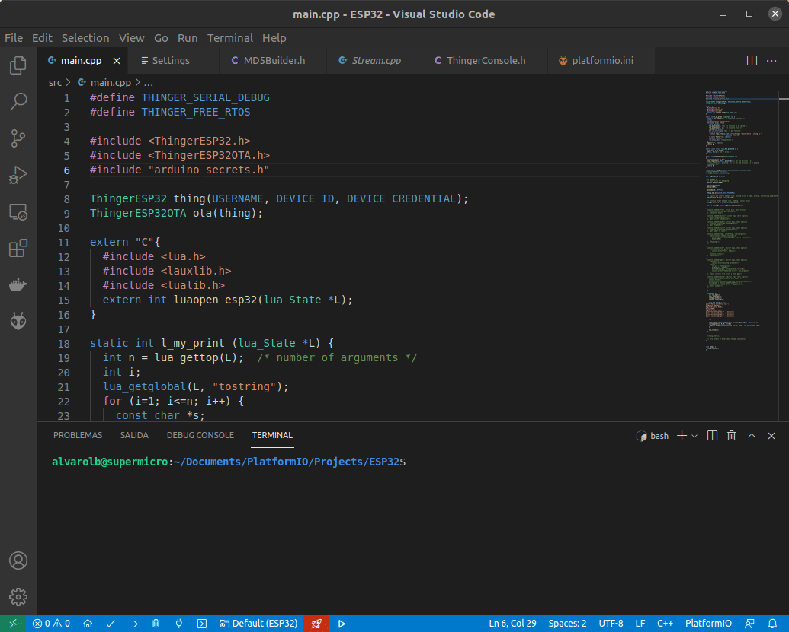

# OTA PROGRAMMING

Over the Air \(OTA\) Programing is a method that allows to **remotely send new firmware to IoT devices over the Internet**, no matter where they are as it works with Thinger.io Cloud to deliver the new firrmware binaries.

This feature allow us to keep the devices updated with new security patches and code improvements in a fast and scalable way. It is an essential tool for the maintenance of IoT products that will prevent us from traveling to the location of the devices.

The update process is done over a **Visual Studio Code extension** that integrates with the Thinger.io cloud to upload new firmware binaries to the target device. So, it integrates with the IDE to streamline the development process, **just compile and upload** as if the device where connected to the computer. 


## IDE Configuration

Before working with this tool it is necessary to install and configure Visual Studio Code and the PlatformIO extension as explained on the [SDK SETUP](../sdk-setup/#visual-studio-code) section of the documentation. Then it is required to **install Thinger.io VSCode extension** directly from the Extension manager. Search for "Thinger.io" or [Checkout on Microsoft Marketplace](https://marketplace.visualstudio.com/items?itemName=thinger-io.thinger-io). 


This extension will manage the OTA processes with some interesting features such as: 

* OTA updates directly from the Internet over Thinger.io
* Device switcher to search & select the target device for the update
* Real-time device connection status
* Compatible with multiple PlatformIO configuration environments inside a Project
* Automatic build and upload over the Internet in a single click
* OTA with compression support both on ESP8266 and ESP32
* MD5 Checksum verification for firmware binaries

### Extension Configuration

Before running the OTA it is necessary to configure the extension by accessing the VScode Extensions Manager and selecting the Extensions Settings option.


* **Thinger.io Host**: Place here the URL of the Thinger.io Instance you are working with \(if using a private instance, otherwise by default it will be backend.thinger.io\).
* **Thinger.io Port**: Specifies the connection port \(443 by default\).
* **Thinger.io Secure**: Enable/disable SSL/TLS connection \(enabled by default\).
* **Thinger.io Token**: Place here a Thinger.io `Access Token`with the following permissions:
  * ListDevices
  * AccessDeviceResources
  * ReadDeviceStatistics

The following image provides a token configuration example with the required permissions.


## Firmware Upload via OTA

The OTA feature is implemented on the default [Thinger.io Arduino client libraries](https://github.com/thinger-io/Arduino-Library) required for the connectivity with the Thinger.io cloud.

The boards that supports OTA updates over the Visual Studio Code extension are the following:

* Espressif ESP8266
* Espressif ESP32
* Arduino Nano 33 IOT
* Arduino MKR WiFi 1010
* Arduino RPI2040 Connect
* Arduino MKR NB 1500

The general requirement to start working with OTA updates for a specific device are:

1. Have a PlatformIO project on Visual Studio Code for the target device. More details [here](https://docs.thinger.io/sdk-setup/visual-studio-code#starting-a-project).
2. Have a basic Thinger.io firmware for your device, and ensure you it can connect to the cloud.
3. Modify the sketch to include the OTA functionality. More details in each specific device section.
4. Flash the initial firmware over a serial communication port on the computer.
5. Use the Thinger.io Visual Studio Code toolbar buttons to select your device and flash new firmware.

If everything is configured correctly it will be possible to start working with the Thinger.io extension via the new elements added to the bottom toolbar. There are two buttons that allow to select the target device to be flashed, and then compile and upload new firmware binaries.


**Select Target Device** 🚀

This button is a device selector, when you click it, it will prompt to search and select a target device from your Thinger.io account.




When the target device is disconnected, the target device button background color will be red.


**Compile and Update ▶️**

This button compiles and uploads the code to the selected device. In the process it will show a window with the OTA progress. 



To update your device over OTA, the first time it must be flashed from a serial com port.


**Clean Target Device** 🗑️

It is possible to clean the selected target device accessing the Visual Studio command Palette with `Ctrl` + `Shift` + `P`, and searching for `Thinger.io`


### ESP32 OTA

To add OTA functionality for **ESP32** it is only required to include the `ThingerESP32OTA.h` header and create an instance of it. A complete example for a basic firmware with OTA support can be as the following:



```cpp
#define THINGER_SERIAL_DEBUG

#include <ThingerESP32.h>
#include <ThingerESP32OTA.h>
#include "arduino_secrets.h"

ThingerESP32 thing(USERNAME, DEVICE_ID, DEVICE_CREDENTIAL);
ThingerESP32OTA ota(thing);

void setup() {
  // open serial for monitoring
  Serial.begin(115200);
  
  pinMode(16, OUTPUT);

  thing.add_wifi(SSID, SSID_PASSWORD);

  // digital pin control example (i.e. turning on/off a light, a relay, configuring a parameter, etc)
  thing["GPIO_16"] << digitalPin(16);

  // resource output example (i.e. reading a sensor value)
  thing["millis"] >> outputValue(millis());

  // more details at http://docs.thinger.io/arduino/
}

void loop() {
  thing.handle();
}
```



```cpp
#define USERNAME "your_user_name"
#define DEVICE_ID "your_device_id"
#define DEVICE_CREDENTIAL "your_device_credential"

#define SSID "your_wifi_ssid"
#define SSID_PASSWORD "your_wifi_ssid_password"
```



### ESP8266 OTA

To add OTA functionality for **ESP8266** it is only required to include the `ThingerESP8266OTA.h` header and create an instance of it. A complete example for a basic firmware with OTA support can be as the following:



```cpp
#define THINGER_SERIAL_DEBUG

#include <ThingerESP8266.h>
#include <ThingerESP8266OTA.h>
#include "arduino_secrets.h"

ThingerESP8266 thing(USERNAME, DEVICE_ID, DEVICE_CREDENTIAL);
ThingerESP8266OTA ota(thing);

void setup() {
  // open serial for monitoring
  Serial.begin(115200);

  // set builtin led as output
  pinMode(LED_BUILTIN, OUTPUT);

  // add WiFi credentials
  thing.add_wifi(SSID, SSID_PASSWORD);

  // digital pin control example (i.e. turning on/off a light, a relay, configuring a parameter, etc)
  thing["led"] << digitalPin(LED_BUILTIN);

  // resource output example (i.e. reading a sensor value)
  thing["millis"] >> outputValue(millis());

  // more details at http://docs.thinger.io/arduino/
}

void loop() {
  thing.handle();
}
```



```cpp
#define USERNAME "your_user_name"
#define DEVICE_ID "your_device_id"
#define DEVICE_CREDENTIAL "your_device_credential"

#define SSID "your_wifi_ssid"
#define SSID_PASSWORD "your_wifi_ssid_password"
```



### Arduino Nano 33 IOT OTA

To add OTA functionality for **Arduino Nano 33 IOT** it is required to include the `ThingerWiFiNINAOTA.h` header and create an instance of it. A complete example for a basic firmware with OTA support can be as the following:



```cpp
#define THINGER_SERIAL_DEBUG

#include <ThingerWiFiNINA.h>
#include <ThingerWiFiNINAOTA.h>
#include "arduino_secrets.h"

ThingerWiFiNINA thing(USERNAME, DEVICE_ID, DEVICE_CREDENTIAL);
ThingerWiFiNINAOTA ota(thing);

void setup() {
  // configure LED_BUILTIN for output
  pinMode(LED_BUILTIN, OUTPUT);

  // open serial for debugging
  Serial.begin(115200);

  // configure wifi network
  thing.add_wifi(SSID, SSID_PASSWORD);

  // pin control example (i.e. turning on/off a light, a relay, etc)
  thing["led"] << digitalPin(LED_BUILTIN);

  // resource output example (i.e. reading a sensor value, a variable, etc)
  thing["millis"] >> outputValue(millis());
  
  // more details at http://docs.thinger.io/arduino/
}

void loop() {
  thing.handle();
}
```



```cpp
#define USERNAME "your_user_name"
#define DEVICE_ID "your_device_id"
#define DEVICE_CREDENTIAL "your_device_credential"

#define SSID "your_wifi_ssid"
#define SSID_PASSWORD "your_wifi_ssid_password"
```




Note: it is required to include `lib_archive = no` to `platformio.ini` configuration file.



```bash
[env:nano_33_iot]
platform = atmelsam
board = nano_33_iot
framework = arduino
lib_archive = no
lib_deps = thinger.io
```


### Arduino MKR WiFi 1010 OTA

To add OTA functionality for Arduino **MKR WiFi 1010** it is required to include the `ThingerWiFiNINAOTA.h` header and create an instance of it. A complete example for a basic firmware with OTA support can be as the following:



```cpp

#include <ThingerWiFiNINA.h>
#include <ThingerWiFiNINAOTA.h>
#include "arduino_secrets.h"

ThingerWiFiNINA thing(USERNAME, DEVICE_ID, DEVICE_CREDENTIAL);
ThingerWiFiNINAOTA ota(thing);

void setup() {
  // configure LED_BUILTIN for output
  pinMode(LED_BUILTIN, OUTPUT);

  // open serial for debugging
  Serial.begin(115200);

  // configure wifi network
  thing.add_wifi(SSID, SSID_PASSWORD);

  // pin control example (i.e. turning on/off a light, a relay, etc)
  thing["led"] << digitalPin(LED_BUILTIN);

  // resource output example (i.e. reading a sensor value, a variable, etc)
  thing["millis"] >> outputValue(millis());
  
  // more details at http://docs.thinger.io/arduino/
}

void loop() {
  thing.handle();
}
```



```cpp
#define DEVICE_ID "your_device_id"
#define DEVICE_CREDENTIAL "your_device_credential"

#define SSID "your_wifi_ssid"
#define SSID_PASSWORD "your_wifi_ssid_password"
```




Note: it is required to include `lib_archive = no` to `platformio.ini` configuration file.



```bash
[env:mkrwifi1010]
platform = atmelsam
board = mkrwifi1010
framework = arduino
lib_archive = no
lib_deps = thinger.io
```


### Arduino RPI2040 Connect OTA

To add OTA functionality for **Arduino RPI2040 Connect** it is only required to include the `ThingerMbedOTA.h` header and create an instance of it. A complete example for a basic firmware with OTA support can be as the following:



```cpp

#define THINGER_SERIAL_DEBUG

#include <ThingerMbed.h>
#include <ThingerMbedOTA.h>
#include "arduino_secrets.h"

ThingerMbed thing(USERNAME, DEVICE_ID, DEVICE_CREDENTIAL);
ThingerMbedOTA ota(thing);

void setup() {
  // open serial for debugging
  Serial.begin(115200);

  // configure LED_BUILTIN for output
  pinMode(LED_BUILTIN, OUTPUT);

  // configure wifi network
  thing.add_wifi(SSID, SSID_PASSWORD);

  // pin control example (i.e. turning on/off a light, a relay, etc)
  thing["led"] << digitalPin(LED_BUILTIN);

  // resource output example (i.e. reading a sensor value, a variable, etc)
  thing["millis"] >> outputValue(millis());

  // start thinger task
  thing.start();

  // more details at http://docs.thinger.io/arduino/
}

void loop() {
  // your code here
}
```



```cpp
#define DEVICE_ID "your_device_id"
#define DEVICE_CREDENTIAL "your_device_credential"

#define SSID "your_wifi_ssid"
#define SSID_PASSWORD "your_wifi_ssid_password"
```



### Arduino MKR NB 1500 OTA

To add OTA functionality for **MKR NB 1500** it is only required to include the `ThingerMKRNBOTA.h` header and create an instance of it. A complete example for a basic firmware with OTA support can be as the following:



```cpp
#define THINGER_SERIAL_DEBUG

#include <ThingerMKRNB.h>
#include <ThingerMKRNBOTA.h>
#include "arduino_secrets.h"

ThingerMKRNB thing(USERNAME, DEVICE_ID, DEVICE_CREDENTIAL);
// OTA seems to not work if no reset button pressed
ThingerMKRNBOTA ota(thing);

void setup() {
  // enable serial for debugging
  Serial.begin(115200);

  // optional set pin number
  thing.set_pin(PIN_NUMBER);

  // set APN
  thing.set_apn(GPRS_APN, GPRS_LOGIN, GPRS_PASSWORD);

  // set builtin led to output
  pinMode(LED_BUILTIN, OUTPUT);

  // pin control example over internet (i.e. turning on/off a light, a relay, etc)
  thing["led"] << digitalPin(LED_BUILTIN);

  // resource output example (i.e. reading a sensor value, a variable, etc)
  thing["time"] >> [&](pson& out){
      out = thing.getNB().getTime();
  };

  // more details at http://docs.thinger.io/arduino/
}

void loop() {
  thing.handle();
}

```



```cpp
#define USERNAME "your_user_name"
#define DEVICE_ID "your_device_id"
#define DEVICE_CREDENTIAL "your_device_credential"

#define PIN_NUMBER ""

#define GPRS_APN "your_apn_name"
#define GPRS_LOGIN "your_gprs_login"
#define GPRS_PASSWORD "your_gprs_password"
```




Note: it is required to include `lib_archive = no` to `platformio.ini` configuration file.



```bash
[env:mkrnb1500]
platform = atmelsam
board = mkrnb1500
framework = arduino
lib_archive = no
lib_deps = thinger.io
```



At this moment, it seems that MKR NB 1500 requires pressing the reset button to apply the OTA update.


