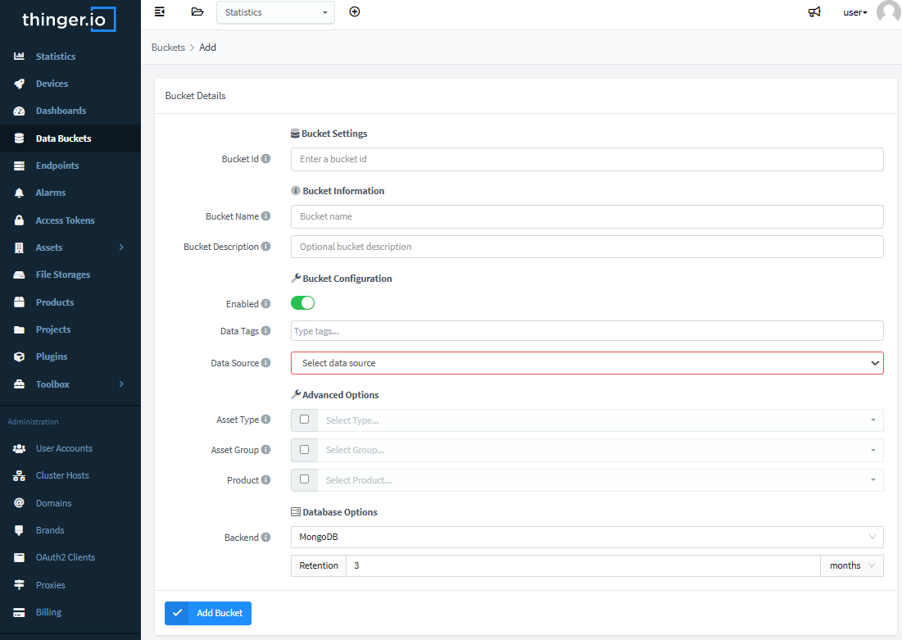

# DATA BUCKETS

A data bucket is a type of virtual storage that can hold time series data, such as temperature or humidity measurements over time. However, it can also be used to store other types of events, such as motion detections, garage door openings, temperature alerts, and more.

This information can be used to plot information in dashboards or can be exported in different formats for offline processing.

## Create Bucket

To create a data bucket, access the `Data Buckets` feature, by clicking on this section:


To create the bucket, just press the **Add Bucket** button, which will show the following screen:



Here, it is necessary to configure different parameters:

* **Bucket ID**: Unique identifier for the bucket.&#x20;
* **Bucket name**: Use a representative name to remember the bucket scope, like `WeatherData`.
* **Bucket description**: Fill here any description with more details, like Temperature and humidity in the house.
* **Enabled**: Data bucket recording can be enabled or disabled. Just switch it on to enable it.
* **Data source:** This parameter allows setting the behavior of the data bucket by selecting the data source and also the sampling method. As there are many different options, this feature is detailed in the section below.

The following sections explain the different data bucket data acquisition modes and timing configurations:&#x20;

### **From Device Resource**

&#x20;This option subscribes Thinger.io Server to a specific device resource (such as temperature, motion, and so on). It can be configured to retrieve data from the device in a specific sampling interval or wait for asynchronous communications from devices by means of the "Refresh mode" parameter.\
\
Note that this option is only compatible with devices that have been provided with Thinger.io Software client libraries (Arduino, Linux or Raspberry), and it will only work properly if the device maintains a permanent connection with the server.

* **Sampling interval:**  Configure the bucket profile to retrieve data from device resources at a specific timing, which can be changed on demand, without modifying the device sketch. Another benefit is that no additional codification is needed to implement this feature and start storing data. The next basic code example will store two variables in the data bucket when using the "sampling interval" configuration.

```
// define the resource just once in the setup() section

thing["TempHum"] >> [](pson &out){ 
  out["temperature"] = dht.readTemperature();
  out["humidity"] = dht.readHumidity();
};
```

* **Update by Device:** This option allows the device to stream the information when required, i.e., by raising an event when detected. In this case, refresh mode must be set as the `Update by Device` option while configuring the bucket, and the device source code will contain a streaming instruction for the resources (also described in more detail [**here**](http://docs.thinger.io/arduino/#coding-streaming-resources)). This way, the data bucket will be listening to a device resource, and its information is registered in every stream call.

```cpp
/*"TempHum" resource was declared in the setup() function
but the stream instuction is added in the loop*/

void loop() {
  thing.handle();
  // use own logic here to determine when to stream/record the resource.
  if(requires_recording){
      thing.stream("TempHum");
  }
}
```


This instruction should NEVER be called each loop execution or at lower than 60s streaming rates, as the bucket system will only store data every 60s. &#x20;


### **From device Write Call**

&#x20;This option sets the bucket in passive mode, waiting to be called by any Thinger.io "Generic Device" (with Thinger.h libraries on it) by means of the `write_bucket()` method. The distinguishing feature of this mode is its ability to store data from multiple devices in a single data bucket.

Here is an example of an ESP8266 device writing information to a bucket using the `write_bucket` function:

```cpp
void setup() {
  // define the resource with temperature and humidity
  thing["TempHum"] >> [](pson &out){ 
    out["temperature"] = dht.readTemperature();
    out["humidity"] = dht.readHumidity();
  };
}

void loop() { 
  // handle connection
  thing.handle();
  // write to bucket BucketId the TempHum resource
  thing.write_bucket("BucketId", "TempHum");
  // sleep the device SLEEP_MS milliseconds
  ESP.deepSleep(SLEEP_MS*1000, WAKE_RF_DEFAULT); 
}
```

### **From API Request (for 3rd parties):**

This configuration allows to store data from any other device or data source that can't be equipped with Thinger.io libraries on its codification. The data bucket will be set in passive mode, waiting to receive data from any [**HTTP Device Callback**](../http-devices.md) that has been properly configured to send data to this data bucket.&#x20;


This feature can also be used to store data directly from any third-party platform just calling the data bucket REST API and sending information in JSON format. But it is preferable to use the[ HTTP device way.](../http-devices.md)


### **From MQTT Topic**

Data buckets can be configured to subscribe to an MQTT topic in the same way as another MQTT client can. This feature enables storing published data within the same topic. Therefore, caution is advised if multiple devices are publishing to it. This configuration can be applied during the creation of a new data bucket or later using the Settings tab.


Once this source has been selected, the interface will show a new input text in which the topic trace can be written:



Note that the data buckets system has been created to store JSON format messages, so the data from the MQTT device must be in this format.&#x20;


## Custom data timestamp&#x20;

Thinger.io data bucket feature has been created using time series databases, The system has been programmed to store the data points using the timestamp of the instant they are stored in the database as the indexing variable, however, it is possible to customize this variable by entering a timestamp in the payload using this key-value structure:

```
// example of datapoint with custom timestamp

{
  "ts":1671536877360
  "lat": 40.416775,
  "lng": -3.70379,
  "temperature": 23.33,
  "humidity": 32.44
}
```

The time must be expressed with a standard Epoch Timestamp expressed in milliseconds. This functionality allows storing data by the time they were produced instead of being stored. It also allows to correct or modify data already stored in the platform.


Note that if the TS of a new datapoint matches with an old data bucket entry, it will be overwritten.


## Review Bucket Data

Once the data bucket has been configured and it starts to record data from a device or from write calls, it will display the information inside a table. Every record contains the server timestamp in UTC (but shown in local time zone in the console) and the record value. The value stored in the data bucket can be a single value or any other JSON document. If the JSON document is composed of key-value pairs, like in the previous examples, they will be displayed in tabular format:

<figure><figcaption></figcaption></figure>

## Bucket Data Import

In order to make bulk data upload or buckets backup processes, the data bucket system has been provided with an import feature that is able to retrieve information from .csv files from a Thinger.io [**File System**](../business-features/file-system.md) and store its data using the timestream specified in the file rows.&#x20;

Note that using this feature has **a few restrictions**.

1. Each row must contain just one variable and use a ";" separation mark.&#x20;
2. The file must contain a column identified as "**ts**" with the Linux Timestream in milliseconds, which will be used to create the temporary serial.

Also, the user account must be able to use File Systems, which is a premium feature, so freemium users can't perform these processes. The accompanying image serves merely as an example; labels such as "File Storage" and "File Name" may vary in the interface:

<figure><figcaption></figcaption></figure>


Files resulting from a data bucket export are completely suitable for the import feature, so they are perfect examples to observe a valid data frame


The import process allows filling the data bucket with the same data contained in the CSV, ordered based on the TimeStamp in milliseconds included in the file.

To execute an import, the following steps must be carried out:

1. Create a new File System ([following **these** instructions](../business-features/file-system.md)) profile with public access configuration, or open an existing one and upload the .csv file to be imported into the File System.&#x20;
2. Create the new data bucket
3. Select the source File System and place the file identifier in the "Filename" section.
4. Click on the "Import Data" button.

## Export Bucket Data

***

It is possible to export all stored information in various file formats, allowing for offline data processing, such as applying Artificial Intelligence, Business Analytics, Big Data, and so on. To do this, access the bucket and configure the export process:


&#x20;The data bucket download configurable parameters are:

* **Export format:** To obtain a CSV, ARFF, or JSON format file
* **Timestamp:** Timestamp or ISO date format
* **Export range:** This section allows downloading the complete data bucket or selecting a custom range.&#x20;
* **Callback:** To set how the ending of the data bucket export process will be notified. Currently, there are two ways:&#x20;
  * Sending an email to the account's associated address&#x20;
  * Calling an endpoint. This option allows sending the download link to third parties using an [**Endpoint profile**](endpoints-1.md)**.**

Once the export data range and format have been selected, the system will create a download link that will be stored in the "Export List" section below. These links can be used to provide customers with custom data reports from the IoT data.


The download links will be available for 3 months if the instance administrator has not specified a different interval.&#x20;

## Clear Bucket Data

Sometimes it can be useful to clear the bucket information without deleting the whole bucket, creating and configuring it again. Therefore, the bucket, or a portion of it, can be easily cleared from the bucket page. During the clearing process, the bucket can still record information from devices.


Data bucket profiles can also be deleted from the data bucket list by selecting the profiles to be deleted and pressing the red "Remove Bucket" button:

.png>)
