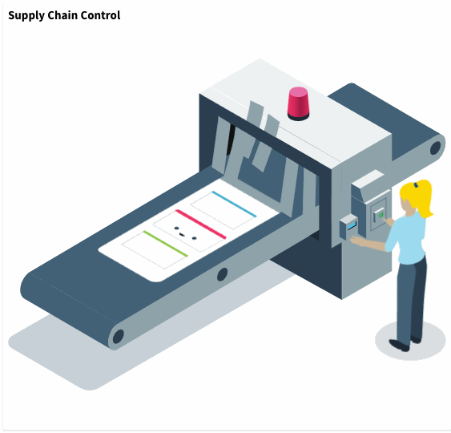
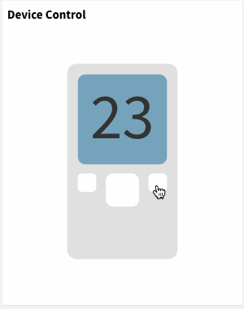

# DASHBOARDS

Thinger.io dashboard system is a feature that allows creating nice data representation interfaces within minutes in a very simple way. No coding is required, just selecting different widgets from a list and using drag\&drop technology to configure the layout of the dashboard, then using the configuration forms it is possible to set the data sources, sampling interval, and other behaviors of each widget. The main types of these widgets are:&#x20;

* **Real-time** data representation
* **Historical** data representation from buckets&#x20;
* **Control** device functions or change values with On/Off buttons or sliders

Here is an example dashboard with some widgets defined, like time series charts, donut charts, maps, or single values, but you can use many other ones


Once created, dashboards can be shared with third parties through a link or configured as templates to analyze data from different devices of the same type. In the following sections, we will explain how to create awesome dashboards in a few and very easy steps. Are you ready to create your own dashboard?

## Create a Dashboard

To manage all your dashboards, it is necessary to access to the `Dashboards` section, by clicking in the following menu item:


Then click on the `Add Dashboard` button that will open a new interface for entering the dashboard details, like in the following screenshot:


It is necessary to configure different parameters:

* **Dashboard Id**: Unique identifier for your dashboard.&#x20;
* **Dashboard name**: A representative name of your dashboard, in a more friendly way than its identifier.
* **Dashboard description**: Fill here any description or detailed information you need to keep about the dashboard.

Clicking again on the "Add Dashboard" button, the new dashboard will be added to the account, and the browser will be automatically redirected to the empty board in order to start adding widgets as explained in the sections below.

## Edit Dashboard

By default, the dashboard appears empty and in view mode, so it is not possible to make modifications, so, to start working, the first step will be switching on the button on the upper-right corner of the dashboard that will change to the edition mode.

.png>)

The dashboard edition mode allows moving, or resizing existing widgets, but also enables different options using the left-side buttons such as:

* **Add Widgets**:  To create new elements from the list. There are two different widget types depending on their objective: **Display widgets** allow to show real-time data from devices or historical data from buckets, and **Control Widgets** allows to connect the dashboard with devices functionalities in order to control them in real-time.&#x20;
* **Add Tab**: This button allows to create an additional dashboard tab that will appear associated to the original one in order to provide simple navigation over related boards.&#x20;
* **Settings**: There are multiple parameters that can be configured in order to set the dashboard behavior, such as the number of columns, the background image or the sharing options. &#x20;

These three options have been explained in more detail in the sections below.

## Display Widgets

When the edit mode is enabled in the dashboard, a new button called `Add Widget` will appear. Clicking on it will show a popup where it is possible to select the widget type to add in the dashboard. There are different widgets both for displaying information, or control connected devices, just like in the following picture:


The following subsections describe the different parameters for each widget type.

### Time Series Chart

A time-series chart is a graph that can display values over time. In this sense, this is quite useful when it is required to display time-series data, like temperature variable that changes over time. It is possible to plot a single variable or multiple values in the same chart. The initial configuration of this widget is like shown in the following figure:


The configurable parameters are the following:


* **Title**: Optional title for the widget.&#x20;
* **Subtitle**: Optional subtitle for the widget.
* **Background**: Optional color for the widget background (defaults to white).
* **Chart Input**: Configure how to feed the values to the time series chart. It is possible to feed the information from a connected **device** or from a **data bucket**
  *   **From Device**: With this option it is necessary to select a device (that must be connected to provide information) and specify the resources to plot. The following figure is an example that is selecting the device `deviceA`, and the resource `millis` from the device. Notice that when a time series widget is feed from a device, it will not keep the information if the dashboard is closed or refreshed, as it is just real-time data from your device to your dashboard. You can also select between different refresh modes, like sampling at different intervals (that can be updated online), or the chart is updated by the device.


  * **From Data Bucket**: With this option, the widget will take the information from a given bucket to plot the historic information on it. So, it is necessary to just select the bucket identifier created in your account. If the bucket is composed by multiple variables, it will allow selecting the variables to plot, like in the following picture. When the information is selected from the data bucket, you will require to establish a data timeframe to be displayed, that can be relative to the current time, or an absolute period between two dates.


* **Options**: It is possible to configure some graph features like splines, legends, axis, etc.
* **Chart Color**: Both on data selected from a device or from a data bucket, it is possible to configure series colors, depending on the information available in the resource, it will show only one configurable color, or a color for each series, like in the previous screenshot.


* **Data Aggregation**:&#x20;

Show raw data directly from a Bucket could be tricky when there is a lot of data-points, specially if the measures are very noisy or irregular. This feature allows aggregating data using different statistics such as medians, means, minimum and maximum values, a counter of data points per period and a data sumatory. The aggregation can be applied over different intervals that goes from five minutes to one week, by using the next configuration inputs in the widget form, and also using the upside right parameters on each time series chart widgets.


The next image shows four different representations of the same dataset and time interval, aggregated using different algorithms: &#x20;

.png>)


Note that Data Aggregation system is only available in **private server** instances with **InfluxDB**&#x20;


### Tachometer Chart

It is a quite visual widget that allows showing device data in a traditional "dial gauge" representation, that can be customized with different value ranges and color marcs, making it more accurate or simplifying the simpection with just a glance.


The configurable parameters are the following:

.png>)

* **Title**: Optional title for the widget.&#x20;
* **Subtitle**: Optional subtitle for the widget.
* **Background**: Optional color for the widget background (defaults to white). This widget has a particularity behavior in relation to this parameter. Pressing into the green "+" button, It is possible to select different background colors depending on the real time value that is being shown:&#x20;

.png>)

This image is representing an example in which the measured variable is reaching dangerous pressure values. According to this situation, the background color is changing to red, so it will be easier to identify and manage the event if there is not any automatic system in the product. &#x20;

 (1).png>)

* **Chart Input**: Configure how to feed the values to the tachometer chart. It is possible to feed the information from a connected **device** or from a **data bucket**
  * **From Device Resource**: With this option it is necessary to select a device (that must be connected to provide information) and specify the resources to plot. The following figure is an example that is selecting the device `deviceA`, and the resource `millis` from the device. Notice that when a time series widget is feed from a device, it will not keep the information if the dashboard is closed or refreshed, as it is just real-time data from your device to your dashboard. You can also select between different refresh modes, like sampling at different intervals (that can be updated online), or the chart is updated by the device.
  * **From Device Property:** This option allows retrieving data from device properties, which is really useful to show device configuration data, but also is the better way to show real time (or last received) data from HTTP devices.&#x20;
  * **From Data Bucket**: With this option, the widget will take the information from a given bucket to plot the historic information on it. So, it is necessary to just select the bucket identifier created in your account. If the bucket is composed by multiple variables, it will allow selecting the variables to plot, like in the following picture. When the information is selected from the data bucket, you will require to establish a data timeframe to be displayed, that can be relative to the current time, or an absolute period between two dates.
  * **Manual Data**: It is always possible to manually introduce values in order to create simulate the behavior of the widget.

The last tab shows all the display options. This is probably the most customizable widget of Thinger.io Platform. It allows selecting a lot of different parameters as shown in the image below:&#x20;

.png>)

* **Display options:**
  * **Units**: Optional information that will display the variable unit, like ºC.
  * **Value Ranges**: This parameter configures the total data range that will be shown at the chart, and also allows adding sub-ranges that can be configured with different colors in order to simplify the visual checking.
  * **Plate Color**: Configure the background plate color.
  * **Text Color**: Configure the text color.
  * **Tick Color**: Configure the division ticks color.&#x20;
  * **Major Ticks**: Allows to configure the range of each tick
  * **Show Value**: To display or hide the numeric representation of the value in a digital textbox.

### Virtual LED

Using LED spots is a common way  to create simple graphical interfaces in electronic projects in order to represent system status, alerts, etc. This widget has been included in Thinger.io Platform with the same purpose, so it can be used to show binary status by changing its color, create alerts by setting blink behavior or show multiple data by including more than one color range in a kind of RGB simulation.&#x20;

.png>)

This widget can be configured in many different ways though the three steps form. first of all selecting "Led indicator" in the Widget menu tab, and then indicating:

* **Title**: Optional title for the widget.&#x20;
* **Subtitle**: Optional subtitle for the widget.
* **Background**: Optional color for the widget background (defaults to white). This widget has a particularity behavior in relation to this parameter. Pressing into the green "+" button, It is possible to select different background colors depending on the real time value that is being shown:&#x20;

Then, the Led indicator menu tab allows selecting the data source, that can be a connected device or a data bucket:

* **Chart Input**: Configure how to feed the values to the tachometer chart. It is possible to feed the information from a connected **device** or from a **data bucket**
  * **From Device Resource**: With this option it is necessary to select a device (that must be connected to provide information) and specify the resources to plot. The following figure is an example that is selecting the device `deviceA`, and the resource `millis` from the device. Notice that when a time series widget is feed from a device, it will not keep the information if the dashboard is closed or refreshed, as it is just real-time data from your device to your dashboard. You can also select between different refresh modes, like sampling at different intervals (that can be updated online), or the chart is updated by the device.
  * **From Device Property:** This option allows retrieving data from device properties, which is really useful to show device configuration data, but also is the better way to show real time (or last received) data from HTTP devices.&#x20;
  * **From Data Bucket**: With this option, the widget will take the information from a given bucket to plot the historic information on it. So, it is necessary to just select the bucket identifier created in your account. If the bucket is composed by multiple variables, it will allow selecting the variables to plot, like in the following picture. When the information is selected from the data bucket, you will require to establish a data timeframe to be displayed, that can be relative to the current time, or an absolute period between two dates.
  * **Manual Data**: It is always possible to manually introduce values in order to create simulate the behavior of the widget.

Finally, the "Display Options" tab allows to custom the led behavior in the next parameters:

* **Led Size**: Configure the diameter of the led spot pixels
* **Color**: configures the led default color, and also allows creating color ranges by pressing the green "+" button on the right side.
  * **Color ranges**: Each time that the "+" button is pressed, a new color range is included, allowing to define a new range and the color that will be shown when the selected input value belongs to this range. &#x20;
  * **Blinking led option:** The right side switches allows adding a blinking behavior to the led when this range profile begins active. It is also possible to disable the blinking by pressing over the led widget.&#x20;

 (1).png>)

### Donut Chart

A donut chart is a graph that can display a value, normally in form of a rounded percentage. In this sense, this is quite useful when you have a know variable that oscillates between a maximum and minimum value. In this case, it is only possible to only represent a single variable, that can be both updated in real-time from a device, or from a data bucket.


The configurable parameters are the following:


* **Title**: Optional title for the widget.&#x20;
* **Subtitle**: Optional subtitle for the widget.
* **Background**: Optional color for the widget background (defaults to white).
* **Donut Value**: Configure how to feed the donut char value. It is possible to feed the information from a connected **device** or from a **data bucket**, in a similar way as the time series chart.
* **Units**: Optional information that will display the variable unit, like ºC.
* **Min Value**: The expected minimum value of the variable.
* **Max Value**: The expected maximum value of the variable.
* **Donut Color**: The color to display inside the donut.

### Progressbar

A progressbar is a graph that can easily represent a progress on some action or process. In this sense, this is quite useful when you have any process that is being completed over time and needs to be monitored. In this case, it is only possible to only represent a single variable, that can be both updated in real-time from a device, or from a data bucket.


The configurable parameters are the following:


* **Title**: Optional title for the widget.&#x20;
* **Subtitle**: Optional subtitle for the widget.
* **Background**: Optional color for the widget background (defaults to white).
* **Progressbar Value**: Configure how to feed the progressbar value. It is possible to feed the information from a connected **device** or from a **data bucket**, in a similar way as the time series chart.
* **Units**: Optional information that will display the variable unit, like %.
* **Min Value**: The expected minimum value of the variable.
* **Max Value**: The expected maximum value of the variable.

### Google Maps

A map can be used to represent, at this moment, a single location in a map. It is quite convenient to track devices in real-time as the chart can be feed in real-time from a connected device, like over a GPRS connection. It is also possible to plot locations from a data bucket, so devices like Sigfox can be also be tracked.


Here is an example of this widget working in real-time with a connected device:

&#x20;\[!\[Real-Time GPS location over GPRS using IoT Solution]\(https://img.youtube.com/vi/3QDDOPMg22g/0.jpg)]\(https://www.youtube.com/watch?v=3QDDOPMg22g)

The configurable parameters are the following:


* **Title**: Optional title for the widget.&#x20;
* **Subtitle**: Optional subtitle for the widget.
* **Background**: Optional color for the widget background (defaults to white).
* **Location**: Configure how to feed the location in the map. It is possible to feed the information from a connected **device** or from a **data bucket**. When feeding the plot from a data bucket or a device, it is required to match the required latitude and longitude (in degrees) with the variables present in the bucket, or in the device resource.


* **Center**: Force the map to automatically keep the location in the center.

### Image/MJPEG

The image/MJPEG widget can be used to represent both a still image, like your business logo, or a live stream from a MJPEG source, like a surveillance camera. To feed this widget it is necessary the image/MJPEG url.


The configurable parameters are the following:


* **Title**: Optional title for the widget.&#x20;
* **Subtitle**: Optional subtitle for the widget.
* **Background**: Optional color for the widget background (defaults to white).
*   **Image Source**: Configure if the image source is a still image, or a MJPEG stream. In both cases it is required to provide the source URL, like in the following screenshot:


### Text/Value

The text/value widget is an useful widget to display any arbitrary data, specially text values that cannot be represented with other widgets. As any other widget, can display data both from connected devices or data buckets.


The configurable parameters are the following:


* **Title**: Optional title for the widget.&#x20;
* **Subtitle**: Optional subtitle for the widget.
* **Background**: Optional color for the widget background (defaults to white).
* **Text Value**: As any other widget, it is possible to select a resource from a connected device, or a value from a data bucket.
* **Units**: Optional information to display the units of the displayed information.
* **Text Color**: Configure the text color.

### Clock

This widget is just a clock widget that can display the current time both in the local time zone or in UTC, which can be useful when monitoring processes in real-time. Note that this widget takes the current time just from your computer.


The configurable parameters are the following:


* **Title**: Optional title for the widget.&#x20;
* **Subtitle**: Optional subtitle for the widget.
* **Background**: Optional color for the widget background (defaults to white).
* **Color**: Color for the text.
* **UTC**: Display the clock in UTC or in the local timezone.

### HTML Widget&#x20;

This widget allows creating custom data representation interfaces by programming it with standard web source code languages such as HTML, CSS, JS. Being also able to represent data from Thinger.io devices or data buckets or show data from third party sources into the same dashboard.&#x20;

To start using the HTML widget, first step is configure the common Thinger.io widget parameters, such as:

* **Title**: Optional title for the widget.&#x20;
* **Subtitle**: Optional subtitle for the widget.
* **Background**: Optional color for the widget background (defaults to white).

Then, selecting HTML widget type, it is possible to introduce the data source, that can be a manual value, a [**Device Resource**](https://docs.thinger.io/coding#adding-resources)**,** a Device Property, or a [**Data Bucket**](buckets.md). And finally, it is possible to define custom HTML code to be displayed.

#### From Code Snippet

To create a basic widget with a simple code such as a data table, a ready-to-paste script from any website, or any other easy integration. The source code can be wrote using the small text editor in the widget form. Note that this code will be executed in the browser as a part of an AngularJS directive, where some scope has been already defined and initialized. In particular:

* `ts`: Timestamp of the data.
* `value`: Value with the selected value in the configuration, i.e., a device property, bucket data, or real-time data from a device.

Those values can be used in the HTML content with the AngularJS two-way data binding using double brackets, i.e., using `{{ts}}` or `{{value}}.` The property's data is displayed on the view, and at the same time, the property will be updated when there is any change.



Example hello world displaying timestamp, timestamp formatted as a date, and the selected value.

 (1).png>)

The widget code is the following:

```html
<h1>Hello World!</h1>
<p>Ts: {{ts}}</p>
<p>Date: {{ts | date:'medium'}}</p>
<p>Value: {{value}}</p>
```



Using the HTML Time Series widget, it is possible to plot information in a given timespan, i.e., latest values from a data bucket. The following example represents an HTML widget holding a list of values from bucket:

 (1) (1).png>)

The code to represent this table is like the following:&#x20;

```html
<div style="width=100%; height:100%; overflow-y:scroll">
    <table class="table table-striped">
      <thead>
        <tr>
          <th>Time</th>
          <th>Inst Water Flow</th>
          <th>Inst Water Flow (l)</th>
        </tr>
      </thead>
      <tbody>
        <tr ng-repeat="entry in value">
            <td>{{entry.ts | date:'medium'}}</td>
           <td>{{entry.inst_waterFlow}}</td>
           <td>{{entry.inst_waterFlow_liter}}</td>
        </tr>
      </tbody>
    </table>
</div>
```


Note that this code is using ``ng-repeat from AngularJS to iterate over all entries available in the `value` variable.``




It is possible to insert any other code snippet, i.e., those offered by third party services, i.e., weather predictions, banners, etc.


.png>)

Next script can be used as example to create an HTML widget with another weather forecast provider:

```
<div id="c_c1374694634f9f99525990d7fe6508ae" class="ancho"></div><script type="text/javascript" src="https://www.eltiempo.es/widget/widget_loader/c1374694634f9f99525990d7fe6508ae"></script>
```


Will result on a widget with the following forecast information.


.png>)



#### From File Storage

For more complex developments over the HTML Widget where several source code files are required, it is possible to use the [**File Storage**](https://docs.thinger.io/console/file-system) feature. This allows the development of more complex interfaces that exploit all the representation capabilities of the browser such as 3D object representation, animated widgets, etc. Moreover, widgets from File Storages can be shared between multiple dashboards is required, so, it is much more maintainable in the long term.&#x20;

It is possible to point the widget to a HTML file inside a file storage by selecting the `File Storage` from `HTML Source` option and then typing the file name.&#x20;

The most interesting option is to create a custom AngularJS directive for custom widgets, as it allows to isolate the widget scope, define custom functions, react to changes, and in general, it is possible to interact more easily with the Thinger.io API via dependency injection.&#x20;

#### AngularJS Directive Example: Hello World

Similar to the Basic Code Snippet example, in this example it is created a simple directive that will display basic information captured in the widget, i.e., the timestamp, the value, and the source configuration. For working with this example it is required to:

* Create a new `File Storage` to store your widgets.


Set public read access to the storage so the widgets can be retrieved when sharing your dashboard via Projects or shared links.


* Create two files named `htmlWidget.js`, and `htmlWidget.html` inside the storage. The Javascript file is the place where you will set your widget code and logic. In the other side, the HTML widget will hold your widget view.
* Initialize the code of both files from the following code:



```javascript
angular.module('helloWidget', [])
.directive('helloWidget', function () {
    return {
        restrict: 'EA',
        scope: {
            source : "=",
            ts:      "=",
            value:   "="
        },
        templateUrl: function(){
            let url = document.querySelector("script[src*='helloWidget.js']");
            return url.src.replace('.js','.html');
        },
        controller: ["$scope", function($scope){
            console.log("controller initialized! scope is", $scope);
            
            // listeners for process source changes (if required)
            $scope.$watch('source', function(newVal, oldVal) {
                console.log("Source has changed:", newVal, oldVal);
            });
            
            // listeners for process value changes (if required)
            $scope.$watch('value', function(newVal, oldVal) {
                console.log("Value has changed:", newVal, oldVal);
            });
            
        }]
    }
});
```



```html
<div>
    <h3>Hello World from AngularJS directive!</h3>
    <p><strong>Source</strong> is {{source}}</p>
    <p><strong>Timestamp</strong> is: {{ts}}</p>
    <p><strong>Value</strong> is: {{value}}</p>
</div>
```



* Create a new widget pointing to to the `helloWidget.js` file. Note that we are loading the file with the `.js` extension, that will load the counterpart `.html` file as specified in `templateUrl` function.&#x20;

 (1) (1).png>)

* Now it will be displayed a similar widget to the Basic Code Snippet example. However, there are many differences from basic example, as now we have Javascript file where we can add more values to the scope, process incoming value changes, detect source changes, and more interesting, we can inject dependencies to other Thinger.io console components, like UI widgets, or API methods to update configurations, call devices, etc.

 (1) (1).png>)


Ensure your widgets use a `camelCase` name for file names.&#x20;


#### Angular JS Directive Example: React to Value Changes

In this example it is created an advanced widget that will display an animation every time the source value is updated, i.e., when it is streamed by the device, it is updated inside a single property, or created a new entry in a bucket. &#x20;



The complex part here is to create a SVG and the corresponding CSS animations. The AngularJS directive just listen for value changes to trigger the animation.



```javascript
angular.module('supplyChainWidget', [])
.directive('supplyChainWidget', function () {
    return {
        restrict: 'EA',
        scope: {
            source : "=",
            value:   "=",
            ts:      "="
        },
        templateUrl: function(){
            let url = document.querySelector("script[src*='supplyChainWidget.js']");
            return url.src.replace('.js','.html');
        },
        controller: ["$scope", "DeviceProperty", function($scope, DeviceProperty){
            function animate(){
                var animElement = document.getElementById('Sprint_Card');
                var ribbonOne = document.getElementById('Ribbon_1');
                var ribbonTwo = document.getElementById('Ribbon_2');
                
                animElement.setAttribute('class', 'active');
                ribbonOne.setAttribute('class', 'active');
                ribbonTwo.setAttribute('class', 'active');
                
                var ribbonClear = setTimeout(function(){
                  animElement.setAttribute('class', '');
                  ribbonOne.setAttribute('class', '');
                  ribbonTwo.setAttribute('class', '');
                },1500);
            }
            
            $scope.$watch('value', function(newValue, oldValue) {
                animate();
            });
        }]
    };
});
```



```html
<style>
.box {
    width: 100%;
    height: 100%;
    display: flex;
    align-items: center;
    justify-content: center;
}

svg {
  margin: 5rem auto;
  display: block;
  width: 800px;
  height: auto;
  overflow: hidden;
  max-width: 100%;
  
}

#Sprint_Card {
  transform: translate(485px, 99px);
  transition: transform 1s ease-in-out;
}
#Sprint_Card.active {
  transform: translate(6px, 383px);
}

#Ribbon_1,
#Ribbon_2 {
  transition: transform 300ms ease-in-out;
  transform-origin: right top;
}

#Ribbon_1.active,
#Ribbon_2.active {
  transform: rotate(5deg);
}
</style>
<div class="box">
  <svg xmlns="http://www.w3.org/2000/svg" width="997" height="758" viewBox="0 0 997 758">
  <defs>
    <linearGradient id="linearGradient-1" x1=".094%" x2="99.957%" y1="49.745%" y2="49.745%">
      <stop stop-color="#ED3065" offset="2.993%"/>
      <stop stop-color="#E52E62" offset="15.54%"/>
      <stop stop-color="#D62A5B" offset="28.65%"/>
      <stop stop-color="#C02352" offset="41.98%"/>
      <stop stop-color="#A51D46" offset="54.7%"/>
      <stop stop-color="#A91E48" offset="65.69%"/>
      <stop stop-color="#B5214D" offset="77.18%"/>
      <stop stop-color="#CB2656" offset="88.86%"/>
      <stop stop-color="#ED3065" offset="100%"/>
    </linearGradient>
  </defs>
  <g id="Page-1" fill="none" fill-rule="evenodd">
    <g id="Conveyer-Belt">
      <g id="Spint_Machine" transform="translate(-2)">
        <g id="Conveyor_Belt" transform="translate(0 55.046)">
          <g id="Group" fill="#426076" opacity=".3">
            <path id="Shape" d="M847.707 328.135L208.563 697.248c-12.844 7.34-28.746 7.34-41.59 0l-156.575-90.52c-10.704-6.116-10.704-21.713 0-27.83l637.92-366.36c11.315-6.728 25.382-6.728 37.003-.306l162.08 91.132c9.48 5.505 9.79 19.266.31 24.77z"/>
          </g>
          <polygon id="sprint_machine_bottom_panel_2_" fill="#2C3F51" points="761.774 496.636 437.003 316.208 437.003 25.994 761.774 258.716"/>
          <polygon id="Shape" fill="#426076" points="989.297 120.795 790.214 3.976 762.08 17.125 975.535 125.688"/>
          <g id="Group" fill="#426076">
            <path id="Shape" d="M56.27 434.557L777.37 7.645c2.447-1.53 4.893-2.14 7.034-2.14 5.81 0 9.786 6.116 9.786 15.29.306 14.373-8.563 32.11-19.266 38.532l-675.84 400-42.815-24.77z"/>
            <path id="Shape" d="M784.404 8.563c4.893 0 6.422 6.422 6.422 12.232.306 13.456-7.95 29.664-17.737 35.474L99.08 455.35l-36.392-21.1L778.9 10.09c1.834-.918 3.975-1.53 5.504-1.53zm0-6.422c-2.752 0-5.505.92-8.563 2.76L51.07 433.95c-.305.303-.917.61-1.223.61L99.083 463l677.37-400.92c11.62-7.034 21.1-25.383 20.795-41.285 0-11.926-5.505-18.654-12.844-18.654z"/>
          </g>
          <path id="Shape" fill="#426076" d="M36.697 491.743v.612l201.224 117.43 13.46-58.715-152.29-88.38-49.54-28.44s-.3 0-.3.307c-11.01 7.645-19.873 25.076-19.57 40.367.308 8.257 3.06 14.067 7.03 16.82z"/>
          <g id="Group" fill="#8FA4AA">
            <path id="Shape" d="M243.12 609.48c-6.73 0-11.01-6.728-11.316-16.82-.305-15.29 8.87-33.027 20.184-39.755l724.77-429.052c2.753-1.53 5.2-2.446 7.646-2.446 6.728 0 11.01 6.728 11.315 16.82.3 15.29-8.87 33.027-20.19 39.755L250.76 607.034c-2.446 1.53-5.2 2.446-7.645 2.446z"/>
            <path id="Shape" d="M984.404 123.242c5.81 0 9.48 6.116 9.48 15.29.306 14.373-8.563 31.804-19.266 38.226L250.153 605.505c-2.447 1.53-4.893 2.14-6.728 2.14-5.81 0-9.48-6.116-9.48-15.29-.306-14.373 8.563-31.804 19.266-38.226l724.78-429.06c2.14-1.23 4.59-1.84 6.43-1.84zm0-3.67c-2.752 0-5.505.917-8.563 2.752L251.07 551.376c-11.926 7.034-21.1 25.383-21.1 41.285 0 11.62 5.504 18.66 13.15 18.66 2.752 0 5.504-.91 8.562-2.75l724.77-429.05c11.927-7.03 21.102-25.38 21.102-41.28 0-11.62-5.505-18.65-13.15-18.65z"/>
          </g>
          <path id="Shape" fill="#2C3F51" d="M240.367 587.768c0 7.95 5.81 11.315 12.844 7.033 7.04-4.28 12.54-14.06 12.54-22.32 0-7.95-5.81-11.31-12.84-7.03s-12.54 14.07-12.54 22.33zm722.02-429.664c0 7.645 5.503 10.703 12.23 6.728 6.73-3.976 11.928-13.456 11.928-21.1 0-7.646-5.505-10.704-12.233-6.73-6.728 3.67-12.232 13.15-11.926 21.102zm-484.71 287.768c0 7.645 5.504 10.703 12.23 6.727 6.73-3.98 11.928-13.46 11.928-21.1 0-7.65-5.505-10.71-12.232-6.73-6.728 3.97-11.927 13.45-11.927 21.1z"/>
          <path id="Shape" fill="#8FA4AA" d="M984.404 123.242c5.81 0 9.48 6.116 9.48 15.29.306 14.373-8.563 31.804-19.266 38.226L250.153 605.505c-2.447 1.53-4.893 2.14-6.728 2.14-5.81 0-9.48-6.116-9.48-15.29-.306-14.373 8.563-31.804 19.266-38.226l724.78-429.06c2.14-1.23 4.59-1.84 6.43-1.84zm0-3.67c-2.752 0-5.505.917-8.563 2.752L251.07 551.376c-11.926 7.034-21.1 25.383-21.1 41.285 0 11.62 5.504 18.66 13.15 18.66 2.752 0 5.504-.91 8.562-2.75l724.77-429.05c11.927-7.03 21.102-25.38 21.102-41.28 0-11.62-5.505-18.65-13.15-18.65z"/>
          <polygon id="Shape" fill="#426076" points="49.541 434.251 251.07 551.376 983.792 117.431 777.37 3.976"/>
          <polygon id="Shape" points="49.541 434.862 251.376 551.682 300 522.936 98.165 406.116"/>
          <polygon id="Shape" points="198.165 346.789 400 463.609 448.93 434.557 247.095 318.043"/>
          <polygon id="Shape" points="348.318 259.327 548.93 375.229 597.859 346.177 397.554 230.887"/>
          <polygon id="Shape" points="496.636 170.642 698.471 287.156 747.095 258.41 545.26 141.896"/>
        </g>
        <g id="Sprint_Card" transform="translate(485 98)">
          <path id="Shape" fill="#FFFFFF" d="M148.012 243.12L416.514 88.072l-137.31-78.9L6.73 166.668c-5.505 3.364-5.505 7.34 0 10.397l114.68 66.055c6.115 3.363 20.794 3.363 26.604 0z"/>
          <path id="Shape" fill="#8FA4AA" d="M416.514 88.073l10.703-6.116c5.505-3.364 5.505-7.033 0-10.397L312.537 5.505c-6.115-3.364-20.794-3.364-26.91 0l-6.422 3.67 137.31 78.898z"/>
          <path id="Shape" fill="#D6DFDF" d="M263.914 40.98l95.413 55.044-49.235 28.44L214.68 69.42l49.234-28.44zm0-2.754l-53.822 30.887 100 57.798 53.822-30.88-100-57.8z"/>
          <polygon id="Shape" fill="#3BABC8" points="360.245 98.165 365.138 95.413 264.832 37.615 260.245 40.367"/>
          <path id="Shape" fill="#D6DFDF" d="M107.34 131.5l95.412 55.044-48.624 28.135-95.412-55.05 48.624-28.13zm0-2.754l-53.212 30.58 100 57.8 53.212-30.582-100-57.798z"/>
          <g id="Sprinty_on_Card_2_">
            <g id="Group">
              <path id="Shape" fill="#FFFFFF" d="M237.003 176.453c-1.53 0-2.752-.306-3.975-.918l-103.976-59.94c-.917-.61-1.53-1.222-1.53-2.14 0-.61.613-1.223 1.224-1.528l51.682-29.664 111.01 64.22-50.46 29.052c-.917.612-2.446.918-3.975.918z"/>
              <path id="Shape" fill="#D6DFDF" d="M180.428 83.792l108.87 62.69-48.625 28.136c-.918.61-2.14.917-3.364.917-1.23 0-2.45-.306-3.37-.61l-103.98-59.94c-.92-.612-.92-.918-.92-.918l.61-.61 50.76-29.665zm0-2.752l-51.988 29.97c-2.446 1.528-2.446 3.975.306 5.504l103.976 59.94c1.223.61 2.752.916 4.28.916 1.53 0 3.365-.306 4.588-1.223l51.988-29.97-113.15-65.137z"/>
            </g>
            <path id="Shape" fill="#ED3065" d="M293.272 146.79l-2.446 1.528L177.37 82.875l2.447-1.53c2.446-1.528 6.422-1.528 8.868 0l104.28 60.245c2.754 1.53 2.754 3.67.307 5.2z"/>
            <g id="Group">
              <path id="Shape" fill="#2C3F51" d="M225.688 143.425c-2.14-1.223-5.81-1.223-7.95 0-2.142 1.223-2.142 3.364 0 4.587 2.14 1.224 5.81 1.224 7.95 0 2.14-1.223 2.14-3.058 0-4.587zm-40.06-18.35c-2.14 1.225-5.81 1.225-7.95 0-2.143-1.222-2.143-3.362 0-4.586 2.14-1.23 5.81-1.23 7.95 0 2.14 1.22 2.14 3.36 0 4.58z"/>
              <path id="Shape" fill="#0B161D" d="M188.685 133.028s-3.364 3.058 2.14 6.116c5.2 3.058 11.01 1.53 11.01 1.53"/>
            </g>
          </g>
          <polygon id="Shape" fill="#8AC641" points="203.976 188.379 208.869 185.627 108.869 127.829 103.976 130.581"/>
        </g>
        <g id="Convertor" transform="translate(436.25)">
          <polygon id="Shape" fill="#101010" points="58.245 140.979 58.245 225.994 273.535 101.835 273.535 270.031"/>
          <polygon id="Shape" fill="#1D2934" points="273.535 392.355 252.434 404.893 273.535 417.737"/>
          <polygon id="Shape" fill="#8FA4AA" points="439.285 485.933 325.523 551.682 325.523 238.838 439.285 173.089"/>
          <polygon id="Shape" fill="#EEF2F2" points="325.523 238.838 301.364 254.129 .752 81.04 25.217 65.443"/>
          <polygon id="Shape" fill="#8FA4AA" points="326.135 419.878 301.364 434.251 301.364 254.74 325.523 238.838"/>
          <polygon id="Shape" fill="#EEF2F2" points="439.285 173.089 325.523 238.838 25.217 65.443 138.979 0"/>
          <g id="Ribbons" fill="#8FA4AA" transform="translate(28.58 131.5)">
            <polygon id="Shape" points="207.034 242.202 234.862 259.939 238.226 135.168 210.398 118.349"/>
            <path id="Shape" d="M168.807 111.01L154.434 215.9l27.523 17.737 14.373-106.73 1.835-15.595-27.83-16.82c0 5.505-.61 11.01-1.528 16.514zM14.985 12.844L.612 117.737l27.523 17.737L42.508 28.746c.61-3.67.917-7.34 1.223-11.01L15.91.916c-.306 3.978-.61 7.954-.917 11.93zm31.805 58.41L28.134 139.45l27.523 17.737 18.96-70.03c3.975-14.986 6.728-30.582 8.257-45.873l-27.83-16.82c-1.528 15.903-4.28 31.5-8.256 46.79z"/>
            <path id="Ribbon_2" d="M123.547 120.49l-18.654 68.195 27.523 17.737 18.96-70.03c4.282-15.903 7.034-32.11 8.563-48.32l-27.83-16.818c-1.23 16.82-3.98 33.027-8.57 49.235z"/>
            <path id="Ribbon_1" d="M76.457 123.453l-11.422 41.322 31.924 13.53 12.52-48.122c6.28-23.9 10.18-48.37 11.72-73.087L89.51 44.85c-1.586 26.373-6.093 52.932-13.053 78.603z"/>
          </g>
          <polygon id="Shape" fill="#8FA4AA" points="380.875 411.927 436.532 379.817 436.532 302.141 380.875 334.251"/>
          <polygon id="Shape" stroke="#426076" stroke-width="1.142" points="426.135 374.924 426.135 319.266 391.272 339.144 391.272 394.801"/>
          <polygon id="Shape" fill="#426076" points="380.875 411.927 346.624 392.049 346.624 314.373 380.875 334.251"/>
          <polygon id="Shape" fill="#EEF2F2" points="436.532 302.141 380.875 334.251 346.624 314.373 401.976 282.263"/>
          <g id="Group" transform="translate(395.554 339.45)">
            <polygon id="Shape" fill="#EEF2F2" points="1.835 34.251 26.911 3.364 22.936 1.223 1.835 13.15"/>
            <polygon id="Shape" fill="#8FA4AA" points="6.116 36.697 26.911 24.465 26.911 3.364 6.116 15.596"/>
            <polygon id="Shape" fill="#426076" points="1.835 13.15 6.116 15.596 6.116 36.697 1.835 34.251"/>
          </g>
          <g id="Group" transform="translate(407.786 348.624)">
            <polygon id="Shape" fill="#369F48" points="10.703 2.752 1.529 14.985 1.529 17.125 10.703 11.927"/>
            <polygon id="Shape" fill="#4CBA74" points="8.869 3.67 1.529 7.951 1.529 14.985 8.869 10.703"/>
            <polygon id="Shape" fill="#2E8E44" points="10.703 11.927 8.869 10.703 8.869 3.67 10.703 2.752"/>
          </g>
          <polygon id="Shape" fill="#426076" points="376.288 331.499 346.624 314.373 346.624 286.544 366.807 298.165"/>
          <polygon id="Shape" fill="#8FA4AA" points="431.639 299.388 376.288 331.499 366.807 298.165 422.159 266.055"/>
          <polygon id="Shape" fill="#EEF2F2" points="366.807 298.165 346.624 286.544 401.976 254.434 422.159 266.055"/>
          <polygon id="Shape" fill="#8FA4AA" points="335.309 416.82 362.22 401.223 362.22 363.609 335.309 379.205"/>
          <polygon id="Shape" fill="#D6DFDF" points="361.303 363.609 334.697 379.205 319.101 370.336 345.707 354.74"/>
          <polygon id="Shape" fill="#111517" points="358.551 372.783 339.284 391.132 339.284 393.272 358.551 381.957"/>
          <polygon id="Shape" fill="#4BC1EA" points="356.716 373.7 339.284 383.792 339.284 391.132 356.716 380.734"/>
          <polygon id="Shape" fill="#111517" points="358.551 381.957 356.716 380.734 356.716 373.7 358.551 372.783"/>
          <polygon id="Shape" fill="#426076" points="320.018 370.336 335.309 379.205 335.309 416.82 320.018 407.951"/>
          <g id="Group">
            <path id="Shape" fill="#1D2934" d="M201.67 129.97v-8.87h5.81c.612-.305 1.223-.916 1.835-1.222 9.786-5.81 25.688-5.81 35.168-.306.612.306 1.223.917 1.835 1.53h5.2v8.867c0 3.67-2.448 7.34-7.34 10.09-9.787 5.81-25.69 5.81-35.17.3-4.892-3.06-7.338-6.73-7.338-10.4z"/>
            <path id="Shape" fill="url(#linearGradient-1)" d="M1.835 56.88l4.28-43.12H47.4l4.283 42.51v.61c0 3.67-2.447 7.34-7.34 10.092-9.785 5.81-25.688 5.81-35.168.306-4.893-3.058-7.34-6.728-7.34-10.397z" transform="translate(199.835 64.22)"/>
            <path id="Shape" fill="#E96FA9" d="M241.425 69.42c-7.95-4.588-21.1-4.588-29.358 0-8.256 4.586-8.256 12.23-.305 16.818 7.95 4.588 21.1 4.588 29.357 0 8.25-4.587 8.25-12.232.3-16.82z"/>
          </g>
        </g>
        <polygon id="Arch" fill="#2C3F51" points="737.615 254.74 437.309 81.346 437.309 260.551 466.361 241.59 470.337 126.911 480.734 132.722 494.801 141.284 494.801 141.284 508.869 149.847 519.878 156.269 547.707 173.089 556.881 178.593 598.165 203.364 626.3 220.184 637.309 226.911 658.716 239.755 665.444 243.425 676.453 250.153 704.587 266.973 709.786 270.336 709.786 417.737 737.615 434.251"/>
        <g id="Operator">
          <path id="Shape" fill="#2C3F51" d="M975.23 676.76c-31.805 18.347-83.18 18.04-114.985-.307-31.804-18.35-32.11-48.012-.306-66.36 31.8-18.35 83.18-18.044 114.98.305 31.8 18.348 32.11 48.012.3 66.36z" opacity=".17"/>
          <g id="Group">
            <path id="Shape" fill="#1D2934" d="M906.116 645.872l9.786 7.033c.306 8.87.612 13.15-2.752 15.597-3.975 3.058-11.315.917-15.596-.612l-1.224-3.364c-5.81-.61-4.28.306-10.09-2.752-7.035-3.67-15.903-8.87-17.432-15.29-.306-1.836.917-5.2 2.752-5.2l21.1 2.447 13.456 2.15z"/>
            <g id="Shape">
              <g fill="#CEB698">
                <path d="M885.016 374.006c-2.447-2.446-7.952-7.033-11.01-8.562-3.058-1.53-4.587-.918-6.422 0-1.835.917-4.28 4.28-3.975 6.727.3 2.45 2.14 5.82 3.67 7.96 1.52 2.14 6.11 4.28 8.25 4.59l7.03 1.23 6.11-6.115c-1.226-1.834-1.226-3.363-3.67-5.81z"/>
                <path d="M866.667 371.254c-7.95-4.893-11.315-7.95-13.15-5.81-.917 1.223 6.422 7.645 14.067 13.455l-.917-7.65z"/>
              </g>
              <path fill="#062642" d="M887.768 377.982c-3.67 0-7.34 3.975-8.563 9.174 6.422 4.587 12.233 9.174 18.35 14.373l6.115-13.46c-4.893-3.67-10.398-7.04-15.902-10.09z"/>
              <path fill="#1D2934" d="M932.722 625.382l10.092 7.95c0 9.482 0 14.07-3.67 16.515-4.28 3.058-11.927.612-16.514-1.53l-1.223-3.67c-4.28-.61-3.364.613-7.95-1.833-7.952-4.282-19.573-11.01-21.102-18.96-.306-2.14 1.223-5.505 3.058-5.2l22.936 3.976 14.37 2.752z"/>
              <path fill="#2C3F51" d="M950.765 441.896c.917 9.786 4.587 28.746 4.587 34.25-.918 29.36-5.81 53.518-7.34 82.876l-3.975 79.204c0 .612-.306 1.224-.612 1.53-2.752 1.53-11.315-.918-19.572-5.81-3.363-1.836-6.116-3.976-7.95-5.81-.918-.613-1.835-1.225-3.06-2.142l4.894-140.98 1.835-34.25 31.193-8.868z"/>
              <path fill="#426076" d="M922.936 459.022c.917 9.785 7.645 18.96 7.34 28.746-3.06 30.58-9.48 59.02-10.398 88.38l-2.447 77.98c0 .612-.3.918-.61 1.224-2.75 1.53-11.31-.918-19.57-5.81-7.95-4.588-12.23-9.48-10.4-11.01l.62-139.143 7.04-34.26 28.44-6.12z"/>
              <path fill="#EBF5F6" d="M906.728 352.905c-18.654 10.704-28.746 22.324-22.63 25.688 6.116 3.364 25.994-2.446 44.648-13.15 18.655-10.703 28.747-22.324 22.936-25.688-6.116-3.363-26.3 2.447-44.954 13.15z"/>
              <path fill="#EBF5F6" d="M948.93 369.113c.917-15.29-.918-29.358-11.62-27.523-11.01 1.835-32.723 18.35-44.65 24.465l17.738 5.81 38.532-2.752z"/>
              <path fill="#9DDBF0" d="M949.542 341.59c8.256 7.646.61 56.88 0 68.196-5.2 8.257-13.762 5.2-18.043-.306l-2.76-29.052c.92-18.96 15.59-41.284 20.79-38.838z"/>
              <path fill="#CEB698" d="M905.2 336.086c.61 4.587 4.586 14.984 0 26.3 10.397-2.14 21.406-9.48 24.464-13.762.306-2.752.917-5.81 1.53-8.87l-25.995-3.668z"/>
              <path fill="#9DDBF0" d="M896.33 363.914c-32.415 14.985-7.033 38.533-2.14 74.618.306 2.753-2.14 11.927-4.587 20.795-1.835 9.786 13.76 12.54 23.547 11.927 18.96-1.223 40.367-12.538 37.615-28.44-3.364-5.2-9.786-11.927-7.95-28.135 1.528-12.85 3.974-16.52 5.503-27.83 1.224-7.95 5.81-38.84-8.257-38.23-4.58 0-36.39 11.92-43.73 15.29z"/>
              <path fill="#CEB698" d="M900.918 296.636c-2.753 4.893-6.117 5.81-6.422 12.233 0 5.19-.306 33.33 8.868 39.44 3.364 2.14 11.62-2.75 16.82-7.04 3.67-3.06 2.14-8.56 3.67-10.706l-7.952-32.11-14.984-1.835z"/>
              <path fill="#FBD702" d="M938.838 290.52c12.538 8.868 12.844 25.076 5.505 37.615-3.364 6.116-4.282 7.95-9.786 10.703-2.447 1.223-6.422 3.976-10.398 3.976-4.9-.306-10.1-21.407-15.29-22.02-2.15-.305-3.98 2.448-3.37 10.705-3.37-7.96-6.42-10.4-11.32-17.13-8.57-25.38 32.41-39.76 44.64-23.86z"/>
              <path fill="#FBD702" d="M971.254 356.27c-13.15 7.95-21.1 13.15-27.83 6.115-13.454-13.455-16.512-49.847-7.644-66.972 1.223-2.447.917-3.364 0-2.752-2.14-.3-8.563-6.72-6.422-8.25 26.3-16.82 37.615.31 37.003 16.21-1.22 38.53-13.15 49.24 4.9 55.66z"/>
              <path fill="#144678" d="M930.887 283.486c-2.14.918-4.28 1.224-4.893 2.753-.917 2.75 1.223 7.64 3.364 9.48 1.53 1.22 5.505-1.23 7.034-3.06-3.364-.92-5.505-5.81-5.505-9.18z"/>
              <path fill="#CEB698" d="M914.373 352.294c-6.116 3.67-9.48 7.34-7.645 8.562 1.53 1.835 9.786 2.14 16.208-1.53 6.116-3.668 8.257-10.396 6.116-11.62-1.835-.917-8.562.918-14.68 4.588z"/>
            </g>
          </g>
          <g id="Group">
            <g id="Shape" fill="#CEB698">
              <path d="M825.688 418.35c-7.34-1.53-7.95-2.142-15.29-6.117-2.753-1.53-4.282-2.14-8.563-2.753-2.14-.306-17.125-6.116-19.572-1.53-.917 1.53 9.786 1.836 11.62 3.977 1.53 1.835-10.702-1.835-12.537-.612-2.447 1.53-1.223 3.058-.306 5.2 1.53 4.28 5.81 6.42 13.76 7.95 5.812.917 7.035 5.2 12.54 5.505 3.364 0 5.81-.612 9.48-.612l8.868.917.612-11.315h-.306l-.306-.61z"/>
              <path d="M817.737 415.29c-3.975 1.53-4.28 11.62-1.223 14.985l45.566 11.927c11.01 1.53 14.984-3.976 14.68-9.174-.307-5.2-4.283-11.01-15.292-11.315l-43.73-6.422z"/>
            </g>
            <path id="Shape" fill="#9DDBF0" d="M877.982 379.205c10.397-22.936 38.532-15.596 26.91 9.174-5.81 12.23-17.43 31.19-24.464 43.73-6.422 11.62-13.455 11.92-17.43 8.87-3.976-3.06-6.117-9.48 0-22.02 6.42-14.07 8.562-25.69 14.984-39.76z"/>
          </g>
        </g>
      </g>
    </g>
  </g>
</svg>
</div>

```



#### AngularJS Directive: Update Device Properties&#x20;

In this example it is created an advanced widget that will allow both display and configure device properties from the dashboard.

 (1) (1).png>)

This directive has been created with the following two files from a [File Storage](../file-system.md). The interesting part on this example is how it interacts with the API to update the property values. Internally, the console exposes different classes witch represents different resources on a user account, i.e., buckets, devices, properties, etc. In this example, it is used the `DeviceProperty` class, which takes two parameters: `device`and `property`, which can be obtained from the source parameter passed to the directive:

```javascript
$scope.api = new DeviceProperty({device: $scope.source.device_property.device, property: $scope.source.device_property.property});
```

This API initialization is done every time the source is changed, so, if a user changes the dashboard source device, i.e., with a Control Widget, the API points to the correct endpoint automatically. The rest of the code and HTML is just a standard form that calls the `$scope.save()`function when submitted.

The code is as the following, and it is expecting to be linked to a property with `a`, `b`, and `c` values. It can be modified as required for any other number of properties, structure, fields, etc.



```javascript
angular.module('devicePropertyWidget', [])
.directive('devicePropertyWidget', function () {
    return {
        restrict: 'EA',
        scope: {
            source : "=",
            value:   "=",
            ts:      "="
        },
        templateUrl: function(){
            let url = document.querySelector("script[src*='devicePropertyWidget.js']");
            return url.src.replace('.js','.html');
        },
        controller: ["$scope", "DeviceProperty", function($scope, DeviceProperty){
            console.log("controller initialized!", $scope);
            
            // if we require to listen for value changes...
            $scope.$watch('value', function(newValue, oldValue) {
                console.log("value has changed!", newValue, oldValue);
            });
            
            // watch for source changes to update our api endpoint
            $scope.$watch('source', function(newVal) {
                $scope.api = new DeviceProperty({device: $scope.source.device_property.device, property: $scope.source.device_property.property});
            });
            
            $scope.save = function(){
                // just call our api to patch values
                $scope.api.patch({value: $scope.value}).then(result => {
                   
                }).catch(error => {

                });
            };
        }]
    };
});
```



```html
<form class="form-validation m-t" ng-submit="save()">
    <fieldset ng-disabled="api.state==api.status.RUNNING || !api.allowed()">
    
        <div class="row wrapper-xs">
            <label class="col-sm-12"><strong>Value A</strong></label>
            <div class="col-sm-12">
                <input type="text" class="form-control" placeholder="Value A" ng-model="value.a" maxlength="255" required>
            </div>
        </div>
        
        <div class="row wrapper-xs">
            <label class="col-sm-12"><strong>Value B</strong></label>
            <div class="col-sm-12">
                <input type="number" class="form-control" placeholder="Value B" ng-model="value.b" min="0" max="100" required>
            </div>
        </div>
        
        <div class="row wrapper-xs">
            <label class="col-sm-12"><strong>Value C</strong></label>
            <div class="col-sm-12">
                <label class="i-switch bg-success m-t-xs">
                    <input type="checkbox" ng-model="value.c">
                    <i></i>
                </label>
            </div>
        </div>
    
        <div class="wrapper-xs">
            <div class="alert alert-danger alert-dismissible m-b-sm" ng-if="api.state===api.status.ERROR">
                <a href="" class="close" data-dismiss="alert" aria-label="close">&times;</a>
                <strong><i class="far fa-thumbs-down"></i> Ooops!</strong> Cannot process your request. Error {{api.code}} ({{api.message}})
            </div>
            <button class="btn btn-success btn-addon" type="submit" ><i><span ng-class="{'fa fa-check': api.state!=api.status.RUNNING, 'fa fa-spinner fa-pulse' : api.state==api.status.RUNNING}"></span></i>Update</button>
        </div>
        
    </fieldset>
</form>
```



#### AngularJS Directive Example: Call Device Resource&#x20;

In this example it is created an advanced widget that will allow sending custom data to the device, by using a custom layout. For example, it is simulating an air conditioner remote controller, with some basic functions like up, down, or on/off. The connected device has 3 resources, `increase`, which receives the amount of degrees to increase, i.e., +1 or -1; `onoff` resource that turn on and off the control; and `state` which it is automatically streamed by the device when there any changes on the temperature or the power state. The HTML widget is composed by an SVG remote controller with some buttons associated to directive functions.



The code from this example is quite similar to the Device Property update example. In this case, it is using another API called `DeviceResource`, which has `run` and `read` methods for interact with the device. Note that the directive code never executes (for this use case) the `read` method on the API, as the updates to the widget are directly handled by the HTML widget configuration, which is set to read the `state` resource with `Stream by Device` configuration.



```javascript
angular.module('deviceControlWidget', [])
.directive('deviceControlWidget', function () {
    return {
        restrict: 'EA',
        scope: {
            source : "=",
            value:   "=",
            ts:      "="
        },
        templateUrl: function(){
            let url = document.querySelector("script[src*='deviceControlWidget.js']");
            return url.src.replace('.js','.html');
        },
        controller: ["$scope", "DeviceResource" function($scope, DeviceResource){
            
            $scope.center = function(){
                console.log("center clicked");
                $scope.api.run('onoff').then(result => {
                    
                }).catch(error => {
                    
                });
            };
            
            $scope.left = function(){
                console.log("left clicked");
                $scope.api.run('increase', -1).then(result => {
                    
                }).catch(error => {
                    
                });
            };
            
            $scope.right = function(){
                console.log("right clicked");
                $scope.api.run('increase', 1).then(result => {
                    
                }).catch(error => {
                    
                });
            };
            
            $scope.$watch('source', function(newValue, oldValue) {
                $scope.api = new DeviceResource({device: $scope.source.device.id});

            });
        }]
    };
});
```



```html
<svg xml:space="preserve" viewBox="0 0 100 100" y="0" x="0" xmlns="http://www.w3.org/2000/svg" version="1.1" width="200px" height="200px" style="width:100%;height:100%;" >
    <path fill="#e0e0e0" d="M69.968 92.5H30.032a3.983 3.983 0 0 1-3.983-3.983V11.483c0-2.2 1.783-3.983 3.983-3.983h39.937c2.2 0 3.983 1.783 3.983 3.983v77.034c0 2.2-1.784 3.983-3.984 3.983z"></path>
    <path fill="#77a4bd" d="M66.136 51.265H33.864a3.219 3.219 0 0 1-3.219-3.219V15.383a3.219 3.219 0 0 1 3.219-3.219h32.273a3.219 3.219 0 0 1 3.219 3.219v32.663a3.22 3.22 0 0 1-3.22 3.219z"></path>
    <path ng-click="center()" fill="#fff" d="M53.966 69.696h-7.933a3.271 3.271 0 0 1-3.271-3.271v-7.933a3.271 3.271 0 0 1 3.271-3.271h7.933a3.271 3.271 0 0 1 3.271 3.271v7.933a3.27 3.27 0 0 1-3.271 3.271z" style="cursor:pointer" ></path>
    <path ng-click="left()" fill="#fff" d="M32.409 63.257h4.404a1.816 1.816 0 0 0 1.816-1.816v-4.404a1.816 1.816 0 0 0-1.816-1.816h-4.404a1.816 1.816 0 0 0-1.816 1.816v4.404c0 1.003.813 1.816 1.816 1.816z" style="cursor:pointer" ></path>
    <path ng-click="right()" fill="#fff" d="M67.539 63.257h-4.404a1.816 1.816 0 0 1-1.816-1.816v-4.404c0-1.003.813-1.816 1.816-1.816h4.404c1.003 0 1.816.813 1.816 1.816v4.404a1.816 1.816 0 0 1-1.816 1.816z" style="cursor:pointer" ></path>
    <text x="36" y="40" fill="#333" font-size="28px">{{value.temperature}}</text>
</svg>
```



## Control Widgets

Thinger.io has been provided with some widgets that allow controlling device functions, sending data or requests in real-time when the devices have been programmed with [**Input Resources**](https://docs.thinger.io/quick-sart/coding-guide#input-resources). This widgets can be also used to set the value of device properties, allowing also to set the response data that will be sent to Sigfox, HTTP, or Lora devices.

### On/Off State

The On/Off widget allows controlling a boolean state of a connected device, like turning on/off a light, a motor, a relay, or any other element. The device should expose a boolean input, just like those examples for controlling a led. The resource is then mapped to this widget, which can change the device state in real-time. If the input resource is defined properly [implemented](http://docs.thinger.io/arduino/#coding-adding-resources-input-resources), this widget is also able to show the current device state.

&#x20;&#x20;

The configurable parameters are the following:


* **Title**: Optional title for the widget.&#x20;
* **Subtitle**: Optional subtitle for the widget.
* **Background**: Optional color for the widget background (defaults to white).
* **Device Resource**: Determines the specific device and resource to control. Use a connected device for an easy config, as you can automatically select the device and resource.


This widget has the possibility to be shown on different appearances, that can be specified in the **Switch Style** menu:

* [x] **Switch** is the standard configuration with a little horizontal switch
* [x] **Button** which is an improved face that can be configured with different colors and icons
* [x] **Push button** it configurates the button to be automatically switched off when it is not being clicked. This option is perfect to implement toggle switches behavior on the devices.

Using Button or Push button configuration, it is possible to configure the next parameters:

.png>)

* **On Color**: The color that will be displayed when the boolean value of this resource is true.
* **Off Color**: The color that will be displayed when the boolean value of this resource is false.
* **Icon**: This button is able to show a customizable icon from a favicon library or any other icon library URL.
*   **Icon Color**: Icon color is also configurable with a hexadecimal value. Note that there are different color options for both button status, so you can customize it as you want.


.png>)

### Slider

The slider widget allows controlling a numeric state of a connected device, like setting a threshold, a target temperature, or any other internal device state that is likely to be controlled remotely. The device should expose a numeric input. The resource is then mapped to this widget, that can change the target value in real-time. If the input resource is defined properly [implemented](http://docs.thinger.io/arduino/#coding-adding-resources-input-resources), this widget is also able to show the current device state.


The configurable parameters are the following:


* **Title**: Optional title for the widget.&#x20;
* **Subtitle**: Optional subtitle for the widget.
* **Background**: Optional color for the widget background (defaults to white).
* **Device Resource**: Determines the specific device and resource to control. Use a connected device for an easy config, as you can automatically select the device and resource.
* **Min Value**: Maximum value of the slider.
* **Max Value**: Minimum value of the slider.
* **Step Width**: Slider precision.

## Dashboard Control Widgets

There are some widgets that allow modifying the Dashboard behaviour, i.e., modifying data sources.

### Source Switcher

The Source Switcher widget allows to modify the data source from a dashboard. This way, it is possible to create a single dashboard for all devices or buckets of the same type or within a project.

 (1).png>)

The widget will appear as a dropdown with the current device or bucket being used by the dashboard. When clicked, it is possible to select or search a new data source, which will update the dashboard automatically.

 (1).png>)

## Dashboard Tabs

A Dashboard Tab is an additional work page that can be added to a dashboard to organize the visualization of data and simplify navigation between related panels. The widgets and data sources of each tab can be completely independent of the others but all the tabs will share the same configuration settings (column number, background image, widgets border-radius, etc).&#x20;

This feature also has the advantage of keeping all the tabs of a dashboard open even if they are not being visualized, so the data of the devices shown in real-time will not be lost when changing from one tab to another.

.png>)

### Adding a new tab

To add a tab to a dashboard you only need to click on the blue "add tab" button, this button can be clicked as many times as tabs are desired to create, they will be labeled as "new tab" and will show a generic icon. The label can be modified just by typing a new name, but the icon can also be customized by pressing over the existent one, deploying a menu with all available icons.

.png>)

Note that, when the editing mode is enabled, the tabs order can also be customized by dragging to the desired position.&#x20;

 (1).png>)

## Dashboard Settings

Thinger.io allows setting some parameters of the dashboard behavior. Accessing the settings menu just requires to activate the dashboard edit mode and then click on the blue "Settings" button in the upper area of the dashboard. The next context will appear, which has three main tabs to organize the work that can be made with this menu:

 (1).png>)

### Layout configuration

This section allows to custom the main dashboard configuration parameters, such as:

* **Name**: Dashboard name that will be shown on the header and browser tab
* **Description**: Dashboard description for additional information&#x20;
* **Columns**: This number allows selecting the logical amount of horizontal places that can be used to insert widgets on the dashboard. Each widget can be scaled to fill more than one position.&#x20;
* **Background image**: The background image can be selected in order to custom dashboard appearance&#x20;
* **Border radius**: widget corners will be rounded according to this parameter
* **Hide Header**: Shared dashboards have been provided with a header that shows the dashboard name, but this header can be hidden if the developer switches this option on.&#x20;
* **Make template**: To enable template feature (as explained below)
* **Share Dashboard**: To create a dashboard link and authorization in order to share it with thirds

### Dashboard Templates

This feature allows using one dashboard configuration over different data sources (devices or buckets) that can be changed dynamically, allowing them to display their data over the same widgets. This way the same layout can be used to show information of many devices with the same resource name in an agile way.

\<gift - changing a template data source>


Note that the template system only is able to show data from different devices when they have the same resource ID, as it works replacing the device ID.&#x20;


To enable the Dashboard Template feature just switch the edition mode on, open the settings menu and click into the "template" option of "layout" section. Then, a new top bar will show the devices and data buckets that are being currently displayed:

.png>)

Clicking over each data source box allows to change it with another resource from the devices or dashboard lists.&#x20;

.png>)

### Share Dashboard

By default, any dashboard is private to the account owner. This feature allows to share an isolated read-only version of the dashboard so others can display the information. To share a dashboard, just enter in the dashboard config and enable the `Share` switch. After enabling the dashboard sharing, an URL will be generated, which can be publicly shared.

.png>)


Any modification on a shared dashboard widget that includes new device or data bucket resources must be updated in the authorization by means of the Access Tokens menu or by re-generating the link by turning the shared dashboard option off and on again.&#x20;


### Developer section

Finally, for more advanced users, the dashboard settings section allows access to the JSON file where all interface parameters are configured. This allows you to customize each element in a flexible way, but it is also the best way to copy a dashboard for replication or post it in the community discussion forum.

 (1).png>)

