# DASHBOARDS

Thinger.io dashboard system is a feature that allows creating nice data representation interfaces within minutes in a very simple way. No coding is required, just selecting different widgets from a list and using drag & drop technology to configure the layout of the dashboard. Then, using the configuration forms, it is possible to set the data sources, sampling interval, and other behaviors of each widget. The main types of these widgets are:&#x20;

* **Real-time** data representation.
* **Historical** data representation from buckets.
* **Control** device functions or change values with On/Off buttons or sliders.

Here is an example dashboard with some widgets defined, like time series charts, donut charts, maps, or single values, but many other ones can be used:

<figure><figcaption></figcaption></figure>

Once created, dashboards can be shared with third parties through a link or configured as templates to analyze data from different devices of the same type. In the sections below, we will explain how to create awesome dashboards in a few and very easy steps. ready to create your own dashboard?

## Create a Dashboard

The **Dashboards** section provides access to the workspace where visualization panels are configured and managed. To begin creating a new dashboard, navigate to the **Dashboards** menu item located in the main interface.

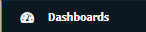

Once in this section, select the **Add Dashboard** button to open the configuration panel, where the dashboard's name, layout, and data sources can be defined.

<figure><figcaption></figcaption></figure>

It is necessary to configure different parameters:

* **Dashboard ID**: Unique identifier for your dashboard.&#x20;
* **Dashboard name**: A representative name of your dashboard, in a more friendly way than its identifier.
* **Dashboard description**: Fill here any description or detailed information required to keep about the dashboard in the long term.&#x20;

Clicking on the blue "Add Dashboard" button, the new dashboard will be added to the account, and the browser will be automatically redirected to the empty board in order to start adding widgets as explained in the sections below.

## Edit Dashboard

Initially, the dashboard is empty and set to view mode, which means no changes can be made. To enable modifications, first click the button in the top-right corner to activate edit mode. This action will then reveal a new menu containing options for settings, adding a new tab, or inserting a widget:

<figure><figcaption></figcaption></figure>

The dashboard edition mode allows moving or resizing existing widgets, but also enables different options using the left-side buttons, such as:

* **Add Widget**:  To create new elements from the list. There are two different widget types depending on their objective: **Display widgets** allow showing real-time data from devices or historical data from buckets, and **Control Widgets** allow connecting the dashboard with device functionalities in order to control them in real-time.&#x20;
* **Add Tab**: This button allows to create an additional dashboard tab that will appear associated with the original one in order to provide simple navigation over related boards.&#x20;
* **Settings**: There are multiple parameters that can be configured in order to set the dashboard behavior, such as the number of columns, the background image or the sharing options. &#x20;

These three options have been explained in more detail in the sections below.

## Widgets introduction

When the edit mode is enabled in the dashboard, a new button `Add Widget` will appear. Clicking on it will show a pop-up where it is possible to select the widget type to add in the dashboard. There are different widgets, both for displaying information and controlling connected devices.

<figure><figcaption></figcaption></figure>

* **Title**: Optional title for the widget.&#x20;
* **Subtitle**: Optional subtitle for the widget.
* **Link to:**  This option enables the image chart to function as a clickable link. When activated, it can be selected as a target dashboard from the dropdown, allowing users to navigate directly to it by clicking the widget.&#x20;
* **Show Update:** This toggle controls the visibility of an update mechanism for the image, which can be useful for manually refreshing dynamic image content.
* **Show Offline:** This dropdown determines the widget's behavior when its associated device or data source is offline, allowing to choose what is displayed in such a scenario.
* **Show Fullscreen:** This toggle, when enabled, displays an option to expand the image chart to full-screen view for better visibility.
* **Background**: Optional color for the widget background (defaults to white).
* **Type:** Click on 'Select widget type' to see a wide variety of widgets available

### Widget list

| **Category**          | **Widget**                                                                         | **Description**                                                    |
| --------------------- | ---------------------------------------------------------------------------------- | ------------------------------------------------------------------ |
| **Display**           | [Assets Map](dashboards.md#asset-map)                                              | Displays geolocated devices on a map.                              |
|                       | [Assets Table](dashboards.md#html-time-series)                                     | Shows asset data in a tabular format.                              |
|                       | [Apex Charts](dashboards.md#apex-charts)                                           | Advanced charts (line, bar, area) using ApexCharts library.        |
|                       | [Time Series Chart](https://docs.thinger.io/features/dashboards#time-series-chart) | Plots historical data over time using line charts.                 |
|                       | [Donut Chart](https://docs.thinger.io/features/dashboards#donut-chart)             | Visualizes percentages or parts of a whole.                        |
|                       | [Progressbar](https://docs.thinger.io/features/dashboards#progressbar)             | Displays a value within a horizontal bar.                          |
|                       | Gauge                                                                              | Circular meter to indicate a value within a range.                 |
|                       | [Tachometer](https://docs.thinger.io/features/dashboards#tachometer-chart)         | Speedometer-style gauge with dynamic needle.                       |
|                       | [Google Map](https://docs.thinger.io/features/dashboards#google-maps)              | Shows device locations using Google Maps.                          |
|                       | [Image/MJPEG](https://docs.thinger.io/features/dashboards#image-mjpeg)             | Displays or streams image content, like camera feeds.              |
|                       | [Text/Value](https://docs.thinger.io/features/dashboards#text-value)               | Simple display of numeric or text values.                          |
|                       | [Led Indicator](https://docs.thinger.io/features/dashboards#virtual-led)           | Color-coded LED icon reflecting a binary or threshold state.       |
|                       | [Clock](https://docs.thinger.io/features/dashboards#clock)                         | Shows the current time or a timestamp from data.                   |
|                       | [HTML Widget](https://docs.thinger.io/features/dashboards#html-widget)             | Fully custom content using raw HTML.                               |
|                       | [HTML Time Series](dashboards.md#html-time-series)                                 | Custom time-series visualizations with HTML formatting.            |
|                       | [Group Widget](dashboards.md#group-widget)                                         | Groups multiple widgets in one frame for better layout.            |
| **Device Control**    | [On/Off State](https://docs.thinger.io/features/dashboards#on-off-state)           | Switch to toggle a boolean device property (true/false).           |
|                       | [Slider](https://docs.thinger.io/features/dashboards#slider)                       | Adjusts a numeric value in a defined range via slider.             |
|                       | Property Button                                                                    | Triggers an action or sends a value when clicked.                  |
|                       | Property Table                                                                     | Displays or controls multiple properties in table form.            |
| **Dashboard Control** | [Source Switcher](https://docs.thinger.io/features/dashboards#source-switcher)     | Allows switching the data source dynamically for multiple widgets. |

As soon as a Widget type is selected, a new tab will pop up:

### **Data Sources**

This section serves as an introduction to configuring data visualization, enabling the user to specify the origin of the information. It offers choices such as real-time data from connected devices, historical data from devices or data buckets, device properties, or direct manual input. Subsequently, the different parameters pertinent to each widget type are described:

<figure><figcaption></figcaption></figure>

* **From Device Resource**: Displays real-time data from a connected device; data is volatile and not retained on dashboard reload.
* **From Data Bucket**: Retrieves persistent historical data from a user-configured Data Bucket, available across sessions.
* **From Device Bucket**: Accesses historical or aggregated data linked to a specific device’s properties.
* **From Device Property**: Retrieves static or infrequently changing device parameters, useful for configuration or last-known values.
* **Manual**: Allows manual input of values for testing or simulating widget behavior without live data sources.


<figure><figcaption></figcaption></figure>

* **Timeframe**: This parameter is only visible when configuring a time series widget that will represent historical data, as it allows defining the range of data to be displayed on the chart.&#x20;
  * **Latest Value:** Displays only the most recent data point received.
  * Once a Data Source is selected, this parameter becomes available. It is essential to specify the range of data to be rendered.
  * **Relative:** Displays data from a rolling time window, defined in relation to the current moment. Users can specify the duration of this window and the time units (in hours, minutes, or seconds).
  * **Absolute:** Presents data within a precisely defined, static time frame. Users set both a fixed start date and time, as well as a fixed end date and time, for the data to be displayed.
  * **Configurable:** Provides advanced options to dynamically set the timeframe based on other dashboard elements or custom logic.
* **Time Period**: Is shown when the selected Data Source is a real-time value such as a "Device Resource" or a "Device Property", permite representar los valores que va adquiriendo la variable a lo largo del tiempo indicado en este periodo, aunque no sean almacenados en la base de datos permanentemente .&#x20;

<figure><figcaption></figcaption></figure>

Some display-type widgets provide aggregation features that can be selected in order to process the device's data before being displayed, which is quite interesting when working with raw senor-data in order to obtain the most accurate representation.&#x20;

* **Data Aggregation**: Showing raw data directly from a Bucket could be tricky when there are a lot of data points, especially if the measures are very noisy or irregular. This feature allows aggregating data using different statistics such as medians, means, minimum and maximum values, a counter of data points per period, and a data summary. The aggregation can be applied over different intervals that go from five minutes to one week, by using the next configuration inputs in the widget form, and also using the upper-right parameters on each time series chart widget.
* **Data Transformation:** Some display-type widgets (time-series chart, HTML series) have a **Transform** selector, which works as an on-the-fly filter applied _after_ the raw value is fetched from the device or bucket but _before_ the widget renders it. The goal is to save users from rewriting firmware or setting up a separate data-processing pipeline just to polish how the metric is presented. According to the Thinger.io documentation, these functions “allow processing data before being used in widgets” for example, rounding numbers, computing rates, or converting units in place.
* **Dashboard processing:** Some widgets allow the execution of a custom "processing function", which can be previously defined in the dashboard **Settings > Functions** section. [As explained in this section of the documentation. ](https://docs.thinger.io/features/dashboards#functions)

## Display widgets

### Time Series Chart

A time-series chart is a graph that can display values over time. In this sense, this is quite useful when it is required to display time-series data, like a temperature variable that changes over time. It is possible to plot a single variable or multiple values in the same chart. The initial configuration of this widget is as shown in the following figure:

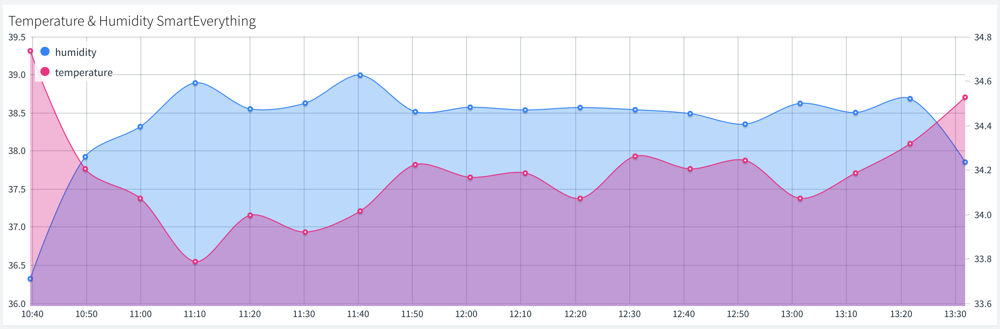

To configure this widget, select "Time Series Chart" from the Widget menu's "Type" tab. This will reveal a new configuration panel. Then, adjust the appropriate parameters:

<figure><figcaption></figcaption></figure>

* **Name:** The name of the source to be called.
* **Color**: A color can be assigned to a data source by selecting it from the color picker. The color can be adjusted using the color spectrum bar, by manually entering RGB (Red, Green, Blue) values, or by moving the dot within the color gradient area. Depending on the data source, it may be possible to configure a single color or multiple colors for different data series.
* **Data Source**: Designates the origin of the information utilized for visualization or analysis. For comprehensive details, refer to the '**Data Sources**' section above.
* **Timeframe**: When working with historical data stored in _Data Bucket_ or _Device Bucket_ sources, the Timeframe parameter defines the specific period to be rendered. It provides multiple predefined and configurable range options.
  * **Latest Value:** Displays only the most recent data point received.
  * **Relative:** Displays data from a rolling time window, defined in relation to the current moment. Users can specify the duration of this window and the time units (in hours, minutes, or seconds).
  * **Absolute:** Presents data within a precisely defined, static time frame. Users set both a fixed start date and time, as well as a fixed end date and time, for the data to be displayed.
  * **Configurable:** This parameter offers crucial advanced configuration within the dashboard profile, enabling dynamic adjustment of the timeframe based on other dashboard elements or custom logic. These powerful options are essential for precisely tailoring the time duration and other settings to your specific visualization needs.
* **Time Period**: This option allows setting up the time range during which the widget should retrieve and represent real-time data or the last received value.
* **Data Aggregation**: Given potentially noisy or irregular raw Bucket data with numerous points, this feature enables data aggregation. Statistics, as detailed in the table below, can be applied over intervals ranging from five minutes to one week. Configuration is handled via widget form inputs and the upper-right parameters of each time series chart widget.


A detailed Data Aggregation list is available here.


* **Data Transformation:** The Transform selector functions as an on-the-fly filter, processing raw values before widget rendering. This feature eliminates the need for firmware rewrites or separate data-processing pipelines, allowing for in-place data polishing such as rounding numbers, computing rates, or converting units.&#x20;


A detailed Data Transformation list is available here.


* **Multiple sources**: Sources can be added, cloned (recommended for similar sources), or removed. Every source will appear in the same widget.

Finally, the "**Display Options**" tab allows to customize the final appearance and behavior of the widget. From this section, the parameters that modify the widget's aesthetics and visual behavior:

<figure><figcaption></figcaption></figure>

The next image shows four different representations of the same dataset and time interval, aggregated using different algorithms: &#x20;

.png>)


Note that the Data Aggregation system is only available in **private server** instances&#x20;


### Apex Charts

An ApexChart is a modern JavaScript charting library that enables the creation of interactive and responsive data visualizations. It supports a wide range of chart types, **including line, bar, area, pie, and more**, and is commonly used for embedding charts in web applications with minimal configuration.

<figure><figcaption></figcaption></figure>

This widget is able to display data from multiple data sources in the same chart. Note that the configuration interface allows to add variables or clone a source configuration to make it easier.

<figure><figcaption></figcaption></figure>

* **Name:** The name of the source to be called.
* **Color**: A color can be assigned to a data source by selecting it from the color picker. The color can be adjusted using the color spectrum bar, by manually entering RGB (Red, Green, Blue) values, or by moving the dot within the color gradient area. Depending on the data source, it may be possible to configure a single color or multiple colors for different data series.
* **Data Source**: Designates the origin of the information utilized for visualization or analysis. For comprehensive details, refer to the '**Data Sources**' section above.
* **Timeframe**: When working with historical data stored in _Data Bucket_ or _Device Bucket_ sources, the Timeframe parameter defines the specific period to be rendered. It provides multiple predefined and configurable range options.
  * **Latest Value:** Displays only the most recent data point received.
  * **Relative:** Displays data from a rolling time window, defined in relation to the current moment. Users can specify the duration of this window and the time units (in hours, minutes, or seconds).
  * **Absolute:** Presents data within a precisely defined, static time frame. Users set both a fixed start date and time, as well as a fixed end date and time, for the data to be displayed.
  * **Configurable:** This parameter offers crucial advanced configuration within the dashboard profile, enabling dynamic adjustment of the timeframe based on other dashboard elements or custom logic. These powerful options are essential for precisely tailoring the time duration and other settings to your specific visualization needs.
* **Time Period**: This option allows setting up the time range during which the widget should retrieve and represent real-time data or the last received value.
* **Data Aggregation**: Given potentially noisy or irregular raw Bucket data with numerous points, this feature enables data aggregation. Statistics, as detailed in the table below, can be applied over intervals ranging from five minutes to one week. Configuration is handled via widget form inputs and the upper-right parameters of each time series chart widget.

#### Apex charts customization options

Una parcitularidad de los apex charts es que permiten personalizar la visualización de los datos aportando una gran variedad de templates con los que ajustar mejor al tipo de datos y el aspecto deseado. La sección Widget Settings contiene las siguientes funciones con esta finalidad:

<figure><figcaption></figcaption></figure>

### Tachometer Chart

It is a quite visual widget that allows showing device data in a traditional "dial gauge" representation, which could be customized with different value ranges and color marks, making it more accurate or simplifying the inspection with just a glance.


To begin configuring the Tachometer widget, start by filling in the general settings such as the title, subtitle, and background color (note that it can change in real time depending on the data value, as shown in the image below). then, select "Tachometer" from the widget type dropdown to define the visualization style.

.png>)

Then select the Tachometer data source from the dropdown menu:

<figure><figcaption></figcaption></figure>

* **From Device Resource**: Displays real-time data from a connected device; data is volatile and not retained on dashboard reload.
* **From Data Bucket**: Retrieves persistent historical data from a user-configured Data Bucket, available across sessions.
* **From Device Bucket**: Accesses historical or aggregated data linked to a specific device’s properties.
* **From Device Property**: Retrieves static or infrequently changing device parameters, useful for configuration or last-known values.
* **Manual**: Allows manual input of values for testing or simulating widget behavior without live data sources.


Finally, the "**Display Options**" tab allows to customize the final appearance and behavior of the widget. This is the most important section in order to create nice and attractive dashboards.&#x20;

<figure><figcaption></figcaption></figure>

* **Display options:**
  * **Units**: Optional information that will display the variable unit, like ºC.
  * **Ranges Values**: This parameter configures the total data range that will be shown in the chart, and also allows adding sub-ranges that can be configured with different colors in order to simplify the visual checking.
  * **Plate Color**: Configure the background plate color.
  * **Text Color**: Configure the text color.
  * **Tick Color**: Configure the division tick color.&#x20;
  * **Major Ticks**: Allows to configure the range of each tick
  * **Show Value**: To display or hide the numeric representation of the value in a digital textbox.

### LED Indicator

Using LED spots is a common way to create simple graphical interfaces in electronic projects in order to represent system status, alerts, etc. This widget has been included in Thinger.io Platform with the same purpose, so it can be used to show binary status by changing its color, create alerts by setting blink behavior or show multiple data by including more than one color range in a kind of RGB simulation.&#x20;

 (1).png>)

This widget can be configured in many different ways through the three-step form. First of all, select "Led Indicator" in the Widget menu tab, write a title and select a data source from:&#x20;

<figure><figcaption></figcaption></figure>

* **From Device Resource**: Displays real-time data from a connected device; data is volatile and not retained on dashboard reload.
* **From Data Bucket**: Retrieves persistent historical data from a user-configured Data Bucket, available across sessions.
* **From Device Bucket**: Accesses historical or aggregated data linked to a specific device’s properties.
* **From Device Property**: Retrieves static or infrequently changing device parameters, useful for configuration or last-known values.
* **Manual**: Allows manual input of values for testing or simulating widget behavior without live data sources.

The **"Display Options"** tab defines the visual behavior of the LED widget, by means of the following parameters that modify the widget's aesthetics and visual behavior. The image below shows an example of an RGB led to represent a three-state variable:

<figure><figcaption></figcaption></figure>

* **Led Size**: Configure the diameter of the led spot pixels
* **Color**: configures the LED default color, and also allows creating color ranges by pressing the green "+" button on the right side.
  * **Color ranges**: Multiple color ranges can be configured as required. When a new color range profile is added, it requires specifying a value range and the corresponding color to be displayed when the input value belongs within that range.
  * **Blinking led option:** The right side switch allows adding a blinking behavior to the led when this range profile begins active. It is also possible to disable the blinking by pressing on the led widget.&#x20;

### Donut Chart

This widget is quite useful when the variable to be displayed oscillates between a known minimum and maximum value.&#x20;

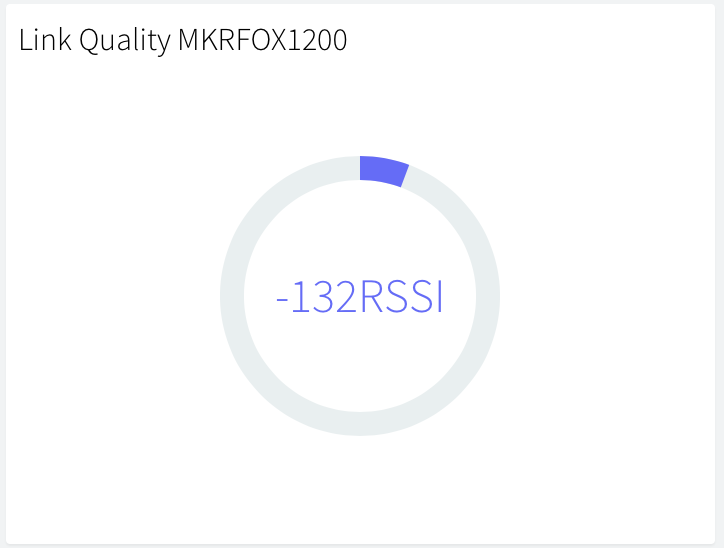

This widget can be configured in many different ways through the three-step form. First of all, select "Donut Chart" in the Widget menu tab, and select a data source with the dropdown selector:&#x20;

<figure><figcaption></figcaption></figure>

* **From Device Resource**: Displays real-time data from a connected device; data is volatile and not retained on dashboard reload.
* **From Data Bucket**: Retrieves persistent historical data from a user-configured Data Bucket, available across sessions.
* **From Device Bucket**: Accesses historical or aggregated data linked to a specific device’s properties.
* **From Device Property**: Retrieves static or infrequently changing device parameters, useful for configuration or last-known values.
* **Manual**: Allows manual input of values for testing or simulating widget behavior without live data sources.

functionsIt is also possible to apply **Dashboard processing funtions** over donut charts.  Some widgets allow the execution of a custom "processing function", which can be previously defined in the dashboard **Settings > Functions** section in order to apply custom data transformations. [As explained in this section of the documentation. ](https://docs.thinger.io/features/dashboards#functions)

Finally, the "**Display Options**" tab allows to customize the final appearance and behavior of the widget. This is the most important one in order to create nice and attractive dashboards.&#x20;

<figure>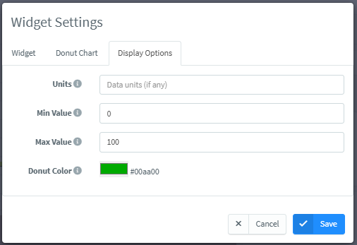<figcaption></figcaption></figure>

* **Units**: Optional information that will display the variable unit, like ºC.
* **Min Value**: The expected minimum value of the variable.
* **Max Value**: The expected maximum value of the variable.
* **Donut Color**: The color to display inside the donut.

### Progressbar

The **Progress Bar** widget provides a visual representation of a variable that changes between known minimum and maximum values. It is ideal for displaying percentages, charge levels, task completion, or other indicators that fluctuate within a defined range.

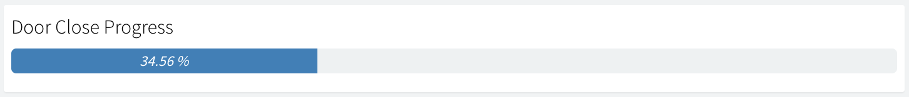

Before configuring the **Progress Bar** widget, make sure you select a variable whose **minimum and maximum values are clearly known**. This is essential to ensure the progress bar accurately reflects the value within the defined range. The image above shows the initial step, where the widget data source is selected.&#x20;

<figure><figcaption></figcaption></figure>

**Data source**: is fundamental for configuring how values are fed to a widget. It allows determining the origin of the information to be visualized, choosing between real-time data from a connected device, historical data stored in a data or device bucket, device properties, or even manual input.

Finally, the "**Display Options**" tab allows to customize the final appearance and behavior of the widget. This is the most important one in order to create nice and attractive dashboards.&#x20;

<figure><figcaption></figcaption></figure>

* **Units**: Optional information that will display the variable unit, like %.
* **Min Value**: The expected minimum value of the variable.
* **Max Value**: The expected maximum value of the variable.
* **Icon:** It is used to select the visual symbol representing the widget.
* **Icon Size:** To adjust the dimensions of the icon.

### Google Map

A map can be used to represent, at this moment, a single location on a map. It is quite convenient to track devices in real-time as the chart can be fed in real-time from a connected device, like over a GPRS connection. It is also possible to plot locations from a data bucket, so devices like Sigfox can also be tracked.

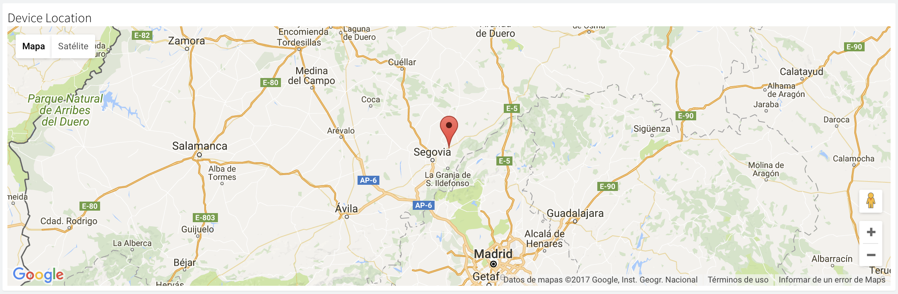

Here is an example of this widget working in real-time with a connected device:

Then, the Google Map menu tab allows selecting the data source, which can be a connected device or a data bucket:

<figure><figcaption></figcaption></figure>

* **Name:** The name you want the source to be called.
* **Color**: Both on data selected from a device or from a data bucket, it is possible to configure series colors. Depending on the information available in the resource, it will show only one configurable color or a color for each series, like in the previous screenshot, next to Source 1.&#x20;

**Data Source**: is fundamental for configuring how values are fed to a widget. It allows selecting the origin of the information to be visualized, choosing between real-time data from a connected device, historical data stored in a data or device bucket, device properties, or even manual input.

The different options are described below:

Finally, the "**Display Options**" tab allows to customize the final appearance and behavior of the widget. This is the most important one in order to create nice and attractive dashboards.&#x20;

<figure><figcaption></figcaption></figure>

* **Center**: Force the map to automatically keep the location in the center.
* **Zoom Level:** To determine the amount of zoom for the map.
* **Map Type:** Which will show the next options:


<figure><figcaption></figcaption></figure>

* **Waypoints**: Toggle this option to render a sequence of historical locations on the map, useful for tracking a device's journey or data points over time.
* **Location**: Configure how to feed the location into the map. It is possible to feed the information from a connected **device** or a **data bucket**. When feeding the plot from a data bucket or a device, it is required to match the required latitude and longitude (in degrees) with the variables present in the bucket or in the device resource.
* **Geofences**: Check this box to overlay geofences on the map. Then, using the 'Select Device...' dropdown to associate these boundaries with a particular device, enabling visual monitoring of its location relative to the defined areas.
* **Hide Controls:** Toggle this option to hide the standard user interface controls of the map, useful for creating a more streamlined or embedded visual.



### Asset Map

The **Asset Map** widget allows users to display the geographic locations of assets in real-time using a map interface. It provides powerful visual insight for tracking the deployment, status, and grouping of assets across regions. This is especially beneficial for operations teams, asset managers, and analysts who require spatial awareness of device locations and statuses.

<figure><figcaption></figcaption></figure>

Note that devices can be plotted from different aggrupations, so once this widget is selected, it's possible to choose from:&#x20;

* **From Asset Type**: Selecting this option provides a dropdown to choose a specific type of asset. Only assets belonging to the selected type will be displayed. This is useful when the goal is to analyze or visualize a particular category of assets.
* **From Asset Group:** Choosing this option presents a dropdown to select a specific asset group. This is beneficial when assets are organized into logical groups and the focus is on data from a particular group.
* **From Asset Product:** If this option is selected, a dropdown appears for choosing a specific product asset. This is helpful when interested in the performance or status of assets associated with a particular product line.


<figure><figcaption></figcaption></figure>

Then the "display options" menu allows to custom the looc and feel  of the map with multiple options such as:&#x20;

* **Map Type**: This crucial dropdown determines the base visual style of the map itself. It offers various cartographic representations:
  * &#x20;**Roadmap**: Shows standard road networks, labels, and general geographical features. It's good for general navigation and understanding locations.
  * **Satellite**: Displays satellite imagery, offering a realistic view of the terrain and buildings. Useful for detailed visual inspection of asset locations.
  * **Hybrid**: This option combines satellite imagery with road and label overlays, providing the realism of a satellite view alongside navigational aids from a roadmap.
  * **Terrain**: This displays geographical features such as mountains, valleys, and elevation changes, which is useful for understanding the topography surrounding assets
* **Show Options**: It groups further display-related configurations.
* **Show Search**: If activated, displays a search bar on the map widget. This allows users to search for specific locations or addresses directly on the map.
* **Connected**: This toggle controls the visibility or special styling of assets that are currently connected or online within the system. If active, connected assets appear in a specific color or with an icon to denote their live status.
* **Disconnected**: Similar to "Connected," this toggle likely controls the visibility or styling of assets that are currently disconnected or offline. If active, disconnected assets might be shown with a different color, icon, or even filtered out if the toggle is off.
* **Clustering**: This is a very common feature in map widgets, especially when dealing with many assets. If active, assets that are geographically close to each other will be grouped into a single "cluster icon". Zooming in, these clusters break apart to reveal individual assets. This prevents the map from becoming too cluttered when many assets are in a small area.

### Image/MJPEG

The image/MJPEG widget can be used to represent both a still image, like your business logo, or a live stream from an MJPEG source, like a surveillance camera. To feed this widget, it is necessary to provide the image/MJPEG URL.

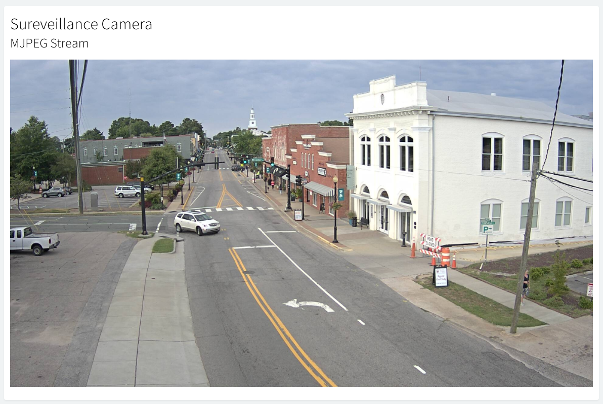

To configure this widget, click the **Add Widget** button to open the widget configuration panel. In the **Widget** tab, enter a title and select **"Image/MJPEG"** as the widget type. Next, choose the **Image Source** as either **"Still Image"** or **"MJPEG Stream"**, and specify the corresponding **URL** that will be used to load the image or video stream.

*


### Text/Value

The text/value widget is a useful widget to display any arbitrary data, especially text values that cannot be represented with other widgets. Like any other widget, it can display data from both connected devices and data buckets.


This widget can be configured in many different ways through the three-step form. First of all, fill the widget Title and the type: "Text/Value" in the "Widget" menu tab. Then, the Text/Value menu tab allows selecting the data source, which can be a connected device or a data bucket.&#x20;

Finally, the "**Display Options**" tab allows to customize the final appearance and behavior of the widget. This is the most important one in order to create nice and attractive dashboards.&#x20;

<figure><figcaption></figcaption></figure>

* **Decimal Places**: Determines the number of digits to display after the decimal point for numerical values.
* **Units**: Optional information to display the units of the displayed information.
* **Text Color**: Configure the text color.
* **Text Size**: Controls the font size of the primary displayed value, typically measured in pixels (px), allowing adjustment of its visual prominence.
* **Text Weight**: Defines the boldness or lightness of the displayed text, offering options like 'Thin', 'Normal', or 'Bold' to influence its visual style.
* **Units Size**: Specifically adjusts the font size of the units suffix, distinct from the main text size, ensuring the units are displayed at an appropriate scale.
* Icon: Enables the selection of a visual symbol (e.g., a Font Awesome class such as `fas fa-tachometer-alt`) to accompany the displayed value, enhancing the widget’s visual appeal."
* **Open URL** enables the widget to act as a clickable link. When a URL is entered, clicking the widget will redirect the user to the specified web address.

### Clock

This widget is just a clock widget that can display the current time both in the local time zone and in UTC, which can be useful when monitoring processes in real-time. Note that this widget takes the current time just from the web browser, so it should be the same as your computer.


This widget can be configured in many different ways through the two-step form. First of all, select "Clock" in the Widget menu tab, and customize the clock behavior, note that the time value can be displayed in UTC format if preferred:&#x20;

<figure><figcaption></figcaption></figure>

* **Color**: Color for the text.
* **UTC**: Display the clock in UTC of the bworser  the local timezone.

### HTML Widget&#x20;

This widget allows creating custom data representation interfaces by programming it with standard web source code languages such as HTML, CSS and JavaScript. Being also able to represent data from Thinger.io devices or data buckets, or show data from third-party sources on the same dashboard.&#x20;

This widget can be configured in many different ways through the three-step form. First of all, select "HTML Widget" in the Widget menu tab, which allows selecting one of the common Thinger.io data sources:

<figure><figcaption></figcaption></figure>

**Processing option**: Some widgets support the use of **processing functions**, which allow you to transform or manipulate the data before it's displayed. These functions can be defined directly within the widget configuration, under the section "**Settings > Functions".**&#x20;

<figure><figcaption></figcaption></figure>

Finally,  the "**Display Options**" tab allows to customize the final appearance and behavior of the widget. From this section, it is possible to define custom HTML code to be displayed.

<figure><figcaption></figcaption></figure>

#### From Code Snippet

To create a basic widget with a simple code, such as a data table, a ready-to-paste script from any website, or any other easy integration. The source code can be written using a small text editor in the widget form. Note that this code will be executed in the browser as a part of an AngularJS directive, where some scope has already been defined and initialized. In particular:

* `ts`: Timestamp of the data.
* `value`: Value with the selected value in the configuration, i.e., a device property, bucket data, or real-time data from a device.

Those values can be used in the HTML content with the AngularJS two-way data binding using double brackets, i.e., using `{{ts}}` or `{{value}}.` The property's data is displayed on the view, and at the same time, the property will be updated when there is any change.



Example hello world displaying timestamp, timestamp formatted as a date, and the selected value.

.png>)

The widget code is the following:

```html
<h1>Hello World!</h1>
<p>Ts: {{ts}}</p>
<p>Date: {{ts | date:'medium'}}</p>
<p>Value: {{value}}</p>
```



Using the HTML Time Series widget, it is possible to plot information in a given timespan, i.e., latest values from a data bucket. The following example represents an HTML widget holding a list of values from bucket:

.png>)

The code to represent this table is like the following:&#x20;

```html
<div style="width=100%; height:100%; overflow-y:scroll">
    <table class="table table-striped">
      <thead>
        <tr>
          <th>Time</th>
          <th>Inst Water Flow</th>
          <th>Inst Water Flow (l)</th>
        </tr>
      </thead>
      <tbody>
        <tr ng-repeat="entry in value">
            <td>{{entry.ts | date:'medium'}}</td>
           <td>{{entry.inst_waterFlow}}</td>
           <td>{{entry.inst_waterFlow_liter}}</td>
        </tr>
      </tbody>
    </table>
</div>
```


Note that this code is using ``ng-repeat from AngularJS to iterate over all entries available in the `value` variable.``




It is possible to insert any other code snippet, i.e., those offered by third party services, i.e., weather predictions, banners, etc.


.png>)

Next script can be used as example to create an HTML widget with another weather forecast provider:

```
<div id="c_c1374694634f9f99525990d7fe6508ae" class="ancho"></div><script type="text/javascript" src="https://www.eltiempo.es/widget/widget_loader/c1374694634f9f99525990d7fe6508ae"></script>
```

Will result on a widget with the following forecast information.


.png>)



#### From File Storage

For more complex developments over the HTML Widget, where several source code files are required, it is possible to use the [**File Storage**](https://docs.thinger.io/console/file-system) feature. This allows the development of more complex interfaces that exploit all the representation capabilities of the browser, such as 3D object representation, animated widgets, etc. Moreover, widgets from File Storage can be shared between multiple dashboards is required, so it is much more maintainable in the long term.&#x20;

It is possible to point the widget to an HTML file inside a file storage by selecting the `File Storage` from `HTML Source` option and then typing the file name.&#x20;

The most interesting option is to create a custom AngularJS directive for custom widgets, as it allows isolating the widget scope, defining custom functions, reacting to changes, and in general, it is possible interacting more easily with the Thinger.io API via dependency injection.&#x20;

#### AngularJS Directive Example: Hello World

Similar to the Basic Code Snippet example, in this one, a simple directive is created that will display basic information captured in the widget, i.e., the timestamp, the value, and the source configuration. For working with this example, it is required to:

* Create a new `File Storage` to store your widgets.


Set public read access to the storage so the widgets can be retrieved when sharing your dashboard via Projects or shared links.


* Create two files named `htmlWidget.js`, and `htmlWidget.html` inside the storage. The JavaScript file is the place where you will set your widget code and logic. On the other side, the HTML widget will hold your widget view.
* Initialize the code of both files from the following code:



```javascript
angular.module('helloWidget', [])
.directive('helloWidget', function () {
    return {
        restrict: 'EA',
        scope: {
            source : "=",
            ts:      "=",
            value:   "="
        },
        templateUrl: function(){
            let url = document.querySelector("script[src*='helloWidget.js']");
            return url.src.replace('.js','.html');
        },
        controller: ["$scope", function($scope){
            console.log("controller initialized! scope is", $scope);
            
            // listeners for process source changes (if required)
            $scope.$watch('source', function(newVal, oldVal) {
                console.log("Source has changed:", newVal, oldVal);
            });
            
            // listeners for process value changes (if required)
            $scope.$watch('value', function(newVal, oldVal) {
                console.log("Value has changed:", newVal, oldVal);
            });
            
        }]
    }
});
```



```html
<div>
    <h3>Hello World from AngularJS directive!</h3>
    <p><strong>Source</strong> is {{source}}</p>
    <p><strong>Timestamp</strong> is: {{ts}}</p>
    <p><strong>Value</strong> is: {{value}}</p>
</div>
```



* Create a new widget pointing to the `helloWidget.js` file. Note that we are loading the file with the `.js` extension that will load the counterpart `.html` file as specified in `templateUrl` function.&#x20;

<figure><figcaption></figcaption></figure>

* Now it will be displayed a similar widget to the Basic Code Snippet example. However, there are many differences from basic example, as now we have Javascript file where we can add more values to the scope, process incoming value changes, detect source changes, and more interesting, we can inject dependencies to other Thinger.io console components, like UI widgets, or API methods to update configurations, call devices, etc.

.png>)


Ensure your widgets use a `camelCase` name for file names.&#x20;


#### AngularJS Directive Example: React to Value Changes

In this example, an advanced widget is created that will display an animation every time the source value is updated, i.e., when it is streamed by the device, it is updated inside a single property, or a new entry is created in a bucket. &#x20;


The complex part here is to create an SVG and the corresponding CSS animations. The AngularJS directive just listens for value changes to trigger the animation.

Then, the On/Off State menu tab allows selecting the data source, which can be a connected device. Finally, the "**Display Options**" tab allows to customize the final appearance and behavior of the widget. From this section, it is possible to define custom HTML code to be displayed.

<figure><figcaption></figcaption></figure>

* **Target Value -> From Device Resource**: This option requires the device to be connected in real-time. The widget will display data as it is received from the device. It's important to note that, when fed directly from a device resource, the widget will not retain the information if the dashboard is closed or refreshed, as it only displays live data from your device to your dashboard.
* **Target Value -> From Device Property:** This option is ideal for retrieving data from a device's configurable properties, making it particularly useful for visualizing static or infrequently changing device configuration data, such as firmware versions or location IDs, as well as displaying the last received data from HTTP devices that do not maintain a persistent connection.

Finally,  the "**Display Options**" tab allows to customize the final appearance and behavior of the widget:

<figure><figcaption></figcaption></figure>

This widget can be shown in different appearances, which can be specified in the **Switch Style** menu:

* [x] **Switch** is the standard configuration with a little horizontal switch
* [x] **Button,** which is an improved face that can be configured with different colors and icons
* [x] **Push button** it configurates the button to be automatically switched off when it is not being clicked. This option is perfect to implement the toggle switches behavior on the devices.

Using Button or Push button configuration, it is possible to configure the following parameters:

<figure><figcaption></figcaption></figure>

* **On Color**: The color that will be displayed when the boolean value of this resource is true.
* **Off Color**: The color that will be displayed when the boolean value of this resource is false.
* **Icon**: This button is able to show a customizable icon from a favicon library or any other icon library URL.
* **Icon Color**: Icon color is also configurable with a hexadecimal value. Note that there are different color options for both button statuses, so you can customize them as you want.

Upon completion, a result similar to this will be displayed:

.png>)

### Slider

The slider widget allows controlling a numeric state of a connected device, like setting a threshold, a target temperature, or any other internal device state that is likely to be controlled remotely. The device should expose a numeric input. The resource is then mapped to this widget, which can change the target value in real-time. If the input resource is properly defined and [implemented](http://docs.thinger.io/arduino/#coding-adding-resources-input-resources), this widget is also able to show the current device state.


This widget can be configured in many different ways through the three-step form. First of all, select "Slider" in the Widget menu tab, and then, in the Slider menu tab, allows selecting the data source, which can be a connected device.

<figure><figcaption></figcaption></figure>

* **Target Value:**
  * &#x20;**Device Resource**: This option requires the device to be connected in real-time. The widget will display data as it is received from the device. It's important to note that, when fed directly from a device resource, the widget will not retain the information if the dashboard is closed or refreshed, as it only displays live data from your device to your dashboard.
  * **Device Property:** This option is ideal for retrieving data from a device's configurable properties, making it particularly useful for visualizing static or infrequently changing device configuration data, such as firmware versions or location IDs, as well as displaying the last received data from HTTP devices that do not maintain a persistent connection.

<figure><figcaption></figcaption></figure>

Finally,  the "**Display Options**" tab allows to custom behavior of the widget:

* **Min Value**: Maximum value of the slider.
* **Max Value**: Minimum value of the slider.
* **Step Width**: Slider precision.

### HTML Time Series&#x20;

The **HTML Time Series** widget in Thinger.io is a versatile component designed primarily for rendering **custom data tables** within a dashboard. It enables advanced, fully customizable representations of time-series or real-time data through user-defined HTML templates, supporting precise formatting and layout control. As it plot historical data points over time using customizable HTML-based charting it's perfect to enable detailed analysis of trends and variations.

<figure><figcaption></figcaption></figure>

To configure this widget, select "HTML Time Series" from the Widget menu's "Type" tab. This will reveal a new configuration panel. Then, the HTML Time Series menu tab allows selecting multiple data sources, blending data from device resources, data buckets or properties into the same table; however, it is recommended to choose data that comes from the same source.&#x20;

<figure><figcaption></figcaption></figure>

Finally, using the "code snippet" section, it's possible to customize the appearance of the table structure. It's important to take care of the data structure when calling the variables. The example above has been created by means of a simple source code in HTML, whose variable ID's must fit with the ones introduced in the source "Name" input box.&#x20;

```html
<div style="width=100%; height:100%; overflow-y:scroll">
    <table class="table table-striped">
      <thead>
        <tr>
          <th>Date</th>
          <th>Temperature</th>
          <th>Humidity</th>
        </tr>
      </thead>
      <tbody>
        <tr ng-repeat="entry in value">
          <td>{{entry.ts| date:'medium'}}</td>
           <td>{{entry.temperature}}</td>
           <td>{{entry.humidity}}</td>
        </tr>
      </tbody>
    </table>
</div>
```

### Group Widget

The **Group Widget** is a container element designed to organize and group multiple individual widgets within a single visual unit. This structure allows for a semantically meaningful layout, enabling users to associate related widgets visually and functionally.

<figure><figcaption></figcaption></figure>

Upon creation, the Group Widget appears as an empty placeholder, as shown in the first image. However, a **“+” button** is located in the upper-right corner, which allows users to add widgets to the group. Clicking this button reopens the standard widget creation interface—meaning any compatible widget can be embedded within the group.

Once added, the child widgets are arranged in a flexible grid layout. Users can add any combination of widgets, such as time series charts, indicators, text blocks, or numeric gauges, as illustrated in the second image, which shows a live humidity visualization with both gauge and time-series representations.

<figure><figcaption></figcaption></figure>

**Key Functionalities:**

* **Semantic Grouping**: Allows logically related widgets to be grouped for better visualization and usability.
* **Flexible Composition**: Supports any widget type inside the group, maintaining full configuration and behavior.
* **Independent Layout**: Widgets inside the group can be freely rearranged using drag-and-drop in edit mode.
* **Encapsulation**: Makes it easier to duplicate or template grouped components across dashboards.

This widget is ideal for creating modular, reusable UI components—especially in large dashboards—by isolating sections like “Environmental Sensors,” “Device Stats,” or “Alarms” in well-defined visual blocks.


Note: The Group Widget does not hold data directly. It merely acts as a visual container for organizing child widgets.



## Dashboard Control Widgets

There are some widgets that allow modifying the Dashboard behaviour, i.e., modifying data sources.

### Source Switcher

The Source Switcher widget allows you to modify the data source from a dashboard. This way, it is possible to create a single dashboard for all devices or buckets of the same type or within a project.

<figure><figcaption></figcaption></figure>

The widget will appear as a dropdown with the current device or bucket being used by the dashboard. When clicked, it is possible to select or search a new data source, which will update the dashboard automatically.

.png>)

## Dashboard Tabs

A Dashboard Tab is an additional work page that can be added to a dashboard to organize the visualization of data and simplify navigation between related panels. The widgets and data sources of each tab can be completely independent of the others, but all the tabs will share the same configuration settings (column number, background image, widgets border-radius, etc).&#x20;

This feature also has the advantage of keeping all the tabs of a dashboard open even if they are not being visualized, so the data of the devices shown in real-time will not be lost when changing from one tab to another.&#x20;

### Adding a new tab

To add a tab to a dashboard, you only need to click on the blue "add tab" button. This button can be clicked as many times as tabs are desired to create, they will be labeled as "new tab" and will show a generic icon. The label can be modified just by typing a new name, but the icon can also be customized by pressing over the existing one, deploying a menu with all available icons.

First, a new tab needs to be created. This is the process:

<figure><figcaption></figcaption></figure>

Then, clicking on the settings symbol next to the New Tab, the list of icons will appear:

<figure><figcaption></figcaption></figure>

<figure><figcaption></figcaption></figure>

Note that, when the editing mode is enabled, the tabs order can also be customized by dragging them to the desired position.&#x20;

<figure><figcaption></figcaption></figure>

## Dashboard Settings

Thinger.io allows setting some parameters of the dashboard behavior. Accessing the settings menu just requires activating the dashboard edit mode and then clicking on the blue "Settings" button in the upper area of the dashboard. The next context will appear, which has three main tabs to organize the work that can be done with this menu:

<div data-full-width="false"><figure>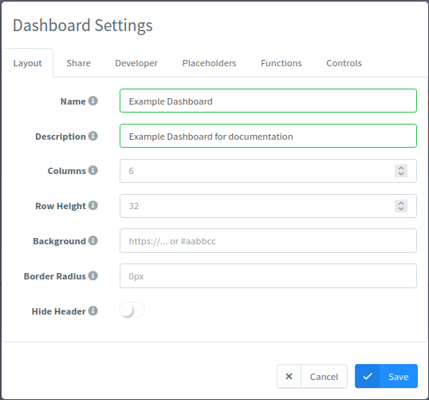<figcaption><p>Layout tab in dashboard settings</p></figcaption></figure></div>

### Layout

This section allows you to customize the main dashboard configuration parameters, such as:

* **Name**: Dashboard name that will be shown on the header and browser tab.
* **Description**: Dashboard description for additional information.&#x20;
* **Columns**: This number allows selecting the logical number of horizontal places that can be used to insert widgets on the dashboard. Each widget can be scaled to fill more than one position.&#x20;
* **Row Height**: This number sets the minimum height of a dashboard row in pixels.
* **Background**: Either the background image or a hexadecimal color can be set in order to customize the dashboard's appearance.
* **Border radius**: Widget corners will be rounded according to this parameter.
* **Hide Header**: Shared dashboards have been provided with a header that shows the dashboard name, but this header can be hidden if the developer switches this option on.&#x20;

### Share

By default, any dashboard is private to the account owner. This feature allows you to share an isolated read-only version of the dashboard so others can display the information. To share a dashboard, just enter the dashboard config and enable the `Share` switch. After enabling the dashboard sharing, a URL will be generated, which can be publicly shared.

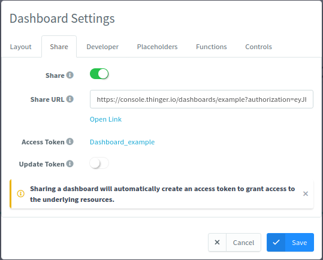


Any modification on a shared dashboard widget that includes new device or data bucket resources must be updated in the authorization by means of the Access Tokens menu or by re-generating the link by turning the shared dashboard option off and on again.&#x20;


### Developer

For more advanced users, the dashboard settings section allows access to the JSON file where all interface parameters are configured. This allows you to customize each element in a flexible way, but it is also the best way to copy a dashboard for replication or to post it in the community discussion forum.

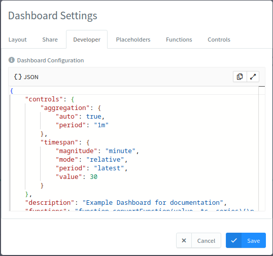

### Placeholders

Dashboard placeholders allow defining variables to be used in any part of the dashboard by using their placeholder name inside double braces. The value can be extracted from a device property or set manually.

<figure>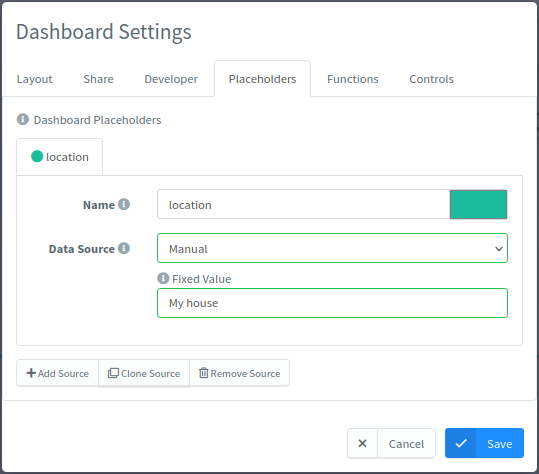<figcaption><p>Placeholders tab in dashboard settings</p></figcaption></figure>

These placeholders can then be used in widget titles, widget subtitles, values, HTML templates, etc. Here is an example of using the above placeholder as the value of a text widget.

<figure>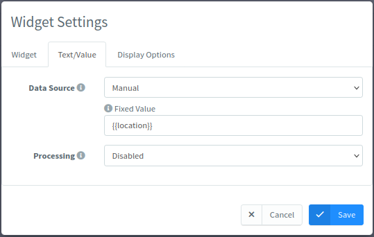<figcaption><p>Configuration of a text widget value with a placeholder</p></figcaption></figure>

<figure>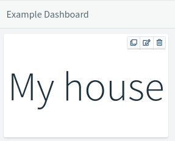<figcaption><p>Text widget with the placeholder value</p></figcaption></figure>


### Functions

Dashboard functions allow processing data before being used in widgets, i.e., limiting a number of decimals, converting units, etc.

By clicking on the 'Add Function' button, a new function will be declared, which we can then use to transform the value of a widget source.

<figure>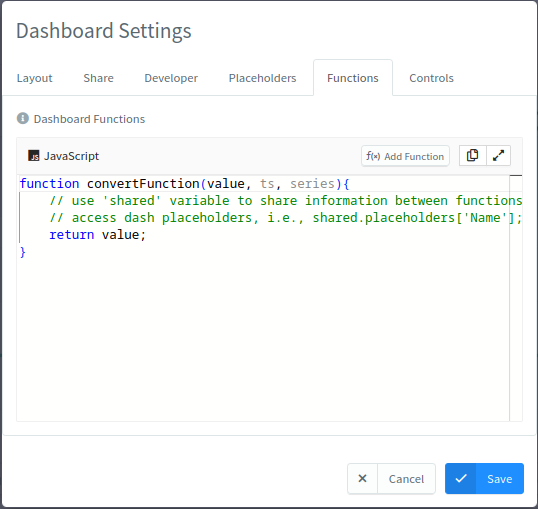<figcaption><p>Functions tab in dashboard settings</p></figcaption></figure>

Afterwards, when configuring a widget's sources, the processing function needs to be set.

<figure>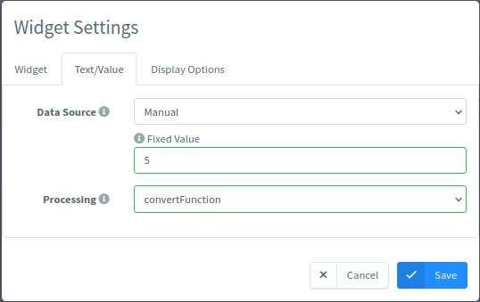<figcaption><p>Setting the processing function in a widget source</p></figcaption></figure>

Additionally, previously defined dashboard placeholders can be used in the functions by using a variable named \`shared.placeholders\`. Check the following images:

<figure>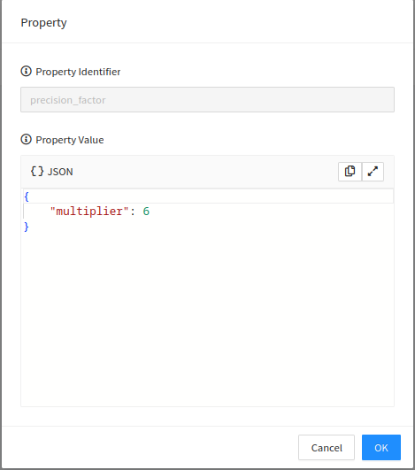<figcaption><p>Device property used as dashboard placeholder</p></figcaption></figure>

<figure>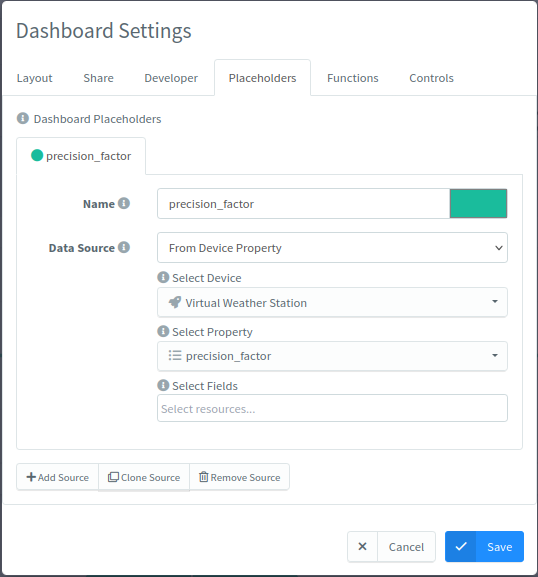<figcaption><p>Dashboard placeholder value as the property value</p></figcaption></figure>

<figure>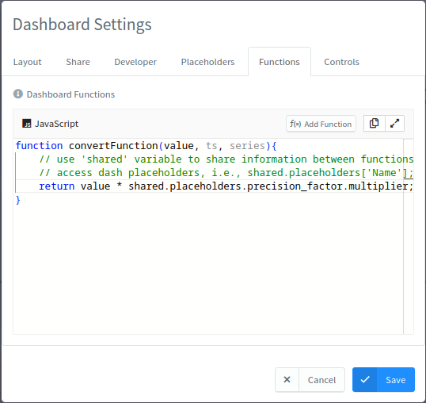<figcaption><p>Dashboard function using the value of a placeholder</p></figcaption></figure>


Transformation of value is done for each individual value, and not over a whole series.


### Controls

In the controls tab, some additional dashboard configuration can be done regarding time selection for time series sources, when a widget source belonging to a dashboard has a configurable timeframe and aggregation window.

<figure><figcaption></figcaption></figure>

<figure>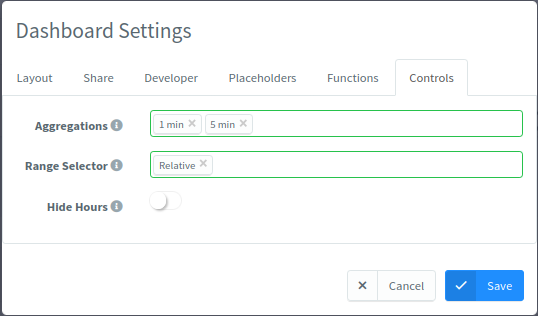<figcaption></figcaption></figure>

* **Aggregations**: Limits the available aggregations that can be selected in the dashboard.
* **Range Selector**: Limits the available time range selectors that can be selected in the dashboard.
* **Hide hours**: Hides the hours in the absolute time range selector

<figure><figcaption></figcaption></figure>

## Widget data transformations list

Data aggregation list

| **count**  | Returns the total number of data points in the selected time range.         | Checking how many samples were received (e.g., to ensure sensor is reporting regularly). |
| ---------- | --------------------------------------------------------------------------- | ---------------------------------------------------------------------------------------- |
| **mean**   | Calculates the average value of all data points.                            | Analyzing general trends like average temperature or humidity.                           |
| **median** | Returns the middle value in a sorted list of data points.                   | Useful when want to avoid distortion from outliers.                                      |
| **mode**   | Returns the most frequently occurring value.                                | Ideal for identifying recurring sensor states (e.g., ON/OFF events).                     |
| **spread** | Calculates the difference between the maximum and minimum values.           | Understanding variability or range in data, such as temperature fluctuations.            |
| **stddev** | Calculates the standard deviation, measuring how spread out the values are. | Evaluating the consistency or stability of sensor data.                                  |
| **max**    | Returns the highest recorded value.                                         | Monitoring peak values like max voltage or pressure.                                     |
| **min**    | Returns the lowest recorded value.                                          | Identifying dips or low thresholds, such as minimum battery level.                       |
| **sum**    | Adds up all the data points                                                 | Calculating total usage or accumulated metrics (e.g., energy consumption over time).     |

Data Transformation list

| Option in the dropdown        | What it does                                                                   | Typical use-case                                                                    |
| ----------------------------- | ------------------------------------------------------------------------------ | ----------------------------------------------------------------------------------- |
| **None**                      | Leave the value untouched.                                                     | Raw sensor read-outs.                                                               |
| **abs**                       | Returns the _absolute_ value.                                                  | Converting ± current readings into a unipolar magnitude.                            |
| **ceil**                      | Rounds up to the nearest integer.                                              | Guaranteeing that never display less than the true amount (e.g., inventory pieces). |
| **floor**                     | Rounds down to the nearest integer.                                            | Showing whole-number counts such as completed batches.                              |
| **round**                     | Rounds to the nearest integer.                                                 | Tidying noisy decimals for dashboards aimed at non-technical audiences.             |
| **difference**                | Computes the delta between consecutive samples.                                | Displaying incremental energy consumption from a cumulative meter.                  |
| **derivative**                | Calculates the rate of change per second (can be negative).                    | Turning distance into velocity or bytes into bandwidth.                             |
| **non\_negative\_derivative** | Same as _derivative_ but clips negative spikes—handy when counters reset to 0. | Network-interface byte counters, water meters that roll over.                       |
| **cumulative\_sum**           | Adds each new sample to a running total.                                       | Tracking production totals without changing the device firmware.                    |
| **elapsed**                   | Returns milliseconds/seconds since the previous data point.                    | Measuring event spacing, e.g., time between machine cycles.                         |
