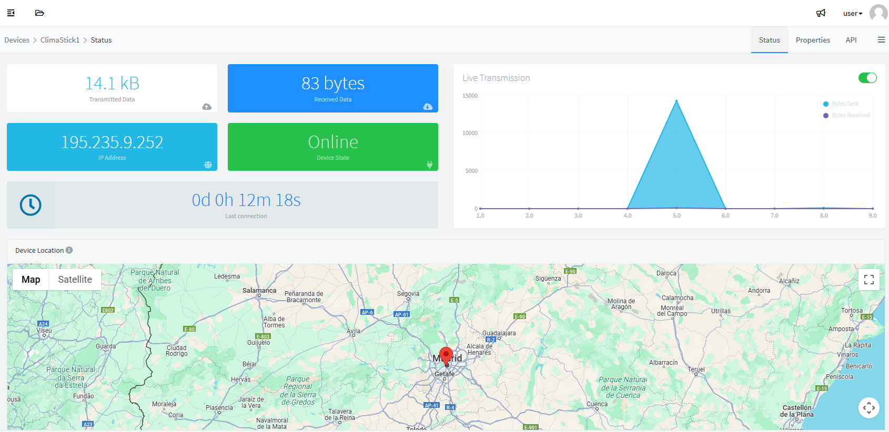
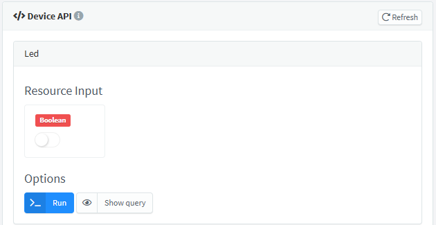
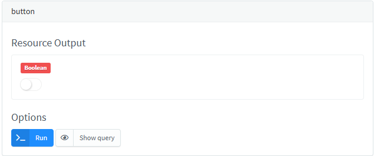

# DEVICES ADMINISTRATION

\
A device in Thinger.io is typically a virtual representation of a physical object connected through an IoT terminal. This instance will receive a series of capabilities on the Thinger.io platform, such as:

* State registration (connection, IP, data bandwidth)
* A unique access REST API
* Storage of attributes through properties. These can be individual or inherited from a group or product profile.
* Storage capabilities in data buckets

Device instances can be provisioned in two ways:

## Create a Single Device

The first step to start any IoT project with Thinger.io (except for not connected devices like Sigfox) is creating a device profile, which relates the hardware device to the user account. Any device in Thinger.io must be registered to get access to the cloud. Each one has its identifier and credentials and is related to the user account. This section describes the required steps to register a new device in your account.

All device creation and management processes are performed from the devices tab in the main menu


This section allows us to show all registered devices and some information about their connection status:

<figure><figcaption></figcaption></figure>

If it's your first time on Thinger.io, this list will be empty. Next, we'll show you how to create your first device. First of all, click on **Add Device,** which will open a form in which you can introduce your device identification credentials and select a **Device Type** from the drop-down list, selecting one of these types:&#x20;

* **IOTMP device**: For devices with the Thinger.io software client installed on them. Such as Raspberry Pi, Linux, or Arduino devices, that will work using IoTMP (Internet of Things Message Protocol)  to transfer the status information and data points.&#x20;
* **HTTP device**: This option allows creating a virtual device to integrate data via REST API Callback, providing nice integration with third-party platforms and other frameworks (Java, Python) and allowing them to work with their data in a simple way.&#x20;
* **MQTT devices:** For MQTT devices that will work with the Thinger.io embedded broker (only for private instances).

<figure><figcaption></figcaption></figure>

Once you select your device type, the form will automatically adjust the device definition parameters according to its specific requirements needed to create the device profile.

* **Device identifier:** It must be unique within your devices
* **Device name:** An optional human-readable name for the device. It’s useful for UI display and should be unique across your devices for clarity.
* **Device description:** A free-text field to describe the purpose or location of the device, making it easier to recognize and manage within your project.
* **Device credentials:** A secure authentication key required for the device to connect to the Thinger.io platform. You can enter your own credentials or generate a random one using the “Random” button. Keep it safe, as it will be used by the device to authenticate its communication.All your passwords on the server are stored securely using `PBKDF2 SHA256` with a 32-byte salt generated with `PRNG` and a non-depreciable amount of iterations.&#x20;
* **Asset Type:** Optionally assign a type/category to the device (e.g., sensor, gateway, actuator), helping with filtering and organization.
* **Asset Group:** Select or assign a group or cluster the device belongs to. Useful for grouping devices by location, customer, or function.
* **Product:** Link the device to a product definition, allowing you to reuse standardized resources (e.g., inputs, outputs, properties) across multiple devices of the same type.
* **Enable**: Toggle to activate or deactivate the device. A disabled device cannot connect or report data until re-enabled.

\
Keep your **Device identifier** and **Device credentials**, as you will need them for connecting your device (the password cannot be recovered later).

Right after, you will be redirected to the device profile, where you will see its status, which shows: data transmitted and received, IP address, device state (online or offline), last connection, device location and the daily data transmitted.


Depending on your device, you will need to install the required libraries or development environment, so check out the following sections according to your device:



[arduino](../arduino/)



[linux.md](../linux.md)


Remember that Sigfox devices do not share the concept of "connected devices", as they are by default offline devices that send information periodically. To store information from these devices, please check the documentation.


[sigfox.md](../lpwan/sigfox.md)


***

For this example, the Arduino IDE will be used with an ESP8266 device, such as the NodeMCU. The example code for the ESP8266 can be opened and filled in with the device details: the username, the device ID, and the device credentials established during device creation. These pictures illustrate the relationship between the code and the device created in the account.

<figure><figcaption></figcaption></figure>

Once we have established in the code our account identifier, device identifier, and device credentials, we can compile and flash the program. Meanwhile, we can open our device in the cloud console, just by clicking its identifier in the devices list. On the device screen, information regarding the device will be visible, such as its IP address, connection status, and sent/received data in real time. By default, the device will appear as disconnected:

<figure><figcaption></figcaption></figure>

Once the device gets connected to the account, the interface will change its status, showing "Online" status, and some connection data like the IP address or the upload/download data amount:



Note that the connected device profile can show an estimated location of the device, which can be customized when modifying the "location" property as explained in the [**properties**](https://docs.thinger.io/console/devices-administration#device-properties) section of this documentation.&#x20;

Also, there is an additional section below, the Daily Transmission Data:

<figure><figcaption></figcaption></figure>

Having the first connected device, we are ready to discover all the other Thinger.io features.

## Create a Large Device Network

By means of the `Products` feature, Thinger.io enables efficient management of large fleets of IoT devices through self-provisioning. This means that, instead of manually registering each device, create a 'product profile' that represents a specific type of device or category with common characteristics.

Once a product is configured, you can define its characteristics, such as common data buckets to store the historical data of each device, default properties that will be inherited, device dashboard, and data processing scripts.&#x20;

Thinger.io facilitates this process by providing unique access tokens for each device, ensuring a secure and reliable connection. Additionally, through the self-provisioning functionality, devices can automatically register on the platform without manual intervention.

This is especially useful when managing a large number of devices, as it greatly simplifies the onboarding process and subsequent management. In summary, the 'products' functionality with self-provisioning in Thinger.io is a powerful tool for scaling and effectively managing IoT device fleets.

## Device Explorer

Each device comes with an explorer and administration interface that allows showing and configuring different device features. This interface is common for all device types in thinger.io, but note that some features, such as the "device API explorer", may not be available if the device does not have an actual real-time connection with the server.&#x20;

In the next sections, it is explained each different feature of the device explorer:

### Device API

***

A notable feature of the Thinger.io platform is its ability to discover resources defined within a device. A resource can represent a sensor reading, such as temperature, humidity, or pressure, or an actionable element like a light, relay, or motor. Generally, any device resource functions as a callback that can be invoked on demand via a REST API. This section explains how to interact with device resources through the cloud console and demonstrates how to issue custom REST API calls to query a device.

Once a device is connected to an account, as described in the preceding section, its resources and API REST endpoints can be accessed and explored using the API Explorer. This screen is accessible from the Device Dashboard by clicking the small blue "Device API" button.

Within the API Explorer interface, a distinct box will be visible for each resource defined in the code. Each resource possesses an identifier linked to the resource name established in the code. The Thinger.io platform supports four different types of resources: one for input (sending data to the device), one for output (the device sending information), one for input/output (allowing both sending and receiving information in a single call), and a callback resource (which can be executed without sending or receiving information). From an API perspective, input and output data can be any JSON document. Consult the library documentation for details on defining these various resource types.

For example, the default ESP8266 example in the Arduino libraries defines two different resources. One input resource, called `led`for controlling the `LED_BUILTIN`, and one output resource, called `millis` to extract the current "millis" value of the device. Notice that a resource name can be any arbitrary text to identify the underlying resource, as they are not tied to any constant defined in the platform.

So, these are our sample resources:

```cpp
thing["Led"] << digitalPin(LED_BUILTIN);
thing["button"] >> outputValue(millis());
```

If our device is connected to the platform, we can open our device API explorer and see the defined resources in the platform:



<figure><figcaption></figcaption></figure>


Defined resources within the device are now available on the platform, as the device is capable of reporting its available resources and their format or current state. The intent is to allow for real-time testing and interaction with these resources. In this case, it will be possible to switch the LED state or read the current milliseconds from the Arduino device. Each click of the "Run" button will execute the resource, i.e., forcing a read from a sensor, calling the `millis()` function, or sending a new state for the actuator, depending on the resource type (input or output).

Thanks to this feature, every device resource can be translated to a REST API endpoint in a very simple way, so it can be consumed or interacted with by any other devices or applications using standard REST queries, i.e., using a `POST` method to send values to the device, or using a `GET` method to read information from the device.&#x20;

It is also possible to create more complex resources with both input and output functionalities. This example returns the sum and multiplication between two integer numbers:

```cpp
thing["in_out"] = [](pson& in, pson& out){
    out["sum"] = (int)in["value1"] + (int)in["value2"];
    out["mult"] = (int)in["value1"] * (int)in["value2"];
};
```

This resource definition will be translated to the following resource in the platform, where it is possible to both test input values and view the output result. So, try entering some values, click on `Run`, and see the output reported by the device. This example also emphasizes the functionality of resources, highlighting that they are not merely static values but rather callbacks that can be invoked with any input or output value. When our device API explorer is opened, it shows other defined resources in the platform:

<figure><figcaption></figcaption></figure>

***

Beyond the useful device API explorer, which facilitates interaction with devices, specific information about the REST API endpoint can be obtained by clicking the Show Query button. This reveals details such as the method type, URL, content type, request body, and response body. Additionally, clicking `Curl`allows for copying the command to interact with the device directly from the console. The preceding example translates to the following REST API call:

.PNG>)

There is more information available about the API for interacting with the devices [here](http://docs.thinger.io/api/#devices-api-access-device-resources).

### Device Tokens

***

All interactions with connected devices, such as those using the REST API endpoints mentioned previously or a mobile phone, require authentication against the platform. By default, when interacting with devices via the Thinger.io console, all requests to the platform are implicitly signed with an access token obtained from the username and password. This type of authorization grants access to all account resources, allowing for the configuration of devices, buckets, and so on. However, this authorization expires frequently (though it is automatically renewed by the browser) and cannot be used to grant device access to other users or platforms, as it would provide access to the entire account.

In this scenario, it is possible to create specific access tokens for granting access to devices and even to particular resources on those devices. Furthermore, the token's validity can be defined by enabling an expiration date. Thus, if access to certain device resources needs to be provided to a third-party tool like IFTTT, an external web page, a mobile phone, or any other service, creating a device token is highly recommended.

To create a device token, open the device profile and take a look at the subsection called "Device Tokens". Then, click on the green button `Add` on the right of the box. Then, a modal window will appear, where different parameters can be configured:

* Token name: Use a representative name to remember why the token was issued, i.e., IFTTT Access, Mobile phone, etc.
* Token access: Configure the token to allow accessing all device resources or limit access to a set of resources.
* Token expiration: Configure the token to expire at some given date or be available indefinitely.

While configuring a device token, click on  `Select Resources` :

<figure><figcaption></figcaption></figure>

Once the token is saved, the interface will show the access token to be used in the REST API Calls. If any help is needed to integrate this access token in the REST API calls, check out [this](http://docs.thinger.io/api/#authentication-api-rest-api-authentication) documentation.

<figure><figcaption></figcaption></figure>

Note that it is possible to create a QR code in order to share this resource access with third parties or APPs.

<figure><figcaption></figcaption></figure>

### HTTP devices Callback <a href="#http-devices-callback" id="http-devices-callback"></a>

Because of the nature of these devices, [thinger.io](http://thinger.io/) applies a special treatment, based on the use of callbacks, to make the integration. A callback is a functionality of the server that can be used to request a process with device data by means of an HTTP query, such as storing it in a bucket, calling an endpoint profile, or registering the information contained in a JSON that should be sent with the query.

To create a callback, first, navigate to the device profile.&#x20;

In the top right corner of the menu, a three-line icon will be found. Clicking it will reveal a drop-down menu that includes the desired callback option:

<figure><figcaption></figcaption></figure>

After clicking "callback", different options in the callback details will be displayed:

<figure><figcaption></figcaption></figure>

Different functionalities can be requested from the server using a callback, by just clicking the checkbox and selecting the resource that will receive the data, such as:

* Data storage in scalable [Data Buckets](http://docs.thinger.io/console/#data-buckets)
* Calling [Endpoint Profiles](http://docs.thinger.io/console/#endpoints) to integrate with third parties
* Retrieving or modifying [Device Properties](http://docs.thinger.io/api/#Device-properties) using `Set device property` or `response data` features.

Note that it is not possible to create properties, data buckets, or endpoints through callback requests, so it is necessary to initialize them first using the web console or via REST API.

Once the callback details have been configured, the system will be ready to receive a request. Similar to the "show query" feature in the Connected device's dashboard, a precise specification of the HTTP request structure and a complete cURL example can be found by clicking on the `Callback / Overview`context:

<figure><figcaption></figcaption></figure>

Scrolling down, this cell will appear:

<figure><figcaption></figcaption></figure>

Finally, to create a Callback HTTP request, take into account that the `Authorization Header` must be included in the HTTP request:

```
https://<Thinger_Server>/v3/users/<Username>/devices/<Device_ID>/callback?authorization=<Authorization_Header>
```

### Device Properties <a href="#device-properties" id="device-properties"></a>

[Thinger.io](http://thinger.io/) provides a simple way to store additional information related to a specific device, such as location, identification, or even configuration parameters that may be retrieved by devices using common JSON files. In this way, the platform can be used as a device's persistent memory. To create a device property, open the device profile and take a look at the subsection called "Properties".

<figure><figcaption></figcaption></figure>

This menu provides an easy way to create, manage, or delete the device's properties. Note that the property created in this example specifies the device location. The [Thinger.io](http://thinger.io/) system has been designed to detect this configuration and automatically represent it on the device profile map. To add a new property, click the "Add" button located within the Properties section. If location is written as a Property Identifier, this will show:

<figure><figcaption></figcaption></figure>

***

If a different word is entered, it becomes possible to adjust the specific JSON variables to be targeted:

<figure><figcaption></figcaption></figure>

Property declarations and modifications are made by means of a special context, provided with a JSON validator that enhances the text and checks morphological mistakes.

#### Coding with properties <a href="#coding-with-properties" id="coding-with-properties"></a>

It is also possible to create, retrieve and modify data properties from devices. However, at this point, we must differentiate between HTTP devices or [thinger.io](http://thinger.io/) software client devices, which will use `set_property()` or `get_propery()` commands:

* **Setting a property**

```
                    /*set property value*/
void loop(){
thing.handle();

if(event){    //must be flow controlled

    //create a pson with new values
    pson data;
    data["longitude"]=-4.056;
    data["latitude"]=41.40;

    //sending new values to the platform
    thing.set_property("location", data, true);
    }
}
```

* **Reading a property**

Where "location" is the property\_ID, "data" is the PSON to be sent, and the boolean (true/false) to get writing confirmation.&#x20;

```
                /*retrieve property value*/
void loop(){
thing.handle();

//creating a pson to store the property values
pson data;

//retrieving data from the platform
thing.get_property("My_Property", data);
  float lng=data["longitude"];
  float lat=data["latitude"];
  Serial.print("L: ");
  Serial.print(lng);
  Serial.print(" , l: ");
  Serial.println(lat);
}
```


More details about property codification functions at the **"**[**codification**](../coding-guide.md)**"** section of this documentation.


Using HTTP devices, it's also possible to interact with properties through the callback configuration submenu tools under `Callback Details` . For example, the Response Data:

<figure><figcaption></figcaption></figure>

According to this configuration, when the [Thigner.io](http://thigner.io/) server receives any transmission from "SigfoxDevice1", the payload data will be stored in the "data" property, creating a JSON with all variables. In the opposite situation, thanks to the "Response Data" feature, the values stored in the parameter, which was called "downlink\_data", will be sent to the device through the Sigfox infrastructure.

### Device Online Terminal <a href="#device-settings" id="device-settings"></a>

This feature has been designed to work as a common program terminal, allowing printing of debug or execution messages from the device program, but working online through a device resource.&#x20;


This feature is only available for generic devices equipped with the Thinger.io software client code library


To open a terminal, first, navigate to the device profile. Then, in the top right corner of the menu, find a three-line icon. Clicking it will reveal a drop-down menu that includes the terminal option:

<figure><figcaption></figcaption></figure>

### Device Settings <a href="#device-settings" id="device-settings"></a>

***

Some device details, such as its description or credentials, can be adjusted by navigating to the "Settings" subsection of the device dashboard. This allows for changing the device credentials to new ones in case they have been forgotten (the password cannot be recovered from a database as it is encrypted). It should be noted that changing the device password will not disconnect the device, but it will prevent its reconnection once disconnected.

To access the settings, first, navigate to the device profile. Then, in the top right corner of the menu, a three-line icon will be found. Clicking it will reveal a drop-down menu that includes the desired settings option.

<figure><figcaption></figcaption></figure>

If changing the device identifier is needed, it is necessary to delete the device and register a new one with the desired one.
