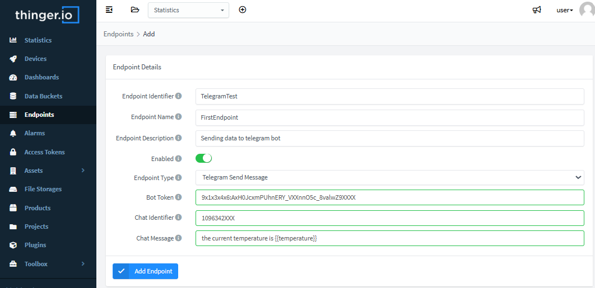

# ENDPOINTS

An endpoint is the entry point to a service, a process, or any other destination. So, in Thinger.io, an endpoint can be defined like a target destination that can be called by devices to perform any action, like sending an email, sending an SMS, calling a REST API, interacting with IFTTT, calling a device from a different account, or calling any other HTTP endpoint.

Calling those endpoints directly by devices can be complex in small microcontrollers, and would require more bandwidth in devices. This way, Thinger.io can handle endpoint calls that can be requested directly by devices, activating them by using their identifier and passing any information required. It also adds some flexibility, as the endpoint request can be dynamically changed as necessary, while the deployed code in the device remains the same.

## Create Endpoint

To manage all the endpoints, it is necessary to access the Endpoints section, by clicking on the menu item:


Then click on the Add Endpoint button, which will open a new interface for entering the endpoint details:


Here, it is necessary to configure different parameters:

* **Endpoint Identifier**: Unique identifier for the endpoint (_the device must use this identifier for activating the endpoint_).&#x20;
* **Endpoint Name**: Unique name for the endpoint.
* **Endpoint Description**: Fill here any description or detailed information needed to keep about the dashboard.
* **Endpoint Type**: Defines the endpoint type, depending on the selected type, the endpoint will present different fields. In the following sections are described some of these types.

## Useful Endpoint types

### Email Endpoint

An email endpoint enables the sending of emails from devices. The target email address, subject, and email body can be defined.

The configurable parameters are:

* **Email Address**: The target email address of the message.
* **Email Subject**: The email subject.
* **Email Body**: Allows defining the email body, which can be a plain JSON text with the data sent from the device, or a custom body that can also contain information gathered from the device.

There is an example of an email endpoint that contains some text and variables that are filled when the device calls the endpoint, adding the current temperature and humidity reported by the device. Notice that `temperature` and `humidity` variables are closed inside double brackets `{{}}`, so the endpoint will be expecting this information to complete the body.


Calling endpoints is well documented [here](http://docs.thinger.io/arduino/#coding-using-endpoints-calling-endpoints), but it is basically required to call the endpoint by using the `call_endpoint` method, which requires the endpoint id, `ExampleEmail` in this example, the optional data to be sent to the endpoint, which is a `pson` document (quite similar to JSON) with two keys named `temperature` and `humidity` holding the readings from a DHT sensor:

```cpp
pson data;
data["temperature"] = dht.readTemperature();
data["humidity"] = dht.readHumidity();
thing.call_endpoint("ExampleEmail", data);
```

**Note**: To include a single value in the email body, use the double bracket `{{}}` without any key, and send a `pson` document from the device with a single value:

```
Temperature is: {{}} ºC
```

Can be filled with this call in the device:

```cpp
pson data = dht.readTemperature();
thing.call_endpoint("ExampleEmail", data);
```

### HTTP Endpoint

An HTTP endpoint is a generic type of endpoint that can be used to interact with any other web service or web application. So, this endpoint can be configured to make any HTTP request by configuring the method, URL, headers, and body.

The configurable parameters are:

* **Request URL**: Configure the method (GET, POST, PUT, PATCH, or DELETE), and the request URL.
* **Request Headers**: It is possible to add headers to the request, which can be useful for adding authorizations, controlling caches, configuring content type, etc.
* **Request Body**: The body can be either a custom body with a specific content or a JSON payload with the information sent by the device. In a custom body, it is possible to add custom variables, as shown in the email example. This way, it is possible to create content in different formats like XML, SOAP, etc (remember to add the adequate content-type in this case).


### Telegram Bot Endpoint

This endpoint is pre-configured to send data to a Telegram bot in a simple way and thus use the messaging platform to get alerts or data from the IoT devices through Thinger.io.



The next parameters need to be configured to work with telegram bot:

* **Bot Token**: Is the bot identification and authorization stream, this parameter can be left empty on this form in order to specify it directly in the device source code with the key "token".
* **Chat Identifier**: Is a 10 digits chat identificator that can be obtained from Telegram conversation information. It can be left empty at this configuration and be called in the source code with the key "chat".
* **Chat Message**: Is the text and device data that wants to be sent in the message, it can be specify here or hard coded in the device to be send on the endpoint call with the key "message".
