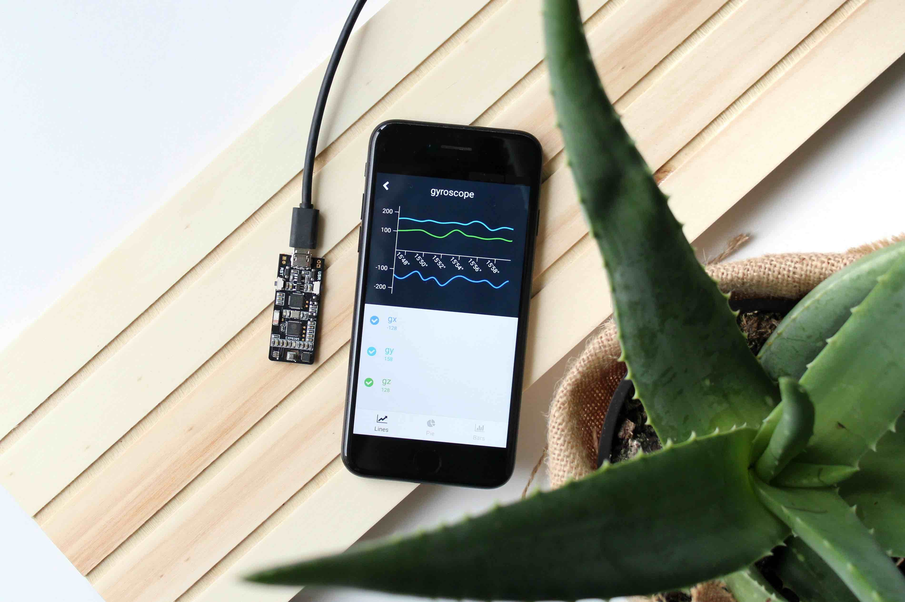
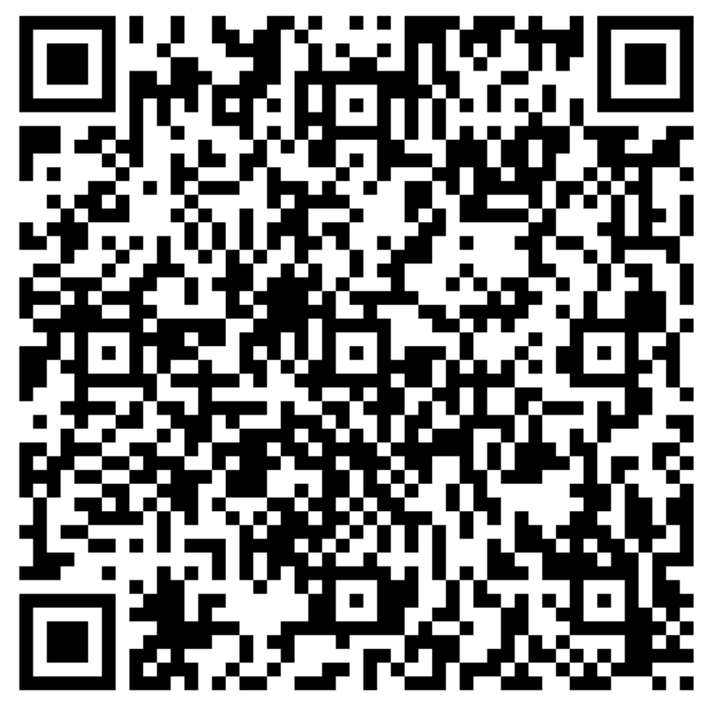
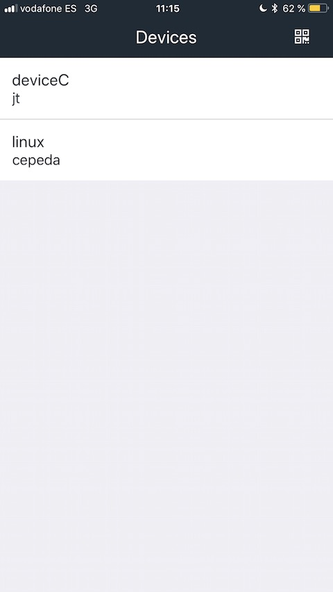
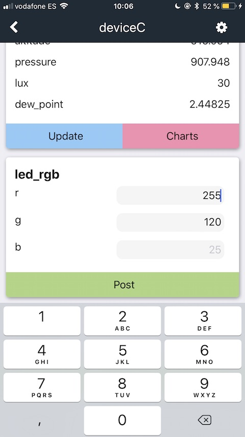
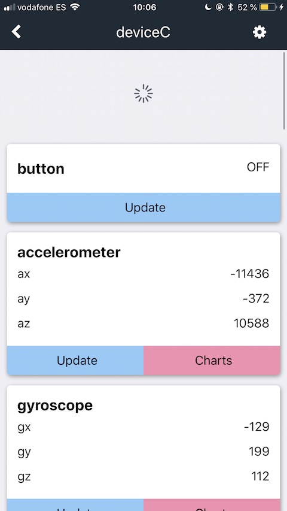
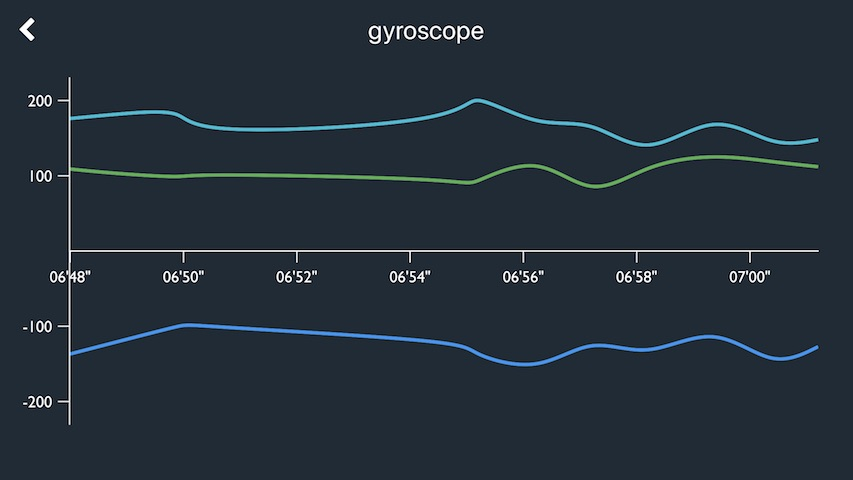
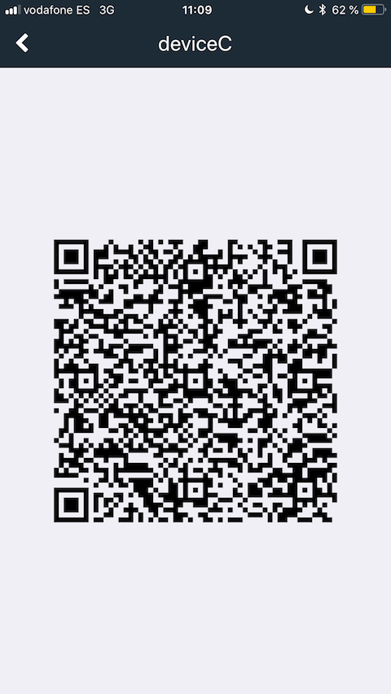

Introduction
============
 

This documentation provides information about the mobile app of the Thinger.io IoT platform. This way you will learn how to manage different elements of the platform on your smartphone. The app is available on Google Play and the App Store and it is ready for being downloaded.

Usage
=====

## Add Device
First of all, you need to scan a token QR of one of your devices. Read **Device Tokens** section [here](http://docs.thinger.io/console/#devices-device-tokens) to learn how to generate your tokens in the Thinger.io console. Keep in mind that also you can add a device from other users if you have the appropriate token. If you haven't a token device yet you can try the app with this one:

You can scan your tokens pressing the QR icon on the top of main screen and aiming with your camera to your QR. Now you can view the scanned devices on the main screen.

## Receive and send data
With the Thinger.io app is very easy to check the status of your devices. All resources of the device are divided in different cards with all the available information. You can visualize and update output resources, edit and post input resources and call run resources.

It is possible to **update** a resource pressing the blue button or all of them dragging the screen downward (pull-to-refresh).

For **post** a resource you must fill the input fields and press the green button. If you don't fill some field, the post is done with the latest value (in grey).

For call to **run** resources just press the paper plane icon.

## Charts
A cool function of the Thinger.io app is how easy is monitor your resources in real time with three different charts types: lines, bars and pie chart.

If you select the option ***Charts*** of a resource, you can visualize it. And it is very easy select which items you want to plot. Behind the chart there is the legend. Pressing on every item you can select/unselect them. Keep in mind that you can represent numbers, but no strings o booleans. Additionally, the pie chart just works with positive numbers.

Do you want to try another amazing function? Rotate your device and watch the charts in full screen.

## Settings
For every device added to your smartphone you can edit some settings. For access to the device settings, you must press the wheel button on the top of the screen.

**Name** is an alias for your added devices. It is very useful if you want to identify devices from another person.

If you are not using the Thinger.io server, you must change **Server** element to point to your server. Read the [deployment](http://docs.thinger.io/deployment/) section for more information if you are interested in use your own server.

Inside the **Token QR** section you can visualize the token for share with a friend.

The button **Remove** deletes the device from the smartphone.

 