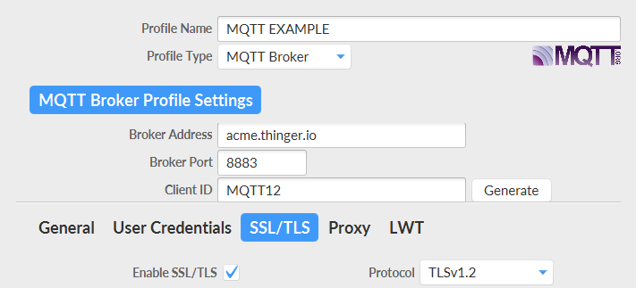

# MQTT CLIENTS

## Introduction to MQTT

MQTT is an M2M communication protocol that has become very popular for IoT purposes due to its simplicity and lightness. It uses a pub-sub messaging paradigm in which the devices, also called **"clients",** maintain a TCP/IP connection with a server, being able to perform two different types of communication:&#x20;

* **Publish** messages with an identification that is called "topic". In this way, the devices can send data to the server.&#x20;
* **Subscribe** to a specific topic to receive data from the server.&#x20;

The server, also called **"broker"**, keeps a register of all connected devices and their pub-sub behavior, allowing fast, efficient, and asynchronous data communications.

## Integration of MQTT devices&#x20;

Thinger.io Platform has been provided with a custom MQTT broker that can be used to integrate devices with this protocol with ease, allowing publish and subscribe communications. The next sections explain how to work with both to integrate MQTT data with the platform.

The process is carried out in two parts: on the one hand, the definition of the device at Thinger.io Platform Server that will act as a Broker, and on the other hand, the configuration of an MQTT Client.

### Create an MQTT device at Thinger.io &#x20;

Creating the device on Thinger.io is done like any other resource on the platform, just accessing the device list, available in the "devices" section of the main menu and clicking on the "Add device" button:&#x20;

<figure><figcaption></figcaption></figure>

Then the "new device form" will appear, allowing for the introduction of device information:

<figure><figcaption></figcaption></figure>

* **Device Type**: MQTT device should be selected
* **Device identifier:** Must be unique within the devices
* **Device description:** Additional information that may help to identify each device
* **Device credentials:** This is the device security password, it can be randomly created using the bottom button.

When all the information has been introduced, pressing the "Add Device" button will create a new device profile in the device list. If everything is right, a confirmation message will appear, meaning that Thinger.io Platform is ready to receive data from the MQTT devices. &#x20;

### Configure the MQTT client to connect with Thinger.io&#x20;

The integration's second part is configuring any device or program as a client to connect to Thinger.io and start publishing or subscribing data. In any case, the following parameters must be introduced to the client in order to create the connection:&#x20;

*   **Broker Address**: The server web domain (without http:// command). When working with the freemium server use:&#x20;

    ```
    backend.thinger.io
    ```
* **Broker Port**: 1883 for non-secure connections, or 8883 for SSL/TLS
* **User Name**: Thinger.io username (not email address)
* **Client ID**: The device identifier that was configured at the device form
* **Password**: Must be the same password that was placed on Thinger.io "Device Credentials" parameter
* **MQTT version**: Currently, Thinger.io supports 3.1 or 3.1.1 versions of the protocol

.png>)


It is mandatory to enable SSL/TLS if the Broker Port = 8883:

<figure><figcaption></figcaption></figure>


It is recommended to use SSL/TLS communication using the port 8883


Once the client has been configured, it should be able to publish and subscribe data with the server, for example, using the `mosquit_pub` client:

```
mosquitto_pub -d -h backend.thinger.io -p 1883 -i MQTT -u jt -P testCredential -t telemetry -m '{"temperature":5}'  

Client MQTT sending CONNECT
Client MQTT received CONNACK (0)
Client MQTT sending PUBLISH (d0, q0, r0, m1, 'telemetry', ... (17 bytes))
Client MQTT sending DISCONNECT
```

Where `MQTT` is the  Client ID, `jt` is the user account, and `testCredentials` is the device password.&#x20;

Note that the Thinger.io MQTT broker has been designed to support multi-tenancy by default. It supports multiple clients/organisations to use the same broker without overlapping topics.

## Working with MQTT data

Once the MQTT device is connected to the platform, there are different ways to work with its data:&#x20;


The most recommended way to work with MQTT device data is to configure a **`Product`** profile, which allows building interfaces between the MQTT broker topics and the platform features. [**Check the "Products" section**](business-features/products/) to learn how to work with this feature.


However, it is also possible to store raw MQTT data using the data buckets feature as explained below.

### Storing data in buckets

Thinger.io data buckets are a virtual storage where any kind of time series data can be saved. This information can be used to be plotted in dashboards or exported in different formats for offline processing.\
\
Configure a data bucket to store data from a specific MQTT topic just requires going to the "Buckets" section of the main menu and pressing the "Add Bucket" button to access the "new bucket form", which introduces the topic configuration: &#x20;

<figure><figcaption></figcaption></figure>

The next parameters need to be configured:&#x20;

* **Bucket ID**: Unique identifier for the bucket.&#x20;
* **Bucket name**: Use a representative name to remember the bucket scope, like `WeatherData`.
* **Bucket Description**: Fill here any description with more details, like Temperature and humidity in the house.
* **Enabled**: Data bucket recording can be enabled or disabled. Just switch it on to enable it.
* **Data Source**: Commonly, this defines the Thinger.io device or resource that will be subscribed by the server. In this situation, "From MQTT Topic" must be placed
* **MQTT Topic**: place here the MQTT topic that will be subscribed by the server&#x20;

This way, Thinger.io Platform server will be configured as an MQTT broker but also as a topic consumer in order to provide additional features. Then, the client must be configured to send data in JSON format.


Use **JSON** as the payload type for the device messages stored by buckets.


### Showing data in Dashboards

Now that the MQTT data is being stored in the data bucket, it is possible to show it on dashboards, where multiple widgets can be used to create real-time or historical representations by selecting the bucket as the data source:&#x20;

<figure><figcaption></figcaption></figure>

Dashboard widgets can show data from different devices and have been configured to create flexible data representations, as we have explained in the [**dashboard section of this documentation**](features/dashboards.md).&#x20;

.png>)


