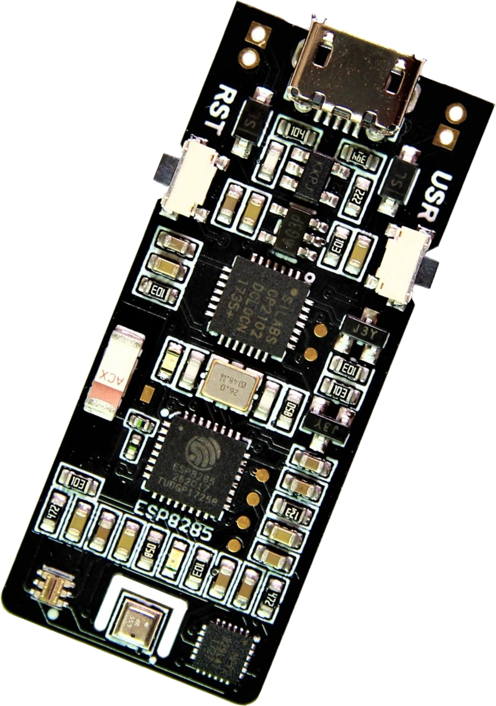

# ClimaStick

<figure><figcaption></figcaption></figure>

## ClimaStick Reference

This board is a complete Internet of Things development kit that integrates WiFi connectivity along with a set of powerful sensors to provide environmental and motion sensing. This way, it is possible to create several connected projects easily. It is fully compatible with the Thinger.io cloud infrastructure and provides easy-to-use libraries that can be used in the Arduino IDE.

### Board Layout

#### ClimaStick V1.1:


#### ClimaStick V2:


### Board Features

* Environmental sensing for temperature, relative humidity, barometric pressure, and lux intensity. A micro weather station!
* Inertial Measurement Unit (IMU), integrating an accelerometer, a gyroscope, and a digital compass.
* Li-Po Charger. It can charge (and be powered by) batteries from a solar panel or the built-in USB.
* RGB Led (only in ClimaStick V1).
* User button.
* Fully compatible with the Arduino Environment. Can be programmed directly from the Arduino IDE. There are libraries for reading the sensors and connecting the board to the Thinger.io Cloud or other Internet services.

### Sample Use Cases

* Education: This board provides an easy-to-use environment for education. It is fully compatible with the Arduino IDE, ensuring continued use of this familiar environment. The board also integrates multiple sensors, allowing students to develop projects directly. This eliminates the need for extensive wiring of multiple sensors and controllers on large protoboards, thereby avoiding potential shorts and burns. Moreover, its integrated WiFi capabilities enable students to advance in building connected solutions, including creating dashboards, sending emails, and recording data.
* Remote Telemetry: It provides a full IMU with Wifi connectivity that can be used for remote telemetry. The low weight of the device (4gr) and the option for setting a different power supply than the USB make this board an excellent option for monitoring drones or UAVs in real-time.
* Industry 4.0: It can be used in industrial environments for predictive maintenance, as it is possible to measure vibrations, temperature, and humidity in real-time and determine if the sensed parameters are between normal operation thresholds.
* Weather Station: This device can be used as a micro weather station. It can be powered easily from a battery and a solar panel, and collaborate with weather platforms, or just store the information in the Thinger.io cloud.


To obtain highly accurate weather variables, the PCB processor must be hibernated using the "ESP.deepsleep()" instruction. &#x20;


## Configure Environment

This section covers how to set up the computer to start working with the ClimaStick device.

### Install required components

* CP2102 drivers from Silicon Labs may need to be installed if the ClimaStick device is not recognized by the computer. This driver facilitates USB-to-serial communication with the board.

[Download page >](http://www.silabs.com/products/mcu/pages/usbtouartbridgevcpdrivers.aspx)

* Arduino IDE v1.6.13 or newer.&#x20;

[Download page >](https://www.arduino.cc/en/main/software)

### Configure Arduino IDE

1- Open File > Preferences > Additional\_Boards\_URL\_Manager to include the "ESP8266 boards manager link" that can be retrieved from the [Github community project](https://github.com/esp8266/Arduino). It is normally:

`http://arduino.esp8266.com/stable/package_esp8266com_index.json`


2- Open Tools > Boards > Boards Manager... and search for ESP8266 package, then install the latest version.

.PNG>)

3- Almost any ESP82XX processor can now be programmed directly from the Arduino IDE. Under `Tools > Boards`, the newly installed ESP8266 community boards should be visible.

1. For program ClimaStick V1 select **NODE\_MCU V1.0 (ESP-12E Module)**.
2. For program ClimaStick V2 select **WeMos D1 Mini Lite**.


4- Open Sketch > Include Library > Manage Libraries, and search for **Thinger.io** libraries. Then install the Thinger.io and ClimaStick libraries:


5- Connect the ClimaStick to the computer and select its serial communication port number on: Tools > Port. It normally will be a COM port, or named as /dev/cu.SLAB\_USBtoUART on Mac.

6- Now, start developing with Thinger.io ClimaStick! It is helpful to start with the examples provided in the library by opening File > Examples > ClimaStick.

### Uploading firmware

The ClimaStick board can be programmed directly by pressing the Upload button of the Arduino IDE, as it has been designed with an automatic synchronization circuitry.  However, if the synchronization fails or the program is not able to connect with the PCB, please follow the next checklist in order to identify the problem:&#x20;

#### Firmware upload Troubleshooting

* Be sure that the micro USB wire allows data transmission. Some cables are only for electrical power and may not work properly.
* Verify that the operating system properly recognizes the CP2102 serial port interface.
* Check the selected serial COM port on Arduino IDE: Tools > Port
* ⚠ **Flash boot mode:** If it is confirmed that everything is configured properly and the problem persists, a flash boot-up can be forced by pressing the USR button on the board, then pressing the RST button once, and finally releasing the USR button. Following this procedure, the PCB should be ready to receive the program.


ClimaStick's processor status can be checked by opening the Serial Port inspector of Arduino IDE and selecting 74.880 baudrate. When booting up, the PCB will print the boot status between two possibilities:  &#x20;

1\) If the processor is in normal execution mode, a message ending with the command "mode(3,6)" will be printed.&#x20;

2\) If Flash mode, a message ending in  "mode(1,6)" means that the processor is ready to receive a new sketch.&#x20;


## QuickStart Examples

The system should now be ready to open and upload any example from the ClimaStick library to the ClimaStick device. In the Arduino IDE, navigate to `File > Examples > ClimaStick` to access examples illustrating the most useful functions of the board's features, including sensors, IMU access, battery level readings, weather conditions, and LED state changes.

### ClimaStick Auto

The ClimaStick\_Auto example code is a little sketch that integrates all ClimaStick functionality, defining all sensor resources that will be accessible from the Thinger.io Platform:

```cpp
#include <ClimaStick.h>

#define USERNAME "your_user_name"
#define DEVICE_ID "your_device_id"
#define DEVICE_CREDENTIAL "your_device_credential"

#define SSID "your_wifi_ssid"
#define SSID_PASSWORD "your_wifi_ssid_password"

ClimaStick thing(USERNAME, DEVICE_ID, DEVICE_CREDENTIAL);

void setup() {
  // configure board wifi
  thing.add_wifi(SSID, SSID_PASSWORD);
  // initialize board sensors
  thing.init_sensors();
  // define resources for all features
  thing.init_resources();
}

void loop() { 
  thing.handle();
}
```

### Data Recording using Sleep

The board can be easily configured to record environment values and then enter a sleep state. This functionality is quite useful when powering the device from a battery. This example will write the environment values to the specified `BucketId`, which must be created in the Thinger.io console.

```cpp
#include <ClimaStick.h>

#define USERNAME "your_user_name"
#define DEVICE_ID "your_device_id"
#define DEVICE_CREDENTIAL "your_device_credential"

#define SSID "your_wifi_ssid"
#define SSID_PASSWORD "your_wifi_ssid_password"

ClimaStick thing(USERNAME, DEVICE_ID, DEVICE_CREDENTIAL);

void setup() {
  // configure board wifi
  thing.add_wifi(SSID, SSID_PASSWORD);
  // initialize board sensors
  thing.init_sensors();
  // define the "environment" resource
  thing.init_environment_resource();
}

void loop() { 
  thing.handle();
  // write to bucket BucketId
  thing.write_bucket("BucketId", "environment");
  // sleep the device 60 seconds
  thing.sleep(60);
}
```

This example is particularly useful when accurate temperature values are required. Due to its low power dissipation capacity, the small ClimaStick board heats up quickly after a few seconds of operation, making accurate temperature readings challenging during constant work. To obtain more accurate temperature data, it is advisable to put the processor to sleep and wait a few minutes before taking a fresh sensor reading. The board supports the `thing.sleep(seconds)` function, that will sleep the processor and all WiFi transmissions. After the sleep, the device will start again like a normal reboot.

> **⚠ DEEPSLEEP CONSIDERATIONS:**
>
> * To allow the processor to automatically wake up it is mandatory to weld the WKUP connexion of the board bottom as shown in the section "other considerations".&#x20;
> * During the deepSleep mode, it is not possible to flash code. To change the program, make a forced flash mode boot up as described in the Uploading firmware section.
> * Note that, when the processor makes a hard reset, all dynamic variables will lost its values.

After some time, the bucket should look like:


That will allow creating historical dashboards like:


## ClimaStick Functions

The ClimaStick functions can be executed to read any sensor value as required by the application. Here we describe some of the most important functions. Using these functions always requires initializing the sensors in the setup method:

```cpp
void setup() {
    thing.init_sensors();
}
```

### Reading Accelerometer

```cpp
Accelerometer accel = thing.get_acceleration();
Serial.println(accel.ax);
Serial.println(accel.ay);
Serial.println(accel.az);
```

### Reading Gyroscope

```cpp
Gyroscope gyro = thing.get_gyroscope();
Serial.println(gyro.gx);
Serial.println(gyro.gy);
Serial.println(gyro.gz);
```

### Reading Compass

```cpp
Compass compass = thing.get_compass();
Serial.println(compass.heading);
Serial.println(compass.headingDegrees);
```

### Reading Magnetometer

```cpp
// you can also call thing.get_raw_magnetometer() to read raw values and not normalized
Magnetometer magnet = thing.get_magnetometer();
Serial.println(magnet.x);
Serial.println(magnet.y);
Serial.println(magnet.z);
```

### Reading Temperature

```cpp
float temperature = thing.get_temperature();
Serial.println(temperature);
```

### Reading Humidity

```cpp
float humidity = thing.get_humidity();
Serial.println(humidity);
```

### Reading Pressure

```cpp
float pressure = thing.get_pressure();
Serial.println(pressure);
```

### Reading Lux

```cpp
uint16_t lux = thing.get_lux();
Serial.println(lux);
```

### Change RGB Led (Only in ClimaStick V1)

```cpp
 int r=255, g=0, b=0;
 thing.set_rgb(r, g, b);
 // or
 thing.set_rgb("blue");
```

## OTHER CONSIDERATIONS

This section covers different considerations while using the board.

### General Considerations

*
* The device should be powered by a 5V USB power supply capable of providing 250 to 1000mAh of current.
* This board has a low heat dissipation capacity, so it is normal for it to heat up during high transmission processes. The temperature sensor may read elevated values while performing full-duplex communication.
* This device is developed for prototyping and software development support; therefore, it is not designed to withstand harsh weather conditions without an appropriate protective enclosure.
* Avoid touching the component surfaces while using the device, as electrostatic discharge can cause short circuits and malfunctions. It is recommended to handle the board by its edges:

<figure><figcaption></figcaption></figure>

* If necessary, clean the circuit using a non-damaging contact cleaner like Isopropyl alcohol and a soft brush.&#x20;
* Store in a cool, dry place. Protected from dust.

### External Power Supply

* If the VIN power header is used, care must be taken to connect it in the correct position. Not following this directive could damage the protection diode.

&#x20;

<figure><figcaption></figcaption></figure>

* ⚠ Do not use the VIN power supply and USB power supply at the same time! It can damage the hardware.

### Battery Power Supply

* A battery can be powered and charged directly from the board. Use the BAT power header, and take care of the polarity:

<figure><figcaption></figcaption></figure>

* BAT header is connected to a lithium battery charger that can manage 3.7Vdc, 500mAh Li-Po / Li-ion batteries' charge and discharge process.
* To charge a battery, connect it to the BAT header and power on the ClimaStick through USB / VIN connectors. The battery charger will manage the charging voltage to increase the battery life and stop the charging cycle when the voltage drops to 4.2Vdc.
* ⚠ If a different battery is being used, it should be plugged into the VIN connector.
* ⚠ If the cell voltage drops under 3.6V, an automatic battery protection circuit will power off the system.

### Wake-up selector

When using the Deep-sleep function, it is necessary to weld together the two connectors of the WKUP port in order to close the WKUP circuitry (GPIO16-RESET). This port is not originally soldered to avoid malfunctions in the programming process. It is normal that, by enabling this option, it is necessary to force the flash mode before each reprogramming.

.png>)

## Device Files

### Arduino Library

Click below to download latest ClimaStick.h library:



### Datasheets

Download the device datasheet from:

[ClimaStick V1 Datasheet >](https://github.com/thinger-io/Docs/tree/9fc057586e6704dcf058d1a33a7f25ae648c002c/hardware/climaStick/assets/ClimaStick_Datasheet.pdf)

[ClimaStick V2 Datasheet >](https://github.com/thinger-io/Docs/tree/9fc057586e6704dcf058d1a33a7f25ae648c002c/hardware/climaStick/assets/ClimaStick_V2_Datasheet.pdf)

### Design files

Download and edit the device files using Eagle CAD:

[ClimaStick V1 design files (.sch & .brd)](https://acme.thinger.io/v1/users/jt/storages/ClimaStickFiles/files/)

[ClimaStick V2 design files (.sch & .brd)](https://acme.thinger.io/v1/users/jt/storages/ClimaStickFiles/files/)

### Disclaimer

* This device is commercialized by the Thinger.io platform (INTERNET OF THINGER S.L.) as a development kit, so it is not subject to commerce homologation rules. The device owner is liable for all injuries to third parties and damage to their properties.&#x20;
