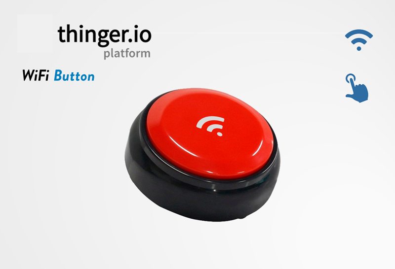

# WiFi Button


Introduction
------------


Thinger.io WiFi Button is a ready-to-go Internet of Things-based dash-button that integrates an ESP8266 processor with WiFi connectivity, along with a simple integration with Thinger.io platform events to provide flexible support for many different use cases.&#x20;

<figure><figcaption></figcaption></figure>

.png>)

These devices are aimed at creating simple interfaces, Huma-Internet, which can be used for any kind of project in education, connected industry, or home automation. Depending on the user requirements, the WiFi-Button can be used to execute functions through Thinger.io Platform, such as sending a notification via email, endpoints to IFTTT, messages to other devices or even, by means of a Thinger.io Server Event, trigger the execution of a flow in Node-RED.

.png>)

Our buttons come with an example program that enables configuration of a WiFi network and Thinger.io credentials via an onboard web server. Once configured, the device instantly connects to the specified Thinger.io Server to perform programmed functions. Afterward, the WiFi Button's hardware enters a hibernation state to conserve battery, extending its life to over 3000 pulsations under optimal conditions.

The following sections explain how to work with this example program and how to configure the Thinger.io platform to leverage its full capabilities.

## **Quick start guide**

This section contains the deployment instructions that should be followed on the device’s first run:

1. Opening the bottom battery cap, Insert with two R03 (AAA) 1.5V alkaline batteries, then close the cap and insert the security screw if available.&#x20;
2. Put the bottom switch in the “ON” position
3. Press the main button to first start the device. One “bip” sound will be emitted.
4. The device will create a WiFi hotspot that can be used to configure connection credentials using a multimedia device.

### **Button Status graph**

This device has been provided with a basic program that allows creating useful functionalities using Thinger.io endpoints. The next execution diagram shows how this program works and how to use the single button to move between the different program menus, which allows introducing or deleting WiFi credentials, changing the device program by using Arduino OTA feature or just making a single connection to order any functionality.&#x20;

.png>)

### **Device Sound interface**

This device includes a buzzer that provides a simple way to monitor its working status. The following sound commands list specifies the interface protocol introduced in the device.

| **Process status**                | **Sound specification** |
| --------------------------------- | ----------------------- |
| Wake up                           | **·**                   |
| 5 seconds pressed button          | **·**                   |
| Confirmation                      | **· ·**                 |
| WiFi error                        | **\_ \_ \_**            |
| Cleaning credentials menu         | **· · ·**               |
| Cleaning credentials confirmation | **\_**                  |
| Timeout, going to sleep           | **\_     \_     \_**    |

| Sound specification | **Sound description**     |
| ------------------- | ------------------------- |
| **"·"**             | short sharp sound (“bip”) |
| **"\_"**            | long grave sound (“daaa”) |
| "  "                | Silent                    |

### **Initial configuration process**

A brand-new device is not ready for immediate use; it requires the introduction of Wi-Fi connection credentials and user information. During its initial setup, the device will create a temporary Wi-Fi hotspot. This hotspot enables users to access a graphical configuration interface via a standard web browser. Follow the next steps to access this interface and configure the Wi-Fi credentials.


To conserve battery, the configuration hotspot remains active for 180 seconds (3 minutes). **After this period, the Wi-Fi button will automatically power off.** If the configuration process was not completed, it can be restarted by pressing the main button once.


1\)      With the bottom switch in the “ON” position, press the device and listen to the Wake-up signal (one “bip”).

2\)      Using a Smartphone or a Personal computer with WiFi connectivity, open the WiFi configuration and look for the button device WiFi hotspot. Then connect to this network by introducing the password, which will be the same as the WiFi SSID (wifi network name).

.png>)

3\)      When the device begins to connect to the access point, a Web Browser should automatically open the configuration interface:

.png>)


WARNING! If the computer is connected to the Wi-Fi hotspot but the web browser doesn't show this interface, it is possible to manually access it by opening a web browser and entering the 192.168.4.1 address in the browser bar.


4\)      Select **“Configure WiFi”** option by pressing the button on the main menu. This option initiates a scan to identify higher-quality WiFi signals within the surrounding environment (home or office), displaying them in the subsequent menu.

.png>)


IMPORTANT: If the desired Wi-Fi Network SSID doesn't appear in this list, pressing 'Scan' will launch a new scanning process. If the problem persists, the SSID can be manually entered into the SSID text box.


5\)      Select the correct Wi-Fi network SSID by clicking it, then enter the Wi-Fi security password to establish full connectivity for the Wi-Fi button device.

6\)      Continue by filling out the form as explained in the next section (Device Credentials Configuration).

7\)      Finally, press the 'Save' button to store credentials and initiate the device's first run.

If the device successfully connects to the Wi-Fi network, a confirmation sound will be emitted. After sending its first message, the device switches to a low power mode; however, the bottom hardware switch can be turned off to prevent accidental executions without affecting the saved configuration.


**WARNING!** If the connection wasn’t possible, **the WiFi hotspot will be launched again** in order to provide the user another chance to make the configuration. If, after 3 minutes, the device is not receiving interaction from the user, an alert signal will be emitted and the device will power off the WiFi hotspot. &#x20;


### **Device Credentials Configuration**

In addition to the common configuration parameters, each connected device has to be configured to send data to a specific IoT server. The next table shows all the parameters that can be changed in these buttons in order to adapt them to different use cases:

| **Parameter**           | **Description**                                                                                  |
| ----------------------- | ------------------------------------------------------------------------------------------------ |
| IoT server address      | Thinger.io Hostname, for example "acme.do.thinger.io"                                            |
| Server account          | Each account can be managed to a project or user, place here the name of these account           |
| Auto-provisioning token | An authorization string that provide auto-provisioning permissions to create the device profile. |
| Device ID               | Button identifier                                                                                |

As soon as a valid WiFi configuration is made, the WiFi button will create a new device profile on this platform according to the auto-provisioning process, setting its device credentials with the data that was included during the button configuration. This profile can be checked at the Thinger.io platform workspace by clicking on the “devices” menu tab.

<figure><figcaption></figcaption></figure>

Clicking on the device name, it is possible to access the device dashboard that contains information related to the device connection and status, and provides a simple way to show device parameters.

**Working with the device**

1. Make sure that the bottom switch is in the “ON” position.
2. Press the main device button for an instant. A wake-up signal will be emitted.
3. If the device is configured properly, after a few seconds the device shall emit the confirmation signal (double “beep”).

If the confirmation signal is not emitted, review the configuration or go to the troubleshooting section of this guide (sect. 6).

**Changing device configuration**

After the first configuration, it is possible to change WiFi credentials and program parameters by cleaning the memory and repeating the configuration process. To make this, the system has been provided with a “delete credentials” process, which can be launched using the main button as is explained in the next steps:

1. Make sure that the bottom switch is in the “ON” position.
2. Hold the device's main button pressed (Wake-up signal will be emitted at the beginning), then continue pressing the button for 5 to 8 seconds.
3. Once a second "bip" is emitted, the button can be released to enter "cleaning credentials" mode.
4. If this process is carried out properly, the cleaning credentials mode will run in the device for 10 seconds. And the “cleaning credentials” message will be emitted.
5. To confirm the deletion of the credentials, press the button momentarily one more time. Then the “delete” message will be emitted and the WiFi configuration hotspot will be launched in order to provide a way to configure new credentials.
6. If new credentials are not to be configured, the device's bottom switch can be turned off, or a 3-minute waiting period can be observed for automatic power-off.


Once a device's credentials are deleted, it is not possible to recover them.


### **General Troubleshooting Guidelines**

This section compiles all the possible operating problems and the recommendations to follow in order to solve them or to identify the factor that causes the system malfunction:

| Problem                                                                                             | Source                                                                                       | Solution                                                                                                            | Observations                                                                                                                                 |
| --------------------------------------------------------------------------------------------------- | -------------------------------------------------------------------------------------------- | ------------------------------------------------------------------------------------------------------------------- | -------------------------------------------------------------------------------------------------------------------------------------------- |
| After configure the device credentials, no confirmation signal was emitted and the hotspot stils up | WiFi credentials can’t be confirmed because the device wasn’t able to connect this network.  | Check WiFi SSID and password to be sure that they are well gotten and the WiFi is accessible in 2.4 Ghz frequency.  | It is possible that the SSID and password are correct but the device can't connect because of additional protection protocols in the network |
| The device is not emitting wake-up signal when main button is pressed.                              | 
1.Device battery is discharged

2. Device bottom switch is in “OFF” position
     | 
 1. Change device battery 

2. Put the bottom switch in “ON” position 

                           | Also, The device could be working with configuration hotspot opened                                                                          |

## Configuring Thinger.io Platform




Sorry! This is a work in progress












## Development&#x20;

These devices have been created as a platform to develop different IoT use cases; it is possible to change their standard programming to modify the behavior.

### Configure Environment

This section covers how to set up the computer to start working with the ClimaStick device.

#### Install required components

* CP2102 drivers from Silicon Labs may need to be installed if the ClimaStick device is not recognized by the computer. This driver facilitates USB-to-serial communication with the board.

[Download page >](http://www.silabs.com/products/mcu/pages/usbtouartbridgevcpdrivers.aspx)

* Arduino IDE v1.6.13 or newer.&#x20;

[Download page >](https://www.arduino.cc/en/main/software)

#### Configure Arduino IDE

1- Open File > Preferences > Additional\_Boards\_URL\_Manager to include the "ESP8266 boards manager link" that can be retrieved from the [Github community project](https://github.com/esp8266/Arduino). It is normally:

`http://arduino.esp8266.com/stable/package_esp8266com_index.json`

2- Open Tools > Boards > Boards Manager... and search for ESP8266 package, then install the latest version.

.PNG>)

3- Almost any ESP82XX processor can now be programmed directly from the Arduino IDE. Under `Tools > Boards`, the newly installed ESP8266 community boards should be visible.

1. For program ClimaStick V1 select **NODE\_MCU V1.0 (ESP-12E Module)**.
2. For program ClimaStick V2 select **WeMos D1 Mini Lite**.

4- Open Sketch > Include Library > Manage Libraries, and search for **Thinger.io** libraries. Then install the Thinger.io Platform and WiFi Button libraries:

Now the computer is ready to start programming these devices to easily adapt their behavior to multiple use cases.

### Firmware development guidelines

#### Hardware resources

| Resource       | Attached GPIO | Annotations                                                                                                                   |
| -------------- | ------------- | ----------------------------------------------------------------------------------------------------------------------------- |
| Button         | GPIO12        | This port can be read to know if the main button is pressed or not.                                                           |
| Hold Circuitry | GPIO13        | This port must be HIGH to hold the device power supply enabled (POWER ON). If the port is LOW, the device will be turned OFF. |
| Buzzer         | GPIO14        | This is an active buzzer so HIGH signal on this port results on a constant sound.                                             |
| LED            | GPIO5         | This feature is optional, not all the hardware devices has been provided with LEDs                                            |
| Battery Sensor | Internal      |                                                                                                                               |

#### Thinger.io Resources

#### WiFi Button Library

### Uploading firmware

When a new device firmware is ready, the uploading process requires using an external processor that needs to be wired to the PCB programming connector.

**OTA programming**

In order to provide an upgradeable system, these devices can be reprogrammed using Arduino IDE / Platformio IDE OTA (Over The Air) system. To launch this status and upgrade device firmware, follow the next steps:

1\) Make sure that the bottom switch is in the “ON” position.

2\)      Hold the device's main button pressed (Wake-up signal will be emitted at the beginning), then continue pressing the button for 10 to 15 seconds.

3\)      When a third "beep" is emitted, the button can be released to enter "OTA firmware update" mode. An alert signal will then be emitted.

4\)      If this process is carried out properly, an “OTA” hotspot will be opened. Using a computer, developers can connect Arduino IDE to this network and send new firmware to the button via the Wireless Port.

#### **USB-**&#x55;ART Programming

1\)Button enclosure disassembling.

\>>IMAGE<<

2\)Wiring a UART programmer



.png>)







Been able to connect the WiFi button to the computer requires a UART to USB device. A specific programmer or a Node-MCU PCB can be used:&#x20;

<figure><figcaption></figcaption></figure>

Once the device is wired, go to the Arduino IDE> Tools>Serial Port selector and choose the addressed serial communication port of the programmer. Commonly, it will be a COM\_# port, or named as /dev/cu.SLAB\_USBtoUART on Mac.

At this point, the WiFi Button PCB can be programmed directly by pressing the Upload button of the Arduino IDE. However, if the synchronization fails or the program is not able to connect with the PCB, please follow the next checklist to identify the problem:&#x20;

#### UART Programming Troubleshooting

* Be sure that the micro USB wire allows data transmission. Some cables are only for electrical power and may not work properly.
* Verify that the operating system properly recognizes the CP2102 serial port interface.
* Check the selected serial COM port on Arduino IDE: Tools > Port
* ⚠ **Flash boot mode:** If it is confirmed that everything is configured properly and the problem still persists, a flash boot-up can be forced by pressing the USR button on the board, then pressing the RST button once, and finally releasing the USR button. Following this procedure, the PCB should be ready to receive the program.


ClimaStick's processor status can be checked by opening the Serial Port inspector of Arduino IDE and selecting 74.880 baudrate. When booting up, the PCB will print the boot status between two possibilities:  &#x20;

1\) If the processor is in normal execution mode, a message ending with the command "mode(3,6)" will be printed.&#x20;

2\) If Flash mode, a message ending in  "mode(1,6)" means that the processor is ready to receive a new sketch.&#x20;


## Device Files

### Datasheet


Thinger.io WiFi Button Datasheet.pdf


### Design files


Thinger.io WiFi Button Dessing Files.zip


### Firmware files


Thinger.io WiFi Button Original Firmware


## Additional considerations

* This device is designed for indoor use only; do not expose it to rain or snow. As it utilizes Wi-Fi communication, a stable network with sufficient signal quality is mandatory for proper operation.
* This device is compatible only with 2.4GHz Wi-Fi networks. WPA2 and DHCP protocols must be configured on the Wi-Fi router to ensure a secure IP address and connection for the device.
* Use only R03 (AAA) batteries. Using other battery types may lead to bursting, causing personal injury and damage. Do not mix different battery types (e.g., NiMH, NiCd, Alkaline, Li-ion, Li-po) in the device.
* Remove batteries from the device if it will not be used for an extended period.
* Do not incinerate, disassemble, or short-circuit batteries.
* Do not dispose of electrical appliances as unsorted municipal waste; use separate collection facilities. Contact the local government for information on available collection systems. Improper disposal in landfills can lead to hazardous substances leaking into groundwater and entering the food chain, potentially harming health and well-being.

#### Disclaimer

This device is commercialized by INTERNET OF THINGER S.L. (Thinger.io platform) as a self-certified development kit. Consequently, it is not subject to common commercial homologation rules. The device owner is liable for all injuries to third parties and damage to their properties.
