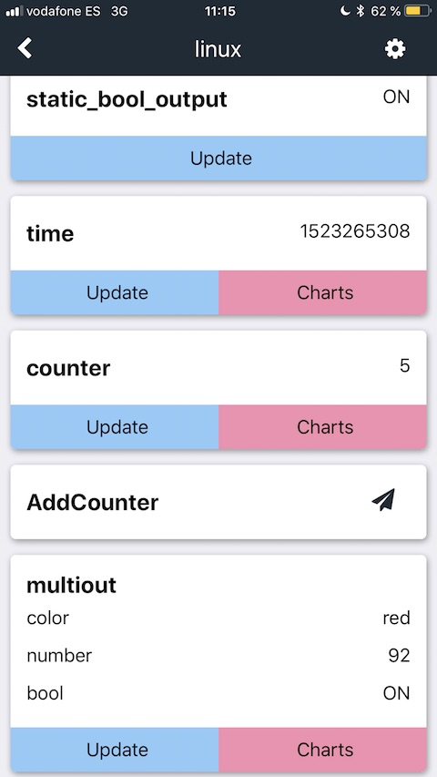
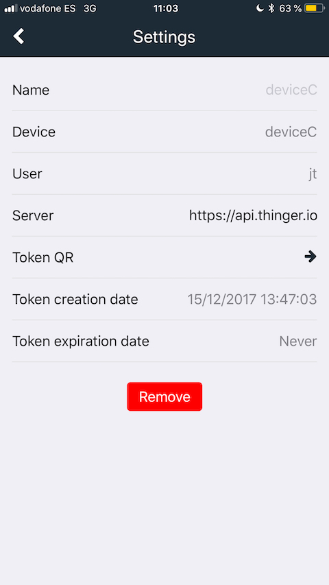

# MOBILE APP

## Introduction

This documentation provides information about the mobile app of the Thinger.io IoT platform. This way you will learn how to manage different elements of the platform on your smartphone. The app is available on Google Play and the App Store and it is ready for being downloaded.

  

## Usage

### Logging in 

Using this application it is possible to access the user account of the web console, this way all the devices registered automatically will be imported. Note that by entering the user credentials it is also possible to set the web domain of the instance you are working with, thus allowing access to accounts of private Thinger.io instances

Working in this mode we can obtain useful information such as the connection status of the devices or the time when the last keep alive was received.

### Add Device with Device Token

It is also possible to import individual devices without logging into any user account by means of the "Device Tocken" feature, which allows sharing authorization privileges to work with the API of any device even if it belongs to another user account or it's connected to a different server instance. [The **Device Tokens** section of the documentation](https://docs.thinger.io/features/devices-administration#device-tokens) explains how to create and manage the permissions in the web console, and how to create a QR token that allows a simple and fast way to import devices into the Smartphone APP. 

To import devices using Tokens, go to the "Scanned" section of the APP by selecting it in the bottom of the interface. Then press the blue  `"+" Add button` and select one the way to introduce the device token from both options: Clipboard if the Device Token has been copied in textual mode or QR Scanner if is possible to show the QR image on another screen.  

### Receive and send data

With the Thinger.io app is very easy to check the status of your devices. All resources of the device are divided in different cards with all the available information. You can visualize and update output resources, edit and post input resources and call run resources.

A specific resource value can be updated by pressing the blue `Update` button, also dragging the screen downward \(pull-to-refresh\) will update all of them.

**Posting** a resource just requires to fill the input fields and press the green button. If you don't fill some field, the post is done with the latest value \(in grey\).

For call to **run** resources just press the paper plane icon.

### Charts

A cool function of the Thinger.io app is how easy becames to monitor real-time devices data with three different charts types: lines, bars and pie chart.

By pressing the _**Charts**_ button of any resource opens a simple mobile-optimized dashboard that plots device data using dynamic scales. Behind the chart there is the legend. Pressing on every item you can select/unselect them. Keep in mind that you can represent numbers, but no strings o booleans. Additionally, the pie chart just works with positive numbers.

Do you want to try another amazing function? Rotate your device and watch the charts in full screen.

### Settings

Each imported device can be configured using the device settings button, which is accessible using the wheel chain button on the top of the screen.

  

This interface allows to show or custom:

* **Name** is an alias for each added device. It is very useful in order to hide the identity of devices to third people. 
* Inside the **Token QR** section, the token authorization can be visualized in order to share with a friend.
* The button **Remove** deletes the device from the smartphone.

