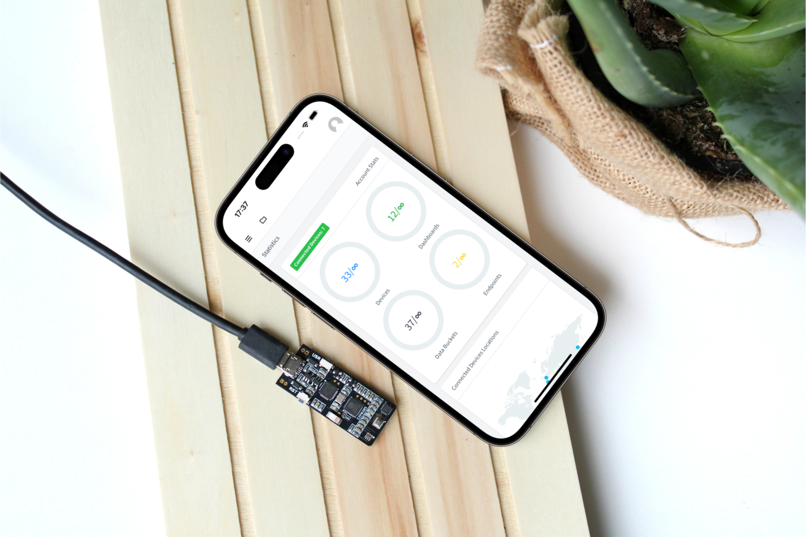
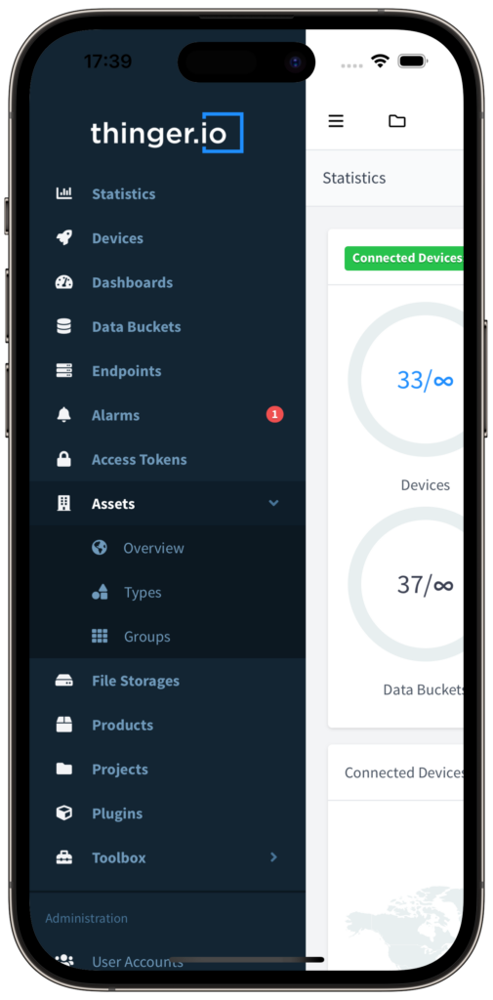

# SMARTPHONE APP

## Introduction

This documentation provides information about the mobile app of the Thinger.io IoT platform. This way, you will learn how to manage different elements of the platform on your smartphone. The app is available on Google Play and the App Store and it is ready to download.

 

## Features

The application offers almost the same features as the web application. Access the capabilities of Thinger.io in the palm of your hand, enabling you to manage and control IoT devices and workflows anytime, anywhere.

  

 

### Logging in&#x20;

This application can be used to log in with both the community console (set by default) or against your private server.

To configure the connection against your private server, click on the Settings button and set up your hostname.

<figure><figcaption></figcaption></figure>

### App Rebranding for Business

Are you a business interested in application rebranding? [Let us know](https://thinger.io/contact-us)! We offer customization options to align the app with your brand’s identity, providing a seamless experience for your users.

#### Customization Options

* **Brand Colors**: Customize the app’s color scheme to match your brand.
* **Logo and Icons**: Replace default icons and logos with your own.
* **Feature Adjustments**: Tailor the app’s features to better suit your business needs.

