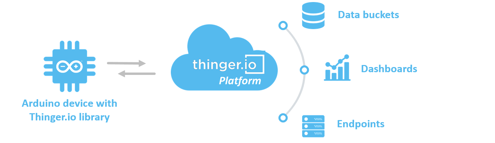

# OVERVIEW

This documentation is related to connecting Arduino compatible devices to Thinger.io. In Thinger.io it is possible to connect almost any Arduino board using Ethernet, WiFi, GSM, or even hardware from different vendors that are compatible with the Arduino ecosystem, like ESP8266, ESP32, and TI CC3200.

Thinger.io provides a library for such devices, simplifying the cloud connectivity, i.e., handling the network connection, managing reconnection to cloud, exposing resources from a device, like a sensor, or actuator. This library is specifically designed for Arduino IDE ecosystem, but it is also possible to use Visual Studio code with PlatformIO. With this library, you can easily program your devices and connect them within minutes. Once the device is connected it is possible to create dashboards, store device information in data buckets, or send its data to external services.

<figure><figcaption></figcaption></figure>

This library supports multiple network interfaces and boards:

* Espressif ESP8266 (OTA Support)
* Espressif ESP32 (OTA Support)
* Arduino Nano RP2040 Connect (OTA Support)
* Arduino Nano 33 IoT (OTA Support)
* Arduino Portenta H7 (OTA Support)
* Arduino MKR 1010 (OTA Support)
* Arduino MKR NB 1500 (OTA Support)
* Arduino MKR 1000
* Arduino GSM1400 (MKRGSM)
* Arduino + Ethernet
* Arduino + Wifi
* Arduino + Adafruit CC3000
* Arduino + ENC28J60
* Arduino Yun
* Arduino + GPRS Shield
* Arduino + TinyGSM library for GSM modems using GPRS (SIM800, SIM900, AI-THINKER A6, A6C, A7, Neoway M590)
* Arduino + ESP8266 as WiFi Modem via AT commands (using TinyGSM library)
* Texas Instruments CC3200
* SeeedStudio LinkIt ONE (Both GPRS and WiFi)
