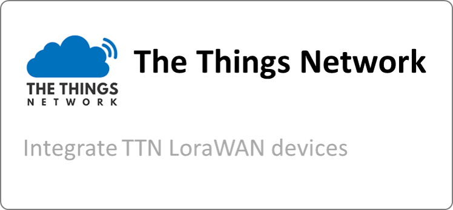

# PLUGINS

## Introduction

Plugins are extensions that allows complementing Thinger.io Platform with specific features or functionalities. 

The core of Thinger.io IoT Platform is designed to be lean and lightweight, to maximize flexibility and minimize learning and common configuration of IoT networks.  Plugins offer custom functions that can be deployed on-demand,  allowing each user to complement their IoT server as it specific needs.

For instructions and information about installing, upgrading, troubleshooting, and managing Thinger.io plugins, see "[Managing Plugins](https://app.gitbook.com/@thinger-io/s/docs/~/drafts/-LrOtZT2lM_x5eeYS6ra/primary/plugins#managing-plugins)" section. For learning how to use any existent plugin, just find below a list of each one.


[Note: Plugins are only available for premium Thinger.io servers. Check **this link** to create your own instance within minutes](https://pricing.thinger.io)


## Default Plugins

|  |                 |  |
| :--- | :--- | :--- |
|  |  |   |

## Managing Plugins

Plugins Marketplace can be founded by clicking into "Plugins" main menu tab.  

This interface contains a list of the existent plugins that can be installed to extend Thinger.io IoT Platform and will include some categories to filter and easily manage the collection of plugins, that at this moment is really small but it is planned to grow a lot in the next years. 

### Install and Deploy an Existent Plugin

Each plugin has a description page, that contains useful information to learn how to use its features and a "plugin management" context that allows managing its installation and status.

That provides a graphical interface to make the next operations:

* **Install:** Install the image of the plugin, giving access to its service and features and creating a new tab in the main menu.
* **Start:** Deploy the execution of the plugin process. It is necessary to press this button after the installation and after pressing kill or stop buttons to re-launch the execution.
* **Stop:** Ends the execution of the plugin process in a common way.
* **Kill:** Kill the plugin process in a forced way.
* **Restart:** Applies an Stop + Start cycle over the plugin process.
* **Pause:** Halt the execution of the plugin without end the process, so all run-time variables will be preserved.
* **Resume:** Launch the execution of the plugin after pause.
* **Remove:** Uninstall the plugin

## Plugin Development 

This section will provide deeply information about the infrastructure that is supporting plugins system and how to build new plugins.


Sorry! this is work in progress 


### Plugins System Infrastructure

### Plugins Repository

### Writing a Plugin

