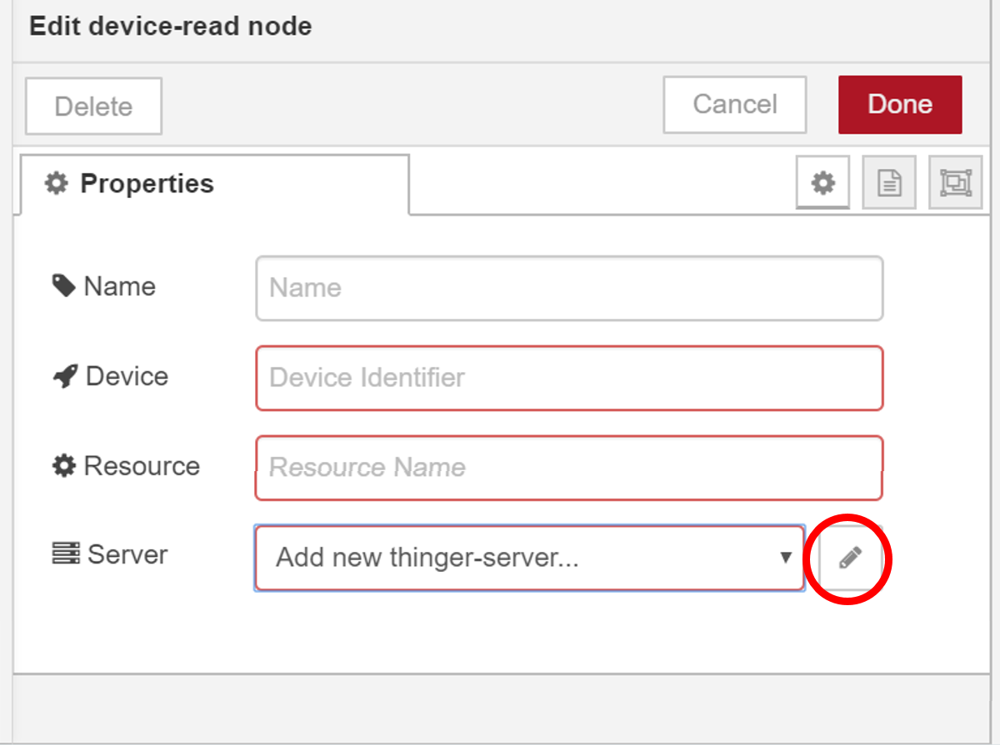
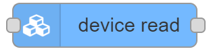
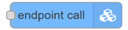
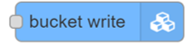

# Node-RED Plugin

Node-RED is an Open Source project created by IBM to provide the Rule Engines market of a simple but powerful framework with an easy to use graphical programing interface, and a huge users community that has made more than 2.000 contributions. 



[Note: Plugins are only available for premium Thinger.io servers. Check **this link** to create your own instance within minutes](https://pricing.thinger.io)


## Plugin Features

* [x] Node-RED server hosted in the same private host as Thinger.io instace, runing 24/7 with no nodes limitation. 
* [x] Improved palette with ad-hoc Thinger.io nodes that provide support for:

  1\) Subscribing to device resources at a given interval \(device stream node\).

  2\) Reading a device resource when a event occurs \(device stream node\).

  3\) Sending data to a connected device \(device write node\).

  4\) Calling endpoints \(endpoint call node\).  
  5\) writing to data buckets \(bucket write node\).

## Node-RED Concepts

Node red essentially consist in a development tool with two basic components: a "flow editor" that consist on a graphical programing tool that can be launch over any web-browser and a backend with the rule engine server that is able to execute the flows. This system is really easy to learn and to use, however there are some concepts that you should know before start working with it:

### Nodes

The "Nodes" are the basic building blocks for creating flows. Each node contains its own configuration form and an specific behavior, that can be accessed by double clicking the block onces it has been introduced in the web editor canvas. There are few basic types of nodes:

#### **Inject Nodes**                                         

This nodes allows automatically start a flow when an event is triggered, at regular interval specified in the properties form or manually over the web editor. The message sent by these nodes van have its payload and topic properties set. 

**Function, Change, Switch Nodes**   

Node-RED counts with some nodes that allows to work with the flow's payload using pre-configured tools or coding their behavior in JavaScript functions that can be created within the editor using a rich text editor. With this proposal, this nodes are provided with both input and output connectors.

**Output and Debug Nodes**               ****

This nodes only have an input connector that allows extracting data from the flow to third parties, files or debug console in the web editor.

### Palette

The web editor contains a graphical list with all the available nodes that can be found in a Node-RED server, called "palette". in order to provide a simple access when creating a flow.  You can extend your palette just using the "palette manager" situated at Node-RED's main menu, in which you can find more than 2.000 additional nodes for your server that have been created by both Node-RED developers and by community contributors. 

### Flows

A flow is represented as a tab within the editor workspace and is the main way to organise nodes. Each flow can have a name, and description that is displayed in the [Information sidebar](https://nodered.org/docs/user-guide/editor/sidebar/info). All of the nodes in a flow can access the same [flow-scoped context](https://nodered.org/docs/user-guide/context).

The flow editor makes it easy to wire together flows using the wide range of nodes in the palette. Flows can be then deployed to the runtime just clicking into "debloy" button: 


### Debug Console

Is a section of the right slide bar that provides a structured view of the messages that are being sent by the debud nodes,  making it easier to explore the performance of the execution.

Alongside each message, the debug sidebar includes information about the time the message was received and which Debug node sent it. Clicking on the source node id will reveal that node within the workspace.


### NodeRED documentation

You can find additional documentation about the using of this tool in Node-RED's official website: [https://nodered.org/docs/user-guide/editor/workspace/](https://nodered.org/docs/user-guide/editor/workspace/)


## Plugin Configuration

In this section it is described the different steps you need to follow to configure the Node-RED plugin to work with Thinger.io server. 

When a Node-RED plugin is installed in Thinger.io Platform, the installation manager sets Thinger.io server as proxi-server for Node-RED communications, but during the first launch of the plugin, it is necessary to make a configuration of the particular server instance that is going to be used by the plugin Nodes. 

To make this configuration, just open any Thinger.io Node properties form and go to the last input, called "Server " and click into the edition button, which will open the Thinger-Server configuration menu.



Then you can fill the server credentials of the Thinger.io server instance that is going to receive your Node-RED requests. If you just want to use the same server that is hosting the plugin,  it is only necessary to include `$(THINGER_HOST)` into "Host" box and `$(THINGER_TOKEN_NODE_RED_PLUGIN)` in the "Token" box, then you can disable SSL communication, as all messages are going to run into the same computer.



Note that, if you want to use a different Thinger.io Server or your aren't running Node-RED from a plugin, it will be necessary to **include its URL or IP Address** in the "Host" box and also a Thinger.io **Access Token with Admin-Access** privileges in the "Token" box, finally SSL would be preferable in this case. 


## Thinger.io Nodes

As it was explained on the beginning, this plugin has two purposes: Host a Node-RED server instance together with Thinger.io IoT server and inprove their integration by including a set of custom nodes to simplify extracting data from Thinger.io IoT devices or calling other platform features. The next list contains a complete description of each node and its properties configuration:

### Device Read                 

It is a **Function** Node that retrieves data from a specified Thinger.io device resource when an injection Node requires it. It is useful to get data from devices with a Node-RED programmed sampling interval.  

To configure this node just include the `Device ID`and the `Resource Name` into the node parameters form. The input for this Node is a triggered event and the output will be a JSON format message with the device resource variables.  

### Device Stream                

It is an **Injection** Node that retrieves data from an specified Thinger.io Device Resource at regular interval specified in seconds into the properties form. 

To configure this node just include the `Device ID`and the `Resource Name` into the node parameters form. The output of this node will be a JSON with the real time Device Resource data that was specified into the properties form.

### Endpoint Call               

It is an **Output** Node that allows calling the execution of a Thinger.io endpoint profile. It is able to receive a JSON that can be introduced in the endpoint in order to use that data in an e-mail, or send to third parties, so it is quite useful to create notifications or to integrating an IoT project with other systems.  

The configuration of this Node just requires introducing the `Endpoint ID`, however, it is important to make a proper management of the input json in order to send the right data. It is strongly recommended to filter the JSON keys using a "Change" Node and check the result with a "Debug" Node to be sure about the data that we are sending.  

### Bucket Write               

It is an **Output** Node that allows to store data into a Thinger.io Data Bucket. It is able to receive a JSON from Node-RED flow and automatically create an entry into the Bucket, so results quite useful to implement scalable data storage to any project.

The configuration of this Node just requires introducing the `Bucket ID`, however, it is important to make a proper management of the input json in order to store the right data. It is strongly recommended to filter the JSON keys using a "Change" Node and check the result with a "Debug" Node to be sure about the data that we are sending.  

### Device Write                 

It is an **Output** Node that allows sending data to a Thinger.io connected Device. It is able to receive a JSON from Node-RED flow and automatically send it to other device in real time. So results quite useful to implement scalable data storage to any project.

The configuration of this Node just requires introducing the `Device ID` and the `Resource ID` , however, it is important to make a proper management of the input json in order to store the right data. It is strongly recommended to filter the JSON keys using a "Change" Node and check the result with a "Debug" Node to be sure about the data that we are sending.  

### Server Events               

It is an **Inject** Node that allows to trigger in real time any event that take places in Thinger.io IoT Server, including:

1. Bucket Write
2. Device Status Change
3. Device Callback Call
4. Device Property Update
5. Device Location Update
6. Endpoint Call

The configuration of each type requires to include the ID of the element that wants to be supervised. It is also possible to monitor every elements leaving the identifier field empty.

When any of these events is triggered, this Node is able to inject a JSON in the flow with the identifier of the Bucket, Device, or Endpoint that has produced the event along with the relevant data. 

## Useful Example Flows

In this section you can find our own cookbook with some useful flows that you can use to get the maximum benefit from this integration



Using the "Device Status Change" property of the Server Event Node, it is possible to detect the  disconnection of any device of your IoT network and execute a flow in Node-RED to notify the incidence using an endpoint sending an email for example.


[Learn how to create an email endpoint here. ](https://docs.thinger.io/console#email-endpoint)


The next flow uses two Thinger.io Nodes, the first one is triggering the Device Disconnection Server Event that will throw a JSON formatted message with the device ID, the status and the timestamp of the change. The second Node allows calling the Endpoint profile to send the alert with the device information JSON attached so it is possible to custom the message to easily identify the problem. 


This flow can be easily imported into your Node-RED workspace using the next JSON:

```text
[{"id":"d577ba5d.a271b8","type":"tab","label":"Flow 1","disabled":false,"info":""},{"id":"b5b501a2.a5287","type":"server-events","z":"d577ba5d.a271b8","name":"","event":"device_state_change","bucket":"","device":"","endpoint":[{"id":"d577ba5d.a271b8","type":"tab","label":"Flow 1","disabled":false,"info":""},{"id":"b5b501a2.a5287","type":"server-events","z":"d577ba5d.a271b8","name":"","event":"device_state_change","bucket":"","device":"","endpoint":"","state":"disconnected","server":"4b6f387.dbcc5c8","x":231,"y":158.99999809265137,"wires":[["6fd24968.0dc1b8"]]},{"id":"6fd24968.0dc1b8","type":"endpoint-call","z":"d577ba5d.a271b8","name":"","endpoint":"DisconnectionAlert","server":"4b6f387.dbcc5c8","x":481,"y":158.99999809265137,"wires":[]},{"id":"4b6f387.dbcc5c8","type":"thinger-server","z":"","host":"$(THINGER_HOST)","name":"","ssl":true}]","state":"","server":"4b6f387.dbcc5c8","x":231,"y":158.99999809265137,"wires":[["6fd24968.0dc1b8"]]},{"id":"6fd24968.0dc1b8","type":"endpoint-call","z":"d577ba5d.a271b8","name":"","endpoint":"DisconnectionAlert","server":"4b6f387.dbcc5c8","x":481,"y":158.99999809265137,"wires":[]},{"id":"4b6f387.dbcc5c8","type":"thinger-server","z":"","host":"$(THINGER_HOST)","name":"","ssl":true}]
```

Note that, the `Device ID` parameter of Server Event Node is empty, in order to monitor the status of every devices in our network. The green indicator under this Node represents the connection status between Node-RED and Thinger.io server.  



MQTT is an extended communication protocol  in IoT that works on top of the TCP/IP protocol suite. It is designed for connections with remote locations where a "small code footprint" is required or the network bandwidth is limited. The next flow allows sending data from a device hosted by NodeRED MQTT Server to the REST API Callback of a Thinger.io HTTP device, in order to store, analyze an show that information with Thinger.io features.   


[Learn how to work with Thinger.io HTTP device callback here](../devices/http-devices.md)



This flow can be easily imported into your Node-RED workspace using the next JSON:

```text
[{"id":"a3d8dc1f.2ef57","type":"tab","label":"MQTT to Thinger.io","disabled":false,"info":""},{"id":"ce84849f.8d4278","type":"mqtt in","z":"a3d8dc1f.2ef57","name":"MQTT Device","topic":"Device","qos":"2","datatype":"json","broker":"","x":193.0000114440918,"y":139.99999332427979,"wires":[["af229fc2.2759a"]]},{"id":"af229fc2.2759a","type":"function","z":"a3d8dc1f.2ef57","name":"Json Creator","func":"msg.payload = {\"temperatura1\":msg.payload};\nreturn msg;","outputs":1,"noerr":0,"x":352.9999771118164,"y":139.99999332427979,"wires":[["157f8686.482779"]]},{"id":"157f8686.482779","type":"http request","z":"a3d8dc1f.2ef57","name":"","method":"POST","ret":"txt","paytoqs":false,"url":"https://<SERVER_ID>.do.thinger.io/v3/users/<USERNAME>/devices/<DEVICE_ID>/callback/data","tls":"","proxy":"","authType":"bearer","x":524.9999084472656,"y":138.9999885559082,"wires":[["da89c2c1.ce839"]]},{"id":"da89c2c1.ce839","type":"debug","z":"a3d8dc1f.2ef57","name":"Check Result","active":true,"tosidebar":true,"console":false,"tostatus":false,"complete":"true","targetType":"full","x":694.9999237060547,"y":138.99999618530273,"wires":[]}]
```

Note that his is an easy example that only retrieves data from just one MQTT device, however it is possible to create complex integrations 



Geofencing is an interesting IoT use case, with many applications in asset management, fleets or package tracking. The next flow shows how to monitor the location of any device to create an alert when it leaves an area specified with a Geofence Node.  


Creating this integration with the "device\_location" property, it is possible to integrate any kind of device including Thinger.io Software Clients, Sigfox, TTN or even HTTP devices in a very simple way.


[Learn how to create an email endpoint here. ](https://docs.thinger.io/console#email-endpoint)


  
   
This flow can be easily imported into your Node-RED workspace using the next JSON:

```text
[{"id":"59de004e.ca5eb","type":"geofence","z":"d644cd0f.0093c","name":"","mode":"circle","inside":"false","rad":146402.02859820635,"points":[],"centre":{"latitude":40.636101528180916,"longitude":-4.011267721652985},"x":357.01296615600586,"y":209.84895133972168,"wires":[["c0dd553b.456428"]]}]
```




This is work in progress, sorry about the inconveniences 





