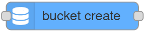
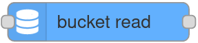
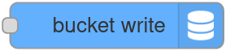
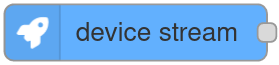
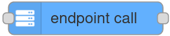
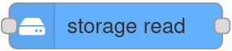
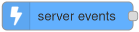
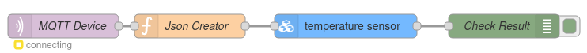
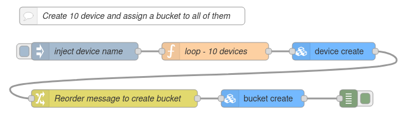

# Node-RED Plugin

Node-RED is an Open Source project created by IBM to provide the Rule Engines market of a simple but powerful framework with an easy to use graphical programing interface, and a huge users community that has made more than 2.000 contributions.&#x20;

This technology begins especially useful for IoT projects, to process and analyze data or create rules to automate behaviors in response to events produced by the IoT devices measures. It can also be used as an MQTT broker or to show data in customizable dashboards. However, its greatest potential is obtained when used in combination with an IoT platform like [Thinger.io](https://thinger.io/), leaving one in charge of data acquisition, storage, and device management and the other one for processing, automation, etc.


## Thinger.io and Node-RED integration&#x20;

We have made a great effort to simplify the integration between Thinger.io and Node-RED, which is materialized in the following elements:&#x20;

*   A **contribution to Node-RED** repositories, called "node-red-contrib-thinger" that contains some nodes that has been specifically created to simplify the integration of Node-RED flows with Thinger.io features, allowing to interact with the IoT platform in the next ways:\


    1\) Iterate over the assets from the Thinger.io Platform (asset iterator node).\
    2\) Create buckets when an event occurs (bucket create node).\
    3\) Read from data buckets (bucket read node).\
    4\) Writing to data buckets (bucket write node).\
    5\) Calling devices callbacks with autoprovisioning (device callback node).\
    6\) Creating any type of devices (device create node).\
    7\) Reading a device resource when an event occurs (device read node).\
    8\) Subscribing to device resources at a given interval (device stream node).\
    9\) Sending data to a connected device (device write node).\
    10\) Calling endpoints (endpoint call node).\
    11\) Reading properties of devices, types or groups (property read node).\
    12\) Writing and modifying properties of devices, types or groups (property write node).\
    13\) Detecting different events of devices, buckets, endpoints and others (server events node).\

* A **Node-RED Plugin** that allows deploying Node-RED server into the same host as Thinger.io IoT platform instance, running 24x7 without any kind of limitation. This way the problem of hosting the node-RED on another machine disappears


[Note: Plugins are only available for premium Thinger.io servers. Check **this link** to create your own instance within minutes](https://pricing.thinger.io)


## Introduction to Node-RED Concepts

Node-RED is a development tool with two basic components: a "flow editor" that consists of a graphical programming tool that can be launched over any web-browser and a backend with the rule engine server that is able to execute the flows. This system is really easy to learn and to use, however, there are some concepts that you should know before starting to work with it:

### Nodes

The "Nodes" are the basic building blocks for creating flows. Each node contains its own configuration form and specific behavior, that can be accessed by double-clicking the block once it has been introduced in the web editor canvas. There are a few basic types of nodes:

#### **Inject Nodes**   &#x20;

This node allows to automatically start a flow when an event is triggered, at regular intervals defined in the properties form or manually over the web editor. The message sent by these nodes has the payload and topic properties set.&#x20;

**Function, Change, Switch Nodes**  &#x20;

Node-RED counts with some nodes that allows working with the flow's payload using pre-configured tools or coding their behavior in JavaScript functions that can be created within the editor using a rich text editor. With this proposal, these nodes are provided with both input and output connectors.

**Output and Debug Nodes**               ****&#x20;

These nodes only have an input connector that allows extracting data from the flow to third parties, files, or debugs console in the web editor.

### Palette

The web editor contains a graphical list with all the available nodes that can be found in a Node-RED server, called "palette". in order to provide simple access when creating a flow.  You can extend your palette just using the "palette manager" situated at Node-RED's main menu, in which you can find more than 2.000 additional nodes for your server that have been created by both Node-RED developers and by community contributors.&#x20;

### Flows

A flow is represented as a tab within the editor workspace and is the main way to organize nodes. Each flow can have a name, and a description that is displayed in the [Information sidebar](https://nodered.org/docs/user-guide/editor/sidebar/info). All of the nodes in a specific flow can access the same [flow-scoped context](https://nodered.org/docs/user-guide/context).

The flow editor makes it easy to wire together flows using the wide range of nodes in the palette. Flows can be then deployed to the runtime just clicking into "debloy" button:&#x20;


### Debug Console

Is a section of the right slide bar that provides a structured view of the messages that are being sent by the debug nodes,  making it easier to explore the performance of the execution.

Alongside each message, the debug sidebar includes information about the time the message was received and which Debug node sent it. Clicking on the source node id will reveal that node within the workspace.


### Node-RED documentation

You can find additional documentation about the use of this tool in Node-RED's official website: [https://nodered.org/docs/user-guide/editor/workspace/](https://nodered.org/docs/user-guide/editor/workspace/)


## Starting with Thinger.io Nodes

In this section, it is described **how to configure Node-RED** "Thinger.io Nodes" to start working with any particular Thinger.io server, that could be your own instance or the public one that is hosted on "https://api.thinger.io" and it is also necessary to provide an authorization to allow Node-RED to work with your Thinger.io account.

To make this configuration, just drag any Thinger.io Node to the canvas and open its properties form, then go to the last input, called "Server " and click into the edition button, which will open the Thinger-Server configuration menu.


This form allows you to introduce the credentials of the specific Thinger.io instance address and authorization that is going to receive your Node-RED requests. However, it is important to take care of the next considerations in order to make a proper configuration:&#x20;


* If you are using Node-RED in a Thinger.io Plugin and you want to work with the same Thinger.io server that is hosting the plugin,  it is only necessary to include `$(THINGER_HOST)` into "Host" box and `$(THINGER_TOKEN_NODE_RED_PLUGIN)` in the "Token" box, then you can disable SSL communication, as all messages are going to run into the same computer.\

* if you want to use a different Thinger.io Server or you aren't running Node-RED from a plugin, it will be necessary to **include its URL or IP Address** in the "Host" box and also a Thinger.io **Access Token with Admin-Access** privileges in the "Token" box, finally, SSL would be preferable in this case.&#x20;



## Thinger.io Nodes

As it was explained in the beginning, this plugin has two purposes: Host a Node-RED server instance together with Thinger.io IoT server and improve their integration by including a set of custom nodes to simplify the extraction of data from Thinger.io IoT devices or calling other platform features. The next list contains a complete description of each node and its properties configuration:

### Asset Iterator              

It is a **Function** Node that iterates over all the desired assets avaible on Thinger.io Platform given a filter. It is able to receive a JSON from Node-RED flow and automatically query the backend. This node is useful to execute operations over multiple assets at the same time.

The configuration of this Node requires introducing of at least the `Asset`.

There will be as many output messages as assets retrieved, each containing the information to only one asset.

### Bucket Create             

It is a **Function** Node that creates a Data Bucket into a Thinger.io Platform. It is able to receive a JSON from Node-RED flow and automatically create the Bucket, so results quite useful to implement scalable and on demand data storage to any project.

The configuration of this Node requires introducing of at least the `Bucket ID` and `Data Source`, but allows the introduction of the same fields from the Thinger.io `Add Bucket` operation. It is important to make proper management of the node, as if it is run in a loop may create an infinite number of buckets.

The output message will contain the result and details of the operation.

### Bucket Read                 

It is a **Function** Node that retrieves data from a specific Thinger.io Data Bucket when an injection Node requires it. It is useful to get data from buckets with a Node-RED programmed sampling interval. &#x20;

To configure this node just include the `Bucket ID`, `Filter` and `Sorting` into the node parameters form. The input for this Node is a triggered event and the output will be a JSON format message with the buckets stored data. &#x20;

### Bucket Write                

It is an **Output** Node that allows to store data into the Thinger.io Data Bucket. It is able to receive a JSON from Node-RED flow and automatically create an entry into the Bucket, so results quite useful to implement scalable data storage to any project.

The configuration of this Node just requires introducing the `Bucket ID`, however, it is important to make proper management of the input JSON in order to store the right data. It is strongly recommended to filter the JSON keys using a "Change" Node and check the result with a "Debug" Node to be sure about the data that we are sending.

### Device Callback          

It is a **Function** Node that calls an HTTP device callback in order to send a message or retrieve what the device has configured in its callback. If the device does not exist it will manage the auto provisioning of a new device and data bucket. It is useful to get auto provision new devices based of different events save its data from the beginning. &#x20;

To configure this node just include the `Device ID` into the node parameters form or through an input message. The input for this Node is a triggered event and the output will be a JSON format message with the device callback response if any.

### Device Create               

It is a **Function** Node that creates a Device into the Thinger.io Platform. It is able to receive a JSON from Node-RED flow and automatically create the Device, so results quite useful to implement scalable and on demand device creation to any project.

The configuration of this Node requires introducing of at least the `Bucket ID`, `Type` and `Credentials` if applicable. However, allows the introduction of the same fields from the Thinger.io `Add Device` operation. It is important to make proper management of the node, as if it is run in a loop may create an infinite number of devices.

The output message will contain the result and details of the operation.

### Device Read                   

It is a **Function** Node that retrieves data from a specific Thinger.io device resource when an injection Node requires it. It is useful to get data from devices with a Node-RED programmed sampling interval. &#x20;

To configure this node just include the `Device ID`and the `Resource Name` into the node parameters form. The input for this Node is a triggered event and the output will be a JSON format message with the device resource variables.

### Device Stream                 &#x20;

It is an **Injection** Node that retrieves data from a specific Thinger.io Device Resource on regular defined interval expressed in seconds into the properties form.&#x20;

To configure this node just include the `Device ID`and the `Resource Name` into the node parameters form. The output of this node will be a JSON with the real-time Device Resource data that was defined in the properties form.

### Device Write                   &#x20;

It is a **Function** Node that allows sending data to a Thinger.io connected Device. It is able to receive a JSON from Node-RED flow and automatically send it to other devices in real-time. So results quite useful to implement scalable device communication for any project.

The configuration of this Node just requires introducing the `Device ID` and the `Resource ID` , however, it is important to make proper management of the input JSON in order to store the right data. It is strongly recommended to filter the JSON keys using a "Change" Node and check the result with a "Debug" Node to be sure about the data that we are sending. &#x20;

### Endpoint Call                   &#x20;

It is a **Function** Node that allows calling the execution of a Thinger.io endpoint profile. It is able to receive a JSON that can be introduced in the endpoint in order to use that data in an e-mail or send it to third parties, so it is quite useful to create notifications or to integrating an IoT project with other systems. &#x20;

The configuration of this Node just requires introducing the `Endpoint ID`, however, it is important to make a proper management of the input JSON in order to send the right data. It is strongly recommended to filter the JSON keys using a "Change" Node and check the result with a "Debug" Node to be sure about the data that we are sending. &#x20;

### Property Read                  

It is a **Function** Node that retrieves data from a specific Thinger.io device, type or group property when an injection Node requires it. It is useful to get data from assets with a Node-RED programmed sampling interval. &#x20;

To configure this node just include the `Asset Type`, `Asset ID`and `Property Name` into the node parameters form. The input for this Node is a triggered event and the output will be a JSON format message with the asset's property value.

### Property Write                

It is a **Function** Node that writes data into a specific Thinger.io device, type or group property when an injection Node requires it. It is useful to save data into assets in order to manage different configurations and act accordingly. &#x20;

To configure this node just include the `Asset Type`, `Asset ID`and `Property Name` into the node parameters form. The input for this Node is a triggered event and the output will be a JSON format message with the operation's result and details.

### Storage Read                   

It is a **Function** Node that reads any file saved in a Thinger.io storage and returns it to Node-RED. It is able to read any file, returning the string representation for text files (plain, csv, json, ...) or a Buffer otherwise. Useful for retrieving and treating information or being able to pass the info to third party nodes.

The configuration of the node requires only the `Storage ID`, as it is able to read recursively. If a `file path` is passed it will read the file content, or its details, as desired.  The input for this Node is a triggered event and the output will be a JSON format message with the operation's result and details.

### Storage Write                    

It is an **Output** Node that allows to store data into the Thinger.io File Storage. It is able to receive a payload from Node-RED flow and automatically save or append into a file in the Storage, so results quite useful to implement scalable file storage to any project.

The configuration of this Node just requires introducing the `Storage ID`, however, it is important to make proper management of the input in order to store the right data.

### Server Events                     &#x20;

It is an **Inject** Node that allows triggering in real-time any event that takes places in Thinger.io IoT Server over all existing assets, like device, types, groups or buckets. Some events contain also additional filter fields to filter from.

The configuration of each type requires to include the ID of the element that wants to be supervised. It is also possible to monitor every element leaving the identifier field empty.

When any of these events is triggered, this Node is able to inject a JSON in the flow with the identifier of the Bucket, Device, or Endpoint that has produced the event along with the relevant data.


If you need further technical information, you can find all the details for each node in Node-RED help dialog.


## Useful Example Flows

In this section, you can find our own cookbook with some useful flows that you can use to get the maximum benefit from this integration



Using the "Device Status Change" property of the Server Event Node, it is possible to detect the disconnection of any device of your IoT network and execute a flow in Node-RED to notify the incidence using an endpoint sending an email for example.


[Learn how to create an email endpoint here. ](https://docs.thinger.io/features/endpoints-1#email-endpoint)


The next flow uses two Thinger.io Nodes, the first one is triggering the Device Disconnection Server Event that will throw a JSON formatted message with the device ID, the status and the timestamp of the change. The second Node allows calling the Endpoint profile to send the alert with the device information JSON attached so it is possible to custom the message to easily identify the problem.&#x20;

.png>)

This flow can be easily imported into your Node-RED workspace using the next JSON:

```
[{"id":"d577ba5d.a271b8","type":"tab","label":"Device Disconnection Alert","disabled":false,"info":""},{"id":"b5b501a2.a5287","type":"server-events","z":"d577ba5d.a271b8","name":"","asset":"","event":"device_state_change","filter":"","filters":{"state":"disconnected"},"bucket":"","device":"","endpoint":"","state":"disconnected","server":"ec0dd4b1ef5aa9a8","x":231,"y":158.99999809265137,"wires":[["6fd24968.0dc1b8"]]},{"id":"6fd24968.0dc1b8","type":"endpoint-call","z":"d577ba5d.a271b8","name":"","endpoint":"DisconnectionAlert","server":"ec0dd4b1ef5aa9a8","x":481,"y":158.99999809265137,"wires":[[]]},{"id":"ec0dd4b1ef5aa9a8","type":"thinger-server","host":"$(THINGER_HOST)","name":"local","ssl":false}]
```

Note that, the `Device ID` parameter of the Server Event Node is empty, in order to monitor the status of every device in our network. The green indicator under this Node represents the connection status between Node-RED and Thinger.io server. &#x20;



MQTT is an extended communication protocol  in IoT that works on top of the TCP/IP protocol suite. It is designed for connections with remote locations where a "small code footprint" is required or the network bandwidth is limited. The next flow allows sending data from a device hosted by NodeRED MQTT Server to the REST API Callback of a Thinger.io HTTP device, in order to store, analyze an show that information with Thinger.io features.  &#x20;


[Learn how to work with Thinger.io HTTP device callback here](../http-devices.md)




This flow can be easily imported into your Node-RED workspace using the next JSON:

```
[{"id":"a3d8dc1f.2ef57","type":"tab","label":"MQTT to Thinger.io","disabled":false,"info":""},{"id":"ce84849f.8d4278","type":"mqtt in","z":"a3d8dc1f.2ef57","name":"MQTT Device","topic":"Device","qos":"2","datatype":"json","broker":"79cc5157a4c20036","nl":false,"rap":false,"inputs":0,"x":193.0000114440918,"y":139.99999332427979,"wires":[["af229fc2.2759a"]]},{"id":"af229fc2.2759a","type":"function","z":"a3d8dc1f.2ef57","name":"Json Creator","func":"msg.payload = {\"temperatura1\":msg.payload};\nreturn msg;","outputs":1,"noerr":0,"initialize":"","finalize":"","libs":[],"x":352.9999771118164,"y":139.99999332427979,"wires":[["14bff97cb9a4beca"]]},{"id":"da89c2c1.ce839","type":"debug","z":"a3d8dc1f.2ef57","name":"Check Result","active":true,"tosidebar":true,"console":false,"tostatus":false,"complete":"true","targetType":"full","x":750,"y":140,"wires":[]},{"id":"14bff97cb9a4beca","type":"device-callback","z":"a3d8dc1f.2ef57","name":"","device":"temperature sensor","body":"","server":"ec0dd4b1ef5aa9a8","x":550,"y":140,"wires":[["da89c2c1.ce839"]]},{"id":"79cc5157a4c20036","type":"mqtt-broker","name":"","broker":"localhost","port":"1883","clientid":"","autoConnect":true,"usetls":false,"protocolVersion":"4","keepalive":"60","cleansession":true,"birthTopic":"","birthQos":"0","birthPayload":"","birthMsg":{},"closeTopic":"","closeQos":"0","closePayload":"","closeMsg":{},"willTopic":"","willQos":"0","willPayload":"","willMsg":{},"userProps":"","sessionExpiry":""},{"id":"ec0dd4b1ef5aa9a8","type":"thinger-server","host":"$(THINGER_HOST)","name":"local","ssl":false}]
```

Note that his is an easy example that only retrieves data from just one MQTT device, however it is possible to create complex integrations&#x20;



Geofencing is an interesting IoT use case, with many applications in asset management, fleets or package tracking. The next flow shows how to monitor the location of any device to create an alert when it leaves an area specified with a Geofence Node. &#x20;

.png>)

Creating this integration with the "device\_location" property, it is possible to integrate any kind of device including Thinger.io Software Clients, Sigfox, TTN or even HTTP devices in a very simple way.


[Learn how to create an email endpoint here. ](https://docs.thinger.io/console#email-endpoint)


This flow can be easily imported into your Node-RED workspace using the next JSON:

```
[{"id":"5f747490.ef8edc","type":"tab","label":"GPS Geofences","disabled":false,"info":""},{"id":"207937f8.10dc48","type":"server-events","z":"5f747490.ef8edc","name":"","asset":"","event":"device_callback_call","filter":"","filters":{},"bucket":"","device":"","endpoint":"","state":"","server":"ec0dd4b1ef5aa9a8","x":158.60000228881836,"y":264.00000381469727,"wires":[["8f3dd8cd.71e4e8","56adf62.4aa1108"]]},{"id":"553ff10.2e60c1","type":"geofence","z":"5f747490.ef8edc","name":"","mode":"polyline","inside":"false","rad":0,"points":[{"latitude":39.89203705190782,"longitude":-3.8814695924520493},{"latitude":40.06041580712444,"longitude":-3.507934436202049},{"latitude":40.09404176311921,"longitude":-3.0025633424520493},{"latitude":41.14474248673421,"longitude":-3.5299070924520493},{"latitude":40.253538217286675,"longitude":-4.628539904952049},{"latitude":40.102445657515226,"longitude":-3.771606311202049}],"centre":{},"floor":"","ceiling":"","worldmap":false,"outputs":1,"x":573.0000076293945,"y":265.0000276565552,"wires":[["be251c21.6d6e3","233f843b.94472c"]]},{"id":"be251c21.6d6e3","type":"endpoint-call","z":"5f747490.ef8edc","name":"","endpoint":"alert","server":"ec0dd4b1ef5aa9a8","x":771.6000595092773,"y":266.0000286102295,"wires":[[]]},{"id":"8f3dd8cd.71e4e8","type":"debug","z":"5f747490.ef8edc","name":"","active":true,"tosidebar":true,"console":false,"tostatus":false,"complete":"false","x":399.6000061035156,"y":346.00000762939453,"wires":[]},{"id":"233f843b.94472c","type":"debug","z":"5f747490.ef8edc","name":"","active":true,"tosidebar":true,"console":false,"tostatus":false,"complete":"false","x":790.6000366210938,"y":347.0000057220459,"wires":[]},{"id":"56adf62.4aa1108","type":"change","z":"5f747490.ef8edc","name":"","rules":[{"t":"set","p":"payload","pt":"msg","to":"payload.payload","tot":"msg"}],"action":"","property":"","from":"","to":"","reg":false,"x":389.6000061035156,"y":265.00000381469727,"wires":[["553ff10.2e60c1"]]},{"id":"ec0dd4b1ef5aa9a8","type":"thinger-server","host":"$(THINGER_HOST)","name":"local","ssl":false}]
```



In some situations it is required to change the unit or metric of any variable, it is now possible to make this transformations before store data in a data bucket by use this Node-RED flow:

.png>)

&#x20;The configuration is quite simple, fist node retrieves the measurement of any device to be modified by the "function" node, that contains the codification that has been included below, and finally the "bucket write" node allows storing the transformed data.&#x20;

the codification of the function node is:

```
msg.payload = {"KW":msg.payload.payload.wats/1000};
msg.topic=msg.payload.device;
return msg;
```

&#x20;the next json contains this flow in order to be imported:

```
[{"id":"bcfa644f1bf43d03","type":"tab","label":"Modify Incoming data","disabled":false,"info":""},{"id":"3310aff0318c010d","type":"server-events","z":"bcfa644f1bf43d03","name":"","asset":"","event":"device_callback_call","filter":"","filters":{},"bucket":"","device":"","endpoint":"","state":"","server":"ec0dd4b1ef5aa9a8","x":290,"y":140,"wires":[["d50d939aa230b928"]]},{"id":"d50d939aa230b928","type":"function","z":"bcfa644f1bf43d03","name":"W to KW","func":"msg.payload = {\"KW\":msg.payload.payload.wats/1000};\nmsg.id=msg.payload.device;\nreturn msg;","outputs":1,"noerr":0,"initialize":"","finalize":"","libs":[],"x":480,"y":140,"wires":[["f6cc88d04b1b8cf8"]]},{"id":"f6cc88d04b1b8cf8","type":"bucket-write","z":"bcfa644f1bf43d03","name":"","bucket":"","value":"","server":"ec0dd4b1ef5aa9a8","x":650,"y":140,"wires":[]},{"id":"ec0dd4b1ef5aa9a8","type":"thinger-server","host":"$(THINGER_HOST)","name":"local","ssl":false}]
```



With the "Device create" and "Bucket create" nodes it is possible to create multiple devices, with the same or different credentials, types or groups; and create buckets associated to the recently created devices.



This flow can be easily imported into your Node-RED workspace using the next JSON:

```
[{"id":"a4b9f2e08c15ad79","type":"tab","label":"Device creation","disabled":false,"info":"","env":[]},{"id":"507f1a24287e53e2","type":"function","z":"a4b9f2e08c15ad79","name":"loop - 10 devices","func":"let device = msg.device;\n\nfor (let i= 0; i < 10; i++) {\n    msg.device = `${device}_${i}`;\n    msg.name = `${device} ${i}`;\n    msg.description = \"Device auto generated from Node-RED flow\";\n    node.send(msg);\n}","outputs":1,"noerr":0,"initialize":"","finalize":"","libs":[],"x":490,"y":220,"wires":[["752ee26eb02bed51"]]},{"id":"415e0ad528c64866","type":"inject","z":"a4b9f2e08c15ad79","name":"inject device name","props":[{"p":"device","v":"climastick","vt":"str"}],"repeat":"","crontab":"","once":false,"onceDelay":0.1,"topic":"","x":270,"y":220,"wires":[["507f1a24287e53e2"]]},{"id":"752ee26eb02bed51","type":"device-create","z":"a4b9f2e08c15ad79","name":"","deviceType":"Generic","deviceId":"","deviceCredentials":"&Xzi3LlG&lyaoyO2","deviceName":"","description":"","assetType":"temperature","assetGroup":"house","server":"ec0dd4b1ef5aa9a8","x":690,"y":220,"wires":[["e1da854b042efd77"]]},{"id":"69d16e383e46acd9","type":"debug","z":"a4b9f2e08c15ad79","name":"debug","active":true,"tosidebar":true,"console":false,"tostatus":false,"complete":"true","targetType":"full","statusVal":"","statusType":"auto","x":715,"y":300,"wires":[],"l":false},{"id":"3be83c6bcc65f1cb","type":"comment","z":"a4b9f2e08c15ad79","name":"Create 10 device and assign a bucket to all of them","info":"This node creates 10 devices in Thinger.io Platform, in this case climasticks, from 0 to 9; all of them with the same credentials, type and group. Also, 10 buckets are created with the date source being the devices created.\n\n### Device create node\nThe device id, name and description are passed as input to the device create node, while the credentials, type and group is configured through the device create node dialog.\n\n### Bucket create node\nThe id, bucket name and description are passed as input to the bucket create node, as well as the extra source (the device in this case) for the data source.\nThe source (device), resource, update interval and asset type and group are configured through the bucket create node dialog.","x":350,"y":160,"wires":[]},{"id":"05af9a7c2958e6c6","type":"bucket-create","z":"a4b9f2e08c15ad79","name":"","bucketId":"","bucket":"","description":"","enabled":true,"source":"device","extraSource":"","resource":"temperature","update":"interval","interval":"1m","assetType":"temperature","assetGroup":"house","server":"ec0dd4b1ef5aa9a8","x":570,"y":300,"wires":[["69d16e383e46acd9"]]},{"id":"e1da854b042efd77","type":"change","z":"a4b9f2e08c15ad79","name":"Reorder message to create bucket","rules":[{"t":"delete","p":"payload","pt":"msg"},{"t":"set","p":"id","pt":"msg","to":"device","tot":"msg"},{"t":"move","p":"name","pt":"msg","to":"bucket","tot":"msg"}],"action":"","property":"","from":"","to":"","reg":false,"x":320,"y":300,"wires":[["05af9a7c2958e6c6"]]},{"id":"ec0dd4b1ef5aa9a8","type":"thinger-server","host":"$(THINGER_HOST)","name":"local","ssl":false}]
```


Learn how to create devices [here](https://docs.thinger.io/features/devices-administration), and data buckets [here](https://docs.thinger.io/features/buckets)





