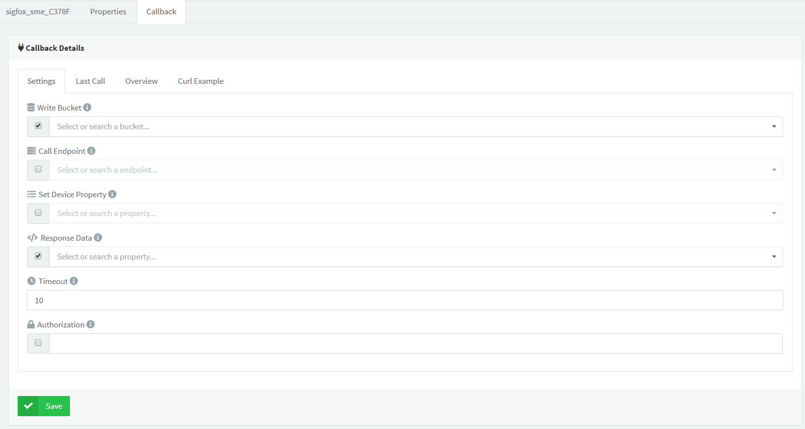

# Sigfox Plugin


This plugin is an interface for using Sigfox HTTP Callback feature in an optimized way, providing features to easily integratie these devices with Thinger.io Platform such as automatic device and storage provisioning and both uplink and downlink cloud processing. 


[Note: Plugins are only available for premium Thinger.io servers. Check **this link** to create your own instance within minutes](https://pricing.thinger.io)


## Plugin Features

* Automatic device and bucket provisioning for new devices included in a Sigfox "Device Type".  
* Store Sigfox device metadata: device location, signal quality, hardware serial, etc. 
* Store device data automatically in data buckets so it can be easily used from the console.
* Custom **uplink data processing with NodeJS,** for both `payload_raw` or  `payload_fields` .
* Support for **defining custom downlink** **callbacks** in NodeJS, so it is possible to configure downlink data in an user-friendly format \(JSON\), and then convert it to `payload_raw` or `payload_fields`, as required by TTN network.

## Sigfox Concepts

For a better understanding of the following sections, here is described some basic Sigfox concepts:

* Device: It is a hardware device with a oficial Sigfox interface.
* Gateway: It is Sigfox infrastructure hardware interface that basically receives messages from multiple edje devices, and push them to Sigfox server over IP communication. These gateways are exclusively property of Sigfox company. 
* Uplink: It is a data flow which represents messages sent from a device to the sigfox cloud. There are two different uplink processes: unidirectional uplink \(single data communication from the device to Sigfox network\) and bidirectional uplink, that also allows to Sigfox system sending a Downlink to the device.  
* Downlink: It is a data flow which represents messages sent from the Sigfox cloud to a device.
* Device Type: It is a concept that defines a group of devices of the same type, normally sending the same kind of data both in uplink and downlink\). 


[Learn how to configure Sigfox Callback to send data to Thinger.io platform **here** ](https://docs.thinger.io/hardware-devices/sigfox#create-sigfox-callback)\*\*\*\*


## Plugin Configuration

In this section it is described the different interfaces that can be used to configure the Sigfox plugin.

### Applications

Every Sigfox "Device Type" that is integrated over this plugin, should define a new profile in Thinger.io plugin, with the same identifier as defined in Sigfox Platform. Note that each Sigfox Device Type defined in this way will allow to customize the plugin behaviour for that kind of devices.


It is possible to create as many Device Types profiles as required. To configure a new profile, just select the id from the Device Types dropdown, and then navigate to the other plugin sections.


Always create the Device Type with the same identifier as defined in Sigfox cloud.


### Callback Config

The uplink behaviour allows to configure how the plugin will react on new information received from Sigfox. 


The configurable parameters are the following:

* **Auto provision resources:** Enable or disable automatic resource provisioning while receiving messages for non created devices.
* **Device connection timeout:** When creating a new device, establish the device connection timeout in minutes, so the platform can consider the device as disconnected after a fixed time without receiving a message. 
* **Device identifier prefix:** When creating a new device, create it with a custom prefix + the original device id.
* **Bucket identifier prefix:** When creating a new data bucket associated to the device, create it with a custom prefix + the original device id.
* **Update device location:** Use the location provided in the gateways information to update de current device location.
* **Initialize downlink data:** When creating a new device, initialize a custom downlink data, that can be modified and processed in further downlink requests.

### Payload Processing

In this section it is possible to configure the payload processors that will transformate the raw data received from Sigfox payload in an uplink message, or the payload that is going to be sent  in a downlink message fron Thinger.io Platform to Sigfox Clous

The interface provides a code editor for NodeJS, where it is possible to define the `uplink` and `downlink`processors. It is also possible to test the code by providing a sample input data both for `uplink` and `downlink`.


In the following, there is information about the uplink and downlink methods.



The uplink method will be called when a device sends a new message through the network. Depending on the configuration done in the Sigfox network, this function can receive two different inputs:

* **Base64 String**: If the Sigfox Device Type define a Custom payload format, this method will receive the raw payload encoded in base64. In this case, it will be necessary to write a function to transform this base64 data to a JSON object.
* **JSON Object:**The output of this method must be always a JSON object containing the information that is necessary to be used by the platform. In the following, there is an uplink method that converts base64 data into a JSON object with `temperature` and `humidity` parsed from the binary data.

```javascript
/* convert a base64 payload to a JSON object that can be used 
   by Thinger.io */
    module.exports.uplink = function(payload){
    const buffer = Buffer.from(payload.data, 'hex');
    payload.temperature = buffer.readInt16LE(0)/100.0;
    payload.humidity = buffer.readInt16LE(2)/100.0;
    return payload;
};
```


The uplink method must always return a JSON object.




The downlink method will be only called when the Sigfox device uplinks a bidirectional mesage to Sigfox Cloud. In this case, Thinger.io server will answer to the callback message that contains your custom Downlink payload in hexadecimal codification. Check out the next sections for more details.

This function will receive different inputs depending on how the plugin is called over its REST API.

* **JSON Object**: If the downlink call is done for a Thinger.io device that defines a `downlink` property \(that is automatically initialized if `Initialize Downlink Data` is configured in the plugin\), this method will receive the JSON content of this property. It usually consists on a user-friendly device configuration that should be later encoded to binary in base64.
* **JSON Object**: If the plugin downlink request contains a JSON payload in the POST call, this function will receive this payload instead of the one configured in the device `downlink` property. 

The output of this method will be a **Base64 String** with the binary information that is going to be sent to Sigfox network.

Example of a downlink method converting a JSON device configuration into base64 as required by Sigfox:

```javascript
/* convert a JSON object with the device configuration in a base64
   string expected by TTN */
module.exports.downlink = function(payload){
    let bytes = [];
    bytes[0] = payload.enabled ? 1 : 0;
    bytes[1] = payload.frequency;
    bytes[2] = payload.threshold;
    return Buffer.from(bytes).toString('base64');
};
```




Use the interface tester to see if your code is correctly procesing the payloads. 


## Sigfox Cloud Configuration

### Uplink Integration


### Downlink Integration

## Plugin Development Details

### Uplink Data Flow

In this section it is described how the uplink data flow works, from its source in the Sigfox network, to its final destination in Thinger.io.


In the following subsections are described the elements shown in the figure.

#### Sigfox Uplink Callback

When Sigfox receives a message from any device, it automatically checks its configured integrations to forward them the information received. This plugin is integrated over HTTP, so, the Sigfox network will issue an HTTP request to the Thinger.io plugin on new messages.

#### Sigfox Plugin

Thinger.io plugin receives data from Sigfox network in a JSON format. The callback includes several fields of information, such as `app_id`, `dev_id`, `donwlink_url`, `metadata`, or the actual payload information sent by LoRa devices on `payload_fields` or `payload_raw` fields, depending on the Payload formats configured in the Sigfox application.

Here is an example of the raw information received by the plugin:

```javascript
{

}
```

Once this information is received by the plugin, it is processed in order to execute the following actions in Thinger.io:

1. Auto provision new device and its associated data bucket if the device does not exists on the platform. It is based on the `dev_id` field. 
2. Call device callback that will actually push processed data to its associated data bucket, but could do any other action like forwarding data to other endpoints.

#### Uplink Processor

This plugin allows to configure custom code for processing incoming data. The information sent by Sigfox devices is normally encoded in small binary payloads that cannot be directly used for representation, as they should not contain tags, JSON, ascii text, etc., in order to minimize transmission time. So, it is required to process the data sent by devices in some point of the cloud.

This plugin also allows to create custom decoders if necessary. The advantage of using the Thinger.io payload processing \(if necessary\), is that it is using NodeJS runtime instead of plain Javascript, so it is possible to use NodeJS modules like Buffer, that simplifies the condig of the processing functions.

Internaly, payload processors are precompiled after its configuration in the plugin, and executed with the payload data received from Sigfox. The output from this function \(if it gets executed\), is then transmitted to the next final step, which is the device callback.

#### Device Callback

The last step of this plugin is to call the device callback in Thinger.io. This plugin auto provision new Sigfox devices as HTTP devices. HTTP devices inside Thinger.io are generic devices that can push data over REST API methods. Thinger.io will be responsable of taking input data and perform different configurable actions with it, like change the device state to connected/disconnected; write provided data to a configured data bucket; send this information to other services over an endpoint; store the provided information as a device property; or return data from one of the device properties.

In this case, the plugin interacts with the platform over such REST interface, pushing data received from Sigfox, and processed by the custom uplink method. By default, the plugin initializes an HTTP device to write to a data bucket that is also automatically created. So, every message sent by a Sigfox device, will write finally write to a specific data bucket. As shown in the following picture:



After the device callback is done, it will appear as a connected device, showing also its location if it was configured in the plugin options.

### Downlink Data Flow

