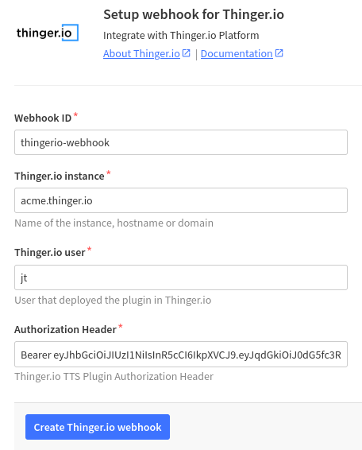
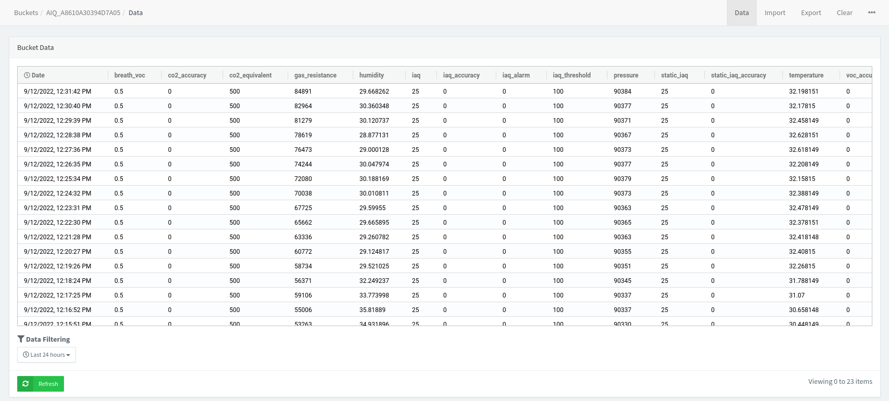
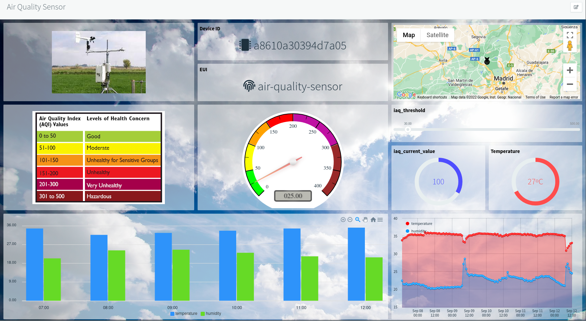

# The Things Stack

<figure><figcaption></figcaption></figure>

The Things Network is a LoRaWAN Network solution that simplifies the deployment of large IoT applications over a collaborative Internet of Things network that spans many countries around the world. From thinger.io we wanted to offer an improved integration to The Things Stack users by providing easy-to-configure tools for storing, analyzing, and showing device data in a simple way. This plugin allows retrieving The Things Stack webhook messages to enhance the integration with some interesting features such as:&#x20;

* Uplink data payload processing&#x20;
* Downlink data payload processing
* Automatic device and data buckets provisioning


[Note: Plugins are only available for premium Thinger.io servers. Check **this link** to create your own privated IoT instance within minutes](https://pricing.thinger.io)


## Plugin Features

* [x] Automatic device and bucket provisioning for new devices is included in The Things Stack application. It is no required additional configuration to start working with The Things Stack data inside Thinger.io.&#x20;
* [x] Store device metadata based on The Things Stack information, like device location, signal quality, hardware serial, etc.&#x20;
* [x] Store device data automatically in data buckets so it can be easily used from the console.
* [x] Provide support for defining custom uplink callbacks on Node.js  to process `payload_raw` or `payload_fields` provided by The Things Stack Integration.
* [x] Provide support for defining custom downlink callbacks on Node.js, so it is possible to configure downlink data in a user-friendly format (JSON), and then convert it to `payload_raw` or `payload_fields`, as required by The Things Stack network.

## The Things Stack Concepts

For a better understanding of the following sections, here is described some basic The Things Stack concepts:

* **Device**: It is a hardware device with a LoRa interface.
* **Gateway**: It is a hardware device with both LoRa and Internet connectivity. It basically receives LoRa messages from multiple devices and pushes them to The Things Stack network over the Internet.
* **Uplink**: It is a data flow that represents messages sent from a device to The Things Stack network
* **Downlink**: It is a data flow that represents messages sent from The Things Stack network to a device.
* **Application**: It is a concept that defines a group of devices of the same type, normally sending the same kind of data both in uplink and downlink).&#x20;
* **Integration**: It is a way of pushing device data outside The Things Stack network, i.e., sending messages to other platforms like Thinger.io.

## Plugin Configuration

This section describes the different interfaces that can be used to configure The Things Stack plugin.

### Integrating The Things Stack Applications

The first step to perform the integration is to create a new plugin configuration. It is possible to create multiple configuration profiles with custom behavior for each application deployed in The Things Stack. To create a new application profile, just type the application ID and press the green Add Application button. Note that the ID must be exactly the same identifier defined in The Things Stack application.

.png>)

The `Application Id` dropdown allows to select and configure a particular application profile, but if the "default" profile is selected, the configuration will be applied to all the applications integrated with the plugin.


Always create applications with the same application identifier as defined in The Things Stack.


### Uplink Settings

.png>)

As shown in the image above, the parameters can be used to configure the plugin's behavior:

* **Auto provision resources:** Enable or disable automatic resource provisioning while receiving messages for non-created devices.
* **Device Connection Timeout:** When creating a new device, establish the device connection timeout in minutes, so the platform can consider the device as disconnected after a fixed time without receiving a message.&#x20;
* **Device Identifier Prefix:** When creating a new device, create it with a custom prefix + the original device id.
* **Bucket Identifier Prefix:** When creating a new data bucket associated to the device, create it with a custom prefix + the original device id.
* **Assign Asset Type:** Associate the auto-provisioned device and bucket with a given Asset Type.
* **Assign Asset Group:** Associate the auto-provisioned device and bucket with a given Asset Group.
* **Update device location:** Use the location provided in the gateways information to update de current device location.
* **Initialize Downlink Data:** When creating a new device, initialize a custom downlink data, that can be modified and processed in further downlink requests.

### Downlink Settings

The Things Stack Downlink processes can be configured from Thinger.io in order to select the behavior in some parameters as shown below:

.png>)

* **Confirmed Downlink:** Set to enabled if downlink messages must be confirmed by the device.
* **Push To Downlink Queue:** Enable to push downlink messages instead of replace previous ones.
* **Downlink Priority:** Specify the downlink priority.

### Payload Processing

This tab is used to configure the payload data treatment in order to transform from binary payload received from The Things Stack webhook into user-friendly variables and the Downlink JSON into a binary buffer that will be transmitted to The Things Stack.

The interface provides a code editor for Node.js scripts, where it is possible to define the codification / decodification processes and also provides a testing tool that allows to verify the behavior of both  `uplink` and `downlink` processes.

.png>)

The following sections provide additional information about how to configure the uplink and downlink methods.



The uplink method will be called after a gateway sends a new message over The Things Stack network. Depending on the configuration done in The Things Stackapplication, this function will receive different inputs:

* **Base64 String**: If The Things Stack application defines `Custom Javascript Formatter` for the payload but does not provide a decoder function, this method will receive the raw payload encoded in base64. In this case, it will be necessary to write a function to transform this base64 data to a JSON object.
* **JSON Object from Cayene LPP**: If The Things Stack application defines a `Cayene LPP` payload formatter, The Things Stack will automatically convert the binary data to a JSON object that can be used directly by the platform. In this case, it is not necessary to define a custom uplink method unless you want to do some extra processing like incorporating calculated fields.
* **JSON Object from Custom Decoder:** If The Things Stack application defines `Custom Javascript Formatter`for the payload and provides a decoder function, this function will receive the output from The Things Stack function. In this case, creating a custom uplink method will be redundant, so create the function in The Things Stack, or in the plugin.

The output of this method must be always a JSON object containing the information that is necessary to be used by the platform. In the following, there is an uplink method that converts base64 data into a JSON object with `temperature` and `humidity` parsed from the binary data.

```javascript
/* convert a base64 payload to a JSON object that can be used 
   by Thinger.io */
module.exports.uplink = function(payload){
    const buffer = Buffer.from(payload, 'base64');
    let processed = {};
    processed.temperature = buffer.readInt16LE(0)/100.0;
    processed.humidity = buffer.readInt16LE(2)/100.0;
    return processed;
};
```


The uplink method must always return a JSON object.




The downlink method will be called before the plugin issues a downlink request to The Things Stack. To issue a downlink request to The Things Stack, this plugin must receive an HTTP POST call, indicating the Thinger.io device identifier, and it will automatically issue the request to the required The Things Stack endpoint and its specific protocol. Check out the next sections for more details.

This function will receive different inputs depending on how the plugin is called over its REST API.

* **JSON Object**: If the downlink call is done for a Thinger.io device that defines a `downlink` property (that is automatically initialized if `Initialize Downlink Data` is configured in the plugin), this method will receive the JSON content of this property. It usually consists on a user-friendly device configuration that should be later encoded to binary in base64.
* **JSON Object**: If the plugin downlink request contains a JSON payload in the POST call, this function will receive this payload instead of the one configured in the device `downlink` property.&#x20;

The output of this method should be one of the following:

* **Base64 String**: With binary information that can be sent directly to The Things Stack network. It is required if your The Things Stack application is not defining a converter.
* **JSON Object**: If The Things Stack application provides a converter for your payloads, this method can return a JSON object that will be accesible in the converter method. In this case, creating a custom downlink method will be redundant, so create the funtion in The Things Stack, or in the plugin.

Example of a downlink method converting a JSON device configuration into base64 as required by The Things Stack:

```javascript
/* convert a JSON object with the device configuration in a base64
   string expected by The Things Stack */
module.exports.downlink = function(payload){
    let bytes = [];
    bytes[0] = payload.enabled ? 1 : 0;
    bytes[1] = payload.frequency;
    bytes[2] = payload.threshold;
    return Buffer.from(bytes).toString('base64');
};
```


The downlink method should return a base64 string if The Things Stack application does not define a converter.




## The Things Stack Console Configuration

### Uplink Configuration&#x20;

The last tab of the plugin configuration interface is called "Webhook settings", it has been created to help the developers to complete the integration in The Things Stack Console, by providing all the information required to set up the webhook profile.&#x20;

.png>)


Note that the REST API does not define the application ID, this parameter will be checked by the plugin software to manage the payload according to the configuration.


To create a new webhook integration follow the next steps in The Things Stack web console:

1. Select the Application to be integrated.
2.  In the main menu open the "Integrations" section and click the "Webhooks" option. The webhooks list will be shown.\


    3\. Clicking the `+Add webhook` blue button in the right top corner of the interface allows choosing between different webhooks integration templates. Select Thinger.io template. Then, configure the webhook only requires filling the form with the information provided by Thinger.io "webhook settings" tab and selecting JSON webhook format.

    <figure><figcaption></figcaption></figure>

<figure><figcaption><p>The Things Stack webhook template for Thinger.io</p></figcaption></figure>


Note that the Authorization header must be set up using the access token including the "Bearer" command


### Downlink Configuration

As part of the webhook template, the Download API key is automatically created, so no further configuration is required.

## Executing Downlink Processes&#x20;

Thinger.io's The Things Stack plugin has been prepared to automatically manage to send downlink messages to The Things Stack server, this system takes the data from the device downlink property, autogenerated during device provisioning, and inserts it as a response to the next HTTP request from the system. In this way, we can create device configuration and control processes just by modifying the value of this property by means of a Dashboard widget, Node-RED, or direct API integration.

To create a new downlink process make sure to follow the next steps:

1. [Configure the plugin's downlink settings at Thinger.io](https://docs.thinger.io/plugins/the-things-stack#downlink-settings)
2. Write a codification script if required using the plugin's "downlink payload processing"
3. Modify the value of the property to launch the execution of the downlink process

After this, the plugin will execute the payload processing and send it in response of the next The Things Stack API request to your server. It is possible to follow the trace of this communication by accessing the plugin's log and going to `Plugins>Plugin profile>Logs`.

## Monitor Your Data

There are multiple ways to view the data sent by the device in [Thinger.io](https://thinger.io/).

As long as the uplink messages are being sent by The Things Stack, the raw data will be available in the [Thinger.io](https://thinger.io/) **Data Bucket** configured or auto-provisioned by the [The Things Stack Plugin](https://docs.thinger.io/plugins/the-things-stack), without any further configuration.

<figure><figcaption><p>Thinger.io data bucket showing raw data sent by The Things Stack device</p></figcaption></figure>

Nevertheless, it is recommended to create a [Dashboard](https://docs.thinger.io/features/dashboards) in [Thinger.io](https://thinger.io/) to be able to view the data in a more comprehensive way.

<figure><figcaption><p>Thinger.io dashboard showing data from The Things Stack device</p></figcaption></figure>

