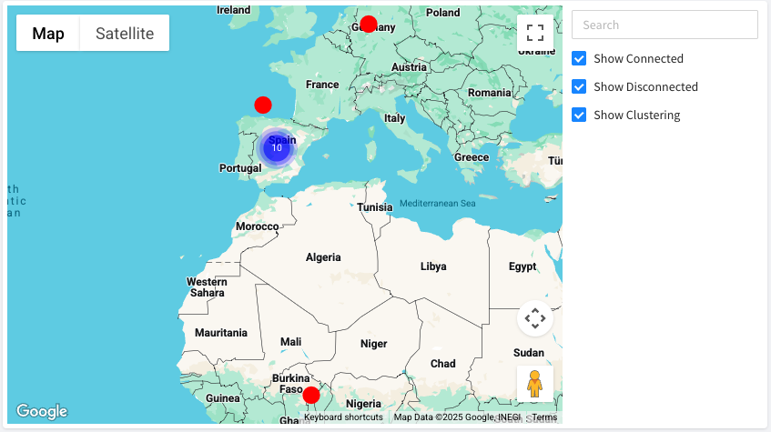

# PROXIES

This feature allows creating of bidirectional pipes with specific IoT resources, enhancing the interoperability of Thinger.io and other IoT ecosystems. The definition of a new Proxy profile will open a server port to receive traffic from a source in order to be pointed to a specific target port.  It is particularly useful to integrate **NB-IoT devices or integrate with web servers located in remote devices without implementing a VPN.**&#x20;

The `proxies` feature is accessible, at the administration section of Thinger.io main menu, which displays the list of all the existing proxy profiles, to be managed.&#x20;

## Create new proxy


Note that this feature is reserved for Admin role accounts, so other users with fewer privileges must contact the instance administrator to configure a proxy to point their account resources.


To configure a new proxy, just click the "Add Proxy" button and fill out the form according to the next instructions:&#x20;

<figure><figcaption></figcaption></figure>

Starting from top, the Proxy Settings section contains the parameters that will help to identify the specific proxy profile, and configure its behavior to be adapted to each particular use case:&#x20;

* **Proxy ID:** Unique identification, must not contain special characters&#x20;
* **Proxy name:** Mnemonic identification name for the proxy profile
* **Proxy Description**: A description will help in the future to understand the objective of the  proxy
* **Protocol:**  This parameter defines the behavior of Thinger.io instance according to the purpose of the integration as explained in the sections below.   &#x20;
* **Enabled:** The proxy profile can be created without changes to your infrastructure if this button is unswitched. This switch is also useful to stop the work of a proxy without removing the profile.&#x20;

The source configuration section allows specifying the port that will receive the connection from the external system.&#x20;

<figure><figcaption></figcaption></figure>

The `Target configuration` shows the destiny of the data received at the source port. Note that depending on the selected protocol, these parameters will change:&#x20;

### TCP/UDP

Data from `Source Port` will be sent to another TCP or UDP port accessible by the instance. It could be another internet server (specifying the IP address and port) or an instance in the same local host, such as Node-RED or Grafana plugin. This behavior can be managed using the "Target Type" menu, which will modify the available properties as shown below:&#x20;

#### Host Address target type

Data from the raw port will be sent to a third-party internet server:

<figure><figcaption></figcaption></figure>

* **Target type** `Host Address`
* **Target Address:** Host IP Address that will receive data from Thinger.io instance
* **Target Port:** Host port that will receive data from Thinger.io instance
* **SSL/TLS (only with TCP):** Allows to secure the communication between Thinger.io instance and the target host. It is not required for localhost destinies, but strongly recommendable when data is being sent to an external internet host.&#x20;

#### Plugin target type

the Data from raw port will be sent to a plugin port

<figure><figcaption></figcaption></figure>

* **Target type** `plugin`
* **Target Plugin:** To select one of the deployed plugins that is being executed in the server
* **Target Port:** Write here the port of that plugin that will receive de data from thinger.io
* **SSL/TLS (only with TCP):** Allows securing the communication between Thinger.io instance and the target host. IT is not mandatory for plugin communication, as they are in the same host.&#x20;

### TCP over IoTMP

This option allows to retrieve data from a third-party service that is accessible by an IoTMP device vía TCP communication. This means that we can extract data from SQL, files or any other resource that is not supported by an HTTP connection. &#x20;

<figure><figcaption></figcaption></figure>

* **Target type** `Host Address`
* **Target Username:** Account username that will own the connection
* **Target Device:** ID of the device that will host the connection
* **Target Address:** IP Address of the device that will receive data from Thinger.io instance
* **Target Port:** The communication port of the device that will host the connection
* **SSL/TLS (only with TCP):** Allows to secure the communication between Thinger.io instance and the target host. IT is not required for localhost destinies, but strongly recommendable when data is being sent to an external internet host.&#x20;

### HTTP over IoTMP

This proxy configuration allows connecting HTTP servers in the same network as the IoTMP device. Hosted itself or by other machines. The HTTP integration allows access to its web portal, by means of an Iframe on the device profile.

<figure><figcaption></figcaption></figure>

* **Target type** `Host Address`
* **Target Address:** Host IP Address that will receive data from Thinger.io instance
* **Target Port:** Host port that will receive data from Thinger.io instance
* **SSL/TLS (only with TCP):** Allows to secure the communication between Thinger.io instance and the target host. It is not required for localhost destinies, but strongly recommendable when data is being sent to an external internet host.&#x20;

## Edit Proxies

Clicking the identification of any profile allows to open the proxy settings form in order to modify any setup parameter (with the exception of the ID, which will require removing the profile to create a new one from scratch).

After applying the required changes don't forget to press the blue "Uptade Proxy" button.&#x20;

## Remove Proxies

To delete one o multiple proxy profiles, select them from the list and click the remove button. Once a profile is deleted, it is not possible to restore it, so if in doubt, please consider using the "enable" switch located at the proxy settings menu.&#x20;

<figure><figcaption></figcaption></figure>

