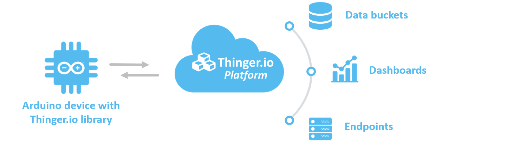
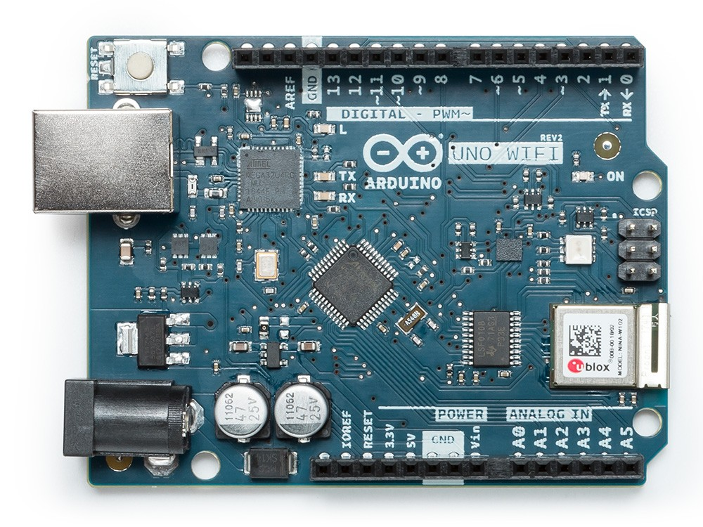
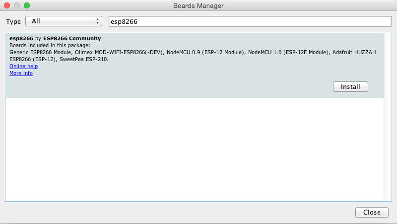
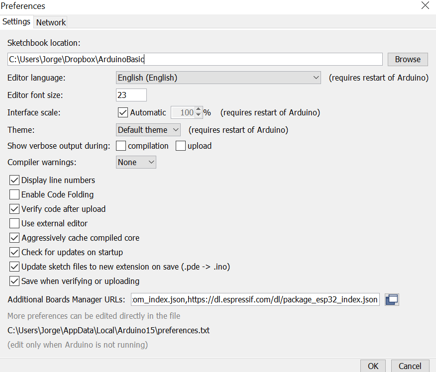
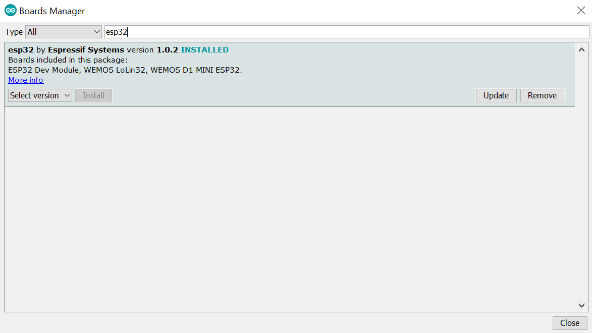

# ARDUINO COMPATIBLE

## Overview

This documentation is related with the [Arduino Client library](https://github.com/thinger-io/Arduino-Library) version of the Thinger.io platform. With this library you will be able to connect almost any Arduino board using Ethernet, Wifi, GSM, or other supported boards like ESP8266, ESP32, and TI CC3200.

The client library allows connecting your IoT devices to the [Thinger.io](http://thinger.io) cloud platform. This is a library specifically designed for the Arduino IDE, or PlatformIO, so you can easily program your devices and connect them within minutes by creating `Input` and `Output` resources. Once the data is online it is possible to show it in customizable dashboards, store in data buckets or send to another cloud services via endpoints.



This library supports multiple network interfaces and boards:

* Espressif ESP8266 \(OTA Support\)
* Espressif ESP32 \(OTA Support\)
* Arduino Nano RP2040 Connect \(OTA Support\)
* Arduino Nano 33 IoT \(OTA Support\)
* Arduino Portenta H7 \(OTA Support\)
* Arduino MKR 1010 \(OTA Support\)
* Arduino MKR NB 1500 \(OTA Support\)
* Arduino MKR 1000
* Arduino GSM1400 \(MKRGSM\)
* Arduino + Ethernet
* Arduino + Wifi
* Arduino + Adafruit CC3000
* Arduino + ENC28J60
* Arduino Yun
* Arduino + GPRS Shield
* Arduino + TinyGSM library for GSM modems using GPRS \(SIM800, SIM900, AI-THINKER A6, A6C, A7, Neoway M590\)
* Arduino + ESP8266 as WiFi Modem via AT commands \(using TinyGSM library\)
* Texas Instruments CC3200
* SeeedStudio LinkIt ONE \(Both GPRS and WiFi\)

## Installation

The first step to start building thinger.io devices is to install the required libraries in the Arduino IDE to support exposing device resources like sensor values, lights, relays, and so on.

If you do not have the Arduino IDE installed yet, then it is a good moment to start, here are also some advices to choose the right version.

### Arduino IDE

It is required a modern version of Arduino supporting `Library Manager` and some other features. Please install a version starting form **1.6.3** from the official Arduino download page. This step is not required if you already have a modern version.

[Download Arduino IDE](https://www.arduino.cc/en/Main/Software)

There are two ways of installing the library. The preferred way is by using the Arduino `Library Manager`, which simplifies searching and installing new libraries. It also supports updating libraries when new versions are released. So use this method when possible. The other way to install the library is by using the traditional method of download and import the `zip` library.

### Library Manager

The most easy way to install new libraries is by using the `Library Manager` available in the Arduino IDE. For installing the thinger.io library please follow the following steps:

> Open the **Library Manager** in the Arduino menu in `Sketch` &gt; `Include Library` &gt; `Manage Libraries`


**Search** and install the thinger.io library


> Search the library with name **thinger.io** and then click `Install`. You can update the library also from this manager when it is updated.

Now the library should be be available with some default examples.

### Manual Import

If the preferred way using the Library Manager is not working or you prefer to manage the libraries yourself, you can also install the library by the traditional way.

**Download** the latest version from the Github repository by clicking in the link below. This will download a file called `Arduino-Library-master.zip`.

[Download Library &gt;](https://github.com/thinger-io/Arduino-Library/archive/master.zip)

Now **rename** the `Arduino-Library-master.zip` file to something more relevant like `thinger.zip`.

The final step is to **import** the `zip` library using the Arduino IDE. This step will uncompress and copy the `zip` library in the Arduino libraries folder. Which is usually under your Documents folder.


> Sketch &gt; Include Library &gt; Add .ZIP libraries

Now the library should be be available with some default examples.

## Supported Hardware

The thinger.io platform is designed to support almost any microcontroller or device with communication capabilities. No matter if it has Ethernet, Wifi, GSM, or the chip is from some vendor or not. Almost any device can be integrated in the cloud. So you can choose the hardware you want to connect, as this platform does not force you to purchase some compatible vendor hardware. This is a crucial when designing your IoT projects. Here you are free to choose the hardware you want!

In the following sections there are some of the devices that are compatible trough the Arduino IDE. For other device like Raspberry Pi, Intel Edison, BeagleBone Black, or any other device running a Linux distribution, please refer to the Linux Documentation.

### Arduino + Ethernet

The Arduino Ethernet Shield connects your Arduino to the internet in mere minutes. Just plug this module onto your Arduino board, connect it to your network with an RJ45 cable, and you are almost done to start controlling your world through the internet.

The following example will allow connecting your device to the cloud platform in a few lines. Just replace the sketch **username**, **deviceId**, and **deviceCredential** with your own credentials.


```cpp
#include <SPI.h>
#include <Ethernet.h>
#include <ThingerEthernet.h>

ThingerEthernet thing("username", "deviceId", "deviceCredential");

void setup() {
}

void loop() {
  thing.handle();
}
```

Want to add some device resources \(led, sensors, etc.\) to interact with them from the Internet?. Check the [Add Resources](arduino.md#coding-adding-resources) section.

### Arduino + Wifi

The Arduino Wifi Shield is a poweful IoT shield that connects your Arduino board to the internet wirelessly. Connecting it to a WiFi network is simple, no further configuration in addition to the SSID and the password are required. The WiFi Shield comes with an easy-to-use library that allows to connect your Arduino board to the internet with few instructions. This is also applied to the Thinger client, so you can connect your Arduino + Wifi Shield to the platform in a few lines of code.

The following example will allow connecting your device to the cloud platform in a few lines. Just replace the sketch **username**, **deviceId**, and **deviceCredential** with your own credentials, and the **wifi\_ssid**, **wifi\_password** with the WiFi credentials.


```cpp
#include <SPI.h>
#include <WiFi.h>
#include <ThingerWifi.h>

ThingerWifi thing("username", "deviceId", "deviceCredential");

void setup() {
    thing.add_wifi("wifi_ssid", "wifi_password");
}

void loop() {
  thing.handle();
}
```

Want to add some device resources \(led, sensors, etc.\) to interact with them from the Internet?. Check the [Add Resources](arduino.md#coding-adding-resources) section.

### Arduino + CC3000

The CC3000 chip from Texas Instruments was one of the first low-cost WiFi chips that revolutionized the IoT maker ecosystem. In contrary to the other available WiFi alternatives, like the WiFi shield, the CC3000 appeared at a low cost \(about 10$\) for their time. It is a powerful chip as it integrates the whole TCP/IP stack and many other protocols. Some vendors like Adadruit started to build modules and libraries for integrating this chip with the Arduino ecosystem. Thanks to the libraries provided by Adafruit is then possible to build connected device with a few lines of code.

So for this module is required to have installed the **Adafruit CC3000 Libraries**, as they are directly used by the thinger client. You can download it here.

[Adafruit CC3000 Libraries &gt;](https://github.com/adafruit/Adafruit_CC3000_Library/archive/master.zip)

The following example will allow connecting your device to the cloud platform in a few lines. Just replace the sketch **username**, **deviceId**, and **deviceCredential** with your own credentials, and the **wifi\_ssid**, **wifi\_password** with the WiFi credentials.


```cpp
#include <Adafruit_CC3000.h>
#include <SPI.h>
#include <ccspi.h>
#include <ThingerCC3000.h>

ThingerCC3000 thing("username", "deviceId", "deviceCredential");

void setup() {
    thing.add_wifi("wifi_ssid", "wifi_password");
}

void loop() {
  thing.handle();
}
```

Want to add some device resources \(led, sensors, etc.\) to interact with them from the Internet?. Check the [Add Resources](arduino.md#coding-adding-resources) section.

### Arduino Yun

The Arduino Yún is a microcontroller board based on the ATmega32u4 and the Atheros AR9331. The Atheros processor supports a Linux distribution based on OpenWrt named OpenWrt-Yun. The board has built-in Ethernet and WiFi support, a USB-A port, micro-SD card slot, 20 digital input/output pins \(of which 7 can be used as PWM outputs and 12 as analog inputs\), a 16 MHz crystal oscillator, a micro USB connection, an ICSP header, and 3 reset buttons. This board let the programmable ATmega32u4 communicate with Internet by using the Bridge Library that expose some functions running in the Linux distribution.

The following example will allow connecting the Yun to the cloud platform in a few lines. Just replace the sketch **username**, **deviceId**, and **deviceCredential** with your own credentials. Notice that it is not required to configure any network parameter in the code, as this managed by the running Linux distribution. However you many need to connect with your Arduino Yun via WiFi to connect it some local network.


```cpp
#include <BridgeSSLClient.h>
#include <ThingerYun.h>

#define USERNAME "your_user_name"
#define DEVICE_ID "your_device_id"
#define DEVICE_CREDENTIAL "your_device_credential"

ThingerYun thing(USERNAME, DEVICE_ID, DEVICE_CREDENTIAL);

void setup() {
  pinMode(LED_BUILTIN, OUTPUT);

  // initialize bridge
  Bridge.begin();

  // pin control example (i.e. turning on/off a light, a relay, etc)
  thing["led"] << digitalPin(LED_BUILTIN);

  // resource output example (i.e. reading a sensor value, a variable, etc)
  thing["millis"] >> outputValue(millis());
}

void loop() {
  thing.handle();
}
```

**⚠ NOTE:** For using Arduino Yun, the device must be connected to a network with Internet, just with Ethernet or a Wifi connection.


Want to add some device resources \(led, sensors, etc.\) to interact with them from the Internet?. Check the [Add Resources](arduino.md#coding-adding-resources) section.

### Arduino MKR1000

The Arduino MKR1000 is a microcontroller based on the Atmel ATSAMW25 SoC \(System on Chip\), that is part of the SmartConnect family of Atmel Wireless devices, specifically designed for IoT projects and devices. A good 32 bit computational power similar to the Zero board, the usual rich set of I/O interfaces, low power Wi-Fi with a Cryptochip for secure communication, and the ease of use of the Arduino Software \(IDE\) for code development and programming. All these features make this board the preferred choice for the emerging IoT battery-powered projects in a compact form factor.

The following example will allow connecting the MKR1000 to the cloud platform in a few lines using secure connections \(TLS/SSL\). Just replace the sketch **username**, **deviceId**, and **deviceCredential** with your own credentials, and the **wifi\_ssid**, **wifi\_password** with the WiFi credentials.


```cpp
#include <WiFi101.h>
#include <ThingerWifi101.h>

ThingerWifi101 thing("username", "deviceId", "deviceCredential");

void setup() {
  thing.add_wifi("your_wifi_ssid", "your_wifi_ssid_password");
}

void loop() {
  thing.handle();
}
```

**⚠ NOTE:** For using MKR1000 over the default TLS/SSL connection it is required to install the Thinger.io server certificate in the board with the Wifi101 Firmware Updater located in the Tools menu.


Or it is possible to disable the secure TLS/SSL connection, by declaring the following define before any other include:

```cpp
#define _DISABLE_TLS_
// other includes goes here
```

### Arduino Nano 33 IoT

In the same iconic size of the Arduino Nano, the Arduino Nano 33 IoT hosts an Arm Cortex-M0+ SAMD21 processor, a WiFi and Bluetooth module based on ESP32, a 6 axis Inertial Measurement Unit \(IMU\) and a crypto chip which can securely store certificates and pre shared keys.


The integration with Thinger.io requires downloading an aditional library called "Arduino WiFiNINA" that allows communicating with the U-BLOX WiFi module.

The following example will allow connecting the MKR1000 to the cloud platform in a few lines using secure connections \(TLS/SSL\). Just replace the sketch username, deviceId, and deviceCredential with your own credentials, and the wifi\_ssid, wifi\_password with the WiFi credentials.

```cpp
#include <ThingerWiFiNINA.h>

#define USERNAME "your_user_name"
#define DEVICE_ID "your_device_id"
#define DEVICE_CREDENTIAL "your_device_credential"

#define SSID "your_wifi_ssid"
#define SSID_PASSWORD "your_wifi_ssid_password"

ThingerWiFiNINA thing(USERNAME, DEVICE_ID, DEVICE_CREDENTIAL);

void setup() {
  // configure wifi network
  thing.add_wifi(SSID, SSID_PASSWORD);

  pinMode(LED_BUILTIN, OUTPUT);

  // pin control example (i.e. turning on/off a light, a relay, etc)
  thing["led"] << digitalPin(LED_BUILTIN);

  // resource output example (i.e. reading a sensor value, a variable, etc)
  thing["millis"] >> outputValue(millis());

  // more details at http://docs.thinger.io/arduino/
}

void loop() {
  thing.handle();
}
```

**⚠ NOTE:** For using MKR WIFI1010 over the default TLS/SSL connection it is required to install the Thinger.io server certificate in the board with the Wifi101/WiFiNINA Firmware Updater located in the Tools menu and including "thinger.io:443" domain in the bottom text input.


Or it is possible to disable the secure TLS/SSL connection, by declaring the following define before any other include:

```cpp
#define _DISABLE_TLS_
// other includes goes here
```

### Arduino Uno WiFi Rev2

The Arduino Uno WiFi is functionally the same as the Arduino Uno Rev3, but with the addition of WiFi and some other enhancements. It incorporates a brand new 8-bit microprocessor from Microchip and has an onboard IMU \(Inertial Measurement Unit\). The Wi-Fi Module is a self-contained SoC with integrated TCP/IP protocol stack that can provide access to a Wi-Fi network, or act as an access point.



The integration with Thinger.io requires downloading an aditional library called "Arduino WiFiNINA" that allows communicating with the U-BLOX WiFi module.

The following example will allow connecting the MKR1000 to the cloud platform in a few lines using secure connections \(TLS/SSL\). Just replace the sketch username, deviceId, and deviceCredential with your own credentials, and the wifi\_ssid, wifi\_password with the WiFi credentials.

```cpp
#include <ThingerWiFiNINA.h>

#define USERNAME "your_user_name"
#define DEVICE_ID "your_device_id"
#define DEVICE_CREDENTIAL "your_device_credential"

#define SSID "your_wifi_ssid"
#define SSID_PASSWORD "your_wifi_ssid_password"

ThingerWiFiNINA thing(USERNAME, DEVICE_ID, DEVICE_CREDENTIAL);

void setup() {
  // configure wifi network
  thing.add_wifi(SSID, SSID_PASSWORD);

  pinMode(LED_BUILTIN, OUTPUT);

  // pin control example (i.e. turning on/off a light, a relay, etc)
  thing["led"] << digitalPin(LED_BUILTIN);

  // resource output example (i.e. reading a sensor value, a variable, etc)
  thing["millis"] >> outputValue(millis());

  // more details at http://docs.thinger.io/arduino/
}

void loop() {
  thing.handle();
}
```

**⚠ NOTE:** For using MKR WIFI1010 over the default TLS/SSL connection it is required to install the Thinger.io server certificate in the board with the Wifi101/WiFiNINA Firmware Updater located in the Tools menu and including "thinger.io:443" domain in the bottom text input.


Or it is possible to disable the secure TLS/SSL connection, by declaring the following define before any other include:

```cpp
#define _DISABLE_TLS_
// other includes goes here
```

### Arduino MKR GSM1400

Arduino MKR GSM 1400 has been designed to offer a practical and cost effective solution for makers seeking to add global GSM connectivity to their projects with minimal previous experience in networking. It is based on the Atmel SAMD21 and a SARAU201 GSM module.

The following example will allow connecting the GSM1400 to the cloud platform in a few lines using secure connections \(TLS/SSL\). Just replace the sketch **username**, **deviceId**, and **deviceCredential** with your own credentials, and the **GPRS\_APN**, **GPRS\_LOGIN**, **GPRS\_PASSWORD**, and **PIN\_NUMBER** with your SIM information.


```cpp
#include <MKRGSM.h>
#include <ThingerMKRGSM.h>

#define USERNAME "your_user_name"
#define DEVICE_ID "your_device_id"
#define DEVICE_CREDENTIAL "your_device_credential"

#define PIN_NUMBER "your_pin"

#define GPRS_APN "your_apn_name"
#define GPRS_LOGIN "your_gprs_login"
#define GPRS_PASSWORD "your_gprs_password"

ThingerMKRGSM thing(USERNAME, DEVICE_ID, DEVICE_CREDENTIAL);

void setup() {
  // optional set pin number
  thing.set_pin(PIN_NUMBER);

  // set APN
  thing.set_apn(GPRS_APN, GPRS_LOGIN, GPRS_PASSWORD);

  // set builtin led to output
  pinMode(LED_BUILTIN, OUTPUT);

  // pin control example over internet (i.e. turning on/off a light, a relay, etc)
  thing["led"] << digitalPin(LED_BUILTIN);

  // resource output example (i.e. reading a sensor value, a variable, etc)
  thing["millis"] >> outputValue(millis());
}

void loop() {
  thing.handle();
}
```

Want to add some device resources \(led, sensors, etc.\) to interact with them from the Internet?. Check the [Add Resources](arduino.md#coding-adding-resources) section.

### ESP8266 / NodeMCU

The ESP8266 chip from Espressif was the new generation of low-cost WiFi chips after the TI CC3000/CC3200. This small chip not only integrates the whole WiFi features, but also a powerful programmable MCU. Depending on the board layout \(ESP-01, ESP-03, ESP-07, ESP12, etc\) it is attached to a programmable flash, ranging from 512K to 4M. This increases the available user code space, and make possible other cool features like a small file system, or OTA updates.

This devices can be directly programmed from the Arduino IDE. You can follow the following steps if you did not programmed this boards with the Arduino IDE. The only requirement is to install the board via the Arduino Boards Manager.

For this step, just put [http://arduino.esp8266.com/stable/package\_esp8266com\_index.json](http://arduino.esp8266.com/stable/package_esp8266com_index.json) into **Additional Board Manager URLs** field in the **Arduino v1.6.4+** preferences. If this URL is not working, maybe you may need to check the Github project that supports the library: [ESP8266 Github](https://github.com/esp8266/Arduino).


> In the Arduino preferences, enter [http://arduino.esp8266.com/stable/package\_esp8266com\_index.json](http://arduino.esp8266.com/stable/package_esp8266com_index.json) in **Additional Boards Manager URLs**

Next, go to the Boards manager to install the ESP8266 package. Search for the esp8266 and install the package **esp8266 by ESP8266 Community**


> **Tools** &gt; **Boards** &gt; **Board manager...** Then search and install the esp8266 package.

Now you can program almost any ESP8266 directly from the Arduino IDE. From the **Tools** &gt; **Boards** you should see now the new ESP8266 boards installed. Select your board to be able to compile code for the ESP8266.



> Select the ESP8266 based board you will program from **Tools** &gt; **Boards**

You can find additional information for the ESP8266 package in the [ESP8266 Github Repository](https://github.com/esp8266/Arduino). The easiest board to program is the Node MCU, which does not require pressing Flash + Reset buttons for uploading the sketch. For other boards you will need to use a USB to Serial converter \(3v3!\) and flash the sketch by setting some GPIOs to GND. Please search in Google for this step if you are not sure how to make it for your board. For our example we will be using the NodeMCU, that already converts the 5v from USB to 3v3, and provides the USB to Serial embedded in the board.

The following example will allow connecting your device to the cloud platform in a few lines. Just replace the sketch **username**, **deviceId**, and **deviceCredential** with your own credentials, and the **wifi\_ssid**, **wifi\_password** with the WiFi credentials.


```cpp
#include <ThingerESP8266.h>

#define USERNAME "your_user_name"
#define DEVICE_ID "your_device_id"
#define DEVICE_CREDENTIAL "your_device_credential"

#define SSID "your_wifi_ssid"
#define SSID_PASSWORD "your_wifi_ssid_password"

ThingerESP8266 thing(USERNAME, DEVICE_ID, DEVICE_CREDENTIAL);

void setup() {
  pinMode(LED_BUILTIN, OUTPUT);

  thing.add_wifi(SSID, SSID_PASSWORD);

  // digital pin control example (i.e. turning on/off a light, a relay, configuring a parameter, etc)
  thing["led"] << digitalPin(LED_BUILTIN);

  // resource output example (i.e. reading a sensor value)
  thing["millis"] >> outputValue(millis());
}

void loop() {
  thing.handle();
}
```

Since library version 2.5.0, the ESP8266 will connect by default using secure sockets layers \(SSL/TLS\). However, if you want to disable the secure TLS/SSL connection, you can declare the following define before any other include.

```cpp
#define _DISABLE_TLS_
// other includes goes here
```

Want to add some device resources \(led, sensors, etc.\) to interact with them from the Internet?. Check the [Add Resources](arduino.md#coding-adding-resources) section.

#### Special ESP8266 Features

`SmartConfig` allows one to configure board's WiFi credentials via an external device on the same network \(e.g. smartphone or another wifi client\). This means no sensitive information goes into a sketch nor in a config file on a device.

`Deep Sleep` is a special mode of ESP8266 which allows it to shut down most of the circuits and wake up after some configurable time. For deep sleep \(and wake up\) to work properly, one has to connect `GPIO16` \(usually a `D0` on dev boards\) and `RST` pins.

However, some boards chose to wire a built-in LED to the same `D0` pin, and will go into a crash loop when using `ThingerSmartConfig` class, which uses the LED as a debugging aid at runtime. The solution is to use an overloaded constructor and disable its use of the LED.

```text
ThingerSmartConfig thing(USERNAME,
                         DEVICE_ID,
                         DEVICE_CREDENTIAL,
                         false); // required for deep sleep
```

### ESP32 / Expressif Wroom 32

ESP32 is a series of low-cost, low-power system on a chip microcontrollers with integrated Wi-Fi and dual-mode Bluetooth. There are multiple modules based on this microcontroller that includes different kinds of antennas, pinouts and memory extensions. It is the successor to the ESP8266 microcontroller and is designed to be one of the most relevant IoT impultors during the next years and there is a great diversity of PCBs that exploit its capacities together with other peripherals, integrating LoRa communication, audio amplifiers, LCD screens, etc.


This devices can be directly programmed from the Arduino IDE by including the ESP32 core libraries with Arduino Boards Manager. For this step, you will need fist to include [https://dl.espressif.com/dl/package\_esp32\_index.json](https://dl.espressif.com/dl/package_esp32_index.json) into "Additional Board Manager URLs" field in the Arduino v1.6.4+ preferences.



Next, go to the Boards manager to install the ESP32 package. Search for the esp32 and install the package **esp32 by Espressif Systems**



After this proces you shold be able to select this PCB on your Arduino IDE and start creating your IoT projects with Thinger.io. The following example will allow connecting your device to the cloud platform in a few lines. Just replace the sketch **username**, **deviceId**, and **deviceCredential** with your own credentials, and the **wifi\_ssid**, **wifi\_password** with the WiFi credentials.

```cpp
#include <ThingerESP32.h>

#define USERNAME "your_user_name"
#define DEVICE_ID "your_device_id"
#define DEVICE_CREDENTIAL "your_device_credential"

#define SSID "your_wifi_ssid"
#define SSID_PASSWORD "your_wifi_ssid_password"

ThingerESP32 thing(USERNAME, DEVICE_ID, DEVICE_CREDENTIAL);

void setup() {
  pinMode(LED_BUILTIN, OUTPUT);

  thing.add_wifi(SSID, SSID_PASSWORD);

  // digital pin control example (i.e. turning on/off a light, a relay, configuring a parameter, etc)
  thing["led"] << digitalPin(LED_BUILTIN);

  // resource output example (i.e. reading a sensor value)
  thing["millis"] >> outputValue(millis());
}

void loop() {
  thing.handle();
}
```

#### Special ESP32 Features

**DeepSleep:**  ESP32 Sleep mode is a power-saving state that ESP32 can enter when not in use, keeping down the power consumption to 2.5 micro ampheres, maintaining the processor status in the RAM and  allowing to save batery on full wireless implementations. However, when the ESP32 executes this function, all the communication will be losted, being not possible to communicate with the device, until  wake-up event turns it in normal mode again. 

**Web Config:** Is a proccess that allows to configure board's WiFi credentials in execution time using a local web server hosted by the device.  This feature allows creating products with flexibe configuration.

**Thinger ESP32 Core**


This freature is work in progress


### TI Launchpad CC3200

The TI CC3200 was the natural evolution of the CC3000/CC3100 chip. Instead on providing a single chip for managing the WiFi communications, it also integrates a powerful programmable MCU, in the same way the ESP8266 is doing. So you can program your code and have WiFi capabilities right out of the box. The easiest way to start with this chip is by using the TI CC3200 Launchpad, which integrates the chip, as well as some sensors, leds, and the USB to serial so you can program the board right from the USB.

To program this board it is possible to use an Arduino-based IDE that is called [Energia](http://energia.nu/download/). So, download and install it before continue. Checkout also the required [instructions](http://energia.nu/pin-maps/guide_cc3200launchpad/) for programming the CC3200, as you need to make a short between two pins.

Once the environment is available and you can program the board examples, then you should install the Thinger Arduino Client Libraries also in the Energia IDE. Check the [Manual Import](arduino.md#installation-manual-import) for reference.

The following example will allow connecting your device to the cloud platform in a few lines. Just replace the sketch **username**, **deviceId**, and **deviceCredential** with your own credentials, and the **wifi\_ssid**, **wifi\_password** with the WiFi credentials.


```cpp
#include <WiFi.h>
#include <ThingerWifi.h>

ThingerWifi thing("username", "deviceId", "deviceCredential");

void setup() {
    thing.add_wifi("wifi_ssid", "wifi_password");
}

void loop() {
  thing.handle();
}
```

Want to add some device resources \(led, sensors, etc.\) to interact with them from the Internet?, check the [Add Resources](arduino.md#coding-adding-resources) section.

### Arduino + ENC28J60

The ENC28J60 is a very cheap Ethernet controller that can be used with our Arduinos to extend its connectivity. The main advantage of this controller is that it is inexpensive, as you can find this module for a few dollars. The bad news is that all the TCP/IP stack, DNS features, and so on, must run in the microcontroller itself, so there is no enough space in stock Arduinos for building things. This way, for integrating the thinger.io libraries in the sketch, it would be necessary to disable the DHCP protocol \(that uses UDP under the hood\), and assign a manual IP address. If this is ok for you, then this module can be a great option.

There are some libraries for managing this boards, but we will use [UIPEthernet](https://github.com/ntruchsess/arduino_uip), as it provides an standard interface that is compatible with the stock Thinger libraries.

The following example will allow connecting your device to the cloud platform in a few lines. Just replace the sketch **username**, **deviceId**, and **deviceCredential** with your own credentials.


```cpp
// UIPEthernet for ENC28J60: https://github.com/ntruchsess/arduino_uip
#include <UIPEthernet.h>
#include <ThingerENC28J60.h>

#define USERNAME "your_username"
#define DEVICE_ID "your_device_id"
#define DEVICE_CREDENTIAL "your_device_credential"

ThingerENC28J60 thing(USERNAME, DEVICE_ID, DEVICE_CREDENTIAL);

void setup() {
  // ENC28J60 using fixed IP Address. DHCP is too big for the sketch.
  uint8_t mac[6] = {0x00, 0x01, 0x02, 0x03, 0x04, 0x05};
  Ethernet.begin(mac, IPAddress(192, 168, 1, 125));

  pinMode(2, OUTPUT);

  // pin control example (i.e. turning on/off a light, a relay, etc)
  thing["led"] << digitalPin(2);

  // resource output example (i.e. reading a sensor value)
  thing["millis"] >> outputValue(millis());
}

void loop() {
  thing.handle();
}
```

Want to add some device resources \(led, sensors, etc.\) to interact with them from the Internet?, check the [Add Resources](arduino.md#coding-adding-resources) section.

### SeeedStudio LinkIT ONE

The LinkIt ONE development board is an open source, high performance, Arduino footprint board for prototyping Internet of Things \(IoT\) devices. The list of capabilities is truly staggering. The board is based around a powerful ARM7 EJ-S™ processor, but has onboard GSM, GPRS, Wi-Fi, Bluetooth BR/EDR/BLE, GPS, Audio codec, and SD card connector \(and more!\).

The board is programmed through the Arduino IDE with a plugin from MediaTek. Check the [MediaTek LinkIt™ ONE SDK for Arduino](http://labs.mediatek.com/site/global/developer_tools/mediatek_linkit/sdk_intro/index.gsp)


> Pin-out similar to Arduino boards, including Digital I/O, Analog I/O, PWM, I2C, SPI, UART and power supply, compatible with Grove 4-pin interface. Although the board is made by Seeed, the chipset is made by MediaTek, a large Chinese company who are already offering significant SDK / support resources.

#### WIFI Connection

The following example will allow connecting your device to the cloud platform in a few lines. Just replace the sketch **username**, **deviceId**, and **deviceCredential** with your own credentials, and the **wifi\_ssid**, **wifi\_password** with the WiFi credentials.

```cpp
#include <LTask.h>
#include <LWiFi.h>
#include <LWiFiClient.h>
#include <ThingerLinkItOneWifi.h>

ThingerLinkItOneWifi thing("username", "deviceId", "deviceCredential");

void setup() {
    thing.add_wifi("wifi_ssid", "wifi_password");
}

void loop() {
    thing.handle();
}
```

#### GPRS Connection

It is also possible to connect the board by using the GPRS connection, so it does not require a WiFi connection for the communication, improving the board mobility. Note that the current version of the LinkIt ONE does not support a SIM with PIN, so remove the PIN befor its use. In this case, it is only necessary to provide the **apn**, **username**, and **password** provided by your network operator. But you can skip this process if your SIM already integrates this information.

```cpp
#include <LGPRS.h>
#include <LGPRSClient.h>
#include <ThingerLinkItOneGPRS.h>

ThingerLinkItOneGPRS thing("user_id", "device_id", "device_credential");

void setup() {
  thing.set_apn("apn", "username", "password");
}

void loop() {
  thing.handle();
}
```

Want to add some device resources \(led, sensors, etc.\) to interact with them from the Internet?, check the [Add Resources](arduino.md#coding-adding-resources) section.


