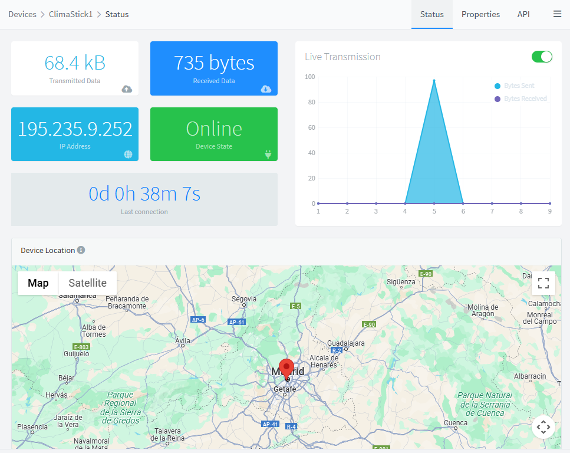

# QUICK START

Quick Start Guide

To start working with Thinger.io just [**create a free account in our cloud platform**](https://console.thinger.io/#!/signup) and follow the next steps to configure and connect the first IoT device.

### 1. Create Device 

Using `Devices` menu tab, just click in `Add Device`button. We recommend starting with a compatible Arduino Framework device (ESP2666, ESP32, MKR1010, etc), so choose Generic Device in `Device Type`and fill the form with the `Device Id`, `Name`, `Description` and `Credentials` prefered.  Thus, this is explained in further detail in the section on [Devices Administration](features/devices-administration.md). Make sure to click on Add Device to finish the process.

<figure><figcaption></figcaption></figure>

### 2. Connect Device 

After provisioning the device at Thinger.io cloud, it is time to configure it in the Hardware device. There are many different hardware supports and communication technologies, but Thinger.io allows using all of them:



The most suitable devices to start working with Thinger.io are the ESP8266 or ESP32. Our [Thinger.io library](https://github.com/thinger-io/Arduino-Library) for the Arduino framework allows programming the first device in two minutes, just following the next steps:

1. [Install Thinger.io libraries into the Arduino IDE](arduino/#installation)
2. Going to "File>Examples>Thinger.io", open the example code that fits better with the board, i.e., ESP8266
3. Edit the example code to include the `USERNAME`, `DEVICE_ID` and `DEVICE_CREDENTIALS`established in the previous step.

<figure><figcaption></figcaption></figure>

<figure><figcaption></figcaption></figure>

The basic example contains two simple resources to send and retrieve to the device, i.e., controlling a digital pin or reading a value from the device.  It can be modified with many different functionalities that we have explained in the [**Coding**](coding-guide.md) **Guide** section.  After modifying the source code, just flash the device again and wait for the device to connect.


Find additional information about Thinger.io devices in the next sections:&#x20;

1. [**Compatible Arduino and Linux devices**](devices.md)
2. [**Zero to Hero Thinger.io Firmware Coding Guide** ](coding-guide.md#sketch-overview)
3. [**Connection Troubleshooting Guide**](https://docs.thinger.io/coding/good-practices-and-troubleshooting)




1\) Create an HTTP device profile by selecting it in the "Device Type" when creating the device \
2\) Going to the device dashboard, create an HTTP device Callback \
3\) Create a device Access Token to authorize the device sending data to the platform \
4\) Introduce the HTTP request (API+TOKEN) into your device code or third party platform and start sending data to Thinger.io


[http-devices.md](http-devices.md)




Any individual Sigfox or LoraWAN device can be integrated using our API as HTTP devices, just setting an HTTP device callback into their callback managers, but if a big network is going to be created using these technologies, it is better to use our integration plugins:


[sigfox.md](lpwan/sigfox.md)



[Broken link](broken-reference)




1\) Create a new device profile and select "MQTT" device type\
2\) Configure device credentials a secret password\
3\) Configure the MQTT client to send data to the embedded broker


[mqtt.md](mqtt.md)




### 3. Devices & Data management 

Thinger.io enables users to organize, monitor, and interact with connected devices through a unified interface. It allows real-time visibility into device status, access to and control over device resources (such as sensors or actuators), and the ability to store historical data in _Data Buckets_ for later analysis. Additionally, it supports tagging and grouping devices, making it easier to manage large-scale deployments. Overall, this feature is essential for maintaining a structured, scalable, and easily manageable IoT system.

T4. Store, Show & Share Data

Thinger.io provides three essential tools to work with device data that are the basis for creating any IoT project. The next tabs show each tool introduction:



To **store** **device data** in a scalable way, program different sampling intervals or record events raised by devices.


[buckets.md](features/buckets.md)




Panels with **customizable widgets** that can be created within minutes using drag'n drop technology, to show real-time and stored data.


[dashboards.md](features/dashboards.md)




Extend the device's interoperability by using endpoints to interact with other services like IFTTT, custom Web Services, emails, or call other devices.


[endpoints-1.md](features/endpoints-1.md)




Dashboards, Data buckets or Device resources can be easily shared with third parties using **Access Tokens** and our **API.**


[access-tokens.md](features/access-tokens.md)




### 5. Extend Thinger.io 

Thinger.io platform can be complemented with many different Internet services using **Plugins** that can be found and deployed within seconds just by going to our marketplace and selecting them.

<a href="business-features/plugins-marketplace.md">Plugins</a>

