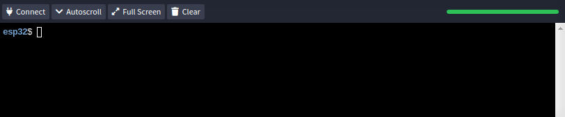

# REMOTE CONSOLE

Remote console is a unique Thinger.io feature to allow remote access to the devices. It allows the creation of web terminals to interact with the device like in a serial interface. It also provides features to create interactive terminals on any Arduino-compatible device.&#x20;

This feature is especially useful for remote diagnosis, showing logs on devices, managing device configuration, or any other functionality, as the console can be easily extended to include new commands.


## Web Serial Interface

By default, the Thinger.io Console can work as a web serial interface, similar to the Arduino Serial Monitor, where the device writes logs to the serial interface.&#x20;

To use Thinger.io Console, it is required to include the `ThingerConsole.h` file and create an instance by `thing` reference.

```
#include <ThingerConsole.h>

ThingerConsole console(thing);
```

### Writing to Console

Then it is possible to use the `console` instance for logging to the remote terminal by using the same interface available in the Arduino `Serial` class, i.e, using `println`, `printf`, etc. This code shows a log every second:

```cpp
unsigned long last_log = 0;
void loop() {
  thing.handle();
  auto current = millis();
  
  if(current-last_log>=1000){
    last_log = current;
    console.printf("printing on serial interface: %lu\r\n", current);
  }
}
```

When the terminal is connected in the Thinger.io console, the device will start to send the configured log. If there is no terminal connected to the device, the device will skip sending any data over the wire.

.gif>)

It is possible to check if the console is connected, so the associated logging code can be omitted, which can be useful if the log involves doing some calculation, reading a sensor, etc. The above example can be improved by adding an extra check&#x20;

```cpp
unsigned long last_log = 0;
void loop() {
  thing.handle();
  
  // check if console is connected
  if(console){
    auto current = millis();
    if(current-last_log>=1000){
      last_log = current;
      console.printf("printing on serial interface: %lu\r\n", current);
    }
  }
}
```


If the web console is not connected, the device will not send any data over the wire.


### Reading from Console

Reading from the serial can be done in the same way it is done over Arduino `Serial` interface. This code sample checks if there is any data available using the `available` method on the console (in the same way it is used on Arduino `Serial`), and will print back to the console:

```cpp
void loop() {
  thing.handle();
  if(console.available()){
    console.setTimeout(100);
    String input = console.readStringUntil('\n');
    console.print("> I received: ");
    console.println(input);
  }
}
```


## Interactive terminals

It is possible to create interactive terminals easily for handling custom commands with arguments. For working with the interactive terminal mode, it is required to create and register commands on the console instance.

### Create Commands

Creating a new command in the console can be done with the `setup` function. It is required to call the function `command` over the `console` instance. This function requires two arguments: the `command name` first and the second `command function`. There is an optional parameters that is the `command description`, that can be useful to specify command arguments or any other help about the command.

In the following sections, some command examples are presented covering different requirements, like writing to the console, reading arguments, or reading from the console.

#### Millis Command Example

The simplest example of a command registers a command named `millis`, and a function that just prints the result of the `millis()` function over the console terminal. It also includes a description in the third argument with this content.

```cpp
void setup() {
  // any other code
  
  // console commands
  console.command("millis", [&](int argc, char* argv[]){
    console.println(millis());
  }, "get current time millis");
}

void loop() {
  thing.handle();
}
```

This will result in a prompt with an interactive terminal in the console, with the ability to execute the `millis` function defined above.




The function definition with the syntax `[&](int argc, char* argv[]{}`is a C++ lambda function, but it is possible to use any other`void function(int argc, char* argv[]){}`


#### Log Command Example&#x20;

There are some cases where commands need to be running during long periods, i.e., to print an ongoing log. The command will print a sample log until the command is canceled or the console is closed.

```cpp
void setup() {
  console.command("log", [&](int argc, char* argv[]){
      while(console.command_running()){
        console.printf("Running log at %lu\r\n", millis());
        delay(1000);
      }
  }, "show logs");
}
```

To work with long-running commands, it is required to frequently check the `command_running` method, which will return false if the console has been closed or the command was cancelled.


To cancel a running command on the terminal, just press Ctrl+C



#### GPIO Command Example&#x20;

Some commands may need to accept arguments, i.e., turn on/off a given GPIO, print a given string to a display, modify a threshold, etc. For this reason, all commands receive `argc` and `argv` parameters, like in any standard C/C++ main function. `argc` determines the number of arguments, and `argv` is an array of `char*` which holds all parsed parameters. Any command will receive at least one argument, which is the command name.

A command is created to modify the digital state of a given GPIO. This function accepts two parameters, which are the GPIO pin number and the desired state.&#x20;

```cpp
void setup() {
  console.command("gpio", [&](int argc, char* argv[]){
      if(argc<3){
        console.error("missing parameters");
      }else{
        int pin = atoi(argv[1]);
        pinMode(pin, OUTPUT);
        digitalWrite(pin, strcmp(argv[2],"on")==0);
        console.printf("%d turned %sn", pin, argv[2]);
      }
  }, "<pin> <on|off> turn on/off a given gpio");
}
```


#### Hello Command Example

Commands may also require reading console inputs interactively while they are running. A simple command is outlined that asks for a name to say hello.

```cpp
void setup() {
  console.command("hello", [&](int argc, char* argv[]){
    console.print("please, enter your name: ");
    console.flush();
    while(console.command_running() && !console.available());
    String name = console.readStringUntil('\n');
    console.printf("hello %s\r\n", name.c_str());
  }, "hello command");
}
```

Once the command is executed, it will prompt the user for its name, waiting until it is ready. After typing the name and pressing Enter,, it will display the name with a hello.


### Terminal Prompt

By default, when the interactive terminal is enabled, it will show a prompt with the device identifier. The `esp32` name acts as the device's identifier:

.png>)

The prompt name can be modified by using the `set_prompt("my prompt")` method on the console instance. For example:

```cpp
void setup(){
    console.set_prompt("Arduino");
}
```

Will result in a modified prompt with the `Arduino` name.

.png>)

### Default Commands

By default, Thinger.io adds some general utility commands.

#### Help command

The help command will display all registered commands with an associated description.

.png>)

#### Reboot command

Thinger.io client implements a command that will reboot the device, as in a normal computer.&#x20;

.png>)

#### Clear command

It can be useful to clear the console sometimes, so it is a clear console command to clear all screen content.


## SSH Connection

The console can be accessed over the Thinger.io web console, but there is also a possibility for connecting devices over standard SSH connections from the Internet (no local network required). This feature is a work in progress and will be released soon as a plugin!


