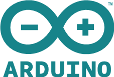
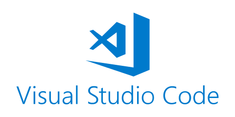

# SDK SETUP

Currently there are two main alternatives to develop with Arduino Compatible devices in Thinger.io. The first one is based on the well-known Arduino IDE, and the second one is Visual Studio Code with PlatformIO.

In Thinger.io we recommend using **Visual Studio Code**, as it provides a better editor, code completion, multiple hardware platforms, and enables some extended features from Thinger.io like OTA.

## Arduino IDE



## Visual Studio Code



