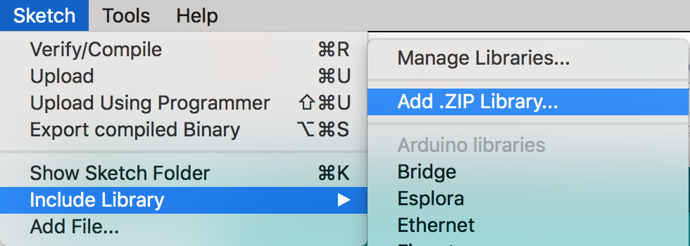

# Arduino IDE

Arduino is widely recognized as the best framework for learning, prototyping, and even product development. Its simplicity and the robust community of developers continuously enhancing its capabilities make it an excellent choice.

At Thinger.io, we have developed a Software Client to easily connect Arduino-based devices. This client is compatible with a wide variety of hardware and is available for Windows, macOS, and Linux distributions. You can download it for free from the official [Arduino website](https://arduino.cc).

The following sections will guide you through the installation and preparation of the Arduino IDE to work with Thinger.io client libraries.

<figure><figcaption><p>Arduino IDE</p></figcaption></figure>

## Installing the Arduino IDE

To use Thinger.io with Arduino, you need a modern version of the Arduino IDE that supports the Library Manager and other advanced features. Please ensure you install version 1.6.3 or later. If you already have a compatible version installed, you can skip this step.

1. **Download the Arduino IDE**: Visit the official [Arduino download page](https://www.arduino.cc/en/software) to download the latest version suitable for your operating system (Windows, macOS, or Linux).

Follow the instructions on the website to complete the installation process.

## Install Thinger.io from Library Manager

Thinger.io Client libraries contain the software needed to connect Arduino-compatible devices with the Thinger.io platform. Using these libraries is the preferred method for connecting devices, as it allows you to leverage all of Thinger.io's features.

To install the Thinger.io library from the Arduino Library Manager:

1. **Open the Library Manager**:
   * In the Arduino IDE, go to **Sketch > Include Library > Manage Libraries**.
2. **Search for Thinger.io**:
   * Use the search bar in the Library Manager to find "Thinger.io".
3. **Install the Library**:
   * Select the Thinger.io Client library from the search results and click **Install**.

<figure><figcaption><p>Thinger.io Arduino Library</p></figcaption></figure>

## Install Thinger.io from ZIP

If you prefer to manage the libraries yourself or the Library Manager is not working, you can manually install the Thinger.io library by following these steps:

1. **Download the ZIP Library**:
   * Obtain the .zip library file from the official [Thinger.io project GitHub repository](https://github.com/thinger-io/Arduino-Library).
   * Click on CODE and download the ZIP named [`Arduino-Library-master.zip`](https://github.com/thinger-io/Arduino-Library/archive/refs/heads/master.zip).
2. **Rename the ZIP File**:
   * Rename `Arduino-Library-master.zip` to something more relevant, such as `thinger.zip`.
3. **Import the ZIP Library in Arduino IDE**:
   * Open the Arduino IDE.
   * Go to **Sketch > Include Library > Add .ZIP Library...**.
   * Navigate to and select the `thinger.zip` file.
   * The Arduino IDE will uncompress and copy the zip library into the Arduino libraries folder, typically located under your Documents folder.



## Starting a Project

Once the Thinger.io Library has been installed, you can start a new project using one of the default examples provided. There are examples tailored for different boards, so choose the one that matches your device.

1. **Open Example Project**:
   * In the Arduino IDE, go to **File > Examples > thinger.io**.
   * Select an example that corresponds to your device.

This will load the example code, which you can then modify to suit your specific needs.

<figure><figcaption><p>Thinger.io Arduino Examples </p></figcaption></figure>

&#x20;A basic example for an ESP32 device will look like the following:



```cpp
#define THINGER_SERIAL_DEBUG

#include <ThingerESP32.h>
#include "arduino_secrets.h"

ThingerESP32 thing(USERNAME, DEVICE_ID, DEVICE_CREDENTIAL);

void setup() {
  // open serial for debugging
  Serial.begin(115200);

  pinMode(16, OUTPUT);

  thing.add_wifi(SSID, SSID_PASSWORD);

  // digital pin control example (i.e. turning on/off a light, a relay, configuring a parameter, etc)
  thing["GPIO_16"] << digitalPin(16);

  // resource output example (i.e. reading a sensor value)
  thing["millis"] >> outputValue(millis());

  // more details at http://docs.thinger.io/arduino/
}

void loop() {
  thing.handle();
}
```



```cpp
#define USERNAME "your_user_name"
#define DEVICE_ID "your_device_id"
#define DEVICE_CREDENTIAL "your_device_credential"

#define SSID "your_wifi_ssid"
#define SSID_PASSWORD "your_wifi_ssid_password"
```


