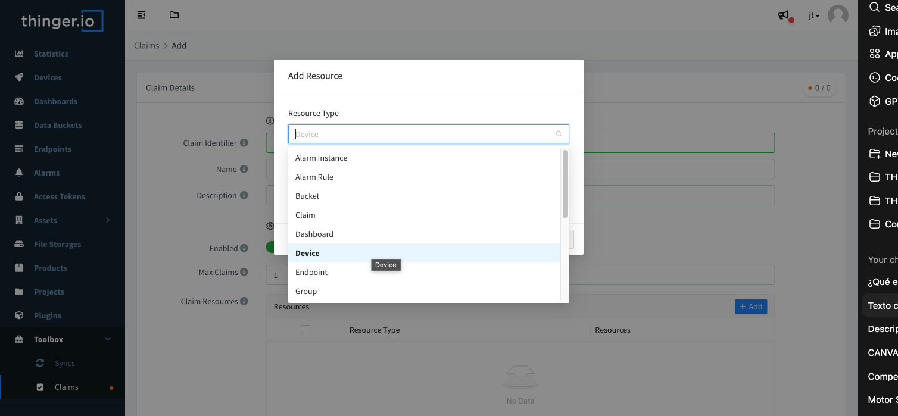

# SERVER ADMINISTRATION

When a new Thigner.io Private Instance is created, it is provided with an standard web domain \(similar to "https://mycompany.do.thinger.io"\) and uses a web console with standar Thinger.io brand aspect, however, it is possible to create multiple rebrands over this consoles and modify the web domain in order to custom the aspect of the platform to multiple customers branding. this feature provides support for deploying multi-tenant solutions. It is also possible to create multiple user accounts that will make use of the same private server, creating an isolated network of users for specific projects. 

In this section it is explained how to use the Server Administration tools to configure the server for using this features in a simple way. 

## Web Console Rebranding

Thinger.io instances support multi-tenant web console customizations. By means of a management tool that is available at the main menu "Rebranding" section, it is possible to create and manage multiple web customizations, in order to custom the aspect of the web console to different customers or projects by changing some elements such as:

* [x] Branding Colors
* [x] Web, Favicon and Main Menu logotypes
* [x] Links, Email accounts, copyright


Note that each web console reband needs to be supported by an individual web domain, which can be managed in the "Domain" section of the main menu.


### Create a new Web Console Rebranding Profile

Clicking into "Add Brand" button of the "Rebranding" section, allows creating a new branding profile. The process starts by introducing a web domain name, that will be the identificator for the brand profile:

### Adding Branding Details

If the Domain Name is valid, the form context will expands allowing to complete the branding details sections by editing the standard thinger.io values:

All the next elements are non-mandatory, so can be left empty and the system will remove their buttons from the main menu:

* **Domain Name:** Is the URL of the new rebranded web console. This Web Domain needs to be introduced in the system as is explained in the "Custom Web Domain" section. 
* **Description:** Place here some additional information about the rebranding profile in order to identify it from the others.
* **Page title:** Identificator for the web browser tabs
* **Page URL:** To introduce link to the company, customer or project website
* **Company Name:** Name of the project, customer or company this rebranding belongs to. 
* **Contact Email:** address for the main menu"Email" button ****that the users are going to contact for support.
* **Twitter Account:**  Social media profile can be added by placing here the complete URL of the twitter profile.
* **Copyright:** The bottom of the website includes a copyright declaration that can be customized here to protect the rebranding rights.  

### Custom Logotypes

What really makes the difference when creating a rebranding is the use of custom logotypes. The second section of the branding editor allows changing each web console logotype separately. To obtain nice results, it is important to take care about the background color of each logotype in order to obtain enough contrast.


Logotypes needs to be introduced in SVG or PNG file format with transparent background 


### **Custom Top Bar**

The top bar has also a big impact into the website aspect. The branding menu allows changing it aspect in two ways: the Top Bar Color and the text color:

It is important also to take care about selected colors in order to obtain good contrast between the texts and background. 

### **Modify a Console Rebranding**

When the Console Rebranding profile is finished, a new entry will appear into the rebranding administration list as shown in the image below:

It is possible to access the configuration form and edit all parameters by clicking into the brand profile identificator, which is the associated web domain.

### Remove a Console Rebranding Profile

A rebranding profile can be easily deleted just selecting it in the Brand List and clicking into the red "Remove Brand" button.

## Custom Web Domain 

Private Instances web-domain can be replaced with different custom web domains, providing an additional white labeling feature, and supporting for multi-tenant deployments in which each customer can use it's own URL to access a different rebrand of the cloud console. This feature can be easily managed using the Domain Administration Manager, available at Thinger.io main menu.

### Create a new Web Domain

Pressing "Add Domain" button in the Domains List interface allows accessing to a domain creation form context, in which it is possible to introduce the new web domain for the instance and description as shown in the image below: 

Before add the new web domain, it is necessary to verify the disponibility and create a secure certificate that will provide secure communications with the web console. To make this, press the "Verify Domain" button. 

#### Redirecting the CNAME Entry 

An important part of this process is to resolve the redirection between the new web domain and the private server original web domain by going to the domain administration service. 

Onces the redirection has been made and the DNS service has propagated the A register, it is possible to verify the domain using the Domain Details button. 

After this process the domain will be ready to be used in a rebranding profile, allowing users to access the private instance with the custom URL.

### Modify Web Domain

In the Domain List, clicking over the domain name allows opening the web domain parameters. It is not possible to change the URL, if needs to be modified, it is necessary to remove the profile and create a new one. 

### Remove Web Domain

Any Web Console profile can be easily deleted just selecting it in the Domain List and clicking into the red "Remove Domain" button.

Note that if a web domain is associated to a web console rebranding, removing it will prevent accessing to the console.  

## User Accounts Management

Thinger.io Server Instances can support multiple user accounts that can be managed from the administration account. This feature allows creating a user network in which each user account has its own resources such as devices, dashboards, data buckets or even it own plugins.


Note that each additional account increases the RAM occupation and CPU load, so it is important to supervise the remaining computational resources when creating new user accounts, specially when using Node-RED plugin.


First step to manage users network is clicking on the "User Accounts" tab of the main menu. This interface allows showing user accounts list and manage each profile individually as explained in the next sections.

### Create new User Account

Pressing "Add User" button of the user administration list opens a form context in which the new user parameters can be introduced:

* **Username**: Account username, this parameter also works as user identificator. 
* **Email**: needs to be a valid email account. Only emails introduced on this list can create a user account in order to prevent intruders.
* **Pasword**: Is the security key for login into this new user account.
* **Enabled**: Each user account can be enabled/disabled just clicking this switch
* **Email Verified**: Put this off will send a mail verification to the user when sign up in order to confirm the authenticity of the email.

When the form is completed, a new user profile will be added to the IoT server by pressing "add user" button.

#### User accounts limit

The amount of user accounts that can be created in one instance is defined during the contracting and deployment of the server. If this value is reached \(or if no additional user account was contracted\) an error message will appear as shown in the image below:

This threshold can be upgraded by going to the Subscriptions Management System, that can be accessed using the Admin Email Account at [**this link**](https://thinger.chargebeeportal.com). 

### Remove User Account

User accounts can also be deleted from the Server Instance, just selecting the checkbox in the left side of the user account profile and clicking the "Remove User" button. 


Note that, when a user account is removed, all its IoT devices, buckets, configurations and personal information will be deleted and it won't be possible to restore them.


