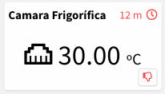

# CHANGELOG

## 6.1.0

**Community Release Date:**  08-04-2024.

**Private Servers Release Date:**  15-04-2024.

#### Added

* Brand PWA configuration includes support for uploading app icons directly from the filesystem. It also allow the configuration of both 'maskable' and 'any' icon purposes. Fixes [https://github.com/thinger-io/thinger-server/issues/84](https://github.com/thinger-io/thinger-server/issues/84)

<figure><figcaption>
PWA Images can be uploaded from filesystem
</figcaption></figure>

* Brand Share Image includes support for uploading an image directly from the filesystem.

<figure><figcaption>
Share Image can be uploaded from filesystem
</figcaption></figure>

* Brand Logos are now served from web server instead of a JSON config, which should reduce load time.
* Brand PWA "start\_url" to make the console installable on Chrome.
* Products can now be configured to resend device data to a given endpoint. For example, fetch a given resource every n seconds, or take data from a topic, and resend it to another service.

<figure><figcaption>
Endpoint configuration fon product profile.
</figcaption></figure>

* Products can now configure bucket tags to be used on the automatic initialization. Fixes [https://github.com/thinger-io/thinger-server/issues/81](https://github.com/thinger-io/thinger-server/issues/81)

<figure><figcaption>
Data tags configuration on the Product bucket.
</figcaption></figure>

* Products can now handle Resource Streams, i.e., to create custom profiles for HTTP devices.

<figure><figcaption>
New Device Stream target on Product API Resources.
</figcaption></figure>

* Endpoint call event now provides context about the caller.

<figure><figcaption>
Endpoint call caller context
</figcaption></figure>

#### Improved

* Add some resources cache for a better performance on massive endpoint calls and bucket writes.
* HTTP devices has been migrated to a new connection schema where it is possible to log their statistics, like bytes sent, received, and connections, as any other MQTT or IOTMP device.
* HTTP devices can be used now used inside dashboards with resources defined at product level.
* Device property selector for HTML widgets allow selecting any parent node (with nested values), or all property values by not selecting any field. Fixes [https://github.com/thinger-io/thinger-server/issues/16](https://github.com/thinger-io/thinger-server/issues/16)
* Property PATCH now supports regular JSON for partial property updates. Fixes [https://github.com/thinger-io/thinger-server/issues/16](https://github.com/thinger-io/thinger-server/issues/16)
* Brand icons and logos are now served from filesystem instead of data url, improving page load.
* Dashboard HTML widgets from external storage now longer requires public storage access. In case of members of a project, they will require read access to the storage.
* Product properties, topics, resources, and functions can be generated now by calling a product function.&#x20;
* Product bucket writes can now override tags values based on the write payload. Previously, tags like device were always being set by the product, discarding any "device" field present on the payload.
* Compatibility with OpenSSL 3.0 on SSL certificate provisioning.
* IP Geocoding automatic updates.

#### Fixed

* Apex Charts widget colors not honoring time series color configuration.
* Binary data on a product payload not processed correctly.
* Visual Studio Code not opening the file storage correctly.
* Products with just "run" resources where not displayed on the API explorer.
* Product profile list for buckets, endpoints, auto provision and api resources were displaying always "Property" instead of the resource type.
* Info page display on empty or restricted resources.
* Statistics on sockets count.

## 6.0.0

**Release Date:** 11-03-2024

#### **Added**

* **Property Forms 📝** : Allow creating custom forms for improving the user experience when setting values inside a property, i.e., when configuring a device. The form can be defined at Product level, and it is currently supported by [Formly](https://formly.dev/).&#x20;

<figure><figcaption>
Property Forms
</figcaption></figure>

<figure><figcaption>
Device property editor using a form
</figcaption></figure>

* **Property Location** 📍: Location properties now display a map for picking the address directly from the map or via a search bar for using an address. Once an address is selected, it automatially fills the coordinates and timezone.

<figure><figcaption>
Property location editor
</figcaption></figure>

<figure><figcaption>
Property raw fields generated by location editor.
</figcaption></figure>

* **Dashboard Functions** ⚡: Dashboard now supports creating custom functions for processing any data used in dashboard, i.e., for changing units, cropping decimals, or filtering values. Conversion functions can be selected on the data source configuration.

<figure><figcaption>
Dashboard Functions.
</figcaption></figure>

<figure><figcaption>
Source processing using Dashboard Function.
</figcaption></figure>

* **Dashboard Placeholders** 🏷: Dashboard now supports settings placeholders from a fixed value, or a device property. Placeholders can be used in a any string field on the dashboard, i.e., titles, units, or even inside functions to change the functions behaviour depending on current device configuration.

<figure><figcaption>
Dashboard Placeholders.
</figcaption></figure>

<figure><figcaption>
Dashboard Placeholder used inside a Unit Field.
</figcaption></figure>

<figure><figcaption>
Dashboard Placeholder used inside Dashboard Function.
</figcaption></figure>

* **Dashboard Property Button** 🆕 : New "Property Button" widget for opening device properties for its modification, even if they have a Property Form defined.

<figure><figcaption>
Property Button Configuration.
</figcaption></figure>

<figure><figcaption>
Property Button on Dashboard.
</figcaption></figure>

* **Dashboard Group Widget (BETA)** 🔠 : New Group Widget that brings the possibility to add any number of widgets inside a parent widget.&#x20;

<figure><figcaption>
Group Widget
</figcaption></figure>

* **Dashboard Property Table (BETA) 🔠** : Introducing a new widget that enables quick editing of properties for a device or a set of devices. This widget includes various built-in controls such as text display, input text, input number, slider, color selection, switch, a save button, and an edit button. These elements can be configured in each column to patch a single property value.

<figure><figcaption>
Property Table
</figcaption></figure>

<figure><figcaption>
Property Table Configuration
</figcaption></figure>

* **Claiming Feature**☝️: The Claiming Feature is a versatile and user-friendly tool designed for administrators to configure and expose a selected number of resources, such as devices, for end-user claiming. This feature enables administrators to effortlessly set up various resources which end-users can subsequently request. Upon a successful request, these resources, like specific devices, are automatically integrated into the end-users' accounts. This streamlined process not only enhances user experience by simplifying resource acquisition but also provides administrators with efficient control over resource distribution and management.

<figure><figcaption>
Claim Configuration
</figcaption></figure>

One of the key strengths of this feature is its flexibility in claiming methods: users can initiate a claim through a directly generated URL, by scanning a QR Code, or by using a specific Claim Code:

<figure><figcaption>
Claim Details
</figcaption></figure>

<figure><figcaption>
Claim Process - Initial Step
</figcaption></figure>

<figure><figcaption>
Claim Process - Review
</figcaption></figure>

Once claim is completed, the process may request the configuration of the devices, i.e., via the Property Forms defined on the product.&#x20;

<figure><figcaption>
Claim Process - Complete &#x26; Configure
</figcaption></figure>

*   **Configurable Brand Accounts**👨‍💼: We've introduced a new "Accounts" section for each brand. This enhancement allows more control over brand-specific behaviors, including:

    * **Cross Sign-In Control:** Decide whether users registered with one brand can log in to another, enhancing security and user management.
    * **Public Sign-Up Options:** Choose whether to allow public sign-up for each brand, providing flexibility in user onboarding.
    * **Automated Role Assignment:** Set specific account roles for users who register through public sign-up, such as automatically assigning 'member' status for device claiming purposes.

    This update offers more customization to better align with your brand's unique operational needs.

<figure><figcaption>
Brands Accounts Configuration
</figcaption></figure>

* **Configurable Brand Scripts** 🖥️ : We've rolled out an exciting update: you can now configure custom scripts for your brand's index.html. This enhancement is perfect for integrating tools like Google Tag Manager and monitor your customers traffic.&#x20;

<figure><figcaption>
Brand Scripts Configuration
</figcaption></figure>

* **New Permissions** 🔒: Console is introducing an array of specific new permissions, enhancing the granularity with which administrators can control member access and actions within the console. This update distinctly separates permissions for actions performed through the API from those executed directly on the console interface. In the current version, all existing permissions will continue to function as before. However, future updates will require the explicit assignment of 'View' permissions to maintain the access level. This change lays the groundwork for more precise and customizable user role management, ensuring enhanced security and efficiency in operation. At this moment they are partially released for Devices, but will be covering the whole console in future updates.

<figure><figcaption>
New View
</figcaption></figure>

* **Updated Editors** :woman\_technologist:: Now editors are based on Monaco (the editor from Visual Studio Code) with support to maximize the editor and copy the contents:

<figure><figcaption>
New Code/Value editor in the console.
</figcaption></figure>

* **New Icon Picker** :unicorn: :  There is a new icon picker with much more variety of icon and improved search capabilities.

<figure><figcaption>
New Icon Picker
</figcaption></figure>

#### **Improved**

* Double click on Widget now opens the Widget editor!
* Create and update properties performance
* Time series data should not present data wraps anymore.
* Internal Google Maps loader to potentially avoid multiple loads.
* Buckets API query now supports "group\_by" parameter.
* Move Swagger to an Angular component. New url https://console.thinger.io/swagger
* Initial deprecation of InfluxDB v1
* Widget add time series automatically selects a different name and color for each series.
* Dashboard source switching now allows switching between bucket tags, with minimum and maximum selected tags.
* Dashboard internals.

#### **Fixed**

* Push button widget not working on mobile devices.
* Real-time dashboards now work properly with  project members and shared dashboards.
* Fixed the issue where the dashboard widget with device resource data source was showing offline, despite the widget receiving data.
* Deletion event not triggered for nested resources, i.e., device property.
* Creation event not triggered for property resources.
* Data bucket storage from Products using device resource with fixed interval randomly stop writing.
* Add Syncs to the tokens actions.
* Dashboard editing not being disabled on non-active tabs.
* Token configuration was missing the description field.
* Delete resource from console sending parameters like index, count...

#### Core

* Partial migration from AngularJs to Angular 17
* Update OpenSSL to versión 3
* Update Boost to 1.83.0
* Update Mongoc to 1.25.1
* Update Mongocxx to 3.9.0
* Update Crypto++ to 8.9.0

## 5.3.7

**Release Date: 30-11-2023**

**Fixed**

* Issue while displaying default project on member accounts.
* Reset password not working for some email addresses.

## 5.3.6

**Release Date: 24-10-2023**

**Added**

* Support for HTTP\_HOST and HTTPS\_HOST environment variables for HTTP requests over a proxy.
* Support for disabling HOSTNAME resolutions on installed plugins, i.e., useful for plugins that requires querying external public IP (like FTP).

**Improved**

* Prevent large navigation breadcrumb overlapping the right menu button.

**Fixed**

* Device link to a Product web page not working on mobile devices (on the aside menu).
* Error while updating account limits.
* Support for 303 HTTP See Other status.

## 5.3.2

**Release Date: 04-07-2023**

**Added**

* Widgets now have a "Show Offline" parameter to "turn off" the widget if the data is not recent.

<figure><figcaption>
Show Offline Configuration based on Timespan.
</figcaption></figure>

<figure><figcaption>
Widget displayed as "Disconnected".
</figcaption></figure>

* Product API Response can now be sourced directly from a function.
* Product API Response can now be sourced directly from an IOTMP resource.

**Improved**

* Internal HTTP client stability.

**Fixed**

* Problem while counting active alarm instances on the menu.
* Alarms not triggering notifications on creation when it has immediate activation.
* Alarms not allowing to select hours as reminder intervals.
* IOTMP with multiple property stream subscriptions.
* Products not processing API Responses payload configuration, but returning just the original payload.
* Input template params to Product API Request targeting functions not being correctly processed.
* Plugins that require a MongodDB user to interact with the database fail to upgrade.
* Dashboard widget settings being closed when removing widget background.

## 5.3.0

**Release Date: 19-06-2023**

**Discussion Topic:** [**Thinger.io Community**](https://community.thinger.io/t/thinger-io-iot-platform-version-5-3-0/4784)&#x20;

**Added**

*   New Alarms feature ⏰ (BETA)! A completely new solution for managing IoT alarms, which includes rule definitions, and alarm instances management. Some key features of the new solution:

    * Multiple data sources for configuring alarms triggering include data buckets, device properties, and device state.
    * Multiple severities: High, medium, low, none.
    * Independent activation and normalization conditions, including confirmations based on timespan or a number of consecutive events.

    <figure><figcaption>
Alarm Rule Configuration
</figcaption></figure>

    * Multiple endpoint notifications on activation, normalization, or reminder., i.e., for sending an email, a message to mobile, etc.
    * Alarm instance management via Acknowledge, Shelve, Latch, or Clear, including reactivation timeouts and operator annotations.

<figure><figcaption>
Alarm Instances
</figcaption></figure>

* Support for cloning almost any thinger.io resource, from dashboards to data buckets, file storages, and projects.

<figure><figcaption>
Clone Resource Functionality
</figcaption></figure>

* HTTP endpoints now support embedded NodeJS 🧑‍💻 scripts for custom payload processing when calling third-party services.

<figure><figcaption>
HTTP Endpoints with custom NodeJS Payload processor
</figcaption></figure>

**Improved**

* The bucket list automatically refreshes the bucket state, i.e., when finish exporting or importing, which happens on a clone operation.
* IOTMP proxies now work correctly with TLS endpoints.
* HTTP over IOTMP now correctly supports WebSockets.
* Resource list and navigation:
  * It is possible to change the maximum number of elements to display per page.
  * Page navigation/sorting is not reset after entering one element and going back to the list.
* Changelog is now available at https://docs.thinger.io/server/changelog.

**Fixed**

* Remove project properties and project roles from the database on project deletion.
* The bucket field selector now displays an input text for manually selecting the fields if the latest values cannot be queried, i.e., when they are older than one week.
* Double loading of HTML widgets when the dashboard is open.&#x20;
* Proxy configuration was not displayed correctly if the source was different than TCP.
* Bucket export list not being displayed under some circumstances.
* Resource lists on the front-end not showing correct permissions on members.
* Prevent members navigate to specific resources if no permissions are available.
* UpdateDevice permission on front-end.

## 5.2.2

**Release Date: 12-04-2023**

#### Fixed

* Timestamp on HTTP device callbacks from HTTP plugin

## 5.2.1

**Release Date: 10-04-2023**

**Discussion Topic:** [**Thinger.io Community Forum**](https://community.thinger.io/t/platform-version-5-2-0/4709)

**Added**

*   Included support for installing Products over plugins. Now, there are some Shelly devices added to the plugins Marketplace. We will grow it soon! Looking for contributors and partnerships!

    
*   Initial support for devices auto-provisioning over products. It is currently based on the device id but will include other features like white lists, manual approval, etc.

    
* New Plugins Marketplace based on a monorepo repository: [Thinger.io Plugins](https://github.com/thinger-io/plugins). It will allow better maintainability, and simplify new contributions!
*   Initial Plugin Exporter feature inside Products. This way, a Product can be easily converted to a Plugin. enhancing user contributions.

    
* Device type to "device\_authentication\_failed" event.

#### Improved

* Avoid creating a Docker network if the plugin does not run a task (i.e., products).
* Plugins marketplace on frontend, with better image alignment.
* Permissions assigned to user File Storages are 1000:1000, so they can be easily edited over plugins, i.e, in Node-Red, VSCode, Juypyter plugins, etc.
* Plugin files copied on installation now have 1000:1000 permissions, so, they are modifiable over plugin shells.

#### Fixed

* Bucket exports showing duplicate columns
* Domain creation when setting a name

## 5.1.12

#### Release Date: 16-03-2023

#### Fixed

* Temporal restore of default IOTMP buffer size until IOTMP-Websocket supports growing buffers

## 5.1.11

#### Release Date: 14-03-2023

#### Fixed

* DynamoDB (community buckets) bucket projections when using reserved keywords

## 5.1.10&#x20;

#### Release Date: 08-03-2023

#### Fixed

* Null/false on bulk bucket writes when using tags on topic placeholders
* DynamoDB (community buckets) bucket projections when using non-alpha characters

## 5.1.9

#### Release Date: 07-03-2023

#### Improved

* Bulk bucket writes are now also supported from products

## 5.1.8

**Release Date: 06-03-2023**

#### Fixed

* Center images on dashboard image widget.
* Remove undesired console.log used in development
* HTML widgets from file storages may fail to load
* Dashboard add widget modal closes when adding new background color

#### Improved

* DynamoDB can now use field projections from dashboards to save bandwidth
* Reduced dashboards max chunks fetch to support large datasets on DynamoDB

## 5.1.7

#### Release Date: 06-03-2023

#### Add

* Daily Data transmission on device Status (For MQTT and IOTMP)

#### Fixed

* Computed data transmission for current and past days

## 5.1.6

#### Release Date: 03-03-2023

#### Fixed

* Big logo shown on shared dashboards

## 5.1.5

#### Release Date: 03-03-2023

#### Fixed

* Problem when converting certain InfluxDB data back to JSON.

## 5.1.4&#x20;

#### Release Date: 02-03-2023

#### Improved

* Maximum message size for IOTMP/MQTT devices.

## 5.1.3

#### &#x20;Release Date: 01-03-2023

#### Fixed

* Fix SSL certificates provisioning on instance startup.

## 5.1.2

#### Release Date: 27-02-2023

#### Fixed

* Plugin Environment variables not initialized on upgrade.
* Dashboard error popups hidden on device dashboard.
* Menu on mobile not responding to first touch event.

#### Improved

* Disconnect mechanism after server restart. It should correctly handle device disconnections and its events.

## 5.1.1

#### Release Date: 24-02-2023

**Discussion Topic:** [**Thinger.io Community Forum**](https://community.thinger.io/t/platform-version-5-1-1/4669)

#### Added

* Infinity scroll on mobile view.
* Support for bulk data bucket writes, i.e., `[{"ts": 1675360078000, "val1": 0, "val2": 1},{"ts": 1675360088000, "val1":1, "val2":3}]`. Only working on private instances at this time.
* Clock icon display full time when the mouse is over
*   Clock icon display full time when the mouse is over

    
*   Protocol column now displays the connection security

    
*   Error/Info messages on mobile view

    

    

#### Fixed

* "Never" is shown again when the device has not been connected
* Resource inspector not opening
* Minor bugs
* Bucket import error reporting
* Plugins logs not working with the latest Docker versions
* Locks not deleted when Sync is removed

#### Improved

* Scrollbars on left menu and content are now overlay scrollbars with auto hide.
* Action buttons are now displayed on the left on desktop view.

* Resource ID is also displayed on mobile view
* Set Type, Set Group, and Set Projects do not require a list refresh.

## 5.0.1

#### Release Date: 2023-02-14

**Discussion Topic:** [**Thinger.io Community Forum**](https://community.thinger.io/t/platform-version-5-0-1/4664)

#### Added

* Support for **ARM64** (Raspberry Pi, Apple M1, Apple M2).
* New 'Syncs' feature inside the Toolbox section: Semaphores for distributed IoT devices that can be used for bandwidth limiters, access control, max number of devices doing OTA, etc. This feature can be used both from API or IOTMP devices using new `lock_sync` and `unlock_sync` methods. Each lock acquires a fixed number of slots if they are available.

* New Content-security-policy HTTP header configuration on Cluster Settings > Deployment.
* Products can now target a File Storage for its script (still under testing). It will automatically load the `index.js` script on the Storage.

* Product APIs can now target a script function for its destination and include additional placeholder data from properties or other device APIs.

#### Fixed

* Product APIs with Property as its target (the property was not written).
* Exception when `TOKEN` is not provided.

#### Improved

* Installed plugins are now automatically updated on impersonation changes.
*   UI with better support for mobile devices. Will be released as an APP. Still under development! :technologist:

    

#### Core

* Base Docker Ubuntu version from 20.04 to 22.04
* Updated OpenSSL version from 1.1.1m to 1.1.1t
* Updated Boost version from 1.78 to 1.81
* Updated mongoc version from 1.20.0 to 1.23.2
* Updated mongocxx version from 3.6.6 to 3.7.0
* Updated CryptoPP from 8.6.0 to 8.7
* Updated Jemalloc from 5.2.1 to 5.3.0
* Updated Maxmind from 1.5.2 to 1.7.1

#### \[4.6.7] 2022-12-20

#### Fixed

* SSL automatic updates

#### Added

* Search any field on resource lists via API, i.e., email on user accounts.
* Internal configurable parameter "certificates.min\_certificate\_validity"

#### Improved

* Validate sort and order query parameters on resource listing

#### \[4.6.6] 2022-11-22

#### Fixed

* Database initialization for users without an initial password
* Device access without permissions, i.e., from a member

#### \[4.6.5] 2022-11-22

#### Fixed

* Bucket clear error
* Remove export create log

#### \[4.6.4] 2022-10-28

#### Fixed

* Bucket export with custom date interval does nothing.
* Difference transformation without aggregation provoked an error.
* Representation issue on dashboard when setting absolute timeframe after a relative timeframe.

#### \[4.6.3] 2022-10-27

#### Added

* New setting on Dashboard control allow to hide hours from absolute date range picker.

#### Improved

* Aggregated dashboard time series queries that includes a transform (i.e., a difference or derivative), now automatically expands the query interval (lower bound) to display the expected range displayed on the UI.

#### Fixed

* Date-time selector now relies on datetime-local HTML5 component, removing some issues related with previous date-time picker.
* Access tokens without a project should not limit accessing to project resources

#### \[4.6.1] 2022-10-13

**Discussion Topic:** [**Thinger.io Community Forum**](https://community.thinger.io/t/platform-version-4-6-0/4553)

#### Added

*   Experimental **IOTMP Proxies** (TCP/HTTP) for connecting with device local network resources, i.e., devices/routers webpages, terminals, RDP, VNC, etc. These proxies requires new IOTMP client library for Linux.

    

    Example of the IOTMP Linux Client working on a [RevPi](https://revolutionpi.com/), providing access to device configuration over the local web page:

    
*   Support for defining **Web Services** inside `Products` section. It allows defining web pages that can be accessed over an IOTMP linux client.

    
*   Ability to **create project members** directly from the "Add Member" section, creating the user automatically by providing only the email address.

    
*   Each project can now define a set of **Project Roles** that can be used by any member within a project.

    
*   Each developer/admin account can now define a set of **Global Roles** that can be used by any member within any project. For example, a general purpose read role that can be shared in all projects.

    
*   **Project member permissions** can be now established by **roles** in addition to custom member permissions, simplifying permissions management. All global roles, project roles, and custom permissions can be established together (if required).

    

#### Improved

* Members will go to the first allowed section after login or refresh, instead to the default Project Dashboard, i.e., devices or dashboards if they do not have access to read project dashboard.
* Device resource streams includes now different signals: start, stop, data, and error (on IOTMP devices), in order to keep track of streams.
*   Device Terminal now supports multiple concurrent sessions (with the IOTMP linux client).

    
* Server can now use wildcard certificates, stored as `*.mydomain.com` on the certificates folder. Provisioning wildcard certificates over Domains section is not possible.
* Internal socket server can now filter socket connections based on IP address. Used at this moment internally for proxies security.

#### Fixed

* Very high loads over websockets could cause a crash under some circumstances.
* Automatic transition to newly created resources when they are nested more than 2 levels (i.e., while creating a new project member).
* Potential crash with multi-thread product initialization at startup.
* Switching between projects, or opening/closing projects reporting forbidden under some circumstances.
* Set projects displayed on proxies (proxies does not support projects).
* Missing selectors when configuring specific token permissions, i.e., over a proxy.
* Access Tokens now are limited to the project scope where they are defined.
* Payload not being sent on IOTMP devices.

#### \[4.5.4] 2022-07-14

Discussion Topic: [Thinger.io Community Forum](https://community.thinger.io/t/platform-version-4-5-4/4483)

#### Improved

* File Storage explorer does not download binary files automatically when clicked, it just displays a download button: 
* Storage API now determine if a file without extension is `text/plain` or `application/octect-stream` to set the correct `content-type` on HTTP response
* Add option `rewrite_base_path` to avoid base path rewrite in plugins reverse proxy
* File Storages can now be opened with VS Code when the plugin is installed 

#### \[4.5.3] 2022-07-13

Discussion Topic: [Thinger.io Community Forum](https://community.thinger.io/t/platform-version-4-5-0/4477)

#### Added

*   Support for limiting range selector on dashboard (i.e., allow only relative and/or absolute range selection).

    
* Screen helpers for all resources on Thinger.io, with links to documentation, API, features, etc.

#### Improved

* Location set from a device property now overwrites geo-ip location, and:
  * Trigger `device_location_changed` event with new location
  * Execute the Geofence configuration to trigger any action based on location change
  * Fixed location is now displayed correctly on Assets Maps

#### Fixed

* Fix Bucket query when fields contain a path with dots, i.e., environment.temperature

#### \[4.5.0] 2022-06-28

Discussion Topic: [Thinger.io Community Forum](https://community.thinger.io/t/platform-version-4-5-0/4461)

#### Added

*   New administration feature called 'Proxies' (starting on MEDIUM instances), which allows creating custom proxies to plugins or local services, i.e, redirect TCP or UDP traffic to Node-RED (for example, for COAP devices), or provide access to local InfluxDB2 install

    
*   New plugin InfluxDB2 (starting on MEDIUM instances, as it requires Proxies feature). It supports accessing the InfluxDB2 GUI and API for custom configurations, dashboards, alerts, ingestion, etc.

    
* A plugin install can now initialize any resource in the console, i.e., InfluxDB2 plugin automatically initializes a proxy
* Plugins can now be defined without a task, i.e., the InfluxDB2 plugin does not deploy any additional container

#### Improved

* Swagger API Generation (tested on proxies API)
* Plugin installs from File Storages
* Left menu now correctly displays the current selected plugin

#### Fixed

* Some fixes on dashboards using image widget and map widget with geofences
* Devices API v2 not respecting the v2 specification (wrapping response inside 'out')
* Loading bucket data view without access to bucket config (required for loading tags information), i.e., when a member does not have permissions for ReadBucketConfig
* Plugins API now supports "id" query parameter, required for Plugin selector

#### \[4.4.0] 2022-06-20

Discussion Topic: [Thinger.io Community Forum](https://community.thinger.io/t/platform-version-4-4-0/4450)

#### Added

*   Bucket view now display tag values in the first columns

    
* Buckets data query API now supports a new query param 'fields' for selecting specific fields from a bucket, i.e., ?fields=temperature,humidity
* Buckets data query API now includes a v2 endpoint removing unnecessary 'val', or aggregation/transformation name on each measurement.

#### Improved

* Dashboards now select only required fields from a bucket, improving bandwidth/resources for buckets with several fields
* Bucket view now auto-resize columns according to the content size
* Bucket view now display a 'Loading' overlay while fetching data
* InfluxDB2 performance by relying on InfluxQL queries when possible
* Grafana plugin is now able to automatically configure data sources (both InfluxDB1 (compatibility) and InfluxDB2)

#### \[4.3.2] 2022-06-15

#### Fixed

* Map widget initialization when the map is placed on a dashboard tab

#### \[4.3.1] 2022-06-14

#### Fixed

* Fix problem while installing plugins on small instances

#### \[4.3.0] 2022-06-12

Discussion Topic: [Thinger.io Community Forum](https://community.thinger.io/t/platform-version-4-3-0/4444)

#### Added

*   Support for switching projects in the mobile view

    
*   Show dashboard name on project dash instead of the default navigation bar

    

#### Fixed

* Project dashboard switch when the user is not a member

#### \[4.2.0] 2022-06-08

Discussion Topic: [Thinger.io Community Forum](https://community.thinger.io/t/platform-version-4-2-0/4443)

#### Added

*   Open Graph support for title, description and image, configurable for each brand, i.e., when sharing a link over a social network.

    
*   Bucket data viewer now includes a filter by time

    
*   Set project dialog now keeps previous assigned projects on the resources

    
* Full support for new time-series backend: InfluxDB2
* Server API updates with support for querying branch information and statistics from localhost
*   Landing pages for each resource type, providing information and links to resources

    
* Support for launching processes inside plugins and get the command response over http/websocket
* Shell over a plugin instance is now executed inside the plugin container (using exec)
* Shell over a plugin now adapts to the original terminal size
*   Show page title according to navigation state, i.e., 'Devices | esp32 | terminal'

    
*   Console rebrand based on new image/logo, including emails

    

#### Improved

* InfluxDB2 queries performance when using 'heavy' buckets with multiple tag values
* Data bucket import now excludes empty or null values
* Internal proxies to plugins, required for supporting latest Grafana version and its security requirements
* Plugins can now (and should) set image version inside the task.image field (i.e. grafana/grafana:8.5.4) , so it can be decoupled from plugin version
* InfluxDB2 + Grafana integration, with automatic source configuration on install
* Console terminals now uses a custom user-friendly scrollbar
* Dashboard view on mobile when controls are enabled (timespan selector and aggregation)
* Mobile navigation when clicking on menu or showing tables
* Data bucket viewer now display local time instead of ISO date on bucket entries.
* Better compatibility for showing last update timestamp on dashboard widgets (even time series charts)
* Using 'password' type on account management
* Fix tachometer widget scaling and value update

#### Fixed

* Multiple dashboards queries on dashboards when using buckets with several tags values
* Undesired timestamp plot on time series chart when no field mapping is present on the widget source
* Slider widget malfunction when setting step width smaller than 1.0
* Dashboard aggregation controls shown on community version (only supported on private instances)
* Console terminal not releasing window
* Plugin markdown not shown
* Migration to new dashboard sources not working correctly on control widgets
* Download bucket exports not working on the community
* Problems with device terminals after the 4.0.0 upgrade
* Search by id or name problem after introducing 'domain' on resources
* MQTT Fix potential crash with malformed inputs
* Email fixes when using multiple brands and multiple email servers

#### \[4.0.0] 2022-05-18

Discussion Topic: [Thinger.io Community Forum](https://community.thinger.io/t/platform-version-4-0-0/4442)

#### Added

*   Support for multiple time series sources on time series widgets, i.e. charts, html time series, and maps.

    
*   Add new "Product" section to allow defining device profiles, that will help when managing devices at scale.

    

    * It supports updating device properties from MQTT topics / device resources
    * It supports defining buckets from MQTT topics/device resources
    * It allows creating custom device APIs for MQTT/HTTP/IOTMP devices.
    * Add support for processing data payloads with NodeJS runtime.
    * Add support for defining per-product dashboard, which is inherited by each device. Devices now automatically open the product dashboard if it is available.
    * It adds another property hierarchy for devices, with this order Product > Type > Group > Device.
*   Data buckets now supports tags: multiple data from the same type can be stored in the same bucket.

    
*   Dashboard support for buckets with tags.

    
*   New role named "Domain Admin", with the ability to manage developer/members inside the specified domain(s).

    
* Initial support for device shadow information, i.e., being able to display last stream data on a dashboard even if de device is disconnected.
* Add new Inspector tool for any resource, so, it is possible to see live Events related to monitored resources, i.e., MQTT live data sent by a device.
* Disabling a device from its settings disconnects the ongoing connection.
* APIs now support additional content-types: messagepack, cbor, ubjson, and form data.
*   Support for InfluxDB transformations on dashboards

    
* Support for MQTT retained messages

#### Improved

* Aggregated data in dashboards now use browser timezone to display data correctly.
* Device API now lazy load device resources when clicked, useful for devices with several resources.
* Device API now keeps track of opened resources when refreshing the API with the button.
* Tokens and Device Tokens can be easily copied with a button.
* Allow plugins to update current token permissions.
* Auto-hide track waypoints on map widget depending on map zoom level.
* Bucket data view now displays the real field case on the columns.

#### Fixed

* Brand email configuration not working properly
* Profile Settings link not working
* Buckets source switch not working when changing from a device resource to anything else
* Disabling a bucket was not stopping a device resource streaming properly
* Closing hosts dashboard throw error on console
* Resource selector not taking the correct selected id when using similar ids
* Device event 'device\_authentication\_failed' not throw
* Device enable/disable setting not working properly
* Fix Device API curl example when body request is 'false'
* Endpoint HTTP request body editor not showing until 'Test' section is opened
* Fixed butter-bar not showing while loading pages
* Fixed Image/MJPEG widget not updating images or updating after modifications
* MQTT client timeout not being used

#### Core

* Updated OpenSSL version from 1.1.1j to 1.1.1m
* Updated Boost version from 1.75 to 1.78
* Updated mongoc version from 1.20.0
* Updated mongocxx version from 3.6.2 to 3.6.6
* Updated CryptoPP from 8.4.0 to 8.6.0

#### \[3.4.2] 2021-11-11

Discussion Topic: [Thinger.io Community Forum](https://community.thinger.io/t/platform-version-3-4-0/4134)

#### Added

*   Initial version for OAuth2 Client authentication flow, i.e., connecting third party apps like Alexa

    
*   New plugin: HTTP Device, supporting scaling HTTP devices deployments

    
*   Hide Menu option for members

    
* Improved HTML Widgets with support for custom AngularJS directives!
* Opening restricted link will redirect to the target url after login
*   Support for disabling Swagger API pages. Available on Host Settings > Deployment

    
*   Now it is possible to configure X-Frame-Options, to allow adding iframes on known pages. Available on Host Settings > Deployment

    
* Endpoints have optional field name for displaying & search purposes
* Dozens of new server events that can be used with Node-RED, i.e., any resource create/update/delete.
* API Endpoint '/v1/server/events' to query all available server events
* API Endpoint '/v1/server/assets' to query server assets types
* API Endpoint '/v2/users//events' with support for registering/unregistering server events, providing commands feedback.
*   Brand configuration for web metadata like keywords and description

    
* Access tokens now provides a field with the hostname for easier cloud integration
* Devices can now be enabled or disabled from settings

#### Improved

* Dashboards refresh buckets and properties sources in real-time
* Removed "#!" from URLs. Previous URLs are still valid
* Platform security by preventing refresh token re-usage
* Improve refreshing token mechanism on frontend (avoiding multiple queries)
* Internal event system is now much more flexible and fault tolerant

#### Fixed

* Show server version option in custom brand configuration
* Set Project button not showing sometimes while changing between projects
* Add resource button with broken layout when switching to a project with some selected items
* Server not registering above 50 MQTT listeners after restart
* Password update from users section not triggering internal event for database update
* New instances not showing Hosts section after initial deployment
* Time series chart with absolute dates not working
* Set project dialog not showing Project selector under some circumstances
* Access token link not working on shared dashboard settings
* Device connection event trigger order on reconnection when 'reusing' credentials
* Server Event 'device\_state\_listener' not triggering with MQTT devices on disconnect

#### \[3.3.0] 2021-08-10

#### Added

*   Support for branding on login form, signup, forgot password, etc. It is possible to set background color, image, location of the forms, and hide public signup.

     

#### Fixed

* A problem with `PATCH` and `PUT` methods on properties, causing issues with Project dashboards or slider widget.
* Groups section in console should be working now for members with allowed permissions
* Fix `Set Project` menu button for types and groups.
* Assets menu now behaves correctly according to member permissions

#### \[3.2.2] 2021-07-29

#### Added

*   Configurable default project for members after login

    
*   Configurable dashboard for each project, shown by default after the member login or project selection

    
* Console interface adapts to member permissions, hiding non-available actions or sections.
*   Accounts management now allows changing per-user account limits (dashboards, devices, etc.)

    
*   Configurable Bucket data retention policy per-user account and default setting.

    
*   Impersonate functionality to check other accounts easily from admin account

    
* Support for linking dashboard widgets to another dashboard
* Websocket support for IOTMP and MQTT devices
* Support for selecting timestamp as field from bucket data
* Dashboard background now supports HTML color, i.e., #aabbcc instead of an url image

**Improved**

* Keep menu and sub-menu items as "active" respecting the hierarchy
* Refactored bucket layout section with different sections grouped by functionality
* Hide project column when there is some project selected in the console
* Hide "ugly" resource names when navigating on resources inside a project, i.e., user.device
* Increased keep alive tolerance for better device connection stability
* Disable close project button for members

**Fixed**

* Apex Charts color contrast in title, subtitle, and axis labels
* Device creation error when switching from Generic to HTTP after filling some fields
* Bucket download links for community buckets exported to S3
* Disable internal database creations for members
* Bucket export state when export fails
* DB error while updating a device without stats
* Invalid property update event when modified from dashboard slider (or PATCH REST API)
* Disable property creation when parent resource does not exists

#### \[3.1.0] - 2021-05-05

**Added**

*   New HTML widget for its use with time series data (i.e., display tables)

    
* Current HTML widget now supports multiple values to be selected

**Fixed**

* Install/upgrade custom plugin version
* Geofences not working for some polygons
* Fix led colors editor (each color in a single row)
* Set X and Y axis limits on time series charts to prevent freezes with wrong values
* Fix a problem with min and max y-axis on time series chart when set to zero
* Fix legacy bug regarding buckets query & merging
* Allow to modify an existing widget type
* Fix template replacement when using \{{\}} as pattern

**Improved**

* Starting a plugin will show its log by default (some plugins require boot time, so this provides feedback to user)
* Plugins with master or latest tags will force an update when installing or upgrading
* Security when mounting volumes insides plugins

#### \[3.0.0] - 2021-04-16

**Added**

*   Apex Charts are now available (in BETA)!

    
* Add aggregation based on client browser timezone
* Allow MQTT 3.1 client connections (in addition to 3.1.1)
* Initial support for VSCode plugin (starting from Medium instances). Contact us for more details.
* Added openapi.json to support restish
* Add support for displaying last known location of a device on map

**Improved**

* Show plugins in menu only if the plugin is running to avoid confusion
* Assets Map widget options are now more legible with different backgrounds
* Upgraded widgets buttons
* Dashboard error handling with time series chart
* Thinger.io Docker image is now smaller
* Plugins engine now supporting installs from Storages, setting custom user, etc.

**Fixed**

* A problem with instances using the server "www." subdomain.
* Storage editor not opening due to Chrome security fix

#### \[2.9.9] - 2021-02-28

**Added**

*   New widget "Assets Maps" for viewing all assets by type/group in map, with search capabilities.

    
*   New widget "Source Switcher" acting as previous template feature: allow to change the device/bucket within a tab.

    
*   Add support for disabling fullscreen button on widgets (@rin67630) .

    
*   Add an option in the shared dashboard settings to automatically update the permissions from the shared link.

    
* Add support to modify min row height in dasbhoards.
* Buckets can now support an asset type and group.
* Add an option for setting asset types and groups for devices/buckets creation and from its settings/lists.
* Devices can hold now a friendly name, i.e., a serial number, plate id, etc.
* Support for creating new accounts (members and developers) without a password. The user will be required to initialize the password via email.
* New page that allows the developers/members initialize their accounts passwords.
*   Support for multi-brand email templates and servers. Brands can now define its own emails templates and custom mail servers for communicating with users.

    
* Added email template editor and mail server settings inside Brands section with options for template testing.
* Add STARTTLS support in SMTP for old servers not supporting direct SSL/TLS connections.

**Improved**

* Changed legacy email templates.
* SMTP interface will correctly send the From Name.
* Users without a verified email address, can verify it automatically after initializing/resetting its password (which requires an email).
* All source selectors will display the friendly name of the resource, i.e, friendly name of a project, device, bucket.
* Search supports now both search by id and friendly name in all resources.
* Control Widgets (buttons/sliders) now supports mapped values (i.e., a field inside a resource).

**Removed**

* Email communications when bucket export, clear, and delete succeed/failed.
* Google Vector Maps by default in dashboards, as they were not enough performant.

**Fixed**

* Swagger API rendering problems. Now it is completely usable again.
* Tachometer widget when setting major axis to 0 (@hjfosse).
* Fix case search root resources (domains, hosts, brands, etc.).
* Fixed an error while removing panel title and subtitle (not updating).
* Cropped aggregation menu from charts widget when the chart was smaller than the menu.
* Fix chart aggregation menu padding hiding right selector border.
* Fixed some problems when loading multiple maps on dashboards.

**Core**

* Propagate websocket proxy error to caller in clustered deployments.
* Asset types and groups are automatically created in the device/bucket creation (from API).
* Updated OpenSSL version from 1.1.1h to 1.1.1j
* Updated Boost version from 1.74 to 1.75
* Updated mongoc version from 1.17.1 to 1.17.4
* Updated mongocxx version from 3.6.0 to 3.6.2
* Updated CryptoPP from 8.2.0 to 8.4.0
* Updated MaxMindDB from 1.4.3 to 1.5.2

#### \[2.9.8] - 2021-02-03

**Added**

* Initial support for columns sorting in all console lists (devices, buckets, dashboards, etc.)

* Add support for configuring axis on chart widget

* Add support for setting placeholders in widgets title and subtitles

* Add support for showing last widget update

**Improved**

* Forgot, login, change password and signup forms metadata for improved browser compatibility

**Fixed**

* Device tokens not opening under some circumstances
* Email settings not being updated
* Properties listing on types and groups (removed Source column)
* Legacy PSON error while decoding uint64\_t values

**Core**

* Upgrade nlohmann JSON to 3.9.1
* Experimental support for IOTMP protocol on private instances that will allow:
  * Clients running on different languages (currently C++, Node.JS, web). Support needed for Python, Java, etc.
  * Resource Path Parameters
  * Custom return code for HTTP methods
  * Publish/Subscribe to MQTT topics
  * Listen to server events
  * Remote Shell on Linux

#### \[2.9.7] - 2020-11-09

**Added**

* Add dashboard 'Developer' tab in settings showing source config, so users can share, copy, or edit dashboards from editor.
* Add dashboard tabs, so, one dashboard can contain multiple tabs with different names and icons.
* Add dashboard widget: push button (on only while it is pressed).
* Add support for nested values on endpoint templates, i.e., \{{location.lat\}} \{{location.lng\}}
* Add role field in accounts list showing: Admin, Developer, and Project Member.
* Add icon color on progressbar widget.
* Add inner icon size for button widgets.
* Add full screen mode for properties editor.
* Add brand config for show/hide support links and server version.

**Improved**

* Dashboards settings are split on three different tabs.
* Map widgets loading & initialization, now using vector maps instead of raster.
* Disable popup exit when clicking outside, (i.e), when editing a property.
* Font Awesome icons can be defined now as 'fas fa-...' to allow other styles (i.e. regular icons 'far fa-...').
* Led indicator colors now works with boolean values (as 0, 1) (thanks rin67630).
* Property list does not wrap source or time. Improved mobile view.
* Tachometer widget now appears correctly centered inside widget.

**Fixed**

* Bottom shadow on button widget.

**Core**

* Updated server Docker base image to Ubuntu 20.04
* Updated SSL version to 1.1.1h
* Updated C++ Boost library to 1.74.0
* Updated MongoDB to mongoc 1.17.1 and mongocxx 3.6.0
* Reduce Docker image size: \~6MB

#### \[2.9.6] - 2020-10-28

**Added**

* Add (BETA) support for "template" dashboards, which allows switching resources (devices/buckets) directly from the dashboard.
* Add template settings in dashboards.

**Improved**

* Improve UI by adding icon according to its type to resource selectors.
* Improve messages in dashboard when the device is not available.

**Fixed**

* Fix JSON validation problem when creating tokens under some circumstances (i.e., from Dashboard with device properties) (thanks rin67631).

#### \[2.9.5] - 2020-10-15

**Fixed**

* Change device credentials not working properly (thanks rin67630).
* Map size on load.
* Remove plugin problem.
* Removing user account did correctly clean all user plugins.
* Bug with passwords being too long

**Improved**

* Disable console being embedded into an iframe for security reasons (Clickjacking)

#### \[2.9.3] - 2020-10-01

**Added**

* Add support for users with role 'Project Member', specially useful for end users
  * Project Members are not limited with the regular max user license limit.
  * Project Members customizes the menu, hiding features not available for end-users
* Add support for setting custom profile picture, removing the Gravatar approach.
* Add support for changing roles to accounts between user, admin, and member.

**Improved**

* User deletes now correctly erases all buckets, running plugins, and other critical resources associated to the account.
* Token and members permissions with the possibility to set wildcards on actions, i.e., List\*, Read\*, etc.
* Adding a member to a project now displays a selector with search capabilities (for admins).

**Fixed**

* Batch users removal.
* Fix removing properties from types, and groups after its deletion.
* Fix restart other hosts in the cluster from Cluster Host Admin.
* Remove bucket exports after bucket deletion.
* Remove contextual "Set projects" button on resources that does not support it.
* Avoid sending current project params on requests that does not support it.
* "Close" project after account logout.
* Other minor UI fixes.

#### \[2.9.2] - 2020-09-21

**Added**

* Add support for defining assets types and assets groups.
* Add support for defining geofences, at device, type, and groups levels.
* Add support for showing geofences in device overview.
* Add support for "inherited" properties in devices from its assets types and groups.
* Viewer for assets types, groups and all assets in map.
* Generated device tokens points to the custom instance, so Mobile APP can be used with private instances.
* Contextual menu on device list supports changing its type, group, and project.
* Contextual menu on any other resource supports changing its project.
* Resource lists show now the current project of each resource. Also type/group for devices.

**Improved**

* Map widget contains more features, like show track route, default zoom level, map type, path color, show waypoints, default location, show geofences, or hide default Google Maps control.
* Dashboards show now the dashboard name in the page title to differentiate several dashboards open.
* Now it is possible to do insensitive case searches in lists or other resource selectors.
* Property selectors now apply filtering at DB level when searching.

**Fixed**

* Some problems with maps not loading property or showing "ghost" markers.
* Printing nested values, i.e., location.lat, from buckets onto a dashboard.
* Fixed properties listing for devices with same root identifier.
* Fixed bucket export listing for buckets with same root identifier.
* Minor bug fixes and improvements

#### \[2.8.2] - 2020-07-21

**Fixed**

* Brand limitation was not applying correctly
* Updating a device property from a shared dashboard

#### \[2.8.0] - 2020-07-14

**Added**

* Add plugin settings for enabling public access to them (useful for plugins managing its own authentication like Grafana)
* Add support for writable filesystems on plugins (useful for installing plugins, i.e, inside Grafana)
* Add changelog viewer

**Fixed**

* Fixed plugin management control states
* Fixed Dashboard switch button when modifying a value from a property
* Minor bug fixes and improvements

**Security**

* Fixed plugins privileges when running a shell over a container. Now all containers run with UID and GUID 1000.

#### \[2.7.6] - 2020-07-10

**Added**

* Admin section "Cluster Hots", supporting viewing all Thinger.io nodes in the cluster, and:
  * View host resources in real time, like connections, CPU/RAM usage, etc.
  * Configure Thinger.io: HTTP Server, Thinger Server, MQTT Server, Email, Buckets, SSL Certificates, Accounts, Deployment and Restart Server
  * View host logs in real-time
* Brand support for PWA (Progressive Web Applications), setting theme color, icons, App name...
* Dashboard settings:
  * Now supports dashboard backgrounds
  * Now supports setting round corners on widgets
  * Allow alpha widgets, setting colors like "#000000aa"
  * Allow hide header with a shared dashboard

**Fixed**

* Timezone update in settings
* Date visualization on buckets according to timezone
* Complex object visualization on buckets
* Dashboard edition on mobile;
