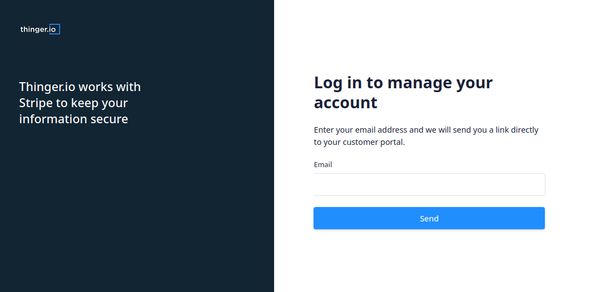
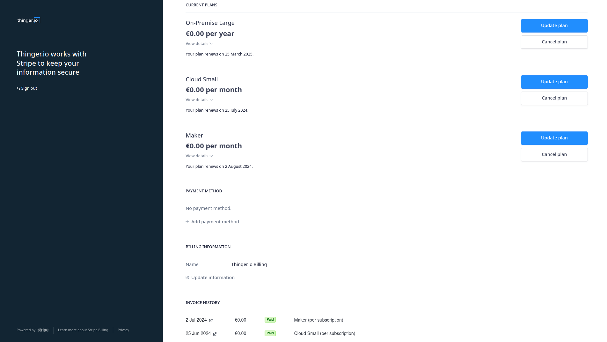
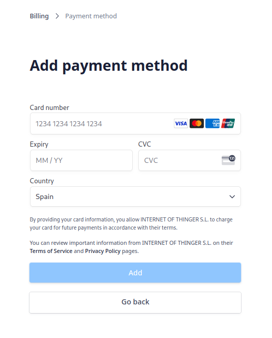
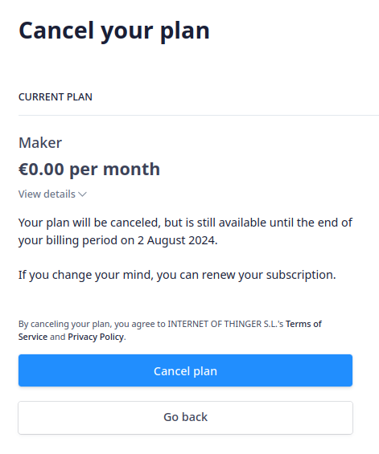

# SERVER DEPLOYMENT

Freemium accounts are perfect for learning and testing Thinger.io platform with only few limitations, however, for getting the best performance and reliability of this platform and access to some advanced features that are essential for professional use, it is necessary to deploy a private Thinger.io Server.&#x20;

## Private Instance Benefits

Thinger.io supports private cloud deployments that can be automatically launched from the pricing page. Private instances are isolated servers for each customer, so the instance is not shared with other thousands of users from our community.&#x20;

Next list details every Thinger.io Private instances advantages:&#x20;

* 100% **Private Server** hosted in the cloud or on-premise host.
* **Unlimited** sampling intervals
* **Plugins** System Deployment with different extensions available.&#x20;
* **File Storage System** that allows saving context data or any kind of files
* **Multiple User Support** allows to create and manage individual customer accounts in your server. &#x20;
* **Multi-Tenancy Support** with multiple web-console rebranding profiles and web domains hosted by just one server instance. &#x20;
* Support for real-time **data aggregation**

## Hosting options

Private instances can be deployed within minutes over the main cloud provider hosts but also in an On-premise server:


[thinger.io-cloud-server.md](thinger.io-cloud-server.md)



[on-premise.md](on-premise.md)


## Managing subscription

The administrator of a private instance of Thinger.io can edit the preferences of the subscription using the management portal, for this you must access the website [**https://billing.stripe.com/p/login/00g9D1fN50SIcpOfYY**](https://billing.stripe.com/p/login/00g9D1fN50SIcpOfYY) obtaining a One Time Password that will be sent to your email when you execute the request.

This portal allows to manage subscription preferences such as **changing the administration email** accoun&#x74;**, modify payment details** and also editing the **subscription Addons** for each license that has been contracted on Thinger.io system:

### Manage Payment Methods

It is possible to modify the payment method by accessing the section "Payment Methods" where you can choose to make payments with a Credit Card or Direct Debit that allows the domiciliation of the payment with SEPA transferences.

### Addons contracting

Currently Addons are contracted through Thinger.io Billing department. [Contact us](https://thinger.io/contact-us) for more information.

* **App Rebranding**: Are you a business interested in application rebranding? Let us know! We offer customization options to align the app with your brand’s identity, providing a seamless experience for your users.
  * **Brand Colors**: Customize the app’s color scheme to match your brand.
  * **Logo and Icons**: Replace default icons and logos with your own.
  * **Feature Adjustments**: Tailor the app’s features to better suit your business needs.
* **Extended Support**: This option is recommended in order to obtain Thinger.io engineers development support with a 24-48h response time. All accounts can use the [community discussion](https://community.thinger.io) forum to obtain support from other community developers.

### Cancel subscription

Any subscription can be cancelled, with changes being applied at the end of the contracted billing period. Please note that Thinger.io does not refund partial subscription fees unless otherwise agreed.&#x20;

To cancel a subscription perform the following steps:&#x20;

1. Log in to the [subscription management portal](https://billing.stripe.com/p/login/00g9D1fN50SIcpOfYY)
2. Select the subscription you wish to cancel
3. In the subscription administration panel click on the `cancel subscription` option.

