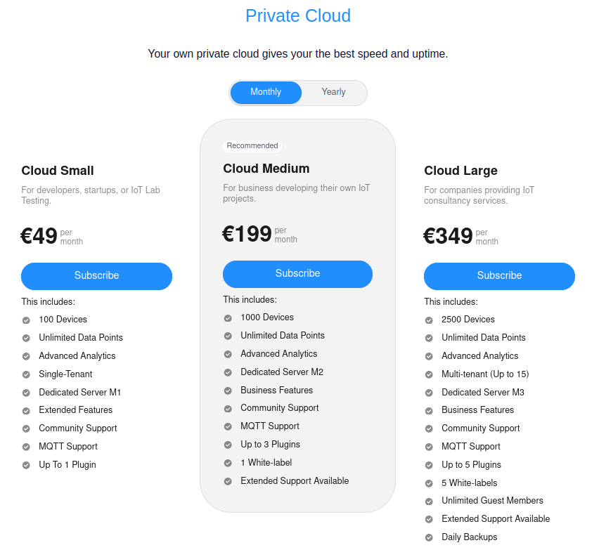
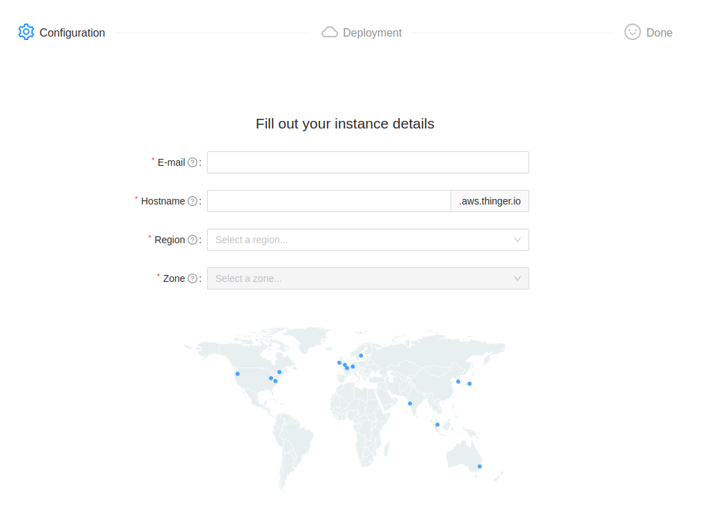
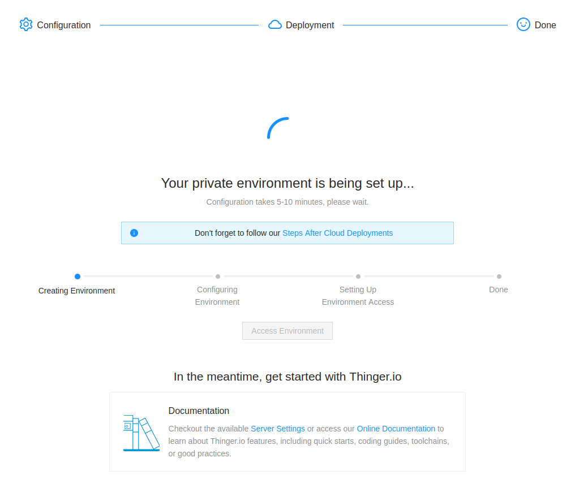

# Thinger.io Cloud

## Subscribing and Deploying a Cloud Instance

This section describes the process to deploy a private Thinger.io Cloud instance within minutes by just accessing the [**Pricing Page**](https://thinger.io/pricing). This pricing is also a deployment system that will set up a private Thinger.io Server instance within minutes, just following the next three steps:&#x20;

### 1. Select a license

Private cloud instances can be deployed with different licenses, depending on the requirements, like host performance, bandwidth or other platform features like branding, custom domains, additional support,  plugins, etc. Once the cloud provider is selected, it is necessary to select the desired license:



This pricing includes the software license and all cloud expenses. Note that yearly subscriptions offer a discount over the monthly ones.&#x20;

The next table shows all the different features provided by each license as well as a desirable purpose specification. It is possible to select one license and change it in the future using the [subscription management portal](https://billing.stripe.com/p/login/00g9D1fN50SIcpOfYY).

<table><thead><tr><th width="191">Features</th><th width="178">SMALL</th><th width="184">MEDIUM</th><th width="211">LARGE</th></tr></thead><tbody><tr><td><strong>Devices</strong></td><td>100</td><td>1000</td><td>2500</td></tr><tr><td><strong>Plugins</strong></td><td>1</td><td>3</td><td>5</td></tr><tr><td><strong>Multi-tenant</strong></td><td></td><td>✓ (Up to 5)</td><td>✓ (Up to 15)</td></tr><tr><td><strong>White-labels</strong></td><td></td><td>✓ (Up to 1)</td><td>✓ (Up to 5)</td></tr><tr><td><strong>Server size</strong></td><td>M1</td><td>M2</td><td>M3</td></tr><tr><td><strong>Extended</strong> <strong>Features</strong></td><td>Extended</td><td>Business</td><td>Business Plus</td></tr><tr><td><strong>Support</strong></td><td>Community</td><td>Extended Support Available (Paid)</td><td>Extended Support Available (Paid)</td></tr><tr><td><strong>MQTT Support</strong></td><td>✓</td><td>✓</td><td>✓</td></tr><tr><td><strong>Daily Backups</strong></td><td>As a service</td><td>As a service</td><td>✓</td></tr></tbody></table>

Additionally, all these subscriptions provide:

* Unlimited Data Points, only limited by the underlying instance storage
* Advanced Analytics, meaning that aggregation windows are provided

#### Dedicated server

<table><thead><tr><th width="128">Size</th><th width="113">CPU</th><th>RAM</th><th>Storage</th><th>Network Transfer</th></tr></thead><tbody><tr><td><strong>M1</strong></td><td>2</td><td>1GB</td><td>40GB SSD</td><td>2TB</td></tr><tr><td><strong>M2</strong></td><td>2</td><td>4GB</td><td>80GB SSD</td><td>4TB</td></tr><tr><td><strong>M3</strong></td><td>4</td><td>16GB</td><td>320GB SSD</td><td>6TB</td></tr></tbody></table>

#### Additional features

<table><thead><tr><th width="198"></th><th>Small</th><th>Medium</th><th>Large</th></tr></thead><tbody><tr><td>Dashboards</td><td>Unlimited</td><td>Unlimited</td><td>Unlimited</td></tr><tr><td>Data Buckets</td><td>Unlimited</td><td>Unlimited</td><td>Unlimited</td></tr><tr><td>Endpoints</td><td>Unlimited</td><td>Unlimited</td><td>Unlimited</td></tr><tr><td>Access Tokens</td><td>Unlimited</td><td>Unlimited</td><td>Unlimited</td></tr><tr><td>File Storages</td><td>Unlimited</td><td>Unlimited</td><td>Unlimited</td></tr><tr><td>Asset Management</td><td>Unlimited</td><td>Unlimited</td><td>Unlimited</td></tr><tr><td>Projects</td><td>Unlimited</td><td>Unlimited</td><td>Unlimited</td></tr><tr><td>Syncs</td><td>Unlimited</td><td>Unlimited</td><td>Unlimited</td></tr><tr><td>Claims</td><td>-</td><td>Unlimited</td><td>Unlimited</td></tr><tr><td>Products</td><td>1</td><td>5</td><td>10</td></tr><tr><td>Proxies</td><td>-</td><td>5</td><td>10</td></tr><tr><td>Oauth Clients</td><td>-</td><td>3</td><td>5</td></tr></tbody></table>

### 2.  Configure license

After license selection and completion of the payment process, an email will be received containing a link to a page where the desired base hostname and deployment region can be chosen.



These options are described in more detail:

* **E-mail**: This is the e-mail address that must be used when creating the Thinger.io account in the private instance deployed. It will be the main account with admin privileges, allowing the creation (if contracted) of new users, domains, brands, etc. It does not need to match the billing e-mail address.
* **Hostname**: Enter the hostname for the private IoT instance. This hostname will always be accompanied by the subdomain "aws.thinger.io" to access the host.
* **Region**: Cloud providers provide servers in different geographic locations. This option allows selecting the closest region to the business or project in order to minimize latency between the instance and the devices, users consuming information, etc. It is recommended to select the closest region to the project location.

### 3. Instance deployment

After the configuration has been done, a launch process will execute to deploy the environment, and a progress bar will be shown to give feedback on the current status of the deployment.



Once the process is done, follow the [Steps After Cloud Deployment](thinger.io-cloud-server.md#steps-after-cloud-deployment).

## Steps After Cloud Deployment

As soon as the deployment process has been completed, a confirmation email will be sent to the `Admin E-mail` configured in the configuration process, meaning that the server is completely ready to be used. To start working with it, just follow the next steps:

### First Login

1. Access the server by writing the configured domain in a web browser, for example: [https://acme.aws.thinger.io](https://acme.aws.thinger.io). This step shows the Thinger.io login screen.
2. Note that this server has never been accessed before, and it is a completely isolated instance, so no user account has been created. Then, it is necessary to click on `Create an account`button, and fill the form to create a new user profile using the `Admin E-mail` address provided while configuring the instance (any other address will not be authorized to sign up).
3. After creating the new account, it is possible to access the new server. It is not necessary to confirm the email address.

### Device Connection

When working with a private Thinger.io Cloud Instance, it is necessary to point devices to the newly created hostname. If the [Arduino](../../arduino/) or [Linux](../../linux.md) client libraries are being used (e.g., for Arduino, ESP8266, ESP32, Raspberry Pi, etc.), a definition should be added at the top of the code to point to the host. The sketch should be modified as follows:

```
#define THINGER_SERVER "acme.aws.thinger.io"

// the rest of the code goes here
```


If this host definition is not provided, the devices will try to connect with the public instance.&#x20;

